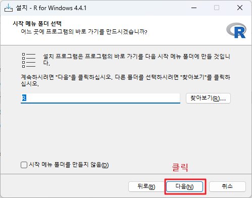
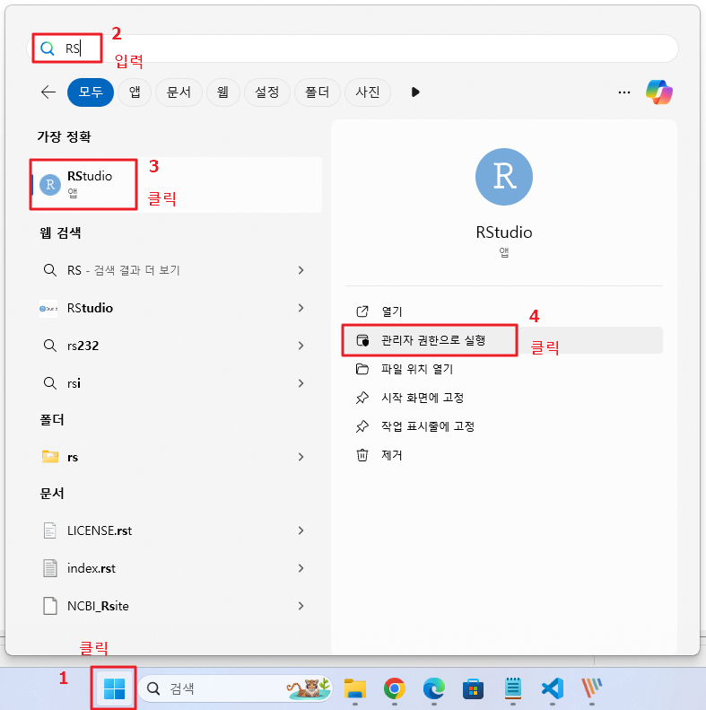
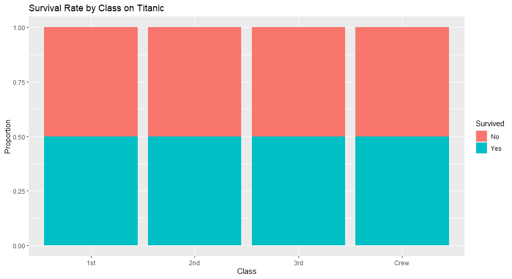
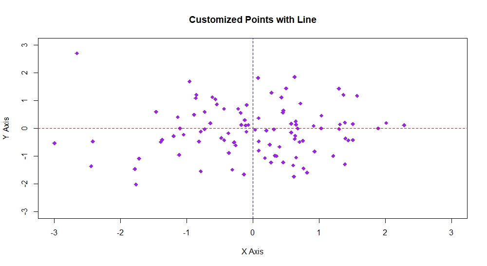
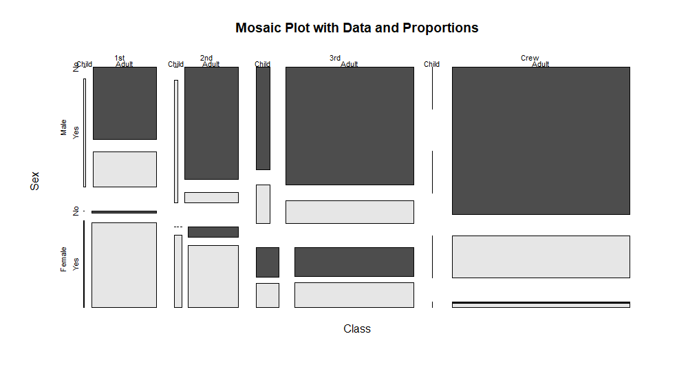

# 1. R 개발환경 구축

## 1-1. R 다운로드 및 설치

### 1. [R 다운로드](https://cran.r-project.org/bin/windows/base/) 로 이동하여 아래 그림과 같이 해당 파일을 다운로드 합니다.


<br>

### 2. download(다운로드) 폴더로 이동하여 아래 그림과 같이 R 을 설치합니다.


<br>

### 3. 사용할 언어를 선택합니다.


<br>

### 4. R 언어의 라이선스 및 참고사항을 확인합니다.


<br>

### 5. R 을 설치할 위치(디렉토리)를 선택합니다.


<br>

### 6. 설치할 R 의 구성요소를 선택합니다.


<br>

### 7. 설치 후에 R을 시작할지 말지를 선택합니다.


<br>

### 8. 표시할 시작 메뉴를 지정합니다.



<br>

### 9. 바탕 화면이나 빠른 메뉴에 실행 아이콘을 표시할지 선택합니다.


<br>


<br>

### 10. R의 설치를 완료합니다.


<br><br><br>


## 1-2. R Studio 다운로드 및 설치

### 1.  R Studio 다운로드 페이지로 이동하여 Window 용 R Studio Desktop 설치 프로그램을 다운로드 합니다.


<br>

### 2. download(다운로드) 폴더로 이동하여 RStudio-2024.04.2.msi 를 더블클릭 또는 마우스 오른쪽 버튼을 누른 후 "관리자 권한으로 실행" 을 선택합니다.


<br>

### 3. R Studio 설치를 시작합니다.


<br>

### 4. R Studio 가 설치될 위치를 지정합니다.


<br>

### 5. R Studio 가 추가될 시작 메뉴 위치를 선택합니다.


<br>


<br>


<br>

### 6. R Studio 의 설치가 완료되었습니다.


<br><br><br>

## 1-3. R Studio 환경 설정

### 1-3-1. R Studio 의 실행

#### 1. R Studio를 실행합니다.



<br>

#### 2. R 이 실행되기 위한 환경을 선택합니다.


<br>

#### 3. R Studio를 시작합니다.


<br>

#### 4. R 코딩을 위한 새로운 파일을 엽니다.


<br>

#### 5. 코드 창에 R 코드를 입력합니다. 


<br><br>

### 1-3-2. R Studio 의 코드 자동 줄바꿈 설정

#### 1. 환경 설정 창으로 이동합니다.


<br>


<br>

#### 2. 자동 줄바꿈하기 위한 설정을 하도록 합니다.


<br><br>

### 1-3-3. 인코딩 방식 설정

#### 1. 환경 설정 창으로 이동합니다.


<br>


<br>

#### 2. 대화상자 왼쪽의 [Code] 선택, 상단의 [Saving] 탭 선택, [Change] 버튼을 순서대로 누릅니다.


<br>


<br><br>

### 1-3-4. 단축키 설정

#### 1. 단축키를 설정하기 위한 메뉴를 선택합니다.


<br>

#### 2. 단축키 목록이 나타납니다.


<br>

#### 3. 단축키를 설정하도록 합니다.


<br><br>

### 1-3-5. 작업 공간 설정

#### 1. 작업 공간을 설정하기 위한 메뉴를 선택합니다.


<br>


<br><br>

### 1-3-6. 테마 설정 


<br><br>

### 1-3-7. 작업 디렉토리 설정


<br>


<br><br>

### 1-3-8. 문서 저장 및 테스트 문서 작성

#### 1. Ctrl+Shift+N 을 눌러 새 파일을 엽니다.


<br>

#### 2. 코드 입력 창에 테스트 코드를 입력하고, Ctrl+Enter 또는 Run 버튼을 누릅니다.


<br>

#### 3. Ctrl+S 또는 아래 그림과 같이 [File]-[Save File] 누릅니다.


<br>

#### 4. 저장 대화상자가 나타나면 파일 저장 위치와 파일명을 입력하여 저장합니다.


<br><br><br>

# 2. R의 변수와 연산

## 2-1. 변수 (Variable)

정의: 변수가 이름을 가진 메모리 위치로, 데이터를 저장하거나 조작하는 데 사용됩니다.
할당: <- 또는 = 연산자를 사용하여 값을 변수에 할당합니다.

<br>

```r
x <- 10  # x라는 변수에 10을 할당
y = 5     # y라는 변수에 5를 할당
```

<br>

사용: 변수에 저장된 값을 참조하거나 조작할 수 있습니다.

```r
z <- x + y  # x와 y의 합을 z에 저장
print(z)    # 출력: 15
```

<br><br>

## 2-2. 기본 자료형 (Basic Data Types)

R에서의 기본 자료형은 데이터의 유형을 정의하며, 주로 다음과 같습니다.

| 자료형          | 설명                                            | 예시                           |
|-----------------|-------------------------------------------------|--------------------------------|
| **숫자형 (Numeric)**  | 실수 또는 정수를 표현합니다. R에서는 기본적으로 실수형입니다. | `3.14`, `2`, `-5`              |
| **정수형 (Integer)**  | 정수를 표현하며, `L` 접미사를 사용하여 명시적으로 정수형으로 지정합니다. | `42L`, `-7L`                   |
| **문자형 (Character)** | 문자 또는 문자열을 표현합니다.                         | `"hello"`, `"R programming"`   |
| **논리형 (Logical)**   | 참(`TRUE`) 또는 거짓(`FALSE`)을 표현합니다.             | `TRUE`, `FALSE`                |
| **복소수형 (Complex)** | 복소수를 표현합니다.                                           | `1 + 2i`, `-3 - 4i`            |
| **팩터형 (Factor)**    | 범주형 데이터를 표현합니다.                                 | `factor(c("low", "medium", "high"))` |

<br>

**기본 실습**

```r
# 숫자형
num <- 3.14
print(num)  # 출력: 3.14

# 정수형
int <- 42L
print(int)  # 출력: 42L

# 문자형
char <- "hello"
print(char)  # 출력: "hello"

# 논리형
logi <- TRUE
print(logi)  # 출력: TRUE

# 복소수형
comp <- 1 + 2i
print(comp)  # 출력: 1+2i

# 팩터형
f <- factor(c("low", "medium", "high"))
print(f)     # 출력: [1] low    medium high   Levels: high low medium
```

<br>

**ch02/ex01.r**

```r
# 변수 : 프로그래밍 상에서 필요한 데이터를 저장하고 있는 기억장소의 별칭

# R에서의 변수명은 영문 대/소문자를 구분하며, 길이 제한은 없으나 여러 단어로 변수명을 작명할 경우 언더스코어 또는 스내이크 방식인 "_" 를 해당 단어 사이에 넣거나 "." 를 해당 단어 사이에 넣어 활용합니다.
# R에서의 변수명은 "_" 또는 "." 특수문자를 사용할 수 있지만, "." 의 다음에는 숫자가올 수 없으며, 숫자로 시작할 수 없습니다. 


# 변수의 값 할당

# "<-" 또는 "<<-" 또는 "=" 를 사용하나 "=" 는 경우에 따라 사용될 수 없는 경우가 있어 "<-" 를 사용합니다.

# 정수, 실수 변수

a <- 3
b <- 4.5
c <- a + b
print ( c )


# NA

one <- 100
two <- 75
three <- 80
four <- NA
is.na(four)   # four 변수에 저장된 값이 NA 인지 확인합니다. TRUE가 출력되면, NA임을 알 수 있으며,  변수에 값이 존재하지 않는 경우를 NA 라고 합니다.


# NULL

x <- NULL
is.null(x)   # x 변수에 저장된 데이터가 NULL 인지 확인합니다. TURE 가 출력되면, NULL 임을 의미하며, 변수가 초기화 되어 있지 않은 경우. 즉, 값을 할당한 적이 한 번도 없는 경우입니다.
is.null(1)
is.null(NA)
is.na(NULL)


# 문자열

a <- " hello "
print ( a )


# 논리값

ps=FALSE
is.logical(ps)
```

<br><br>

## 2-3. 기본 자료형의 연산(Basic Type Operation)

### 2-3-1. 할당 연산자 (Assignment Operators)

| 연산자 | 설명                            | 문법               | 예시 코드                      | 예시 출력                      |
|--------|---------------------------------|--------------------|--------------------------------|--------------------------------|
| `<-`   | 변수에 값을 할당합니다.          | `variable <- value` | `x <- 10`                       | (변수 `x`에 10이 할당됨)        |
| `=`    | 변수에 값을 할당합니다.          | `variable = value`  | `x = 10`                        | (변수 `x`에 10이 할당됨)        |
| `->`   | 값을 변수에 할당합니다.          | `value -> variable` | `10 -> x`                       | (변수 `x`에 10이 할당됨)        |
| `->>`  | 값을 변수에 할당합니다 (비슷하지만 덜 사용됨). | `value ->> variable` | `10 ->> x`                      | (변수 `x`에 10이 할당됨)        |

<br>

### 2-3-2. 산술 연산자 (Arithmetic Operators)

| 연산자 | 설명                             | 문법               | 예시 코드                | 예시 출력        |
|--------|----------------------------------|--------------------|--------------------------|------------------|
| `+`    | 덧셈                              | `a + b`            | `3 + 2`                  | `5`              |
| `-`    | 뺄셈                              | `a - b`            | `5 - 3`                  | `2`              |
| `*`    | 곱셈                              | `a * b`            | `4 * 2`                  | `8`              |
| `/`    | 나눗셈                            | `a / b`            | `10 / 2`                 | `5`              |
| `^`    | 제곱                              | `a ^ b`            | `2 ^ 3`                  | `8`              |
| `%%`   | 나머지                            | `a %% b`           | `10 %% 3`                | `1`              |
| `%/%`  | 정수 나눗셈 (몫)                  | `a %/% b`          | `10 %/% 3`               | `3`              |

<br>

### 2-3-3. 비교 연산자 (Comparison Operators)

| 연산자 | 설명                          | 문법               | 예시 코드                | 예시 출력        |
|--------|-------------------------------|--------------------|--------------------------|------------------|
| `==`   | 같음                           | `a == b`           | `5 == 5`                 | `TRUE`           |
| `!=`   | 다름                           | `a != b`           | `5 != 3`                 | `TRUE`           |
| `<`    | 작음                           | `a < b`            | `3 < 5`                  | `TRUE`           |
| `<=`   | 작거나 같음                     | `a <= b`           | `3 <= 5`                 | `TRUE`           |
| `>`    | 큼                             | `a > b`            | `7 > 5`                  | `TRUE`           |
| `>=`   | 크거나 같음                     | `a >= b`           | `7 >= 7`                 | `TRUE`           |

<br>

### 2-3-4. 논리 연산자 (Logical Operators)

| 연산자 | 설명                             | 문법               | 예시 코드                | 예시 출력        |
|--------|----------------------------------|--------------------|--------------------------|------------------|
| `&`    | 벡터의 요소별 논리곱 (AND)        | `a & b`            | `c(TRUE, FALSE) & c(TRUE, TRUE)` | `TRUE FALSE` |
| `&&`   | 첫 번째 요소만 비교 (AND)         | `a && b`           | `TRUE && FALSE`          | `FALSE`         |
| `\|`    | 벡터의 요소별 논리합 (OR)         | `a \| b`            | `c(TRUE, FALSE) \| c(FALSE, TRUE)` | `TRUE TRUE` |
| `\|\|`   | 첫 번째 요소만 비교 (OR)          | `a \|\| b`           | `TRUE \|\| FALSE`          | `TRUE`          |
| `!`    | 논리 NOT                         | `!a`               | `!TRUE`                  | `FALSE`         |

<br>

**ch02/ex02.r**

```r
# 연산자

# 산술 연산

x=98
y=27

x+y
x-y
x*y
x/y
x^3   # 거듭제곱
y**2  # 거듭제곱
x%%y  # 나머지
x%/%y  # 몫


# 할당 연산자

j<-3
k=4
5->m
j;k;m


# 논리 연산

TRUE & TRUE

TRUE & FALSE

TRUE | TRUE

TRUE | FALSE

!TRUE

!FALSE

c(TRUE, TRUE) & c(TRUE, FALSE)
c(TRUE, TRUE) | c(TRUE, FALSE)


# 비교 연산

a<-100
b<-200

a>b
a>=b
a<b
a<=b
a==b
a!=b
!a
```

<br><br>

## 2-4. 기본 자료형의 확인

| 함수          | 설명                                  | 문법                          | 예시 코드                                  | 예시 출력                             |
|---------------|---------------------------------------|-------------------------------|--------------------------------------------|--------------------------------------|
| **`is.numeric()`** | 숫자형인지 확인합니다.                     | `is.numeric(x)`                | `is.numeric(3.14)`                         | `TRUE`                               |
| **`is.integer()`** | 정수형인지 확인합니다.                       | `is.integer(x)`                | `is.integer(42L)`                         | `TRUE`                               |
| **`is.character()`** | 문자형인지 확인합니다.                        | `is.character(x)`             | `is.character("hello")`                   | `TRUE`                               |
| **`is.logical()`** | 논리형인지 확인합니다.                        | `is.logical(x)`                | `is.logical(TRUE)`                        | `TRUE`                               |
| **`is.complex()`** | 복소수형인지 확인합니다.                       | `is.complex(x)`                | `is.complex(1 + 2i)`                      | `TRUE`                               |
| **`is.factor()`** | 팩터형인지 확인합니다.                          | `is.factor(x)`                 | `is.factor(factor(c("low", "high")))`     | `TRUE`                               |


<br>

**ch02/ex03.r**

```r
# 데이터 유형의 확인

a=10
b=20
c=3.14
d="kim"
e=TRUE
f=a+9i
g=NULL
h=NA
i=b/3
j=b/0

is.numeric(a)
is.integer(b)
is.double(c)
is.character(d)
is.logical(e)
is.complex(f)
is.null(g)
is.na(h)
is.finite(i)
is.infinite(j)
```

<br><br>

## 2-4. 기본 자료형의 형변환

| 함수            | 설명                                     | 문법                       | 예시 코드                             | 예시 출력                   |
|-----------------|------------------------------------------|----------------------------|---------------------------------------|-----------------------------|
| **`as.numeric()`** | 데이터를 숫자형으로 변환합니다.            | `as.numeric(x)`            | `as.numeric("3.14")`                  | `3.14`                      |
| **`as.integer()`** | 데이터를 정수형으로 변환합니다.            | `as.integer(x)`            | `as.integer(3.14)`                   | `3L`                        |
| **`as.character()`** | 데이터를 문자형으로 변환합니다.            | `as.character(x)`          | `as.character(123)`                  | `"123"`                     |
| **`as.logical()`** | 데이터를 논리형으로 변환합니다.            | `as.logical(x)`            | `as.logical(1)`                     | `TRUE`                      |
| **`as.complex()`** | 데이터를 복소수형으로 변환합니다.          | `as.complex(x)`            | `as.complex("1+2i")`                | `1+2i`                      |
| **`as.factor()`**  | 데이터를 팩터형으로 변환합니다.            | `as.factor(x)`             | `as.factor(c("low", "medium"))`     | `factor("low")`             |
| **`as.array()`**   | 데이터를 배열로 변환합니다.                | `as.array(x)`              | `as.array(matrix(1:6, nrow=2))`     | `1 3 5 2 4 6`               |
| **`as.matrix()`**  | 데이터를 행렬로 변환합니다.                | `as.matrix(x)`             | `as.matrix(data.frame(a=1:3, b=4:6))`| `1 4` `2 5` `3 6`          |
| **`as.data.frame()`** | 데이터를 데이터 프레임으로 변환합니다.     | `as.data.frame(x)`         | `as.data.frame(matrix(1:6, nrow=2))` | `1 2 3 4 5 6`              |


**ch02/ex04.r**

```r
# 데이터의 형 변환

a="1004"
b=304.12
c="3.14"
d=1004
e="FALSE"
f="10+7i"

as.numeric(a)
as.integer(b)
as.double(c)
as.character(d)
as.logical(e)
as.complex(f)

is.numeric(as.numeric(a))
is.integer(as.integer(b))
is.double(as.double(c))
is.character(as.character(d))
is.logical(as.logical(e))
is.complex(as.complex(f))
```

<br><br>


<br><br><br>

# 3. R의 제어문

## 3-1. if 문

### 3-1-1. if 문

if 문은 가장 기본적인 조건문입니다. 주어진 조건이 참일 경우 해당 블록을 실행합니다.

```r
x <- 5

if (x > 3) {
  print("x는 3보다 큽니다.")
}
```

<br>

### 3-1-2. if-else 문

if-else 문은 조건이 참일 경우 if 블록을, 거짓일 경우 else 블록을 실행합니다.

```r
x <- 2

if (x > 3) {
  print("x는 3보다 큽니다.")
} else {
  print("x는 3보다 작거나 같습니다.")
}
```

<br>

### 3-1-3. ifelse 함수

ifelse는 벡터화된 조건문으로, 벡터의 각 요소에 대해 조건을 평가하여 참일 경우와 거짓일 경우의 값을 반환합니다. 이는 벡터나 데이터프레임에서 많이 사용됩니다.

```r
x <- c(5, 2, 9)
result <- ifelse(x > 3, "크다", "작다")
print(result)
# [1] "크다" "작다" "크다"
```

<br>

### 3-1-4. 중첩 if-else 문

여러 조건을 처리하기 위해 if-else 문을 중첩해서 사용할 수 있습니다.

```r
x <- 10

if (x > 10) {
  print("x는 10보다 큽니다.")
} else if (x == 10) {
  print("x는 10입니다.")
} else {
  print("x는 10보다 작습니다.")
}
```

<br>

**ch03/ex01.r**

```r
```

<br><br>

## 3-2. switch 문

switch 문은 특정 값에 따라 여러 선택지 중 하나를 실행합니다. 이는 일반적으로 여러 조건을 처리할 때 사용됩니다.

**ch03/ex02.r**

```r
# 숫자형 인덱스를 사용하는 경우
x <- 2

result <- switch(x,
                 "첫 번째 옵션",
                 "두 번째 옵션",
                 "세 번째 옵션")
print(result)
# [1] "두 번째 옵션"


# 문자형 값을 사용하는 경우
day <- "화요일"

result <- switch(day,
                 "월요일" = "일주일의 시작",
                 "화요일" = "일이 많은 날",
                 "수요일" = "중간",
                 "일요일" = "쉬는 날",
                 "알 수 없는 요일")
print(result)
# [1] "일이 많은 날"
```

<br><br>

## 3-3. for 문

R 언어에서 for 반복문은 특정 명령을 반복적으로 수행할 때 사용됩니다. R의 for 문은 매우 유연하며, 다양한 형태로 사용할 수 있습니다. 

### 3-3-1. 기본 for 반복문
가장 기본적인 형태의 for 문으로, 주어진 벡터나 시퀀스의 각 요소에 대해 반복 작업을 수행합니다.

```r
# 1부터 5까지 반복
for (i in 1:5) {
  print(i)
}
```

이 코드는 i가 1부터 5까지 순차적으로 값을 가지면서 각 값을 출력합니다.

<br>

### 3-3-2. 벡터 또는 리스트를 사용하는 for 반복문

벡터, 리스트, 또는 다른 컬렉션의 각 요소에 대해 반복 작업을 수행할 수 있습니다.

```r
# 벡터 반복
vec <- c("apple", "banana", "cherry")
for (fruit in vec) {
  print(fruit)
}

# 리스트 반복
lst <- list(name = "Alice", age = 30, city = "New York")
for (item in lst) {
  print(item)
}
```

이 코드는 각각 벡터와 리스트의 각 요소를 출력합니다.

<br>

### 3-3-3. 중첩된 for 반복문

for 문을 중첩하여 다차원 데이터나 복잡한 구조를 반복 처리할 수 있습니다.

```r
# 2x3 행렬을 반복하며 출력
matrix_data <- matrix(1:6, nrow = 2, ncol = 3)

for (i in 1:nrow(matrix_data)) {
  for (j in 1:ncol(matrix_data)) {
    cat("Row:", i, "Col:", j, "Value:", matrix_data[i, j], "\n")
  }
}
```

이 코드는 2x3 행렬의 각 요소를 반복하며 행렬의 행과 열 인덱스 및 해당 값을 출력합니다.

<br>

### 3-3-4. for 문에서의 인덱스 활용

반복문 내에서 인덱스를 활용하여 벡터나 리스트의 특정 요소에 접근할 수 있습니다.

```r
# 벡터와 인덱스 활용
vec <- c(10, 20, 30, 40, 50)
for (i in 1:length(vec)) {
  cat("Index:", i, "Value:", vec[i], "\n")
}
```

이 코드는 벡터의 인덱스와 해당 값을 함께 출력합니다.

<br>

### 3-3-5. seq_along 또는 seq_len과 함께 사용하는 for 반복문

이 함수들은 벡터나 리스트의 길이를 기반으로 반복을 수행하는 데 유용합니다.

```r
# seq_along을 사용한 반복
vec <- c("red", "green", "blue")
for (i in seq_along(vec)) {
  cat("Color:", vec[i], "\n")
}

# seq_len을 사용한 반복
n <- 5
for (i in seq_len(n)) {
  print(i)
}
```

seq_along은 주어진 벡터의 길이만큼 반복하며, seq_len은 주어진 수만큼 반복합니다.

<br>

### 3-3-6. next와 break를 사용하는 for 반복문

for 문 내에서 반복을 건너뛰거나(next), 반복을 종료(break)할 수 있습니다.

```r
# next를 사용하여 3을 건너뛰기
for (i in 1:5) {
  if (i == 3) {
    next
  }
  print(i)
}

# break를 사용하여 반복 종료
for (i in 1:5) {
  if (i == 3) {
    break
  }
  print(i)
}
```

<br>

**ch03/ex03.r**

```r
# 반복문 for

for (i in 1:10) {
  print ( i )
}

# 벡터 반복
vec <- c("apple", "banana", "cherry")
for (fruit in vec) {
  print(fruit)
}

# 리스트 반복
lst <- list(name = "Alice", age = 30, city = "New York")
for (item in lst) {
  print(item)
}


# 중첩된 for 반복문

# 2x3 행렬을 반복하며 출력
matrix_data <- matrix(1:6, nrow = 2, ncol = 3)

for (i in 1:nrow(matrix_data)) {
  for (j in 1:ncol(matrix_data)) {
    cat("Row:", i, "Col:", j, "Value:", matrix_data[i, j], "\n")
  }
}


# for 문에서의 인덱스 활용

# 벡터와 인덱스 활용
vec <- c(10, 20, 30, 40, 50)
for (i in 1:length(vec)) {
  cat("Index:", i, "Value:", vec[i], "\n")
}


# seq_along 또는 seq_len과 함께 사용하는 for 반복문

# seq_along을 사용한 반복
vec <- c("red", "green", "blue")
for (i in seq_along(vec)) {
  cat("Color:", vec[i], "\n")
}

# seq_len을 사용한 반복
n <- 5
for (i in seq_len(n)) {
  print(i)
}


# next와 break를 사용하는 for 반복문

# next를 사용하여 3을 건너뛰기
for (i in 1:5) {
  if (i == 3) {
    next
  }
  print(i)
}

# break를 사용하여 반복 종료
for (i in 1:5) {
  if (i == 3) {
    break
  }
  print(i)
}
```

<br><br>

## 3-4. while 문

R 언어에서 while 반복문은 주어진 조건이 참일 때 계속해서 코드를 반복 실행합니다. for 반복문과는 달리, 반복 횟수가 사전에 정해지지 않은 경우에 주로 사용됩니다. 

### 3-4-1. 기본 while 반복문

기본적인 형태의 while 문은 특정 조건이 참(TRUE)인 동안 계속해서 실행됩니다.

```r
i <- 1
while (i <= 5) {
  print(i)
  i <- i + 1  # 루프를 빠져나오기 위해 i 값을 증가시킴
}
```

이 코드는 i가 1부터 5까지 증가하면서 각 값을 출력하고, i가 6이 되면 루프를 종료합니다.

<br>

### 3-4-2. 무한 루프 (조건이 항상 참인 경우)

조건이 항상 참인 경우 무한 루프를 만들 수 있습니다. 무한 루프는 break 문을 사용해 탈출할 수 있습니다.

```r
i <- 1
while (TRUE) {
  print(i)
  i <- i + 1
  if (i > 5) {
    break  # i가 5보다 클 때 루프를 종료
  }
}
```

이 코드에서 while (TRUE)는 무한 루프를 의미하며, break 문이 실행될 때 루프가 종료됩니다.

<br>

### 3-4-3. next 문을 사용하여 반복 건너뛰기

while 문 내에서 next 문을 사용하여 조건이 충족될 때 반복을 건너뛸 수 있습니다.

```r
i <- 1
while (i <= 5) {
  i <- i + 1
  if (i == 3) {
    next  # i가 3일 때 아래 코드를 실행하지 않고 다음 반복으로 넘어감
  }
  print(i)
}
```

이 코드는 i가 3일 때 출력을 건너뛰고, i가 4일 때부터 다시 출력합니다.

<br>

### 3-4-4. 조건이 거짓일 때까지 실행되는 while 반복문

조건이 거짓이 될 때까지 특정 작업을 반복합니다. 이 형태는 조건이 참이기 때문에 계속 반복되다가, 조건이 거짓이 되면 종료됩니다.

```r
x <- 10
while (x > 0) {
  print(x)
  x <- x - 1
}
```

이 코드는 x가 10부터 1까지 감소하며 값을 출력하고, x가 0이 되면 루프가 종료됩니다.

<br>

### 3-4-5. while 문을 이용한 사용자 입력 처리

사용자로부터 특정 입력을 받을 때까지 루프를 계속할 수 있습니다. 이 예시는 while 문을 사용하여 특정 조건을 충족할 때까지 반복합니다.

```r
repeat_input <- TRUE
while (repeat_input) {
  input <- readline(prompt="Type 'stop' to end: ")
  if (input == "stop") {
    repeat_input <- FALSE
  } else {
    print(paste("You typed:", input))
  }
}
```

<br>

**ch03/ex04.r**

```r
# 기본 while 반복문

i <- 1
while (i <= 5) {
  print(i)
  i <- i + 1  # 루프를 빠져나오기 위해 i 값을 증가시킴
}


# 무한 루프 (조건이 항상 참인 경우)

i <- 1
while (TRUE) {
  print(i)
  i <- i + 1
  if (i > 5) {
    break  # i가 5보다 클 때 루프를 종료
  }
}


# next 문을 사용하여 반복 건너뛰기

i <- 1
while (i <= 5) {
  i <- i + 1
  if (i == 3) {
    next  # i가 3일 때 아래 코드를 실행하지 않고 다음 반복으로 넘어감
  }
  print(i)
}


# 조건이 거짓일 때까지 실행되는 while 반복문

x <- 10
while (x > 0) {
  print(x)
  x <- x - 1
}


# while 문을 이용한 사용자 입력 처리

repeat_input <- TRUE
while (repeat_input) {
  input <- readline(prompt="Type 'stop' to end: ")
  if (input == "stop") {
    repeat_input <- FALSE
  } else {
    print(paste("You typed:", input))
  }
}


# 중첩 while 문

# 행렬 초기화
matrix_data <- matrix(1:6, nrow = 2, ncol = 3)

# 행렬의 크기 구하기
num_rows <- nrow(matrix_data)
num_cols <- ncol(matrix_data)

# 외부 루프: 행을 반복
row <- 1
while (row <= num_rows) {
  # 내부 루프: 열을 반복
  col <- 1
  while (col <= num_cols) {
    # 각 요소 출력
    cat("Row:", row, "Col:", col, "Value:", matrix_data[row, col], "\n")
    col <- col + 1
  }
  row <- row + 1
}


# next와 break를 사용한 중첩 while 문

row <- 1
while (row <= 3) {
  col <- 1
  while (col <= 3) {
    if (row == col) {
      col <- col + 1
      next  # row와 col이 같은 경우 출력 건너뜀
    }
    cat("Row:", row, "Col:", col, "\n")
    if (row == 2 && col == 2) {
      break  # row와 col이 모두 2일 때 내부 루프 종료
    }
    col <- col + 1
  }
  row <- row + 1
}


# 중첩 while 문 - 특정 조건에서 루프 중단하기

row <- 1
while (row <= 3) {
  col <- 1
  while (col <= 3) {
    cat("Row:", row, "Col:", col, "\n")
    if (row == 2 && col == 2) {
      cat("Breaking out of both loops.\n")
      row <- 4  # 외부 루프 조건을 벗어나도록 설정하여 전체 종료
      break
    }
    col <- col + 1
  }
  row <- row + 1
}
```

<br><br><br>

# 4. R의 참조형 자료와 형 변환

## 4-1. 요인(Factor) 형 자료

요인(factor)은 범주형 데이터를 처리하는 데 유용한 데이터 구조입니다. 
요인은 범주형 데이터를 나타내는 데이터 구조입니다. 각 요인은 가능한 값의 집합(레벨)과 그 값을 나타내는 수준(범주)을 갖습니다. 요인은 특히 통계 분석과 모델링에서 범주형 변수(예: 성별, 지역, 만족도 등)를 효과적으로 다룰 수 있도록 돕습니다. 

<br>

### 4-1-1. 요인(Factor)의 특징

레벨(Levels): 요인 변수는 명목형 또는 순서형 값의 집합을 가집니다. 각 값은 '레벨'이라고 부릅니다. 예를 들어, c("Low", "Medium", "High")는 세 가지 레벨을 가진 요인입니다.
정렬: 순서형 요인의 경우, 레벨 간의 순서가 정의될 수 있습니다. 예를 들어, c("Low", "Medium", "High")는 순서형 요인으로서 정렬이 정의됩니다.

<br>

### 4-1-2. 요인(Factor)의 생성 및 변환

**요인 생성**

요인은 factor() 함수를 사용하여 생성합니다.

```r
# 요인 생성 예
levels <- c("Low", "Medium", "High")
x <- c("Medium", "High", "Low", "Medium")
factor_x <- factor(x, levels = levels)
print(factor_x)
```

<br>

### 4-1-3. 요인(Factor)의 레벨 확인

levels() 함수를 사용하여 요인의 레벨을 확인할 수 있습니다.

```r
levels(factor_x)  # 레벨 확인
```

<br>

### 4-1-4. 요인(Factor)의 레벨 재정의

levels() 함수를 사용하여 요인의 레벨을 변경할 수 있습니다.

```r
levels(factor_x) <- c("Low", "Medium", "High", "Very High")
```

<br>

### 4-1-5. 순서형 요인(Ordered Factor)

ordered = TRUE 매개변수를 사용하여 순서형 요인을 생성할 수 있습니다.

```r
ordered_x <- factor(x, levels = levels, ordered = TRUE)
print(ordered_x)
```

<br>

### 4-1-6. 요인(Factor)의 활용

요인은 회귀 분석, 분산 분석(ANOVA) 등의 통계 분석에서 중요한 역할을 합니다.

```r
# 예제 데이터 프레임
df <- data.frame(
  Group = factor(c("A", "B", "A", "C", "B")),
  Score = c(85, 90, 78, 92, 88)
)

# 그룹별 평균 점수 계산
aggregate(Score ~ Group, data = df, mean)
```

<br>

### 4-1-7. 요인(Factor)의 수준 정렬 및 재정렬

요인의 수준을 정렬하거나 재정렬하여 분석을 용이하게 할 수 있습니다.

```r
# 순서형 요인 생성
ordered_x <- factor(x, levels = c("Low", "Medium", "High"), ordered = TRUE)

# 요인을 정렬
sorted_x <- ordered_x[order(ordered_x)]
print(sorted_x)
```

<br>

### 4-1-8. 요인(Factor)의 변환과 관련된 함수

factor(): 범주형 데이터를 요인으로 변환합니다.
levels(): 요인의 레벨을 확인하거나 설정합니다.
as.factor(): 데이터를 요인으로 변환합니다.
as.character(): 요인을 문자형 데이터로 변환합니다.
as.numeric(): 요인을 숫자형 데이터로 변환합니다. (숫자는 요인의 레벨 인덱스를 나타냅니다.)

<br>

### 4-1-9. 요인(Factor)의 주의 사항

레벨의 순서: 순서형 요인은 레벨의 순서를 중요하게 생각하며, 이를 통해 통계 분석 및 모델링에서 의미 있는 결과를 얻을 수 있습니다.
레벨 인덱스: 요인을 숫자형으로 변환할 때는 레벨의 인덱스가 사용됩니다. 요인 변환 후 레벨의 인덱스와 값 사이의 관계를 이해하는 것이 중요합니다.

<br>

### 4-1-10. 요인(Factor)의 실습 예시

**ch04/ex01.r**

```r
# 요인(Factor)
# 요인(Factor)은 범주형(Categorical) 변수를 위한 데이터 타입
# 기본적으로 데이터에 순서가 없는 명목형 변수(Nominal)

sex <- factor ( " m " , c ( " m " , " f " ) )
sex

# 요소의 수
nlevels(sex)

# 요소의 값
levels(sex)

# 요소의 접근
levels(sex)[1]

levels(sex)[2]

# 값의 변경
levels(sex) <- c("male", "female")
sex


# 범주형(Categorical) 변수를 위한 데이터 타입
# 순서가 있는 값일 경우는 순서형(Ordinal) 변수

ordered(c("b","a","d","c"))
factor(c("b","a","d","c"), ordered = TRUE)

ordered(c("b","a","d","c"))
```

<br><br>

## 4-2. 벡터(Vector)

R 언어에서 벡터(Vector)는 가장 기본적인 데이터 구조로, 동일한 데이터 유형의 값들을 일차원으로 나열한 것입니다. 벡터는 R에서 데이터를 다루고 분석하는 데 핵심적인 역할을 합니다. 벡터는 숫자, 문자, 논리값 등 다양한 유형의 데이터를 포함할 수 있으며, 기본적으로 연속적이며 단일 차원의 데이터를 표현합니다.

<br>

### 4-2-1. 벡터(Vector)의 기본 개념

벡터는 동일한 데이터 유형의 원소들로 구성된 일차원 배열입니다. R에서 모든 데이터 구조는 벡터의 속성을 갖고 있으며, 벡터 자체가 가장 기본적인 데이터 구조입니다.

<br>

### 4-2-2. 벡터(Vector)의 특징

동일 데이터 유형: 벡터의 모든 원소는 동일한 데이터 유형이어야 합니다. 숫자 벡터, 문자 벡터, 논리 벡터 등이 있습니다.
인덱스: 벡터의 각 원소는 인덱스를 통해 접근할 수 있습니다. 인덱스는 1부터 시작합니다.

<br>

### 4-2-3. 벡터(Vector)의 생성

```r
# 숫자 벡터:
num_vec <- c(1, 2, 3, 4, 5)

# 문자 벡터:
char_vec <- c("apple", "banana", "cherry")

# 논리 벡터:
log_vec <- c(TRUE, FALSE, TRUE, FALSE)

# 정수 벡터:
int_vec <- c(1L, 2L, 3L)  # 'L'을 붙여서 정수형 벡터 생성

# 특정 범위의 벡터:
seq_vec <- 1:10  # 1부터 10까지의 정수 벡터

# 반복적인 패턴의 벡터:
rep_vec <- rep(c(1, 2), times = 3)  # 벡터 c(1, 2)를 3번 반복
```

<br>

### 4-2-4. 벡터(Vector)의 조작

```r
# 인덱싱 및 슬라이싱:
vec <- c(10, 20, 30, 40, 50)
vec[2]  # 두 번째 원소 (20)
vec[1:3]  # 첫 번째부터 세 번째 원소까지 (10, 20, 30)

# 원소 접근 및 변경:
vec[2] <- 25  # 두 번째 원소를 25로 변경

# 벡터 길이:
length(vec)  # 벡터의 길이 (원소의 개수)

# 벡터 합치기:
vec1 <- c(1, 2, 3)
vec2 <- c(4, 5, 6)
combined_vec <- c(vec1, vec2)  # 두 벡터를 합치기

# 벡터 필터링:
vec <- c(1, 2, 3, 4, 5)
filtered_vec <- vec[vec > 3]  # 3보다 큰 원소만 필터링 (4, 5)
```

<br>

### 4-2-5. 벡터(Vector)의 연산

```r
# 산술 연산:
vec <- c(1, 2, 3)
vec + 2  # 각 원소에 2를 더함 (3, 4, 5)

# 논리 연산:
vec <- c(TRUE, FALSE, TRUE)
!vec  # 논리값의 부정 (FALSE, TRUE, FALSE)

# 함수 적용:
vec <- c(1, 2, 3, 4, 5)
sum(vec)  # 벡터의 합 (15)
mean(vec)  # 벡터의 평균 (3)
```

<br>

### 4-2-6. 벡터(Vector)와 다른 데이터 구조와의 비교

```r
# 벡터와 행렬
# 벡터를 행렬로 변환할 때는 matrix() 함수를 사용합니다.
mat <- matrix(vec, nrow = 3)  # 3행으로 벡터를 행렬로 변환

# 벡터와 데이터 프레임:
# 벡터를 데이터 프레임으로 변환할 때는 data.frame() 함수를 사용합니다.
df <- data.frame(Column1 = vec)  # 벡터를 데이터 프레임의 열로 사용
```

<br>

### 4-2-7. 벡터(Vector)의 특수 함수

c(): 벡터를 생성하거나 원소를 결합합니다.
seq(): 연속된 숫자의 벡터를 생성합니다.
rep(): 벡터의 반복을 생성합니다.
which(): 조건에 맞는 인덱스를 반환합니다.

```r
c(1, 2, 3)
seq(from = 1, to = 10, by = 2)  # 1부터 10까지 2씩 증가하는 벡터
rep(c(1, 2), times = 3)  # 벡터를 3번 반복
which(vec > 3)  # 3보다 큰 원소의 인덱스 반환
```

<br>

### 4-2-8. 벡터(Vector)의 실습 예시

**ch04/ex02.r**

```r
# 벡터(Vector)
# 배열의 개념으로, 다음과 같이 c() 안에 원하는 인자들을 나열하여 정의하며, 1차원 배열과 같은 단일 차원만 가능


x1 <- c(1 , 2 , 3 , 4 , 5)
x1

x2 <- c("kim", "lee", "park", "choi", "kwon")
x2

# 2차원 처럼 선언하여도 1차원으로 저장
x3 <- c(90, 70, 90, 80, c(50, 70, 40, 80))
x3


# start:end 형태로 지정하는 경우
x4 <- 21:40
x4

# from, to, by 형태로 지정하는 경우
x5 <- seq(5, 30, 3)
x5

# 저장된 요소의 수 만큼 1~N 요소 발생
x6 <- seq_along(c("shilla","gaya","baikjae","goguryoe"))
x6

# 지정한 수 만큼 1~N 요소 발생
x7 <- seq_len(4)
x7

# 벡터에 이름을 지정
x8 <- c(95,100,85,90)
names(x8) <- c("park","kim","lee","choi")
x8

# 벡터에서 특정 요소의 접근
x8[2]
x8[-2]
x8[c(1,2)]
x8[c(1:3)]
x8["kim"]
x8[c("kim","choi")]

# 벡터에서 요소의 수 출력
length(x8)
nrow(x8)      # 행렬만 가능
NROW(x8)


# 벡터 연산
# %in% 연산자 : 특정 값이 벡터에 존재하는 확인
90 %in% x8
"lee" %in% x8


st1 <- c("a" , "b" , "c")
st2 <- c("d" , "a" , "f" )
st3 <- c("a" , "b" , "c", "b", "a")

# 합집합 연산
union(st1, st2)

# 교집합 연산
intersect(st1, st2)

# 차집합 연산
setdiff(st1, st2)

# 집합간 비교
setequal(st1, st2)
setequal(st1, st3)


# 요소의 반복
x9 <- rep(12:15, 3)
x9

x10 <- rep(12:15, each=3)
x10
```

벡터는 R에서 데이터 처리를 위한 기본적인 데이터 구조로, 벡터의 이해와 조작은 R 프로그래밍의 기본이자 핵심적인 부분입니다. 벡터의 기본 작업을 잘 익혀두면, 보다 복잡한 데이터 분석과 처리를 효과적으로 수행할 수 있습니다.

<br><br>

## 4-3. 리스트(List)

R에서 리스트(list)는 다양한 유형의 데이터 구조를 담을 수 있는 강력하고 유연한 데이터 구조입니다. 리스트는 여러 타입의 데이터(벡터, 행렬, 데이터 프레임 등)를 혼합하여 저장할 수 있으며, 데이터 분석 및 프로그래밍에서 다양한 용도로 사용됩니다. 

<br>

### 4-3-1. 리스트(List) 개요

리스트는 다양한 데이터 유형을 포함할 수 있는 데이터 구조입니다. 각 원소는 서로 다른 데이터 유형이 될 수 있으며, 리스트 자체도 다른 리스트를 원소로 포함할 수 있습니다.

<br>

### 4-3-2. 리스트(List) 특징

유연성: 리스트는 벡터, 행렬, 데이터 프레임 등 서로 다른 데이터 유형을 하나의 객체에 저장할 수 있습니다.
인덱싱: 리스트의 원소는 인덱스나 이름을 사용하여 접근할 수 있습니다. 인덱스는 1부터 시작합니다.
모든 원소는 동일한 데이터 유형일 필요 없음: 리스트의 각 원소는 서로 다른 데이터 유형이 될 수 있습니다.

<br>

### 4-3-3. 리스트(List) 생성 및 조작

```r
# 리스트 생성:

# 간단한 리스트 생성
my_list <- list(name = "John", age = 30, scores = c(85, 90, 88))

# 출력
print(my_list)

# 리스트 원소 접근:
# 이름이 "John"인 원소 접근
my_list$name

# 두 번째 원소 접근 (숫자로 인덱스 접근)
my_list[[2]]

# 리스트 원소 수정:

# 원소 수정
my_list$age <- 31

# 원소 추가
my_list$address <- "New York"

# 리스트 원소 삭제:
# 원소 삭제
my_list$address <- NULL

# 리스트 결합:
# 두 리스트 결합
list1 <- list(a = 1, b = 2)
list2 <- list(c = 3, d = 4)
combined_list <- c(list1, list2)
```

<br>

### 4-3-4. 리스트(List) 의 유용한 함수

str(): 리스트의 구조를 확인합니다.
length(): 리스트의 원소 개수를 반환합니다.
names(): 리스트의 원소 이름을 반환하거나 설정합니다.
lapply(): 리스트의 각 원소에 함수를 적용합니다. sapply()와 달리 결과가 리스트로 반환됩니다.
sapply(): 리스트의 각 원소에 함수를 적용하고 결과를 벡터나 행렬로 반환합니다.
unlist(): 리스트를 단일 벡터로 변환합니다.

```r
str(my_list)
length(my_list)
names(my_list)  # 이름 반환
names(my_list) <- c("Name", "Age", "Scores")  # 이름 설정
lapply(my_list, length)  # 각 원소의 길이를 반환
sapply(my_list, length)  # 각 원소의 길이를 벡터로 반환
unlisted <- unlist(my_list)
as.list(): 다른 데이터 구조를 리스트로 변환합니다.
vec <- c(1, 2, 3)
list_from_vec <- as.list(vec)  # 벡터를 리스트로 변환
```

<br>

### 4-3-5. 리스트(List)와 다른 데이터 구조

**리스트와 벡터**

리스트와 벡터는 서로 다른 데이터 구조입니다. 벡터는 동일한 데이터 유형만을 담을 수 있는 반면, 리스트는 다양한 데이터 유형을 담을 수 있습니다.

벡터를 리스트로 변환할 때는 as.list() 함수를 사용합니다.

```r
vec <- c(1, 2, 3)
list_vec <- as.list(vec)
```

<br>

**리스트와 행렬**

리스트를 행렬로 변환할 때는 do.call(rbind, list) 또는 do.call(cbind, list)를 사용할 수 있습니다.

```r
mat <- do.call(rbind, list(list1, list2))  # 리스트의 각 원소를 행렬의 행으로 변환
```

<br>

**리스트와 데이터 프레임**

리스트를 데이터 프레임으로 변환할 때는 data.frame() 함수를 사용합니다. 리스트의 각 원소는 데이터 프레임의 열이 됩니다.

```r
df <- data.frame(my_list)
```

<br>

**중첩 리스트**

리스트 안에 리스트를 포함할 수 있습니다. 이는 복잡한 데이터 구조를 표현하는 데 유용합니다.

```r
nested_list <- list(list1 = list(a = 1, b = 2), list2 = list(c = 3, d = 4))
```

<br>

**리스트와 반복문**

반복문을 사용하여 리스트의 각 원소를 처리할 수 있습니다.

```r
for (item in my_list) {
  print(item)
}
```

<br>

### 4-3-6. 리스트(List)의 실습 예시

**ch04/ex03.r**

```r
# 리스트(List)
# 해싱 또는 딕셔너리에 해당하며, (키, 값) 형태의 데이터를 담는 연관 배열(associative array)

# 단순 리스트
x1 <- list(name = "kim", height = 174, weight = 71)
x1
x1$name
x1$height
x1$weight

# 중첩 리스트
x2 <- list(a = list(val = c(1,2,3)), b = list(val=c(1,2,3,4)))
x2

# 리스트의 요소 접근
x2$a
x2$b
x2$a$val
x2$b$val
x2[[1]]
x2[[2]]
x2[1]
x2[2]
x2[1:2]
```

리스트는 R에서 매우 유용한 데이터 구조로, 다양한 데이터 유형을 혼합하여 저장할 수 있는 유연성을 제공합니다. 리스트의 기본적인 생성, 접근, 조작 및 변환 방법을 이해하는 것은 데이터 분석과 프로그래밍에서 중요한 부분입니다. 이를 통해 복잡한 데이터 구조를 효율적으로 관리하고 분석할 수 있습니다.

<br><br>


## 4-4. 행렬(Matrix)

R에서 행렬(Matrix)은 데이터를 2차원 배열로 표현하는 기본적인 데이터 구조입니다. 행렬은 행(row)과 열(column)로 구성되며, 모든 원소는 동일한 데이터 유형이어야 합니다. 행렬은 수치 계산, 데이터 분석, 통계 모델링 등에서 널리 사용됩니다.

<br>

### 4-4-1. 행렬(Matrix) 개요

행렬은 정사각형 또는 직사각형의 2차원 데이터 배열로, 각 원소는 동일한 데이터 유형을 가집니다. 행렬은 R의 기본 데이터 구조 중 하나로, 주로 수치 계산과 데이터 처리에 사용됩니다.

<br>

### 4-4-2. 행렬(Matrix)의 특징

동일 데이터 유형: 행렬의 모든 원소는 동일한 데이터 유형이어야 합니다. 일반적으로 숫자형 데이터가 포함됩니다.
행과 열: 행렬은 행(row)과 열(column)로 구성되며, 각각의 원소는 이 두 차원으로 접근할 수 있습니다.
인덱싱: 행렬의 원소는 행과 열의 인덱스를 사용하여 접근합니다.

<br>


### 4-4-3. 행렬(Matrix)의 생성

```r
# 기본 행렬 생성
mat <- matrix(1:6, nrow = 2, ncol = 3)
print(mat)

# 행과 열 이름을 지정하여 행렬 생성:
mat <- matrix(1:6, nrow = 2, ncol = 3, byrow = TRUE)
dimnames(mat) <- list(c("Row1", "Row2"), c("Col1", "Col2", "Col3"))
print(mat)

# 행렬의 특정 값으로 초기화:
# 모두 0으로 초기화된 행렬 생성
mat_zeros <- matrix(0, nrow = 3, ncol = 4)
행렬의 특정 값으로 초기화 (사용자 정의):

# 특정 값으로 행렬 초기화
mat_custom <- matrix(c(10, 20, 30, 40, 50, 60), nrow = 2, ncol = 3, byrow = TRUE)
```

<br>

### 4-4-4. 행렬(Matrix)의 조작

```r
# 원소 접근:
# 특정 원소 접근 (2행 3열)
mat[2, 3]

# 행과 열 접근:
# 1행 접근
mat[1, ]

# 2열 접근
mat[, 2]

# 행렬 원소 수정:
# 2행 3열의 값을 100으로 변경
mat[2, 3] <- 100

# 행렬의 행과 열 추가/삭제:
# 행 추가
new_row <- c(7, 8, 9)
mat <- rbind(mat, new_row)

# 열 추가
new_col <- c(10, 11, 12)
mat <- cbind(mat, new_col)

# 행렬의 차원 확인:
# 행렬의 차원 (행과 열 수)
dim(mat)

# 행렬의 구조 확인:
# 행렬의 구조
str(mat)
```

<br>

### 4-4-5. 행렬(Matrix)의 연산

```r
# 행렬 연산
# 행렬 덧셈과 뺄셈:
mat1 <- matrix(1:6, nrow = 2)
mat2 <- matrix(6:1, nrow = 2)
sum_mat <- mat1 + mat2
diff_mat <- mat1 - mat2

# 행렬 곱셈:
mat1 <- matrix(1:4, nrow = 2)
mat2 <- matrix(4:1, nrow = 2)
product_mat <- mat1 %*% mat2

# 행렬의 전치:
t(mat)

# 행렬의 역행렬:
# 역행렬 계산 (정방 행렬이어야 함)
mat <- matrix(c(1, 2, 3, 4), nrow = 2)
inv_mat <- solve(mat)

# 행렬의 특성값과 고유벡터:
# 특성값과 고유벡터 계산
eigen(mat)

# 행렬의 합계, 평균, 분산:
# 행렬의 모든 원소의 합계
sum(mat)

# 행렬의 모든 원소의 평균
mean(mat)

# 행렬의 모든 원소의 분산
var(mat)
```

<br>

### 4-4-6. 행렬(Matrix)과 데이터 구조

**행렬과 벡터**

벡터를 행렬로 변환할 때는 matrix() 함수를 사용합니다.

```r
vec <- 1:6
mat <- matrix(vec, nrow = 2, ncol = 3)
```

<br>

**행렬과 데이터 프레임**

행렬을 데이터 프레임으로 변환할 때는 data.frame() 함수를 사용합니다.

```r
df <- data.frame(mat)
```

<br>

**행렬과 리스트**

행렬을 리스트로 변환할 때는 as.list() 함수를 사용하거나 행렬을 리스트의 원소로 포함시킬 수 있습니다.

```r
list_from_mat <- as.list(mat)
```

<br>

### 4-4-7. 행렬의 특수 함수

matrix(): 행렬을 생성합니다.
t(): 행렬을 전치합니다.
solve(): 행렬의 역행렬을 계산합니다.
eigen(): 행렬의 고유값과 고유벡터를 계산합니다.
apply(): 행렬의 행 또는 열에 함수 적용합니다.

```r
matrix(1:6, nrow = 2, ncol = 3)
t(mat)
solve(mat)
eigen(mat)

# 각 열의 합계 계산
apply(mat, 2, sum)

# 각 행의 평균 계산
apply(mat, 1, mean)
```

### 4-4-8. 행렬(Matrix)의 실습 예시

**ch04/ex04.r**

```r
# 행렬(Matrix)
# 벡터와 마찬가지로 행렬에는 한 가지 유형의 스칼라만 저장
# 모든 요소가 숫자인 행렬은 가능하지만, ‘1열은 숫자, 2열은 문자열’과 같은 형태는 불가능

# 행 개수를 지정, 열은 자동
m1 = matrix(c(1,2,3,4,5,6,7,8,9), nrow=4)
m1

# 열 개수를 지정, 행은 자동
m2 = matrix(c(1,2,3,4,5,6,7,8,9), ncol=4)
m2

# 행 부터 채우기
m3 = matrix(c(1,2,3,4,5,6,7,8,9), nrow=2, byrow=T)
m3

# 행과 열에 이름을 부여
m4 <- matrix(c(1,2,3,4,5,6,7,8,9), nrow=3, dimnames=list(c("item1","item2","item3"), c("feature1","feature2","feature3")))
m4

# 행렬 내 요소의 접근
m4[1]
m4[1,]
m4[,1]
m4[-1]
m4[1,2]
m4[1:2,2]
m4[1:2,1:2]
m4["item2",]
m4[,"feature2"]
m4["item2",1]
m4[3,"feature2"]


# 행렬의 연산
m5 <- matrix(1:9, ncol=3, nrow=3)
m5*2
m5/2
m5+m5
m5-m5
m5%*%m5             # 행렬곱


m5 <- matrix(c(3,2,3,2,4,6,4,6,9), nrow=3, ncol=3)


# 역행렬 : solve()
# 행렬식 계산
det_m5 <- det(m5)

# 행렬식이 0인지(특이행렬) 확인
if (det_m5 == 0) {
  print("이 행렬은 특이행렬입니다. 역행렬이 존재하지 않습니다.") } else {
  inverse_m5 <- solve(m5)
  print("역행렬:")
  print(inverse_m5)
}

library(MASS)

# 일반화 역행렬 계산
pseudo_inverse_m5 <- ginv(m5)
print("일반화 역행렬:")
print(pseudo_inverse_m5)


# 전치 행렬 : t()
t_m5 <- t(m5)
t_m5


# 행렬의 요소의 수
length(m5)
ncol(m5)
nrow(m5)
```


행렬은 R에서 데이터를 2차원으로 표현하는 강력한 데이터 구조로, 수치 계산과 데이터 분석에서 필수적인 역할을 합니다. 행렬의 기본적인 생성, 접근, 조작 및 연산 방법을 이해하고 활용하는 것은 R을 사용하는 데이터 분석과 모델링에서 중요한 부분입니다.

<br><br>

## 4-5. 배열(Array)

R에서 배열(Array)은 다차원 데이터 구조로, 벡터의 확장된 형태로 다양한 차원의 데이터를 저장할 수 있습니다. 배열은 행렬보다 더 높은 차원의 데이터 구조를 제공하며, 데이터의 다차원적 표현과 연산에 유용합니다.

<br>

### 4-5-1. 배열(Array) 개요

배열은 2차원 이상의 차원을 가지는 데이터 구조로, 각 차원은 원소를 인덱싱하는데 사용됩니다. 모든 원소는 동일한 데이터 유형이어야 하며, 주로 숫자형 데이터가 사용됩니다.

<br>

### 4-5-2. 배열(Array)의 특징

동일 데이터 유형: 배열의 모든 원소는 동일한 데이터 유형이어야 합니다.
다차원: 배열은 1차원(벡터), 2차원(행렬), 3차원 또는 그 이상의 차원을 가질 수 있습니다.
인덱싱: 배열의 원소는 여러 차원의 인덱스를 사용하여 접근합니다.

<br>

### 4-5-3. 배열(Array)의 생성

```r
# 2차원 배열 생성 (행 x 열)
mat <- matrix(1:6, nrow = 2, ncol = 3)

# 배열로 변환
arr <- array(mat, dim = c(2, 3))
print(arr)

# 다차원 배열 생성:
# 3차원 배열 생성 (행 x 열 x 깊이)
arr_3d <- array(1:24, dim = c(2, 3, 4))
print(arr_3d)

# 차원 이름을 지정하여 배열 생성:
arr_named <- array(1:24, dim = c(2, 3, 4), dimnames = list(c("R1", "R2"), c("C1", "C2", "C3"), c("L1", "L2", "L3", "L4")))
print(arr_named)
```

<br>

### 4-5-4. 배열(Array)의 조작

```r
# 특정 원소 접근 (1행, 2열, 3차원)
arr_3d[1, 2, 3]


# 슬라이싱:
# 특정 행과 열을 선택 (모든 깊이 포함)
arr_3d[1, , ]

# 특정 깊이 선택 (모든 행과 열 포함)
arr_3d[, , 2]

# 차원 변경:
# 배열의 차원을 변경
arr_2d <- array(arr_3d, dim = c(4, 6))

# 배열의 차원 확인:
# 배열의 차원 (dim)
dim(arr_3d)

# 배열의 구조 확인:
# 배열의 구조
str(arr_3d)
```

<br>

### 4-5-5. 배열(Array) 연산

```r
arr1 <- array(1:8, dim = c(2, 2, 2))
arr2 <- array(9:16, dim = c(2, 2, 2))

# 배열 덧셈
sum_arr <- arr1 + arr2

# 배열 뺄셈
diff_arr <- arr1 - arr2

arr1 <- array(1:8, dim = c(2, 2, 2))
arr2 <- array(2:9, dim = c(2, 2, 2))

# 배열 곱셈 (요소별 곱셈)
product_arr <- arr1 * arr2

# 배열의 전치:
# 배열의 전치는 2차원 배열에 대해서만 가능
mat <- matrix(1:6, nrow = 2)
transposed_mat <- t(mat)

# 배열의 합계, 평균, 분산:
# 배열의 모든 원소의 합계
sum_arr <- sum(arr_3d)

# 배열의 모든 원소의 평균
mean_arr <- mean(arr_3d)

# 배열의 모든 원소의 분산
var_arr <- var(arr_3d)
```

<br>

### 4-5-6. 배열(Array) 과 다른 데이터 구조

**배열과 벡터**

벡터를 배열로 변환할 때는 array() 함수를 사용하여 차원을 지정합니다.

```r
vec <- 1:12
arr <- array(vec, dim = c(3, 4))
```

<br>

**배열과 행렬**

행렬을 배열로 변환할 때는 array() 함수를 사용하여 차원을 추가할 수 있습니다.

```r
mat <- matrix(1:6, nrow = 2)
arr <- array(mat, dim = c(2, 3, 1))  # 행렬을 3차원 배열로 변환
```

<br>

**배열과 데이터 프레임**

배열을 데이터 프레임으로 변환할 때는 as.data.frame() 함수를 사용합니다. 일반적으로 배열을 2차원 데이터로 변환할 때 유용합니다.

```r
df <- as.data.frame(matrix(arr_3d, nrow = dim(arr_3d)[1]))
```

**배열과 리스트**

배열을 리스트로 변환할 때는 as.list() 함수를 사용할 수 있습니다.

```r
list_from_arr <- as.list(arr_3d)
```

<br>

### 4-5-7. 배열(Array)의 특수 함수

array(): 배열을 생성합니다.
dim(): 배열의 차원을 반환하거나 설정합니다.
apply(): 배열의 특정 차원에 함수를 적용합니다.
sweep(): 배열의 특정 차원에 대해 함수 적용 (예: 표준화).

```r
array(1:12, dim = c(2, 3, 2))

dim(arr_3d)

# 각 슬라이스(3차원 배열의 두 번째 차원)에 대해 합계 계산
apply(arr_3d, 2, sum)

# 각 차원에 대해 평균을 빼는 표준화
standardized_arr <- sweep(arr_3d, 1, rowMeans(arr_3d))
```

<br>

### 4-5-8. 배열(Array)의 실습 예시

**ch04/ex05.r**

```r
# 배열(Array)

# 행렬(matrix)과 배열(array)의 비교

m1 <- matrix(1:12, ncol=4)
m1

a1 <- array(1:12, dim=c(3, 4))
a1

# 행렬은 3차원 이상의 컬렉션을 만들 수 없으나 배열은 3차원 이상의 컬렉션을 만들 수 있음.


a2 <- array(1:24, dim=c(2,3,4))  # 2행, 3열, 4면
a2

# 요소의 접근
a2[,,1]
a2[,,2]
a2[1,,]
a2[,1,]
a2[1,2,]
a2[1,,3]
a2[2,1,3]
```

배열은 R에서 다차원 데이터 구조를 제공하며, 벡터와 행렬보다 더 복잡한 데이터 구조를 표현할 수 있습니다. 배열의 생성, 조작, 연산 및 변환 방법을 잘 이해하면 복잡한 데이터 분석 작업을 보다 효율적으로 수행할 수 있습니다. 배열은 특히 고차원 데이터 처리와 계산에서 매우 유용하며, 다양한 데이터 분석 작업에 활용됩니다.

<br><br>

## 4-6. 데이터 프레임(Data Frame)

R에서 데이터 프레임(data frame)은 행(row)과 열(column)로 구성된 2차원 데이터 구조입니다. 각 열은 서로 다른 데이터 유형을 가질 수 있으며, 이는 데이터 분석, 통계 모델링, 데이터 시각화 등에서 매우 유용합니다. 데이터 프레임은 R의 핵심 데이터 구조 중 하나로, 데이터 분석과 처리의 기본 단위로 사용됩니다.

<br>

### 4-6-1. 데이터 프레임(Data Frame) 개요

데이터 프레임은 열(column)마다 서로 다른 데이터 유형을 가질 수 있는 2차원 데이터 구조입니다. 행(row)과 열(column)로 구성되며, 각 열은 벡터로 구성됩니다.

<br>

### 4-6-2. 데이터 프레임(Data Frame) 특징

혼합 데이터 유형: 데이터 프레임의 각 열은 서로 다른 데이터 유형을 가질 수 있습니다(예: 숫자, 문자, 논리값 등).
이름 지정: 열 이름과 행 이름을 지정할 수 있습니다.
데이터 접근: 데이터 프레임의 원소는 행과 열의 인덱스 또는 이름을 사용하여 접근할 수 있습니다.

<br>

### 4-6-3. 데이터 프레임(Data Frame)  생성

```r
# 기본 데이터 프레임 생성
df <- data.frame(
  Name = c("John", "Alice", "Bob"),
  Age = c(25, 30, 22),
  Score = c(88.5, 92.0, 79.5)
)
print(df)

# 열 이름과 행 이름 지정
df <- data.frame(
  Name = c("John", "Alice", "Bob"),
  Age = c(25, 30, 22),
  Score = c(88.5, 92.0, 79.5),
  stringsAsFactors = FALSE  # 문자형 데이터를 팩터로 변환하지 않음
)
rownames(df) <- c("Row1", "Row2", "Row3")
print(df)

# 새로운 열 추가
df$Gender <- c("Male", "Female", "Male")
print(df)

# 열 삭제
df$Gender <- NULL
```

<br>

### 4-6-4. 데이터 프레임(Data Frame) 조작

```r
# 특정 열 접근
df$Name

# 특정 행 접근 (행 이름 사용)
df["Row1", ]

# 특정 원소 접근 (2행 3열)
df[2, 3]
행 및 열 추가:

# 새로운 행 추가
new_row <- data.frame(Name = "Eve", Age = 28, Score = 85.0)
df <- rbind(df, new_row)

# 새로운 열 추가
df$Country <- c("USA", "Canada", "UK", "France")

# 특정 행 삭제
df <- df[-2, ]

# 특정 열 삭제
df$Country <- NULL

# 열 순서 변경
df <- df[c("Name", "Score", "Age")]

# 행 순서 변경
df <- df[c(3, 1, 2), ]

# 열 이름 변경
colnames(df) <- c("FullName", "TotalScore", "Years")

# 행 이름 변경
rownames(df) <- c("First", "Second", "Third")
```

<br>

### 4-6-5. 데이터 프레임(Data Frame) 연산

```r
# 특정 열의 평균
mean(df$Age)

# 특정 열의 합계
sum(df$Score)

# Age가 25보다 큰 행 선택
subset(df, Age > 25)

# Score가 85 이상인 행 선택
df[df$Score >= 85, ]

# 열 기준으로 데이터 프레임 합치기
df1 <- data.frame(ID = 1:3, Name = c("John", "Alice", "Bob"))
df2 <- data.frame(ID = 1:3, Age = c(25, 30, 22))
merged_df <- merge(df1, df2, by = "ID")

# 행 기준으로 데이터 프레임 합치기
df3 <- data.frame(ID = 4:5, Name = c("Eve", "Charlie"))
combined_df <- rbind(df1, df3)
```

<br>

### 4-6-6. 데이터 프레임(Data Frame)의 유용한 함수

str(): 데이터 프레임의 구조를 확인합니다.
summary(): 데이터 프레임의 요약 통계량을 제공합니다.
head(): 데이터 프레임의 처음 몇 행을 출력합니다.
tail(): 데이터 프레임의 마지막 몇 행을 출력합니다.
nrow() 및 ncol(): 데이터 프레임의 행 수와 열 수를 반환합니다.
as.data.frame(): 다른 데이터 구조를 데이터 프레임으로 변환합니다.

```r
str(df)
summary(df)
head(df)
tail(df)

nrow(df)
ncol(df)

mat <- matrix(1:9, nrow = 3)
df_from_mat <- as.data.frame(mat)
```

<br>

### 4-6-7. 데이터 프레임(Data Frame)과 다른 데이터 구조

**데이터 프레임과 벡터**

벡터를 데이터 프레임으로 변환할 때는 data.frame() 함수를 사용합니다.

```r
vec <- c(1, 2, 3)
df_from_vec <- data.frame(Number = vec)
```

<br>

**데이터 프레임과 행렬**

행렬을 데이터 프레임으로 변환할 때는 data.frame() 함수를 사용합니다.

```r
mat <- matrix(1:9, nrow = 3)
df_from_mat <- data.frame(mat)
```

<br>

**데이터 프레임과 리스트**

리스트를 데이터 프레임으로 변환할 때는 data.frame() 함수를 사용합니다.

```r
l <- list(Name = c("John", "Alice", "Bob"), Age = c(25, 30, 22))
df_from_list <- data.frame(l)
```

<br>

**데이터 프레임과 배열**

배열을 데이터 프레임으로 변환할 때는 as.data.frame() 함수를 사용합니다.

```r
arr <- array(1:12, dim = c(3, 4))
df_from_arr <- as.data.frame(arr)
```

<br>

### 4-6-8. 데이터 프레임(Data Frame)의 실습 예시

**ch04/ex06.r**

```r
# 데이터 프레임(Data Frame)
# 행렬과 마찬가지의 모습을 하고 있지만 행렬과 달리 다양한 변수, 관측치(observations), 범주 등을 표현하기 위해 특화되어 있음

d1 <- data.frame(x=c(1,2,3,4,5), y=c(2,4,6,8,10))
d1
View(d1)

d2 <- data.frame(x=c(1,2,3,4,5), y=c(2,4,6,8,10), z=c("M","F","M","F","M"))
d2
View(d2)

# 새로운 데이터 추가
d2$v <- c(3,6,9,12,15)
d2


# 데이터 프레임 요소의 접근
d2$x
d2[1,2]
d2[c(1,3), 2]
d2[-1, -c(2,3)]
d2[, c("x","y")]
d2[, c("x"), drop=FALSE]
d2
str(d2)


# 행/열 이름 붙이기
d3 <- data.frame(x=1:120)
head(d3)
colnames(d3) <- c("val")
d3
head(d3)
names(d3) <- c("element")
head(d3)

d4 <- data.frame(1:3)
d4
colnames(d4) <- c("value")
rownames(d4) <- c("one","two","three")
d4

d5 <- data.frame(a=1:3, b=4:6, c=7:9)
d5
d6 <- d5[, names(d5) %in% c("b","c")]
d6
d7<-d5[, !names(d5) %in% c("a")]
d7
```

데이터 프레임은 R에서 데이터를 2차원으로 표현하는 강력한 데이터 구조로, 다양한 데이터 유형을 열 단위로 포함할 수 있습니다. 데이터 프레임의 기본적인 생성, 접근, 조작, 연산 및 변환 방법을 이해하는 것은 데이터 분석과 통계 모델링의 핵심입니다. 데이터 프레임을 활용하면 다양한 데이터 처리 작업을 효율적으로 수행할 수 있습니다.


<br><br>

## 4-7. 참조형 자료의 형 변환

### 4-7-1. 참조형 자료의 변환 함수

| **출발 데이터 구조** | **목표 데이터 구조** | **함수**                   | **설명**                                                    |
|----------------------|-----------------------|----------------------------|-------------------------------------------------------------|
| 벡터                 | 행렬                  | `matrix()`                 | 벡터를 행렬로 변환. `nrow`와 `ncol`을 지정해야 함.        |
|                      | 배열                  | `array()`                  | 벡터를 배열로 변환. `dim`을 지정하여 차원 설정.            |
|                      | 데이터 프레임         | `data.frame()`             | 벡터를 데이터 프레임으로 변환. 열 이름을 지정할 수 있음.  |
| 행렬                 | 벡터                  | `c()` (or `as.vector()`)   | 행렬을 벡터로 변환. 데이터가 열 기준으로 결합됨.           |
|                      | 배열                  | `as.array()`               | 행렬을 배열로 변환. 2차원 배열로 변환됨.                   |
|                      | 데이터 프레임         | `data.frame()`             | 행렬을 데이터 프레임으로 변환. 행과 열 이름을 추가할 수 있음. |
| 배열                 | 벡터                  | `as.vector()`              | 배열을 벡터로 변환. 데이터가 차원 기준으로 결합됨.         |
|                      | 행렬                  | `matrix()`                 | 배열을 행렬로 변환. `nrow`와 `ncol`을 지정해야 함.        |
|                      | 데이터 프레임         | `as.data.frame()`          | 배열을 데이터 프레임으로 변환. `dimnames`를 이용해 이름을 지정할 수 있음. |
| 리스트               | 벡터                  | `unlist()`                 | 리스트를 벡터로 변환. 리스트의 요소를 단일 벡터로 결합.   |
|                      | 행렬                  | `do.call(cbind, l)`        | 리스트를 열 기준으로 결합하여 행렬로 변환.                |
|                      | 데이터 프레임         | `data.frame()`             | 리스트를 데이터 프레임으로 변환. 열 이름을 지정할 수 있음. |

<br>

**ch04/ex07.r**

```r
# 타입 판별
class(c(1,2,3))
class(matrix(c(1,2,3)))
class(array(c(1,2,3)))
class(list(c(1,2,3)))
class(data.frame(x=c(1,2,3)))

class(c(1:10))
class(matrix(1:10))
class(array(1:10))
class(data.frame(1:10))

# 정보 출력
str(c(1,2,3))
str(matrix(c(1,2,3)))
str(array(c(1,2,3)))
str(list(c(1,2,3)))
str(data.frame(x=c(1,2,3)))

# 타입 확인
is.numeric(c(1,2,3))
is.numeric(c("a","b","c"))
is.character(c(1,2,3))
is.character(c("a","b","c"))
is.matrix(matrix(c(1,2,3)))
is.array(array(c(1,2,3)))
is.list(list(c(1,2,3)))
is.data.frame(data.frame(x=c(1,2,3)))
```

<br>

### 4-7-2. 참조형 자료의 교차 변환

| **출발/목표**   | **벡터**           | **행렬**               | **배열**                 | **리스트**                        | **데이터 프레임**                |
|----------------|--------------------|------------------------|--------------------------|-----------------------------------|----------------------------------|
| **벡터**       | -                  | `matrix()`             | `array()`                | `unlist()`                        | `data.frame()`                    |
| **행렬**       | `as.vector()`      | -                      | `as.array()`             | `do.call(cbind, l)`               | `data.frame()`                    |
| **배열**       | `as.vector()`      | `matrix()`             | -                        | `array(l, dim = c(...))`          | `as.data.frame()`                 |
| **리스트**     | `unlist()`         | `do.call(cbind, l)`    | `array(l, dim = c(...))` | -                                 | `data.frame()`                    |
| **데이터 프레임**| `unlist()`        | `as.matrix()`          | `as.array()`             | `split(df, seq(nrow(df)))`        | -                                |


<br>

### 4-7-8. 참조형 자료의 형 변환 실습 예시

**ch04/ex08.r**

```r
# 타입 변환

# vector()
# matrix()
# array()
# list()
# data.frame()

d <- data.frame(matrix(c(1,2,3,4,5,6), ncol=2))
colnames(d) <- c("X","Y")
d

v <- c(1,2,3,4,5,6)


# 벡터(Vector)를 행렬(matrix)로 변환
m1 <- matrix(v, ncol=2)
m1
is.matrix(m1)

# 벡터(Vector)를 배열(array)로 변환
a1 <- array(v, dim = c(2, 3))
a1
is.array(a1)

# 벡터(Vector)를 리스트(list)로 변환
l1 <- list(v)
l1
is.list(l1)

# 벡터(Vector)를 데이터 프레임으로 변환
d1 <- data.frame(matrix(v, nrow=3, ncol=2))
d1
is.data.frame(d1)


m <- matrix(1:12, nrow=4, ncol=3)
m
# 행렬(matrix)를 벡터(Vector)로 변환
v2 <- c(m)
v2
is.vector(v2)

# 행렬(matrix)를 배열(array)로 변환
a2 <- array(m, dim=c(3,4))
a2
is.array(a2)

# 행렬(matrix)를 리스트(list)로 변환
l2 <- list(a=m[,1], b=m[,2], c=m[,3])
l2
is.list(l2)

# 행렬(matrix)를 데이터 프레임으로 변환
d2 <- data.frame(m)
d2
is.data.frame(d2)


a <- array(1:24, dim=c(2,3,4))
a
# Array(배열)을 벡터(Vector)로 변환
v3 <- c(a)
v3
is.vector(v3)

# Array(배열)을 행렬(matrix)로 변환
m3 <- matrix(a, nrow=4, ncol=6)
m3
is.matrix(m3)

# Array(배열)을 리스트(list)로 변환
l3 <- list(a, nrow=6)
l3
is.list(l3)

# Array(배열)을 데이터 프레임으로 변환
d3 <- data.frame(matrix(a, ncol=4))
d3
is.data.frame(d3)


l = list(x=c(1,2,3),y=c(4,5,6),z=c(7,8,9))
l
# 리스트(list)를 벡터(Vector)로 변환
v4 <- unlist(l)
v4
is.vector(v4)

# 리스트(list)를 행렬(matrix)로 변환
m4 <- do.call(cbind, l)
m4
is.matrix(m4)

# 리스트(list)를 Array(배열)로 변환
a4 <- list(l)
a4
is.list(a4)

# 리스트(list)를 데이터 프레임으로 변환
d4 <- data.frame(l)
d4
is.data.frame(d4)


matrix_data <- matrix(1:20, nrow = 4, ncol = 5)
df <- data.frame(matrix_data, row.names = c("kim", "lee", "park", "choi"))
df
# 데이터 프레임을 벡터(Vector)로 변환
v5 <- unlist(df)
v5
is.vector(v5)

# 데이터 프레임을 행렬(matrix)로 변환
m5 <- as.matrix(df, nrow=4, ncol=5)
m5
is.matrix(m5)

# 데이터 프레임을 Array(배열)로 변환
a5 <- as.array(as.matrix(df))
a5
is.array(a5)

# 데이터 프레임을 리스트(list)로 변환
l5 <- list(df)
l5
is.list(l5)
```


<br><br><br>

# 5. R의 사용자 정의 함수(Function)와 순서형 자료 구조 및 패키지 관리

R에서 함수 작성, 값에 의한 전달, 스택(Stack), 큐(Queue), 데크(deque)의 개념과 관련된 내용은 다음과 같습니다. 이 개념들은 데이터 구조와 알고리즘을 이해하는 데 중요한 역할을 합니다.

<br>

## 5-1. 함수(Function) 작성

R에서는 함수를 정의하여 코드의 재사용성을 높이고, 복잡한 작업을 간단하게 수행할 수 있습니다. 함수를 정의하려면 function 키워드를 사용합니다.

<br>

### 5-1-1. 함수(Function)의 정의

```r
# 기본 함수 정의
add <- function(a, b) {
  return(a + b)
}

# 함수 호출
result <- add(5, 3)
print(result)  # 출력: 8
```

<br>

### 5-1-2. 함수(Function)의 기본 인자값

```r
# 기본 인자값을 갖는 함수 정의
greet <- function(name = "Guest") {
  paste("Hello,", name)
}

# 인자를 제공하여 함수 호출
print(greet("Alice"))  # 출력: Hello, Alice

# 인자를 제공하지 않고 함수 호출
print(greet())  # 출력: Hello, Guest
```

<br>

### 5-1-3. 함수(Function)에서 값 반환

```r
# 여러 값을 반환하는 함수
compute_stats <- function(numbers) {
  mean_val <- mean(numbers)
  sd_val <- sd(numbers)
  return(list(mean = mean_val, sd = sd_val))
}

# 함수 호출
stats <- compute_stats(c(1, 2, 3, 4, 5))
print(stats$mean)  # 출력: 3
print(stats$sd)    # 출력: 1.581139
```

<br>

### 5-1-4. 값에 의한 전달

R에서는 기본적으로 모든 인자가 값에 의해 전달됩니다. 이는 함수 호출 시 인자값의 복사본이 함수로 전달된다는 의미입니다. 따라서 함수 내에서 인자의 값을 변경하더라도 원래의 데이터는 영향을 받지 않습니다.

```r
# 값에 의한 전달
modify_value <- function(x) {
  x <- x + 10
  return(x)
}

original_value <- 5
new_value <- modify_value(original_value)

print(original_value)  # 출력: 5 (변경되지 않음)
print(new_value)       # 출력: 15 (변경됨)
```

<br>

### 5-1-5. 함수 종합 실습

**ch05/ex01.r**

```r
# 데이터 프레임 처리 함수 정의
process_dataframe <- function(df, column_name, filter_value, new_column_name, calculation_function) {
  # 열이 데이터 프레임에 존재하는지 확인
  if (!(column_name %in% colnames(df))) {
    stop("Error: Specified column does not exist in the data frame.")
  }
  
  # 주어진 열의 값에 따라 필터링
  filtered_df <- df[df[[column_name]] > filter_value, ]
  
  # 새로운 열 추가 및 값 계산
  filtered_df[[new_column_name]] <- calculation_function(filtered_df[[column_name]])
  
  return(filtered_df)
}

# 예제 데이터 프레임 생성
example_df <- data.frame(
  A = 1:10,
  B = 11:20
)

# 함수 호출 예시
result_df <- process_dataframe(
  df = example_df,
  column_name = "A",
  filter_value = 5,
  new_column_name = "C",
  calculation_function = function(x) x^2
)

# 결과 출력
print(result_df)
```

```console
   A  B  C
6  6 16 36
7  7 17 49
8  8 18 64
9  9 19 81
10 10 20 100
```

<br><br>

## 5-2. 함수형 기반 순서형 자료 구조 라이브러리 만들기

### 5-2-1. 스택(Stack)

스택은 후입선출(LIFO, Last In First Out) 방식의 데이터 구조입니다. R에서 스택을 구현할 때는 주로 리스트를 사용합니다.

```r
# 스택 생성
stack <- list()

# 스택에 요소 추가
push <- function(stack, value) {
  stack <- c(list(value), stack)
  return(stack)
}

# 스택에서 요소 제거
pop <- function(stack) {
  value <- stack[[1]]
  stack <- stack[-1]
  return(list(value = value, stack = stack))
}

# 사용 예시
stack <- push(stack, 1)
stack <- push(stack, 2)
stack <- push(stack, 3)

print(stack)  # 출력: list(3, 2, 1)

result <- pop(stack)
print(result$value)  # 출력: 3
print(result$stack)  # 출력: list(2, 1)
```

<br>

### 5-2-2. 큐(Queue)

큐는 선입선출(FIFO, First In First Out) 방식의 데이터 구조입니다. R에서 큐를 구현할 때는 주로 리스트를 사용합니다.

```r
# 큐 생성
queue <- list()

# 큐에 요소 추가
enqueue <- function(queue, value) {
  queue <- c(queue, list(value))
  return(queue)
}

# 큐에서 요소 제거
dequeue <- function(queue) {
  value <- queue[[1]]
  queue <- queue[-1]
  return(list(value = value, queue = queue))
}

# 사용 예시
queue <- enqueue(queue, 1)
queue <- enqueue(queue, 2)
queue <- enqueue(queue, 3)

print(queue)  # 출력: list(1, 2, 3)

result <- dequeue(queue)
print(result$value)  # 출력: 1
print(result$queue)  # 출력: list(2, 3)
```

<br>

### 5-2-3. 데크(Deque)

데크(Double-Ended Queue)는 양쪽 끝에서 삽입과 삭제가 가능한 큐입니다. R에서 데크를 구현할 때는 리스트를 사용하여 양쪽 끝에서 데이터를 추가하거나 제거할 수 있습니다.

```r
# 데크 생성
deque <- list()

# 앞에 요소 추가
push_front <- function(deque, value) {
  deque <- c(list(value), deque)
  return(deque)
}

# 뒤에 요소 추가
push_back <- function(deque, value) {
  deque <- c(deque, list(value))
  return(deque)
}

# 앞에서 요소 제거
pop_front <- function(deque) {
  value <- deque[[1]]
  deque <- deque[-1]
  return(list(value = value, deque = deque))
}

# 뒤에서 요소 제거
pop_back <- function(deque) {
  value <- deque[[length(deque)]]
  deque <- deque[-length(deque)]
  return(list(value = value, deque = deque))
}

# 사용 예시
deque <- push_back(deque, 1)
deque <- push_back(deque, 2)
deque <- push_front(deque, 0)
deque <- push_back(deque, 3)

print(deque)  # 출력: list(0, 1, 2, 3)

result <- pop_front(deque)
print(result$value)  # 출력: 0
print(result$deque)  # 출력: list(1, 2, 3)

result <- pop_back(result$deque)
print(result$value)  # 출력: 3
print(result$deque)  # 출력: list(1, 2)
```

<br>

### 5-2-4. 순서형 자료 구조 실습

**ch05/ex02.r**

```r
# 스택 구현
create_stack <- function() {
  stack <- list()
  
  push <- function(value) {
    stack <<- c(stack, value)
  }
  
  pop <- function() {
    if (length(stack) == 0) {
      stop("Error: Stack is empty.")
    }
    value <- stack[[length(stack)]]
    stack <<- stack[-length(stack)]
    return(value)
  }
  
  peek <- function() {
    if (length(stack) == 0) {
      stop("Error: Stack is empty.")
    }
    return(stack[[length(stack)]])
  }
  
  return(list(push = push, pop = pop, peek = peek))
}

# 큐 구현
create_queue <- function() {
  queue <- list()
  
  enqueue <- function(value) {
    queue <<- c(queue, value)
  }
  
  dequeue <- function() {
    if (length(queue) == 0) {
      stop("Error: Queue is empty.")
    }
    value <- queue[[1]]
    queue <<- queue[-1]
    return(value)
  }
  
  peek <- function() {
    if (length(queue) == 0) {
      stop("Error: Queue is empty.")
    }
    return(queue[[1]])
  }
  
  return(list(enqueue = enqueue, dequeue = dequeue, peek = peek))
}

# 데크(덱) 구현
create_deck <- function() {
  deck <- list()
  
  push_front <- function(value) {
    deck <<- c(value, deck)
  }
  
  push_back <- function(value) {
    deck <<- c(deck, value)
  }
  
  pop_front <- function() {
    if (length(deck) == 0) {
      stop("Error: Deck is empty.")
    }
    value <- deck[[1]]
    deck <<- deck[-1]
    return(value)
  }
  
  pop_back <- function() {
    if (length(deck) == 0) {
      stop("Error: Deck is empty.")
    }
    value <- deck[[length(deck)]]
    deck <<- deck[-length(deck)]
    return(value)
  }
  
  peek_front <- function() {
    if (length(deck) == 0) {
      stop("Error: Deck is empty.")
    }
    return(deck[[1]])
  }
  
  peek_back <- function() {
    if (length(deck) == 0) {
      stop("Error: Deck is empty.")
    }
    return(deck[[length(deck)]])
  }
  
  return(list(push_front = push_front, push_back = push_back, 
              pop_front = pop_front, pop_back = pop_back, 
              peek_front = peek_front, peek_back = peek_back))
}

# 스택, 큐, 데크 사용 예제
run_examples <- function() {
  # 스택 사용 예제
  stack <- create_stack()
  stack$push(1)
  stack$push(2)
  stack$push(3)
  print(paste("Stack peek:", stack$peek())) # 3
  print(paste("Stack pop:", stack$pop()))   # 3
  print(paste("Stack peek after pop:", stack$peek())) # 2
  
  # 큐 사용 예제
  queue <- create_queue()
  queue$enqueue(1)
  queue$enqueue(2)
  queue$enqueue(3)
  print(paste("Queue peek:", queue$peek())) # 1
  print(paste("Queue dequeue:", queue$dequeue())) # 1
  print(paste("Queue peek after dequeue:", queue$peek())) # 2
  
  # 데크 사용 예제
  deck <- create_deck()
  deck$push_front(1)
  deck$push_back(2)
  deck$push_front(0)
  deck$push_back(3)
  print(paste("Deck peek front:", deck$peek_front())) # 0
  print(paste("Deck pop front:", deck$pop_front())) # 0
  print(paste("Deck peek back:", deck$peek_back())) # 3
  print(paste("Deck pop back:", deck$pop_back())) # 3
}

# 예제 실행
run_examples()
```

```console
[1] "Stack peek: 3"
[1] "Stack pop: 3"
[1] "Stack peek after pop: 2"
[1] "Queue peek: 1"
[1] "Queue dequeue: 1"
[1] "Queue peek after dequeue: 2"
[1] "Deck peek front: 0"
[1] "Deck pop front: 0"
[1] "Deck peek back: 3"
[1] "Deck pop back: 3"
```

<br><br>

## 5-3. 오픈 소스 자료 구조 라이브러리

R에서 스택(Stack), 큐(Queue), 데크(Deque)와 같은 데이터 구조를 효율적으로 구현하고 사용할 수 있도록 다양한 패키지를 활용할 수 있습니다.

<br>

### 5-3-1. 스택 (Stack)

스택은 후입선출(LIFO, Last In First Out) 방식의 데이터 구조입니다. R에서는 기본적으로 리스트를 사용하여 스택을 구현할 수 있지만, 여러 패키지에서 스택을 지원합니다.

<br>

**실습**

```r
# 스택 라이브러리 설치
install.packages("stack")
library(stack)

# 스택 생성
my_stack <- stack()

# 요소 추가
my_stack <- push(my_stack, 1)
my_stack <- push(my_stack, 2)
my_stack <- push(my_stack, 3)

# 스택 출력
print(my_stack)

# 요소 제거
result <- pop(my_stack)
print(result$value)  # 출력: 3
print(result$stack)  # 출력: stack with elements 1 and 2
```

<br>

### 5-3-2. 큐 (Queue)

큐는 선입선출(FIFO, First In First Out) 방식의 데이터 구조입니다. R에서는 기본적으로 리스트를 사용하여 큐를 구현할 수 있지만, 다양한 패키지를 통해 큐를 쉽게 사용할 수 있습니다.

<br>

```r
# 설치 및 로드
install.packages("queue")
library(queue)

# 큐 생성
my_queue <- queue()

# 요소 추가
my_queue <- enqueue(my_queue, 1)
my_queue <- enqueue(my_queue, 2)
my_queue <- enqueue(my_queue, 3)

# 큐 출력
print(my_queue)

# 요소 제거
result <- dequeue(my_queue)
print(result$value)  # 출력: 1
print(result$queue)  # 출력: queue with elements 2 and 3
```

<br>

### 5-3-3. 데크 (Deque)

데크(Double-Ended Queue)는 양쪽 끝에서 삽입과 삭제가 가능한 큐입니다. R에서 데크를 구현하기 위한 패키지도 있습니다.

<br>

```r
# 설치 및 로드
install.packages("deque")
library(deque)

# 데크 생성
my_deque <- deque()

# 앞에 요소 추가
my_deque <- push_front(my_deque, 0)
# 뒤에 요소 추가
my_deque <- push_back(my_deque, 1)
my_deque <- push_back(my_deque, 2)
my_deque <- push_back(my_deque, 3)

# 데크 출력
print(my_deque)

# 앞에서 요소 제거
result <- pop_front(my_deque)
print(result$value)  # 출력: 0
print(result$deque)  # 출력: deque with elements 1, 2, and 3

# 뒤에서 요소 제거
result <- pop_back(result$deque)
print(result$value)  # 출력: 3
print(result$deque)  # 출력: deque with elements 1 and 2
```

<br>

### 5-3-4. 오픈 소스를 활용한 순서형 자료 구조 실습

**ch05/ex03.r**

```r
# 필요한 패키지 로드
install.packages("stack")
install.packages("queue")
install.packages("deque")

library(stack)
library(queue)
library(deque)

# 스택 예제
stack_example <- function() {
  cat("\n--- Stack Example ---\n")
  
  # 스택 생성
  s <- stack()
  
  # 값 추가
  push(s, 1)
  push(s, 2)
  push(s, 3)
  
  # 값 확인
  cat("Stack top:", peek(s), "\n") # 3
  
  # 값 제거
  cat("Popped value:", pop(s), "\n") # 3
  cat("Stack top after pop:", peek(s), "\n") # 2
}

# 큐 예제
queue_example <- function() {
  cat("\n--- Queue Example ---\n")
  
  # 큐 생성
  q <- queue()
  
  # 값 추가
  enqueue(q, 1)
  enqueue(q, 2)
  enqueue(q, 3)
  
  # 값 확인
  cat("Queue front:", peek(q), "\n") # 1
  
  # 값 제거
  cat("Dequeued value:", dequeue(q), "\n") # 1
  cat("Queue front after dequeue:", peek(q), "\n") # 2
}

# 데크 예제
deque_example <- function() {
  cat("\n--- Deque Example ---\n")
  
  # 데크 생성
  d <- deque()
  
  # 값 추가
  push_front(d, 1)
  push_back(d, 2)
  push_front(d, 0)
  push_back(d, 3)
  
  # 값 확인
  cat("Deque front:", peek_front(d), "\n") # 0
  cat("Deque back:", peek_back(d), "\n") # 3
  
  # 값 제거
  cat("Popped front value:", pop_front(d), "\n") # 0
  cat("Popped back value:", pop_back(d), "\n") # 3
}

# 예제 실행
stack_example()
queue_example()
deque_example()
```

<br><br>

## 5-4. 패키지 설치 및 관리

패키지를 설치하고 관리하려면 install.packages() 및 library() 함수를 사용합니다. 필요한 패키지를 설치하고 로드하여 다양한 데이터 구조를 쉽게 사용할 수 있습니다.

<br>

### 5-4-1. 패키지 설치 및 업데이트

| 명령어                          | 설명                                                       | 문법                                    | 예시 코드                        |
|---------------------------------|------------------------------------------------------------|-----------------------------------------|----------------------------------|
| `install.packages()`            | CRAN에서 패키지를 설치합니다.                                | `install.packages("package_name")`      | `install.packages("ggplot2")`    |
| `update.packages()`             | 모든 설치된 패키지를 최신 버전으로 업데이트합니다.           | `update.packages()`                     | `update.packages()`              |
| `install.packages(repos)`       | 다른 저장소에서 패키지를 설치합니다.                        | `install.packages("package_name", repos="URL")` | `install.packages("ggplot2", repos="http://cran.us.r-project.org")` |
| `install.packages(, dependencies)` | 패키지의 모든 의존성을 함께 설치합니다.                | `install.packages("package_name", dependencies=TRUE)` | `install.packages("tidyverse", dependencies=TRUE)` |

<br>

### 5-4-2. 패키지 로드 및 언로드

| 명령어                          | 설명                                                       | 문법                                    | 예시 코드                        |
|---------------------------------|------------------------------------------------------------|-----------------------------------------|----------------------------------|
| `library()`                     | 패키지를 메모리에 로드합니다.                               | `library(package_name)`                 | `library(ggplot2)`               |
| `require()`                     | 패키지를 로드하고 성공 여부를 반환합니다.                    | `require(package_name)`                 | `require(dplyr)`                 |
| `detach()`                      | 메모리에서 패키지를 언로드합니다.                           | `detach("package:package_name", unload=TRUE)` | `detach("package:ggplot2", unload=TRUE)` |

<br>

### 5-4-3. 패키지 제거 및 재설치

| 명령어                          | 설명                                                       | 문법                                    | 예시 코드                        |
|---------------------------------|------------------------------------------------------------|-----------------------------------------|----------------------------------|
| `remove.packages()`             | 설치된 패키지를 제거합니다.                                 | `remove.packages("package_name")`       | `remove.packages("ggplot2")`     |
| `reinstall.packages()`          | 특정 패키지를 재설치합니다.                                 | `reinstall.packages("package_name")`    | `reinstall.packages("dplyr")`    |


### 5-4-4. 패키지 검색 및 정보 확인

| 명령어                          | 설명                                                       | 문법                                    | 예시 코드                        |
|---------------------------------|------------------------------------------------------------|-----------------------------------------|----------------------------------|
| `installed.packages()`          | 설치된 패키지 목록을 확인합니다.                             | `installed.packages()`                  | `installed.packages()`           |
| `search()`                      | 현재 로드된 패키지 및 객체의 목록을 확인합니다.              | `search()`                              | `search()`                       |
| `sessionInfo()`                 | 현재 세션의 R 버전, 로드된 패키지 정보 등을 확인합니다.       | `sessionInfo()`                         | `sessionInfo()`                  |
| `packageVersion()`              | 특정 패키지의 버전을 확인합니다.                             | `packageVersion("package_name")`        | `packageVersion("ggplot2")`      |
| `help(package="")`              | 패키지의 도움말 페이지를 확인합니다.                        | `help(package="package_name")`          | `help(package="ggplot2")`        |
| `?package_name`                 | 특정 패키지나 함수에 대한 도움말을 확인합니다.               | `?package_name`                         | `?ggplot2`                       |
| `available.packages()`          | 사용 가능한 패키지 목록을 확인합니다.                       | `available.packages()`                  | `available.packages()`           |

<br>

### 5-4-5. 패키지 소스 코드 설치

| 명령어                          | 설명                                                       | 문법                                    | 예시 코드                        |
|---------------------------------|------------------------------------------------------------|-----------------------------------------|----------------------------------|
| `install.packages()` (source)   | 패키지를 소스 코드에서 설치합니다. 

<br>

### 5-4-6. 패키지 관리 실습

**ch05/ex04.r**

```r
# 패키지 설치 예제
install.packages("ggplot2")  # ggplot2 패키지 설치
install.packages("dplyr")    # dplyr 패키지 설치

# 패키지 로드 예제
library(ggplot2)  # ggplot2 패키지 로드
library(dplyr)    # dplyr 패키지 로드

# 패키지 업데이트 예제
update.packages()  # 모든 패키지를 최신 버전으로 업데이트

# 패키지 삭제 예제
remove.packages("dplyr")  # dplyr 패키지 삭제

# 설치된 패키지 목록 확인
installed_packages <- installed.packages()
print(installed_packages[1:5, ])  # 설치된 패키지의 상위 5개를 출력

# 패키지 정보 확인
pkg_info <- packageDescription("ggplot2")
print(pkg_info)

# 패키지가 설치되어 있는지 확인하는 함수
is_package_installed <- function(pkg_name) {
  return(pkg_name %in% rownames(installed.packages()))
}

# 패키지 설치 확인
pkg_name <- "ggplot2"
if (is_package_installed(pkg_name)) {
  cat(paste(pkg_name, "is installed.\n"))
} else {
  cat(paste(pkg_name, "is not installed.\n"))
}
```

<br><br>

## 5-5. 새 프로젝트의 패키지 라이브러리화

### 5-5-1. 패키지의 기본 구조 생성

R 패키지는 특정 디렉토리 구조와 파일을 필요로 합니다. 이를 자동으로 생성하기 위해 usethis 패키지를 사용할 수 있습니다.

```r
install.packages("usethis")
library(usethis)

# 패키지 구조 생성
create_package("패키지_경로/패키지_이름")
```

이 명령어는 기본 디렉토리와 파일을 생성해줍니다.

<br>

### 5-5-2. R 폴더에 함수 추가

생성된 패키지 디렉토리에는 R/ 폴더가 있습니다. 이 폴더 안에 작성한 함수들을 R 스크립트 파일로 저장합니다. 예를 들어, my_function.R 파일을 만들어서 다음과 같이 코드를 작성할 수 있습니다.

```r
# my_function.R

my_function <- function(x) {
  return(x^2)
}
```

<br>

### 5-5-3. DESCRIPTION 파일 작성

DESCRIPTION 파일은 패키지의 메타데이터를 포함하고 있습니다. 패키지 이름, 버전, 작성자, 라이선스 등의 정보를 기입해야 합니다. 생성된 DESCRIPTION 파일을 열어 내용을 수정합니다.

```text
Package: mypackage
Type: Package
Title: A brief title of what the package does
Version: 0.1.0
Author: Your Name <your.email@example.com>
Maintainer: Your Name <your.email@example.com>
Description: A longer description of what the package does.
License: MIT
```

<br>

### 5-5-4. NAMESPACE 파일 작성

NAMESPACE 파일은 패키지 내 함수와 객체를 외부에서 어떻게 접근할지를 정의합니다. 이 파일을 자동으로 생성하고 관리하기 위해 roxygen2 패키지를 사용할 수 있습니다.

roxygen2를 사용해 함수 위에 주석을 추가하고, 이 주석을 기반으로 NAMESPACE 파일과 문서를 자동으로 생성할 수 있습니다.

```r
install.packages("roxygen2")
library(roxygen2)

# roxygen2 스타일의 주석 추가
#' Title of the function
#'
#' Description of what the function does.
#' 
#' @param x Description of the input parameter
#' @return Description of the output
#' @export
my_function <- function(x) {
  return(x^2)
}

# NAMESPACE와 문서 파일 생성
roxygenize()
```

<br>

### 5-5-5. 문서화

R 패키지에서는 함수에 대한 문서를 작성해야 합니다. 이를 위해 roxygen2 주석을 사용하거나 man/ 디렉토리에 .Rd 파일을 수동으로 작성할 수 있습니다.

<br>

### 5-5-6. 패키지 빌드 및 설치

패키지를 빌드하고 설치하기 위해 R CMD 명령어를 사용합니다.

```r
# R 콘솔에서 실행
setwd("패키지_경로")

# 패키지 빌드
devtools::build()

# 패키지 설치
devtools::install()
```

<br>

### 5-5-7. 패키지 테스트 및 배포

패키지를 설치한 후에는 다양한 R 세션에서 테스트를 수행해 패키지가 의도대로 작동하는지 확인합니다. 모든 테스트가 완료되면 CRAN 또는 GitHub 등을 통해 패키지를 배포할 수 있습니다.

1. CRAN 배포: CRAN에 제출하기 전에 패키지가 CRAN 정책을 준수하는지 확인해야 합니다. devtools::check()를 통해 패키지를 검사합니다.
2. GitHub 배포: GitHub에 저장소를 만들고 코드를 푸시한 후, 다른 사용자가 devtools::install_github()를 사용해 설치할 수 있도록 합니다.

<br>

### 5-5-8. 패키지 제작 실습

**ch05/ex05.r**

```r
# 패키지 생성 및 초기화
library(devtools)

# 패키지 이름과 경로 설정
pkg_name <- "MyPackage"
pkg_path <- file.path(getwd(), pkg_name)

# 패키지 생성
create_package(pkg_path)

# 패키지 디렉토리로 이동
setwd(pkg_path)

# 기본적인 DESCRIPTION 파일 작성
writeLines(
  c(
    "Package: MyPackage",
    "Type: Package",
    "Title: My First R Package",
    "Version: 0.1.0",
    "Authors@R: person(given = 'John', family = 'Doe', email = 'john.doe@example.com', role = c('aut', 'cre'))",
    "Description: This is a simple example package.",
    "License: MIT"
  ),
  file.path(pkg_path, "DESCRIPTION")
)

# 기본적인 NAMESPACE 파일 작성
writeLines(
  c(
    "export(hello_world)"
  ),
  file.path(pkg_path, "NAMESPACE")
)

# 패키지 함수 작성
# 'R' 디렉토리 생성
dir.create(file.path(pkg_path, "R"))

# 함수 파일 작성
writeLines(
  c(
    "hello_world <- function() {",
    "  print('Hello, world!')",
    "}"
  ),
  file.path(pkg_path, "R", "hello_world.R")
)

# 패키지 로드 및 테스트
load_all(pkg_path)
hello_world()  # 테스트 함수 호출

# 패키지 빌드
build(pkg_path)
```

<br><br><br>

# 6. R의 데이터 조작

## 6-1. R 에서 제공하는 기본 데이터 셋

```comment
R 기본 제공 데이터셋 : data() 명령어로 로딩할 수 있는 기본적으로 제공되는 데이터셋
```

1. airmiles - 미국 항공 여객 수송 (연도별, 백만 마일 단위)
2. AirPassengers - 국제 항공 여객 수송 (1949-1960)
3. airquality - 뉴욕의 대기 질 측정 데이터 (1973년 5월 - 9월)
4. anscombe - Anscombe's Quartet, 회귀 분석의 특징을 설명하는 데이터셋
5. attitude - 직원의 작업 태도 설문조사 데이터
6. beaver1 및 beaver2 - 비버의 체온 측정 데이터
7. BJsales 및 BJsales.lead - Box & Jenkins의 예제 데이터, 판매량 및 선행 지표 데이터
8. BOD - 생물학적 산소 요구량 데이터
9. cars - 1920년대 자동차의 속도와 제동 거리
10. ChickWeight - 닭의 성장과 사료 유형의 관계 데이터
11. ChickEggs - 가상의 닭알 생산 데이터
12. CO2 - 미시시피주의 Grassland의 이산화탄소 흡수 데이터
13. DNase - DNA 표본에 대한 데이터
14. EuStockMarkets - 유럽 주식 시장 지수 데이터
15. Formaldehyde - 포름알데히드의 농도와 반응 데이터
16. HairEyeColor - 머리 색깔과 눈 색깔, 성별에 따른 빈도 데이터
17. Harman23.cor 및 Harman74.cor - Harman의 인자 분석 데이터
18. Indometh - 항염증제 인도메타신의 약동학 데이터
19. InsectSprays - 살충제의 효과를 비교하는 데이터
20. iris - Fisher의 Iris 데이터셋, 세 가지 품종의 꽃잎 및 꽃받침 길이 데이터
21. islands - 세계 주요 섬의 면적 데이터
22. LakeHuron - Lake Huron의 연도별 수위 데이터
23. LifeCycleSavings - 국가별 생애 주기 저축률 데이터
24. Loblolly - 소나무 성장 데이터
25. longley - 미국의 경제적 데이터 (1947-1962)
26. lynx - 캐나다에서 잡힌 살쾡이의 연도별 수량 데이터
27. mdeaths - 영국 남성의 월별 사망률 데이터
28. morley - 빛의 속도 측정 실험 데이터
29. mtcars - 1974 Motor Trend 자동차 데이터셋
30. nhtemp - 뉴헤이븐의 연평균 온도 데이터 (1912-1971)
31. Nile - 나일강의 연도별 유량 데이터 (1871-1970)
32. nottem - 노팅엄의 월평균 기온 데이터
33. Orange - 오렌지 나무의 성장 데이터
34. OrchardSprays - 살충제의 효과를 비교하는 데이터
35. PlantGrowth - 식물 성장 실험 데이터
36. pressure - 온도와 증기압 관계 데이터
37. Puromycin - Puromycin 반응 데이터
38. quakes - 피지 근처의 지진 데이터
39. randu - 난수 데이터셋
40. rivers - 미국의 강 길이 데이터
41. rock - 암석의 단면적과 포러스 데이터
42. sleep - 수면 부족 실험 데이터
43. stack.loss 및 stack.x - 공정 데이터와 입력 변수 데이터
44. state.abb, state.area, state.center, state.division, state.name, state.region - 미국 주 정보 데이터
45. sunspot.month, sunspot.year, sunspots - 태양흑점 관측 데이터
46. swiss - 스위스의 사회 경제적 데이터
47. Theoph - Theophylline 약동학 데이터
48. Titanic - 타이타닉 승객 생존 데이터
49. ToothGrowth - 비타민 C가 기니피그 이 성장에 미치는 영향 데이터
50. trees - 나무의 둘레와 높이, 부피 데이터
51. UCBAdmissions - UC Berkeley 입학 데이터
52. UKDriverDeaths - 영국 운전사 사망률 데이터
53. UKgas - 영국 가스 소비량 데이터
54. USAccDeaths - 미국 월별 교통사고 사망자 수 데이터
55. USArrests - 미국 주별 범죄 데이터
56. USJudgeRatings - 미국 판사의 평가 데이터
57. USPersonalExpenditure - 미국 개인 지출 데이터
58. VADeaths - 버지니아주 사망률 데이터
59. Volcano - 화산 지형 데이터
60. warpbreaks - 섬유 실험 데이터
61. women - 여성의 키와 몸무게 데이터
62. WorldPhones - 대륙별 전화기 수 데이터 (1951-1961)
63. WWWusage - 인터넷 사용량 데이터

<br>

### 6-1-1. mtcars

설명 : 1974년 미국 자동차 잡지에 실린 여러 자동차의 성능 데이터.

```r
# 데이터셋 로드
data(mtcars)

# 데이터셋 요약
summary(mtcars)
```

<br>

### 6-1-2. airquality

설명 : 1973년 뉴욕의 대기 질 측정 데이터.

```r
# 데이터셋 로드
data(airquality)

# 결측값 처리
airquality <- na.omit(airquality)

# 온도와 오존 농도 간의 관계 시각화
plot(airquality$Temp, airquality$Ozone, main="Temp vs Ozone",
     xlab="Temperature", ylab="Ozone")

# 월별 대기 질 요약
aggregate(. ~ Month, data=airquality, summary)
```

<br>

### 6-1-3. cars

설명 : 1920년대 자동차의 속도와 제동 거리 데이터.

```r
# 데이터셋 로드
data(cars)

# 데이터셋 요약
summary(cars)
```

<br>

### 6-1-4. PlantGrowth

설명 : 식물 성장 실험 데이터.

```r
# 데이터셋 로드
data(PlantGrowth)

# 그룹별 평균 계산
aggregate(weight ~ group, data=PlantGrowth, mean)

# ANOVA 분석
anova_model <- aov(weight ~ group, data=PlantGrowth)
summary(anova_model)
```

<br>

### 6-1-5. ToothGrowth

설명 : 비타민 C가 기니피그의 치아 성장에 미치는 영향 데이터.

```r
# 데이터셋 로드
data(ToothGrowth)

# 보충제와 용량에 따른 치아 길이 요약
aggregate(len ~ supp + dose, data=ToothGrowth, mean)

# 두 가지 보충제 간의 t-검정
t_test <- t.test(len ~ supp, data=ToothGrowth)
print(t_test)
```

<br>

### 6-1-6. ChickWeight

설명 : 닭의 성장과 사료 유형의 관계 데이터.

```r
# 데이터셋 로드
data(ChickWeight)

# 시간에 따른 무게 변화 시각화
plot(ChickWeight$Time, ChickWeight$weight, main="Time vs Weight",
     xlab="Time", ylab="Weight", col=ChickWeight$Diet)

# Diet에 따른 성장 속도 비교
aggregate(weight ~ Time + Diet, data=ChickWeight, mean)
```

<br>

### 6-1-7. sleep

설명 : 수면 부족 실험 데이터.

```r
# 데이터셋 로드
data(sleep)

# 그룹별 평균 계산
aggregate(extra ~ group, data=sleep, mean)

# 짝을 이룬 t-검정
t_test <- t.test(extra ~ group, data=sleep, paired=TRUE)
print(t_test)
```

<br>

### 6-1-8. USArrests

설명 : 미국 주별 범죄율 데이터.

```r
# 데이터셋 로드
data(USArrests)

# 데이터셋 요약
summary(USArrests)
```

<br>

### 6-1-9. InsectSprays

설명 : 살충제의 효과를 비교하는 데이터.

```r
# 데이터셋 로드
data(InsectSprays)

# 스프레이별 평균 계산
aggregate(count ~ spray, data=InsectSprays, mean)
```

<br>

### 6-1-10. Iris 데이터 셋

iris 데이터셋은 R에서 기본적으로 제공되는 가장 유명한 데이터셋 중 하나로, 통계학과 기계 학습의 기본 예제에서 자주 사용됩니다. 이 데이터셋은 Edgar Anderson이 1936년에 수집한 것으로, R.A. Fisher가 다변량 분석 기법을 개발할 때 사용되었습니다.

제공 주소 : iris (http://en.wikipedia.org/wiki/Iris_flower_data_set)

<br>

**iris 데이터셋의 구성**

총 행(row) 수: 150개
총 열(column) 수: 5개

<br>

**제공되는 변수들**

Sepal.Length (꽃받침 길이)
설명: 꽃받침의 길이를 나타냅니다.
데이터 타입: 숫자형 (numeric)
단위: cm

Sepal.Width (꽃받침 너비)
설명: 꽃받침의 너비를 나타냅니다.
데이터 타입: 숫자형 (numeric)
단위: cm

Petal.Length (꽃잎 길이)
설명: 꽃잎의 길이를 나타냅니다.
데이터 타입: 숫자형 (numeric)
단위: cm

Petal.Width (꽃잎 너비)
설명: 꽃잎의 너비를 나타냅니다.
데이터 타입: 숫자형 (numeric)
단위: cm

Species (종)
설명: 붓꽃(Iris)의 세 가지 품종을 나타냅니다.
데이터 타입: 팩터(factor)
값: setosa, versicolor, virginica

<br>

**iris 데이터 셋**

| Sepal.Length | Sepal.Width | Petal.Length | Petal.Width | Species    |
|--------------|-------------|--------------|-------------|------------|
| 5.1          | 3.5         | 1.4          | 0.2         | setosa     |
| 4.9          | 3.0         | 1.4          | 0.2         | setosa     |
| 4.7          | 3.2         | 1.3          | 0.2         | setosa     |
| 6.5          | 3.0         | 5.2          | 2.0         | virginica  |
| ...          | ...         | ...          | ...         | ...        |

<br>

**iris 데이터셋 사용 예시**

```r
# 데이터셋 로드
data(iris)

# 데이터셋 요약
summary(iris)

# 데이터셋 구조 확인
str(iris)

# 상위 6개의 행 보기
head(iris)

# 꽃받침 길이의 기본 통계량
summary(iris$Sepal.Length)

# 꽃받침 너비의 기본 통계량
summary(iris$Sepal.Width)

# 꽃잎 길이의 기본 통계량
summary(iris$Petal.Length)

# 꽃잎 너비의 기본 통계량
summary(iris$Petal.Width)

# 종별 꽃받침 길이 평균
aggregate(Sepal.Length ~ Species, data=iris, mean)

# 종별 꽃받침 너비 평균
aggregate(Sepal.Width ~ Species, data=iris, mean)

# 종별 꽃잎 길이 평균
aggregate(Petal.Length ~ Species, data=iris, mean)

# 종별 꽃잎 너비 평균
aggregate(Petal.Width ~ Species, data=iris, mean)
```

iris 데이터셋은 통계 분석, 기계 학습, 데이터 시각화 연습 등 다양한 목적에 사용할 수 있습니다

<br>

### 6-1-11. R 에서 제공하는 데이터 셋 종합 실습

```r
# 1. mtcars 데이터셋
cat("\n--- mtcars Dataset ---\n")
data(mtcars)
print(head(mtcars))
summary(mtcars)

# mtcars 데이터셋의 mpg(연비)와 hp(마력) 간의 관계를 시각화
ggplot(mtcars, aes(x = hp, y = mpg)) +
  geom_point() +
  labs(title = "HP vs MPG in mtcars", x = "Horsepower (hp)", y = "Miles Per Gallon (mpg)")

# 2. airquality 데이터셋
cat("\n--- airquality Dataset ---\n")
data(airquality)
print(head(airquality))
summary(airquality)

# airquality 데이터셋의 Ozone 농도와 Temperature 간의 관계를 시각화
ggplot(airquality, aes(x = Temp, y = Ozone)) +
  geom_point() +
  labs(title = "Temperature vs Ozone in airquality", x = "Temperature (F)", y = "Ozone (ppb)")

# 3. cars 데이터셋
cat("\n--- cars Dataset ---\n")
data(cars)
print(head(cars))
summary(cars)

# cars 데이터셋의 speed와 dist(제동거리) 간의 관계를 시각화
ggplot(cars, aes(x = speed, y = dist)) +
  geom_point() +
  labs(title = "Speed vs Distance in cars", x = "Speed (mph)", y = "Distance (ft)")

# 4. PlantGrowth 데이터셋
cat("\n--- PlantGrowth Dataset ---\n")
data(PlantGrowth)
print(head(PlantGrowth))
summary(PlantGrowth)

# PlantGrowth 데이터셋의 Group별 Plant Weight의 상자 그림
ggplot(PlantGrowth, aes(x = group, y = weight)) +
  geom_boxplot() +
  labs(title = "Plant Weight by Group in PlantGrowth", x = "Group", y = "Weight (g)")

# 5. ToothGrowth 데이터셋
cat("\n--- ToothGrowth Dataset ---\n")
data(ToothGrowth)
print(head(ToothGrowth))
summary(ToothGrowth)

# ToothGrowth 데이터셋의 dose와 length(치아 길이) 간의 관계를 시각화
ggplot(ToothGrowth, aes(x = dose, y = len, color = supp)) +
  geom_point() +
  labs(title = "Dose vs Tooth Length in ToothGrowth", x = "Dose", y = "Tooth Length (mm)")

# 6. ChickWeight 데이터셋
cat("\n--- ChickWeight Dataset ---\n")
data(ChickWeight)
print(head(ChickWeight))
summary(ChickWeight)

# ChickWeight 데이터셋의 Time에 따른 Chick의 Weight를 시각화
ggplot(ChickWeight, aes(x = Time, y = weight, color = Chick)) +
  geom_line() +
  labs(title = "Chick Weight Over Time", x = "Time (days)", y = "Weight (g)")

# 7. sleep 데이터셋
cat("\n--- sleep Dataset ---\n")
data(sleep)
print(head(sleep))
summary(sleep)

# sleep 데이터셋의 group별 extra(수면 증가량) 상자 그림
ggplot(sleep, aes(x = as.factor(group), y = extra)) +
  geom_boxplot() +
  labs(title = "Extra Sleep by Group in sleep", x = "Group", y = "Extra Sleep (hours)")

# 8. Titanic 데이터셋
cat("\n--- Titanic Dataset ---\n")
data(Titanic)
print(Titanic)
summary(Titanic)

# Titanic 데이터셋의 승객 클래스와 생존 여부에 따른 비율을 시각화
titanic_df <- as.data.frame(Titanic)
ggplot(titanic_df, aes(x = Class, fill = Survived)) +
  geom_bar(position = "fill") +
  labs(title = "Survival Rate by Class on Titanic", x = "Class", y = "Proportion")
```

```console
> # 1. mtcars 데이터셋
> cat("\n--- mtcars Dataset ---\n")

--- mtcars Dataset ---
> data(mtcars)
> print(head(mtcars))
                   mpg cyl disp  hp drat    wt  qsec vs am gear carb
Mazda RX4         21.0   6  160 110 3.90 2.620 16.46  0  1    4    4
Mazda RX4 Wag     21.0   6  160 110 3.90 2.875 17.02  0  1    4    4
Datsun 710        22.8   4  108  93 3.85 2.320 18.61  1  1    4    1
Hornet 4 Drive    21.4   6  258 110 3.08 3.215 19.44  1  0    3    1
Hornet Sportabout 18.7   8  360 175 3.15 3.440 17.02  0  0    3    2
Valiant           18.1   6  225 105 2.76 3.460 20.22  1  0    3    1
> summary(mtcars)
      mpg             cyl             disp             hp             drat             wt       
 Min.   :10.40   Min.   :4.000   Min.   : 71.1   Min.   : 52.0   Min.   :2.760   Min.   :1.513  
 1st Qu.:15.43   1st Qu.:4.000   1st Qu.:120.8   1st Qu.: 96.5   1st Qu.:3.080   1st Qu.:2.581  
 Median :19.20   Median :6.000   Median :196.3   Median :123.0   Median :3.695   Median :3.325  
 Mean   :20.09   Mean   :6.188   Mean   :230.7   Mean   :146.7   Mean   :3.597   Mean   :3.217  
 3rd Qu.:22.80   3rd Qu.:8.000   3rd Qu.:326.0   3rd Qu.:180.0   3rd Qu.:3.920   3rd Qu.:3.610  
 Max.   :33.90   Max.   :8.000   Max.   :472.0   Max.   :335.0   Max.   :4.930   Max.   :5.424  
      qsec             vs               am              gear            carb      
 Min.   :14.50   Min.   :0.0000   Min.   :0.0000   Min.   :3.000   Min.   :1.000  
 1st Qu.:16.89   1st Qu.:0.0000   1st Qu.:0.0000   1st Qu.:3.000   1st Qu.:2.000  
 Median :17.71   Median :0.0000   Median :0.0000   Median :4.000   Median :2.000  
 Mean   :17.85   Mean   :0.4375   Mean   :0.4062   Mean   :3.688   Mean   :2.812  
 3rd Qu.:18.90   3rd Qu.:1.0000   3rd Qu.:1.0000   3rd Qu.:4.000   3rd Qu.:4.000  
 Max.   :22.90   Max.   :1.0000   Max.   :1.0000   Max.   :5.000   Max.   :8.000  
> 
> # mtcars 데이터셋의 mpg(연비)와 hp(마력) 간의 관계를 시각화
> ggplot(mtcars, aes(x = hp, y = mpg)) +
+   geom_point() +
+   labs(title = "HP vs MPG in mtcars", x = "Horsepower (hp)", y = "Miles Per Gallon (mpg)")
> 
> # 2. airquality 데이터셋
> cat("\n--- airquality Dataset ---\n")

--- airquality Dataset ---
> data(airquality)
> print(head(airquality))
  Ozone Solar.R Wind Temp Month Day
1    41     190  7.4   67     5   1
2    36     118  8.0   72     5   2
3    12     149 12.6   74     5   3
4    18     313 11.5   62     5   4
5    NA      NA 14.3   56     5   5
6    28      NA 14.9   66     5   6
> summary(airquality)
     Ozone           Solar.R           Wind             Temp           Month            Day      
 Min.   :  1.00   Min.   :  7.0   Min.   : 1.700   Min.   :56.00   Min.   :5.000   Min.   : 1.0  
 1st Qu.: 18.00   1st Qu.:115.8   1st Qu.: 7.400   1st Qu.:72.00   1st Qu.:6.000   1st Qu.: 8.0  
 Median : 31.50   Median :205.0   Median : 9.700   Median :79.00   Median :7.000   Median :16.0  
 Mean   : 42.13   Mean   :185.9   Mean   : 9.958   Mean   :77.88   Mean   :6.993   Mean   :15.8  
 3rd Qu.: 63.25   3rd Qu.:258.8   3rd Qu.:11.500   3rd Qu.:85.00   3rd Qu.:8.000   3rd Qu.:23.0  
 Max.   :168.00   Max.   :334.0   Max.   :20.700   Max.   :97.00   Max.   :9.000   Max.   :31.0  
 NA's   :37       NA's   :7                                                                      
> 
> # airquality 데이터셋의 Ozone 농도와 Temperature 간의 관계를 시각화
> ggplot(airquality, aes(x = Temp, y = Ozone)) +
+   geom_point() +
+   labs(title = "Temperature vs Ozone in airquality", x = "Temperature (F)", y = "Ozone (ppb)")
경고메시지(들):
Removed 37 rows containing missing values or values outside the scale range (`geom_point()`). 
> 
> # 3. cars 데이터셋
> cat("\n--- cars Dataset ---\n")

--- cars Dataset ---
> data(cars)
> print(head(cars))
  speed dist
1     4    2
2     4   10
3     7    4
4     7   22
5     8   16
6     9   10
> summary(cars)
     speed           dist       
 Min.   : 4.0   Min.   :  2.00  
 1st Qu.:12.0   1st Qu.: 26.00  
 Median :15.0   Median : 36.00  
 Mean   :15.4   Mean   : 42.98  
 3rd Qu.:19.0   3rd Qu.: 56.00  
 Max.   :25.0   Max.   :120.00  
> 
> # cars 데이터셋의 speed와 dist(제동거리) 간의 관계를 시각화
> ggplot(cars, aes(x = speed, y = dist)) +
+   geom_point() +
+   labs(title = "Speed vs Distance in cars", x = "Speed (mph)", y = "Distance (ft)")
> 
> # 4. PlantGrowth 데이터셋
> cat("\n--- PlantGrowth Dataset ---\n")

--- PlantGrowth Dataset ---
> data(PlantGrowth)
> print(head(PlantGrowth))
  weight group
1   4.17  ctrl
2   5.58  ctrl
3   5.18  ctrl
4   6.11  ctrl
5   4.50  ctrl
6   4.61  ctrl
> summary(PlantGrowth)
     weight       group   
 Min.   :3.590   ctrl:10  
 1st Qu.:4.550   trt1:10  
 Median :5.155   trt2:10  
 Mean   :5.073            
 3rd Qu.:5.530            
 Max.   :6.310            
> 
> # PlantGrowth 데이터셋의 Group별 Plant Weight의 상자 그림
> ggplot(PlantGrowth, aes(x = group, y = weight)) +
+   geom_boxplot() +
+   labs(title = "Plant Weight by Group in PlantGrowth", x = "Group", y = "Weight (g)")
> 
> # 5. ToothGrowth 데이터셋
> cat("\n--- ToothGrowth Dataset ---\n")

--- ToothGrowth Dataset ---
> data(ToothGrowth)
> print(head(ToothGrowth))
   len supp dose
1  4.2   VC  0.5
2 11.5   VC  0.5
3  7.3   VC  0.5
4  5.8   VC  0.5
5  6.4   VC  0.5
6 10.0   VC  0.5
> summary(ToothGrowth)
      len        supp         dose      
 Min.   : 4.20   OJ:30   Min.   :0.500  
 1st Qu.:13.07   VC:30   1st Qu.:0.500  
 Median :19.25           Median :1.000  
 Mean   :18.81           Mean   :1.167  
 3rd Qu.:25.27           3rd Qu.:2.000  
 Max.   :33.90           Max.   :2.000  
> 
> # ToothGrowth 데이터셋의 dose와 length(치아 길이) 간의 관계를 시각화
> ggplot(ToothGrowth, aes(x = dose, y = len, color = supp)) +
+   geom_point() +
+   labs(title = "Dose vs Tooth Length in ToothGrowth", x = "Dose", y = "Tooth Length (mm)")
> 
> # 6. ChickWeight 데이터셋
> cat("\n--- ChickWeight Dataset ---\n")

--- ChickWeight Dataset ---
> data(ChickWeight)
> print(head(ChickWeight))
  weight Time Chick Diet
1     42    0     1    1
2     51    2     1    1
3     59    4     1    1
4     64    6     1    1
5     76    8     1    1
6     93   10     1    1
> summary(ChickWeight)
     weight           Time           Chick     Diet   
 Min.   : 35.0   Min.   : 0.00   13     : 12   1:220  
 1st Qu.: 63.0   1st Qu.: 4.00   9      : 12   2:120  
 Median :103.0   Median :10.00   20     : 12   3:120  
 Mean   :121.8   Mean   :10.72   10     : 12   4:118  
 3rd Qu.:163.8   3rd Qu.:16.00   17     : 12          
 Max.   :373.0   Max.   :21.00   19     : 12          
                                 (Other):506          
> 
> # ChickWeight 데이터셋의 Time에 따른 Chick의 Weight를 시각화
> ggplot(ChickWeight, aes(x = Time, y = weight, color = Chick)) +
+   geom_line() +
+   labs(title = "Chick Weight Over Time", x = "Time (days)", y = "Weight (g)")
> 
> # 7. sleep 데이터셋
> cat("\n--- sleep Dataset ---\n")

--- sleep Dataset ---
> data(sleep)
> print(head(sleep))
  extra group ID
1   0.7     1  1
2  -1.6     1  2
3  -0.2     1  3
4  -1.2     1  4
5  -0.1     1  5
6   3.4     1  6
> summary(sleep)
     extra        group        ID   
 Min.   :-1.600   1:10   1      :2  
 1st Qu.:-0.025   2:10   2      :2  
 Median : 0.950          3      :2  
 Mean   : 1.540          4      :2  
 3rd Qu.: 3.400          5      :2  
 Max.   : 5.500          6      :2  
                         (Other):8  
> 
> # sleep 데이터셋의 group별 extra(수면 증가량) 상자 그림
> ggplot(sleep, aes(x = as.factor(group), y = extra)) +
+   geom_boxplot() +
+   labs(title = "Extra Sleep by Group in sleep", x = "Group", y = "Extra Sleep (hours)")
> 
> # 8. Titanic 데이터셋
> cat("\n--- Titanic Dataset ---\n")

--- Titanic Dataset ---
> data(Titanic)
> print(Titanic)
, , Age = Child, Survived = No

      Sex
Class  Male Female
  1st     0      0
  2nd     0      0
  3rd    35     17
  Crew    0      0

, , Age = Adult, Survived = No

      Sex
Class  Male Female
  1st   118      4
  2nd   154     13
  3rd   387     89
  Crew  670      3

, , Age = Child, Survived = Yes

      Sex
Class  Male Female
  1st     5      1
  2nd    11     13
  3rd    13     14
  Crew    0      0

, , Age = Adult, Survived = Yes

      Sex
Class  Male Female
  1st    57    140
  2nd    14     80
  3rd    75     76
  Crew  192     20

> summary(Titanic)
Number of cases in table: 2201 
Number of factors: 4 
Test for independence of all factors:
	Chisq = 1637.4, df = 25, p-value = 0
	Chi-squared approximation may be incorrect
> 
> # Titanic 데이터셋의 승객 클래스와 생존 여부에 따른 비율을 시각화
> titanic_df <- as.data.frame(Titanic)
> ggplot(titanic_df, aes(x = Class, fill = Survived)) +
+   geom_bar(position = "fill") +
+   labs(title = "Survival Rate by Class on Titanic", x = "Class", y = "Proportion")
```

```console
source("ex01.r")
```



<br><br>

## 6-2. 파일 입출력

### 6-2-1. 기본 파일 입출력 함수

R 언어에서 기본적으로 제공하는 패키지 라이브러리이므로 별도의 설치 과정이 필요 없습니다.

**파일 열기 (Open)**

file(): 파일을 열기 위한 연결을 생성합니다. 이 함수는 파일을 읽거나 쓰기 위한 연결 객체를 반환합니다.

```r
con <- file("filename.txt", "r")  # 읽기 모드로 파일 열기
con <- file("filename.txt", "w")  # 쓰기 모드로 파일 열기
```

<br>

**파일 읽기 (Read)**

1. read.table(): 파일에서 데이터를 읽어와 데이터 프레임으로 반환합니다. 기본적으로 탭 또는 공백으로 구분된 파일을 읽습니다.

```r
data <- read.table("datafile.txt", header = TRUE)
```

2. read.csv(): CSV (Comma-Separated Values) 파일을 읽어 데이터 프레임으로 반환합니다.

```r
data <- read.csv("datafile.csv", header = TRUE)
```

3. readLines(): 파일의 각 행을 문자 벡터로 읽어옵니다.

```r
lines <- readLines("datafile.txt")
```

4. scan(): 데이터를 읽어와 벡터로 반환합니다. 주로 숫자 데이터를 읽는 데 사용됩니다.

```r
numbers <- scan("datafile.txt", what = numeric())
```

5. load() : save() 함수로 저장된 R 데이터 파일을 불러올 때 사용됩니다. 이 함수는 파일에서 저장된 객체를 현재 작업 공간으로 복원합니다.

```r
# 파일에서 객체 불러오기
load("mydata.RData")

# 저장된 객체가 현재 작업 공간에 복원됨
print(x)
print(y)
```

<br>

**파일 쓰기 (Write)**

1. write.table(): 데이터 프레임을 파일로 저장합니다. 기본적으로 탭으로 구분된 파일을 생성합니다.

```r
write.table(data, "outputfile.txt", sep = "\t", row.names = FALSE)
```

2. write.csv(): 데이터 프레임을 CSV 파일로 저장합니다.

```r
write.csv(data, "outputfile.csv", row.names = FALSE)
```

3. writeLines(): 문자 벡터를 파일로 저장합니다.

```r
writeLines(lines, "outputfile.txt")
```

4. cat(): 문자 데이터를 파일에 출력합니다. 주로 형식을 맞추기 위해 사용됩니다.

```r
cat("Hello, World!", file = "outputfile.txt")
```

5. save() 함수 : R 객체를 R의 이진 형식으로 저장하는 데 사용됩니다. 이 방식으로 저장된 파일은 .RData 또는 .rda 확장자를 가지며, R의 load() 함수를 사용하여 다시 불러올 수 있습니다.

```r
# 여러 객체를 저장할 때
x <- 1:10
y <- rnorm(100)
save(x, y, file = "mydata.RData")

# 하나의 객체만 저장할 때
save(x, file = "x.RData")
# x, y: 저장할 객체
# file: 저장할 파일 이름
```

<br>

**파일 닫기 (Close)**

close(): 파일 연결을 닫습니다.

```r
close(con)
```

<br>

#### 6-2-1-1. 파일 입출력 실습

**ch06/ex02.r**

```r
# 필요한 패키지 로드
if (!requireNamespace("readxl", quietly = TRUE)) {
  install.packages("readxl")
}
if (!requireNamespace("writexl", quietly = TRUE)) {
  install.packages("writexl")
}
if (!requireNamespace("jsonlite", quietly = TRUE)) {
  install.packages("jsonlite")
}

library(readxl)
library(writexl)
library(jsonlite)

# 1. TXT 파일 처리
txt_file <- "example.txt"

# TXT 파일에 데이터 쓰기
writeLines(c("Line 1", "Line 2", "Line 3"), txt_file)

# TXT 파일 읽기
txt_data <- readLines(txt_file)
cat("\n--- TXT File Contents ---\n")
print(txt_data)

# 2. CSV 파일 처리
csv_file <- "example.csv"

# CSV 파일에 데이터 쓰기
write.csv(data.frame(Name = c("John", "Jane"), Age = c(30, 25)), csv_file, row.names = FALSE)

# CSV 파일 읽기
csv_data <- read.csv(csv_file)
cat("\n--- CSV File Contents ---\n")
print(csv_data)

# 3. XLS 파일 처리
xls_file <- "example.xlsx"

# XLS 파일에 데이터 쓰기
write_xlsx(data.frame(Name = c("Alice", "Bob"), Score = c(90, 85)), xls_file)

# XLS 파일 읽기
xls_data <- read_xlsx(xls_file)
cat("\n--- XLS File Contents ---\n")
print(xls_data)

# 4. JSON 파일 처리
json_file <- "example.json"

# JSON 파일에 데이터 쓰기
json_data <- toJSON(list(Name = "Charlie", Age = 35))
write(json_data, json_file)

# JSON 파일 읽기
json_read_data <- fromJSON(json_file)
cat("\n--- JSON File Contents ---\n")
print(json_read_data)
```

<br>

### 6-2-2. 외부 패키지를 이용한 파일 입출력

외부 패키지를 사용하면 다양한 파일 형식과 데이터 소스를 처리할 수 있습니다. 몇 가지 주요 패키지와 함수는 다음과 같습니다:

**readr 패키지**

readr 패키지는 빠르고 직관적인 파일 읽기/쓰기를 지원합니다.

1. read_csv(): CSV 파일을 빠르게 읽어 데이터 프레임으로 반환합니다.

```r
library(readr)
data <- read_csv("datafile.csv")
```

2. write_csv(): 데이터 프레임을 CSV 파일로 저장합니다.

```r
write_csv(data, "outputfile.csv")
```

3. read_tsv(): 탭으로 구분된 파일을 읽어옵니다.

```r
data <- read_tsv("datafile.tsv")
```

4. write_tsv(): 데이터 프레임을 탭으로 구분된 파일로 저장합니다.

```r
write_tsv(data, "outputfile.tsv")
```

<br>

**readxl 패키지**

readxl 패키지는 엑셀 파일을 읽을 수 있습니다.

1. read_excel(): 엑셀 파일을 읽어 데이터 프레임으로 반환합니다.

```r
library(readxl)
data <- read_excel("datafile.xlsx", sheet = 1)
```

<br>

**writexl 패키지**

writexl 패키지는 데이터 프레임을 엑셀 파일로 저장할 수 있습니다.

1. write_xlsx(): 데이터 프레임을 엑셀 파일로 저장합니다.

```r
library(writexl)
write_xlsx(data, "outputfile.xlsx")
```

<br>

**jsonlite 패키지**

jsonlite 패키지는 JSON 파일을 읽고 쓸 수 있습니다.

1. fromJSON(): JSON 파일을 읽어 R 객체로 변환합니다.

```r
library(jsonlite)
data <- fromJSON("datafile.json")
```

2. toJSON(): R 객체를 JSON 파일로 저장합니다.

```r
toJSON(data, pretty = TRUE, auto_unbox = TRUE)
writeLines(toJSON(data, pretty = TRUE), "outputfile.json")
```

<br>

**HDF5 패키지**

rhdf5 패키지는 HDF5 파일을 처리할 수 있습니다.

1. h5read(): HDF5 파일에서 데이터를 읽어옵니다.

```r
library(rhdf5)
data <- h5read("datafile.h5", "dataset_name")
```

2. h5write(): R 객체를 HDF5 파일에 저장합니다.

```r
h5write(data, "outputfile.h5", "dataset_name")
```

<br>

#### 6-2-2-1. 외부 패키지를 이용한 파일 입출력

**ch06/ex03.r**

```r
# 패키지 설치 및 로드
if (!requireNamespace("readr", quietly = TRUE)) {
  install.packages("readr")
}
if (!requireNamespace("readxl", quietly = TRUE)) {
  install.packages("readxl")
}
if (!requireNamespace("writexl", quietly = TRUE)) {
  install.packages("writexl")
}
if (!requireNamespace("jsonlite", quietly = TRUE)) {
  install.packages("jsonlite")
}
if (!requireNamespace("h5", quietly = TRUE)) {
  install.packages("h5")
}

library(readr)
library(readxl)
library(writexl)
library(jsonlite)
library(h5)

# 1. TXT 파일 처리
txt_file <- "example.txt"

# TXT 파일에 데이터 쓰기
writeLines(c("Line 1", "Line 2", "Line 3"), txt_file)

# TXT 파일 읽기
txt_data <- readLines(txt_file)
cat("\n--- TXT File Contents ---\n")
print(txt_data)

# 2. CSV 파일 처리
csv_file <- "example.csv"

# CSV 파일에 데이터 쓰기
write_csv(data.frame(Name = c("John", "Jane"), Age = c(30, 25)), csv_file)

# CSV 파일 읽기
csv_data <- read_csv(csv_file)
cat("\n--- CSV File Contents ---\n")
print(csv_data)

# 3. XLSX 파일 처리
xlsx_file <- "example.xlsx"

# XLSX 파일에 데이터 쓰기
write_xlsx(data.frame(Name = c("Alice", "Bob"), Score = c(90, 85)), xlsx_file)

# XLSX 파일 읽기
xlsx_data <- read_xlsx(xlsx_file)
cat("\n--- XLSX File Contents ---\n")
print(xlsx_data)

# 4. JSON 파일 처리
json_file <- "example.json"

# JSON 파일에 데이터 쓰기
json_data <- toJSON(list(Name = "Charlie", Age = 35))
write(json_data, json_file)

# JSON 파일 읽기
json_read_data <- fromJSON(json_file)
cat("\n--- JSON File Contents ---\n")
print(json_read_data)

# 5. HDF5 파일 처리
h5_file <- "example.h5"

# HDF5 파일에 데이터 쓰기
h5createFile(h5_file)  # HDF5 파일 생성
h5write(matrix(1:9, nrow = 3), h5_file, "dataset")  # 데이터 쓰기

# HDF5 파일 읽기
h5_data <- h5read(h5_file, "dataset")
cat("\n--- HDF5 File Contents ---\n")
print(h5_data)
```

<br>

### 6-2-3. 파일 내용 통합

R에서 rbind()와 cbind() 함수는 데이터 프레임이나 행렬을 결합하는 데 사용됩니다. 이 두 함수는 각각 행 방향과 열 방향으로 데이터를 결합합니다.

#### 6-2-3-1. rbind(): 행 방향으로 결합

rbind() 함수는 두 개 이상의 데이터 프레임, 행렬, 벡터를 행 방향으로 결합합니다. 이 함수는 각 입력 객체의 행을 이어 붙입니다.

**사용법**

```r
rbind(..., deparse.level = 1)
# ...: 결합할 데이터 프레임, 행렬, 벡터 등
# deparse.level: 객체 이름을 행 이름으로 사용할지 여부를 제어하는 옵션
```

<br>

**데이터 프레임을 행 방향으로 결합하기**

```r
# 두 개의 데이터 프레임 생성
df1 <- data.frame(ID = 1:2, Name = c("Alice", "Bob"))
df2 <- data.frame(ID = 3:4, Name = c("Charlie", "David"))

# 데이터 프레임을 행 방향으로 결합
combined_df <- rbind(df1, df2)

# 결과 출력
print(combined_df)
```

```console
  ID    Name
1  1   Alice
2  2     Bob
3  3 Charlie
4  4   David
```

<br>

**행렬을 행 방향으로 결합하기**

```r
# 두 개의 행렬 생성
mat1 <- matrix(1:6, nrow = 2, byrow = TRUE)
mat2 <- matrix(7:12, nrow = 2, byrow = TRUE)

# 행렬을 행 방향으로 결합
combined_mat <- rbind(mat1, mat2)

# 결과 출력
print(combined_mat)
```

```console
    [,1] [,2] [,3]
[1,]    1    2    3
[2,]    4    5    6
[3,]    7    8    9
[4,]   10   11   12
```

<br>

**벡터를 행 방향으로 결합하기**

```r
# 두 개의 벡터 생성
vec1 <- c(1, 2, 3)
vec2 <- c(4, 5, 6)

# 벡터를 행 방향으로 결합
combined_vec <- rbind(vec1, vec2)

# 결과 출력
print(combined_vec)
```

```console
    [,1] [,2] [,3]
vec1    1    2    3
vec2    4    5    6
```

<br>

#### 6-2-3-2. cbind(): 열 방향으로 결합

cbind() 함수는 두 개 이상의 데이터 프레임, 행렬, 벡터를 열 방향으로 결합합니다. 이 함수는 각 입력 객체의 열을 옆으로 이어 붙입니다.

**사용법**

```r
cbind(..., deparse.level = 1)
# ... : 결합할 데이터 프레임, 행렬, 벡터 등
# deparse.level: 객체 이름을 열 이름으로 사용할지 여부를 제어하는 옵션
```

<br>

**데이터 프레임을 열 방향으로 결합하기**

```r
# 두 개의 데이터 프레임 생성
df1 <- data.frame(ID = 1:2, Name = c("Alice", "Bob"))
df2 <- data.frame(Age = c(25, 30), City = c("New York", "Los Angeles"))

# 데이터 프레임을 열 방향으로 결합
combined_df <- cbind(df1, df2)

# 결과 출력
print(combined_df)
```

```console
  ID  Name Age        City
1  1  Alice  25    New York
2  2    Bob  30 Los Angeles
```

<br>

**행렬을 열 방향으로 결합하기**

```r
# 두 개의 행렬 생성
mat1 <- matrix(1:4, nrow = 2)
mat2 <- matrix(5:8, nrow = 2)

# 행렬을 열 방향으로 결합
combined_mat <- cbind(mat1, mat2)

# 결과 출력
print(combined_mat)
```

```console
   [,1] [,2] [,3] [,4]
[1,]    1    2    5    6
[2,]    3    4    7    8
```

<br>

**벡터를 열 방향으로 결합하기**

```r
# 두 개의 벡터 생성
vec1 <- c(1, 2, 3)
vec2 <- c(4, 5, 6)

# 벡터를 열 방향으로 결합
combined_vec <- cbind(vec1, vec2)

# 결과 출력
print(combined_vec)
```

```console
   vec1 vec2
[1,]    1    4
[2,]    2    5
[3,]    3    6
```

rbind(): 데이터를 행 방향으로 결합하며, 주로 데이터 프레임이나 행렬의 행을 추가할 때 사용됩니다.
cbind(): 데이터를 열 방향으로 결합하며, 주로 데이터 프레임이나 행렬의 열을 추가할 때 사용됩니다.

<br>

#### 6-2-3-3. 파일 내용 통합 실습

**ch06/ex04.r**

```r
# 필요한 패키지 설치 및 로드
if (!requireNamespace("readr", quietly = TRUE)) {
  install.packages("readr")
}
if (!requireNamespace("readxl", quietly = TRUE)) {
  install.packages("readxl")
}
if (!requireNamespace("writexl", quietly = TRUE)) {
  install.packages("writexl")
}
if (!requireNamespace("jsonlite", quietly = TRUE)) {
  install.packages("jsonlite")
}

library(readr)
library(readxl)
library(writexl)
library(jsonlite)

# 파일 경로 설정
txt_file <- "example.txt"
csv_file <- "example.csv"
xlsx_file <- "example.xlsx"
json_file <- "example.json"
output_file <- "integrated_data.csv"

# 1. TXT 파일 읽기
txt_data <- readLines(txt_file)
txt_df <- data.frame(Source = "TXT", Data = txt_data, stringsAsFactors = FALSE)

# 2. CSV 파일 읽기
csv_data <- read_csv(csv_file)
csv_df <- data.frame(Source = "CSV", Data = paste(c(csv_data$Name, csv_data$Age), collapse = ", "), stringsAsFactors = FALSE)

# 3. XLSX 파일 읽기
xlsx_data <- read_xlsx(xlsx_file)
xlsx_df <- data.frame(Source = "XLSX", Data = paste(c(xlsx_data$Name, xlsx_data$Score), collapse = ", "), stringsAsFactors = FALSE)

# 4. JSON 파일 읽기
json_data <- fromJSON(json_file)
json_df <- data.frame(Source = "JSON", Data = paste(json_data$Name, json_data$Age, sep = ", "), stringsAsFactors = FALSE)

# 5. 데이터 통합
combined_df <- rbind(txt_df, csv_df, xlsx_df, json_df)

# 6. 통합된 데이터를 새로운 CSV 파일로 저장
write_csv(combined_df, output_file)

cat("Files have been read, integrated, and saved to", output_file, "\n")
```

<br>

### 6-2-4. 데이터 프레임화 및 데이터 변형

apply(), lapply(), sapply(), tapply(), mapply() 함수는 데이터 처리를 위해 사용되는 함수들로, 각기 다른 데이터 구조와 요구 사항에 맞춰 데이터를 변형하거나 집계하는 데 유용합니다.

#### 6-2-4-1. apply()

apply() 함수는 행렬 또는 배열의 행 또는 열에 함수를 적용할 때 사용됩니다. 데이터의 특정 차원에 함수를 적용하여 결과를 얻습니다.

**사용법**

```r
apply(X, MARGIN, FUN, ...)
# X : 행렬 또는 배열
# MARGIN : 함수를 적용할 차원 (1 = 행, 2 = 열)
# FUN : 적용할 함수
# ... : 함수에 추가로 전달할 인수
```

```r
# 행렬 생성
mat <- matrix(1:9, nrow = 3)

# 각 행의 합을 계산
row_sums <- apply(mat, 1, sum)
print(row_sums)
# [1] 15 18 21

# 각 열의 평균을 계산
col_means <- apply(mat, 2, mean)
print(col_means)
# [1] 4 5 6
```

<br>

#### 6-2-4-2. lapply()

lapply() 함수는 리스트나 벡터의 각 요소에 함수를 적용하고, 결과를 리스트로 반환합니다.

**사용법**

```r
lapply(X, FUN, ...)
# X : 리스트 또는 벡터
# FUN : 적용할 함수
# ... : 함수에 추가로 전달할 인수
```

```r
# 리스트 생성
my_list <- list(a = 1:5, b = 6:10, c = 11:15)

# 각 리스트 요소의 평균 계산
list_means <- lapply(my_list, mean)
print(list_means)
# $a
# [1] 3

# $b
# [1] 8

# $c
# [1] 13
```

<br>

#### 6-2-4-3. sapply()

sapply() 함수는 lapply()와 유사하지만, 결과를 가능한 경우 벡터 또는 행렬로 반환합니다. 결과를 벡터나 행렬로 간단하게 변환할 수 있습니다.

**사용법**

```r
sapply(X, FUN, ...)
# X : 리스트 또는 벡터
# FUN : 적용할 함수
# ... : 함수에 추가로 전달할 인수
```

```r
# 리스트 생성
my_list <- list(a = 1:5, b = 6:10, c = 11:15)

# 각 리스트 요소의 평균 계산
list_means <- sapply(my_list, mean)
print(list_means)
# a  b  c 
# 3  8 13
```

<br>

#### 6-2-4-4. tapply()

tapply() 함수는 벡터와 함께 그룹화 변수를 사용하여 데이터를 집계합니다. 그룹별로 함수를 적용하고 결과를 반환합니다.

```r
tapply(X, INDEX, FUN, ...)
# X : 집계할 데이터 벡터
# INDEX : 그룹화 변수 (리스트, 팩터 등)
# FUN : 적용할 함수
# ... : 함수에 추가로 전달할 인수
```

```r
# 데이터 생성
values <- c(10, 20, 30, 40, 50, 60)
groups <- factor(c("A", "B", "A", "B", "A", "B"))

# 그룹별 평균 계산
group_means <- tapply(values, groups, mean)
print(group_means)
# A  B 
# 30 50
```

<br>

#### 6-2-4-5. mapply()

mapply() 함수는 여러 리스트나 벡터를 동시에 처리하며, 각 요소에 함수를 적용합니다. apply() 함수의 멀티-버전으로 생각할 수 있습니다.

**사용법**

```r
mapply(FUN, ..., MoreArgs = NULL)
# FUN: 적용할 함수
# ...: 함수의 인수로 사용할 벡터 또는 리스트
# MoreArgs: 함수에 추가로 전달할 인수

```r
# 두 벡터 생성
vec1 <- 1:4
vec2 <- 5:8

# 각 요소의 합을 계산
result <- mapply(sum, vec1, vec2)
print(result)
# [1]  6  8 10 12
```

apply(): 행렬이나 배열의 특정 차원에 함수를 적용합니다. 행 또는 열 단위의 집계에 유용합니다.
lapply(): 리스트나 벡터의 각 요소에 함수를 적용하고 결과를 리스트로 반환합니다.
sapply(): lapply()와 유사하나, 결과를 벡터 또는 행렬로 반환합니다.
tapply(): 벡터와 그룹화 변수에 함수를 적용하여 그룹별 집계를 수행합니다.
mapply(): 여러 리스트나 벡터를 동시에 처리하며, 각 요소에 함수를 적용합니다.

<br>

#### 6-2-4-6. 데이터 프레임화 및 데이터 변형 실습

**ch06/ex04.r**

```r
# 데이터 프레임 생성
data <- data.frame(
  ID = 1:5,
  Name = c("Alice", "Bob", "Charlie", "David", "Eva"),
  Score1 = c(85, 90, 88, 92, 79),
  Score2 = c(78, 85, 87, 91, 80),
  stringsAsFactors = FALSE
)

# 1. 데이터 프레임 출력
cat("--- Original Data Frame ---\n")
print(data)

# 2. apply() 사용 예제
# 행 별로 평균 계산
row_means <- apply(data[, 3:4], 1, mean)
cat("\n--- Row Means (apply()) ---\n")
print(row_means)

# 3. lapply() 사용 예제
# 각 열의 평균 계산
column_means <- lapply(data[, 3:4], mean)
cat("\n--- Column Means (lapply()) ---\n")
print(column_means)

# 4. tapply() 사용 예제
# Score1에 대한 평균 Score2 계산 (ID에 따라 그룹화)
tapply_result <- tapply(data$Score2, data$ID, mean)
cat("\n--- tapply() Result ---\n")
print(tapply_result)

# 5. mapply() 사용 예제
# Score1과 Score2의 합계 계산
sum_scores <- mapply(sum, data$Score1, data$Score2)
cat("\n--- Sum of Scores (mapply()) ---\n")
print(sum_scores)

# 데이터 변형: Score1의 10% 증가
data$Score1 <- data$Score1 * 1.1

# 데이터 변형: Name의 길이 추가 열로 추가
data$Name_Length <- nchar(data$Name)

# 데이터 변형: Score2의 5점 추가
data$Score2 <- data$Score2 + 5

# 6. 변형된 데이터 프레임 출력
cat("\n--- Modified Data Frame ---\n")
print(data)
```


```r
> # 데이터 프레임 생성
> data <- data.frame(
+   ID = 1:5,
+   Name = c("Alice", "Bob", "Charlie", "David", "Eva"),
+   Score1 = c(85, 90, 88, 92, 79),
+   Score2 = c(78, 85, 87, 91, 80),
+   stringsAsFactors = FALSE
+ )
> 
> # 1. 데이터 프레임 출력
> cat("--- Original Data Frame ---\n")
--- Original Data Frame ---
> print(data)
  ID    Name Score1 Score2
1  1   Alice     85     78
2  2     Bob     90     85
3  3 Charlie     88     87
4  4   David     92     91
5  5     Eva     79     80
> 
> # 2. apply() 사용 예제
> # 행 별로 평균 계산
> row_means <- apply(data[, 3:4], 1, mean)
> cat("\n--- Row Means (apply()) ---\n")

--- Row Means (apply()) ---
> print(row_means)
[1] 81.5 87.5 87.5 91.5 79.5
> 
> # 3. lapply() 사용 예제
> # 각 열의 평균 계산
> column_means <- lapply(data[, 3:4], mean)
> cat("\n--- Column Means (lapply()) ---\n")

--- Column Means (lapply()) ---
> print(column_means)
$Score1
[1] 86.8

$Score2
[1] 84.2

> 
> # 4. tapply() 사용 예제
> # Score1에 대한 평균 Score2 계산 (ID에 따라 그룹화)
> tapply_result <- tapply(data$Score2, data$ID, mean)
> cat("\n--- tapply() Result ---\n")

--- tapply() Result ---
> print(tapply_result)
 1  2  3  4  5 
78 85 87 91 80 
> 
> # 5. mapply() 사용 예제
> # Score1과 Score2의 합계 계산
> sum_scores <- mapply(sum, data$Score1, data$Score2)
> cat("\n--- Sum of Scores (mapply()) ---\n")

--- Sum of Scores (mapply()) ---
> print(sum_scores)
[1] 163 175 175 183 159
> 
> # 데이터 변형: Score1의 10% 증가
> data$Score1 <- data$Score1 * 1.1
> 
> # 데이터 변형: Name의 길이 추가 열로 추가
> data$Name_Length <- nchar(data$Name)
> 
> # 데이터 변형: Score2의 5점 추가
> data$Score2 <- data$Score2 + 5
> 
> # 6. 변형된 데이터 프레임 출력
> cat("\n--- Modified Data Frame ---\n")

--- Modified Data Frame ---
> print(data)
  ID    Name Score1 Score2 Name_Length
1  1   Alice   93.5     83           5
2  2     Bob   99.0     90           3
3  3 Charlie   96.8     92           7
4  4   David  101.2     96           5
5  5     Eva   86.9     85           3
```

<br>

### 6-2-5. doBy 패키지

doBy 패키지는 R에서 데이터 프레임을 그룹화하고 집계하는 데 유용한 다양한 함수들을 제공합니다. 주요 함수로는 summaryBy(), orderBy(), splitBy(), sampleBy()가 있습니다.

#### 6-2-5-1. summaryBy()

summaryBy() 함수는 데이터 프레임의 그룹별 요약 통계량을 계산하는 데 사용됩니다. 이 함수는 데이터를 그룹화하고, 각 그룹에 대해 요약 통계량을 계산합니다.

**사용법**

```r
summaryBy(formula, data, FUN, ...)
# formula: 그룹화 변수와 요약할 통계량을 지정하는 공식 (~ 기호 사용)
# data: 데이터 프레임
# FUN: 적용할 함수 (예: mean, sum, sd 등)
# ...: 추가 인수
```

```r
# doBy 패키지 로드
library(doBy)

# 데이터 프레임 생성
data <- data.frame(
  Group = rep(c("A", "B"), each = 5),
  Value1 = c(10, 20, 30, 40, 50, 15, 25, 35, 45, 55),
  Value2 = c(5, 10, 15, 20, 25, 7, 12, 17, 22, 27)
)

# 그룹별로 Value1과 Value2의 평균 계산
result <- summaryBy(Value1 + Value2 ~ Group, data = data, FUN = mean)
print(result)
```

```console
  Group Value1.mean Value2.mean
1     A        30.0         15.0
2     B        35.0         17.5
```

<br>

#### 6-2-5-2. orderBy()

orderBy() 함수는 데이터 프레임을 하나 이상의 변수에 따라 정렬하는 데 사용됩니다. 여러 열을 기준으로 오름차순 또는 내림차순 정렬할 수 있습니다.

**사용법**

```r
orderBy(order, data, ...)
# order: 정렬 기준을 지정하는 공식 (~ 기호 사용)
# data: 데이터 프레임
# ...: 추가 인수
```

```r
# doBy 패키지 로드
library(doBy)

# 데이터 프레임 생성
data <- data.frame(
  ID = c(3, 1, 2, 5, 4),
  Score = c(90, 85, 95, 70, 80)
)

# Score를 기준으로 내림차순 정렬
sorted_data <- orderBy(~ -Score, data = data)
print(sorted_data)
```

```console
  ID Score
1  3    95
2  2    90
3  1    85
4  5    80
5  4    70
```

<br>

#### 6-2-5-3. splitBy()

splitBy() 함수는 데이터 프레임을 그룹화 변수에 따라 분할합니다. 이 함수는 데이터 프레임을 여러 개의 데이터 프레임 리스트로 나누어 반환합니다.

**사용법**

```r
splitBy(formula, data, drop = FALSE)
# formula: 그룹화 변수 (~ 기호 사용)
# data: 데이터 프레임
# drop: 빈 그룹을 제거할지 여부 (기본값: FALSE)
```

```r
# doBy 패키지 로드
library(doBy)

# 데이터 프레임 생성
data <- data.frame(
  Group = rep(c("A", "B"), each = 5),
  Value = c(10, 20, 30, 40, 50, 15, 25, 35, 45, 55)
)

# Group 변수에 따라 데이터 프레임을 분할
split_data <- splitBy(Group ~ ., data = data)
print(split_data)
```

```console
$A
  Group Value
1    A    10
2    A    20
3    A    30
4    A    40
5    A    50

$B
  Group Value
6    B    15
7    B    25
8    B    35
9    B    45
10   B    55
```

<br>

#### 6-2-5-4. sampleBy()

sampleBy() 함수는 데이터 프레임을 그룹별로 샘플링하는 데 사용됩니다. 그룹별로 샘플을 추출하여 데이터 프레임의 하위 집합을 생성합니다.

**사용법**

```r
sampleBy(formula, data, frac = NULL, size = NULL, ...)
# formula: 그룹화 변수 (~ 기호 사용)
# data: 데이터 프레임
# frac: 각 그룹에서 추출할 샘플의 비율 (전체 데이터의 비율)
# size: 각 그룹에서 추출할 샘플의 크기 (정확한 수)
# ...: 추가 인수
```

```r
# doBy 패키지 로드
library(doBy)

# 데이터 프레임 생성
data <- data.frame(
  Group = rep(c("A", "B"), each = 10),
  Value = 1:20
)

# Group 변수에 따라 데이터 프레임을 분할하고, 각 그룹에서 50% 샘플링
sampled_data <- sampleBy(Group ~ ., data = data, frac = 0.5)
print(sampled_data)
```

```console
  Group Value
1     A     1
5     A     5
6     A     6
7     A     7
8     A     8
9     A     9
10    A    10
12    B    12
13    B    13
14    B    14
15    B    15
16    B    16
17    B    17
18    B    18
19    B    19
20    B    20
```

<br>

summaryBy(): 그룹화 변수에 따라 데이터의 요약 통계량을 계산합니다.
orderBy(): 데이터 프레임을 특정 변수에 따라 정렬합니다.
splitBy(): 데이터 프레임을 그룹화 변수에 따라 분할하여 리스트로 반환합니다.
sampleBy(): 데이터 프레임을 그룹별로 샘플링합니다.

<br>

#### 6-2-5-5. doBy 패키지 실습

**ch06/ex05.r**

```r
# 필요한 패키지 설치 및 로드
if (!requireNamespace("doBy", quietly = TRUE)) {
  install.packages("doBy")
}
library(doBy)

# 데이터 프레임 생성
data <- data.frame(
  Group = rep(c("A", "B", "C"), each = 5),
  Score1 = c(85, 90, 88, 92, 79, 81, 95, 89, 91, 84, 78, 82, 87, 93, 88),
  Score2 = c(78, 85, 87, 91, 80, 75, 90, 88, 84, 83, 77, 79, 85, 91, 82),
  stringsAsFactors = FALSE
)

# 1. 데이터 프레임 출력
cat("--- Original Data Frame ---\n")
print(data)

# 2. summaryBy() 사용 예제
# 그룹별 Score1과 Score2의 평균 및 표준편차 계산
summary_result <- summaryBy(Score1 + Score2 ~ Group, data = data, 
                            FUN = c(mean, sd))
cat("\n--- Summary by Group (summaryBy()) ---\n")
print(summary_result)

# 3. orderBy() 사용 예제
# Score1의 내림차순 정렬
ordered_data <- orderBy(~ -Score1, data)
cat("\n--- Data Ordered by Score1 Descending (orderBy()) ---\n")
print(ordered_data)

# 4. splitBy() 사용 예제
# Group별 데이터 분할
split_data <- splitBy(Group ~ ., data)
cat("\n--- Split Data by Group (splitBy()) ---\n")
print(split_data)

# 각 그룹별로 분할된 데이터 출력
cat("\n--- Data for Group A ---\n")
print(split_data$A)

cat("\n--- Data for Group B ---\n")
print(split_data$B)

cat("\n--- Data for Group C ---\n")
print(split_data$C)
```

```r
> # 데이터 프레임 생성
> data <- data.frame(
+   Group = rep(c("A", "B", "C"), each = 5),
+   Score1 = c(85, 90, 88, 92, 79, 81, 95, 89, 91, 84, 78, 82, 87, 93, 88),
+   Score2 = c(78, 85, 87, 91, 80, 75, 90, 88, 84, 83, 77, 79, 85, 91, 82),
+   stringsAsFactors = FALSE
+ )
> 
> # 1. 데이터 프레임 출력
> cat("--- Original Data Frame ---\n")
--- Original Data Frame ---
> print(data)
   Group Score1 Score2
1      A     85     78
2      A     90     85
3      A     88     87
4      A     92     91
5      A     79     80
6      B     81     75
7      B     95     90
8      B     89     88
9      B     91     84
10     B     84     83
11     C     78     77
12     C     82     79
13     C     87     85
14     C     93     91
15     C     88     82
> 
> # 2. summaryBy() 사용 예제
> # 그룹별 Score1과 Score2의 평균 및 표준편차 계산
> summary_result <- summaryBy(Score1 + Score2 ~ Group, data = data, 
+                             FUN = c(mean, sd))
> cat("\n--- Summary by Group (summaryBy()) ---\n")

--- Summary by Group (summaryBy()) ---
> print(summary_result)
  Group Score1.mean Score2.mean Score1.sd Score2.sd
1     A        86.8        84.2  5.069517  5.263079
2     B        88.0        84.0  5.567764  5.787918
3     C        85.6        82.8  5.770615  5.495453
> 
> # 3. orderBy() 사용 예제
> # Score1의 내림차순 정렬
> ordered_data <- orderBy(~ -Score1, data)
> cat("\n--- Data Ordered by Score1 Descending (orderBy()) ---\n")

--- Data Ordered by Score1 Descending (orderBy()) ---
> print(ordered_data)
   Group Score1 Score2
7      B     95     90
14     C     93     91
4      A     92     91
9      B     91     84
2      A     90     85
8      B     89     88
3      A     88     87
15     C     88     82
13     C     87     85
1      A     85     78
10     B     84     83
12     C     82     79
6      B     81     75
5      A     79     80
11     C     78     77
> 
> # 4. splitBy() 사용 예제
> # Group별 데이터 분할
> split_data <- splitBy(Group ~ ., data)
> cat("\n--- Split Data by Group (splitBy()) ---\n")

--- Split Data by Group (splitBy()) ---
> print(split_data)
  listentry Group
1         A     A
2         B     B
3         C     C
> 
> # 각 그룹별로 분할된 데이터 출력
> cat("\n--- Data for Group A ---\n")

--- Data for Group A ---
> print(split_data$A)
  Group Score1 Score2
1     A     85     78
2     A     90     85
3     A     88     87
4     A     92     91
5     A     79     80
> 
> cat("\n--- Data for Group B ---\n")

--- Data for Group B ---
> print(split_data$B)
   Group Score1 Score2
6      B     81     75
7      B     95     90
8      B     89     88
9      B     91     84
10     B     84     83
> 
> cat("\n--- Data for Group C ---\n")

--- Data for Group C ---
> print(split_data$C)
   Group Score1 Score2
11     C     78     77
12     C     82     79
13     C     87     85
14     C     93     91
15     C     88     82
```

<br>

### 6-2-6. 데이터 분할 및 합치기

split(), subset(), merge() 함수는 데이터 프레임을 다루는 데 유용한 함수들입니다. 각각의 함수는 데이터의 특정 부분을 추출하거나 결합하는 데 사용됩니다. 아래에 각 함수의 사용법과 예제를 자세히 설명하겠습니다.

#### 6-2-6-1. split()

split() 함수는 데이터를 주어진 분리 기준에 따라 여러 그룹으로 나누는 데 사용됩니다. 일반적으로 데이터 프레임을 특정 변수에 따라 나누거나, 벡터를 기준에 따라 분할하는 데 사용됩니다.

**사용법**

```r
split(x, f, drop = FALSE, ...)
# x: 분할할 데이터 (벡터, 데이터 프레임 등)
# f: 분할 기준 (벡터, 팩터 등)
# drop: 불필요한 수준을 제거할지 여부
# ...: 추가 인수
```

<br>

**벡터를 기준에 따라 분할하기**

```r
# 벡터 생성
values <- c(1, 2, 3, 4, 5, 6)
groups <- factor(c("A", "A", "B", "B", "C", "C"))

# 기준에 따라 벡터를 분할
split_values <- split(values, groups)
print(split_values)
```

```console
$A
[1] 1 2

$B
[1] 3 4

$C
[1] 5 6
```

<br>

**데이터 프레임을 기준에 따라 분할하기**

```r
# 데이터 프레임 생성
df <- data.frame(
  Group = rep(c("A", "B", "C"), each = 2),
  Value = c(10, 20, 30, 40, 50, 60)
)

# Group 변수에 따라 데이터 프레임을 분할
split_df <- split(df, df$Group)
print(split_df)
```

```console
$A
  Group Value
1     A    10
2     A    20

$B
  Group Value
3     B    30
4     B    40

$C
  Group Value
5     C    50
6     C    60
```

<br>

#### 6-2-6-2. subset()

subset() 함수는 데이터 프레임의 하위 집합을 조건에 따라 추출하는 데 사용됩니다. 이 함수는 특정 조건을 만족하는 데이터만 선택하여 새로운 데이터 프레임을 생성합니다.

**사용법**

```r
subset(x, subset, select, drop = FALSE, ...)
# x: 데이터 프레임 또는 벡터
# subset: 조건식 (행을 선택하는 조건)
# select: 선택할 열 (열을 선택하는 조건)
# drop: 선택된 열이 하나일 때 벡터로 반환할지 여부
# ...: 추가 인수
```

<br>

**조건에 맞는 행 선택하기**

```r
# 데이터 프레임 생성
df <- data.frame(
  ID = 1:6,
  Value = c(10, 20, 30, 40, 50, 60)
)

# Value가 30 이상인 행 선택
subset_df <- subset(df, Value >= 30)
print(subset_df)
```

```console
  ID Value
3  3    30
4  4    40
5  5    50
6  6    60
```

<br>

**조건과 열 선택하기**

```r
# 데이터 프레임 생성
df <- data.frame(
  ID = 1:6,
  Value = c(10, 20, 30, 40, 50, 60),
  Category = rep(c("X", "Y"), 3)
)

# Value가 30 이상이고 Category가 "X"인 행과 ID와 Value 열 선택
subset_df <- subset(df, Value >= 30 & Category == "X", select = c(ID, Value))
print(subset_df)
```

```console
  ID Value
3  3    30
5  5    50
```


<br>

#### 6-2-6-3. merge()

merge() 함수는 두 데이터 프레임을 공통된 변수(열)를 기준으로 결합하는 데 사용됩니다. 데이터 프레임의 조인(Join) 연산을 수행합니다.

**사용법**

```r
merge(x, y, by = NULL, by.x = NULL, by.y = NULL, all = FALSE, all.x = FALSE, all.y = FALSE, sort = TRUE, ...)
# x, y: 결합할 데이터 프레임
# by: 결합 기준이 될 공통 열
# by.x, by.y: 각각 데이터 프레임 x와 y의 결합 기준 열
# all, all.x, all.y: 결합 방식 (전체 결합, 왼쪽 결합, 오른쪽 결합)
# sort: 결합된 결과를 정렬할지 여부
```

<br>

**기본적인 결합**

```r
# 두 데이터 프레임 생성
df1 <- data.frame(
  ID = 1:3,
  Name = c("Alice", "Bob", "Charlie")
)

df2 <- data.frame(
  ID = 2:4,
  Score = c(85, 90, 95)
)

# ID를 기준으로 두 데이터 프레임을 결합
merged_df <- merge(df1, df2, by = "ID")
print(merged_df)
```

```console
  ID    Name Score
1  2     Bob    85
2  3 Charlie    90
```

<br>

**왼쪽 결합 (left join)**

```r
# 두 데이터 프레임 생성
df1 <- data.frame(
  ID = 1:3,
  Name = c("Alice", "Bob", "Charlie")
)

df2 <- data.frame(
  ID = 2:4,
  Score = c(85, 90, 95)
)

# df1을 기준으로 왼쪽 결합
left_merged_df <- merge(df1, df2, by = "ID", all.x = TRUE)
print(left_merged_df)
```

```console
  ID    Name Score
1  1   Alice    NA
2  2     Bob    85
3  3 Charlie    90
```

<br>

split(): 데이터를 기준에 따라 여러 그룹으로 나눕니다.
subset(): 조건에 맞는 데이터의 하위 집합을 추출합니다.
merge(): 두 데이터 프레임을 공통된 변수에 따라 결합합니다.

<br>

#### 6-2-6-4. 데이터 분할 및 합치기 실습

**ch06/ex06.r**

```r
# 데이터 프레임 생성
data <- data.frame(
  ID = 1:10,
  Group = rep(c("A", "B"), each = 5),
  Score1 = c(85, 90, 88, 92, 79, 81, 95, 89, 91, 84),
  Score2 = c(78, 85, 87, 91, 80, 75, 90, 88, 84, 83),
  stringsAsFactors = FALSE
)

# 1. 데이터 프레임 출력
cat("--- Original Data Frame ---\n")
print(data)

# 2. split() 사용 예제
# 'Group' 별로 데이터를 분할
split_data <- split(data, data$Group)
cat("\n--- Data Split by Group (split()) ---\n")
print(split_data)

# 각 그룹별로 분할된 데이터 출력
cat("\n--- Data for Group A ---\n")
print(split_data$A)

cat("\n--- Data for Group B ---\n")
print(split_data$B)

# 3. subset() 사용 예제
# 'Score1'이 85보다 큰 데이터 서브셋 추출
subset_data <- subset(data, Score1 > 85)
cat("\n--- Subset with Score1 > 85 (subset()) ---\n")
print(subset_data)

# 4. 데이터 프레임 생성 (병합 예제)
data2 <- data.frame(
  ID = c(6, 7, 8, 9, 10),
  Group = c("B", "B", "A", "A", "B"),
  Additional_Score = c(100, 95, 89, 90, 80),
  stringsAsFactors = FALSE
)

# 5. merge() 사용 예제
# 'data'와 'data2'를 'ID'와 'Group'으로 병합
merged_data <- merge(data, data2, by = c("ID", "Group"), all = TRUE)
cat("\n--- Merged Data (merge()) ---\n")
print(merged_data)

# 6. 병합된 데이터의 NA 값 처리 (옵션)
# NA 값을 0으로 변경
merged_data[is.na(merged_data)] <- 0
cat("\n--- Merged Data with NA values replaced by 0 ---\n")
print(merged_data)
```

```r
> # 데이터 프레임 생성
>   data <- data.frame(
+     ID = 1:10,
+     Group = rep(c("A", "B"), each = 5),
+     Score1 = c(85, 90, 88, 92, 79, 81, 95, 89, 91, 84),
+     Score2 = c(78, 85, 87, 91, 80, 75, 90, 88, 84, 83),
+     stringsAsFactors = FALSE
+   )
>   
>   # 1. 데이터 프레임 출력
>   cat("--- Original Data Frame ---\n")
--- Original Data Frame ---
>   print(data)
   ID Group Score1 Score2
1   1     A     85     78
2   2     A     90     85
3   3     A     88     87
4   4     A     92     91
5   5     A     79     80
6   6     B     81     75
7   7     B     95     90
8   8     B     89     88
9   9     B     91     84
10 10     B     84     83
>   
>   # 2. split() 사용 예제
>   # 'Group' 별로 데이터를 분할
>   split_data <- split(data, data$Group)
>   cat("\n--- Data Split by Group (split()) ---\n")

--- Data Split by Group (split()) ---
>   print(split_data)
$A
  ID Group Score1 Score2
1  1     A     85     78
2  2     A     90     85
3  3     A     88     87
4  4     A     92     91
5  5     A     79     80

$B
   ID Group Score1 Score2
6   6     B     81     75
7   7     B     95     90
8   8     B     89     88
9   9     B     91     84
10 10     B     84     83

>   
>   # 각 그룹별로 분할된 데이터 출력
>   cat("\n--- Data for Group A ---\n")

--- Data for Group A ---
>   print(split_data$A)
  ID Group Score1 Score2
1  1     A     85     78
2  2     A     90     85
3  3     A     88     87
4  4     A     92     91
5  5     A     79     80
>   
>   cat("\n--- Data for Group B ---\n")

--- Data for Group B ---
>   print(split_data$B)
   ID Group Score1 Score2
6   6     B     81     75
7   7     B     95     90
8   8     B     89     88
9   9     B     91     84
10 10     B     84     83
>   
>   # 3. subset() 사용 예제
>   # 'Score1'이 85보다 큰 데이터 서브셋 추출
>   subset_data <- subset(data, Score1 > 85)
>   cat("\n--- Subset with Score1 > 85 (subset()) ---\n")

--- Subset with Score1 > 85 (subset()) ---
>   print(subset_data)
  ID Group Score1 Score2
2  2     A     90     85
3  3     A     88     87
4  4     A     92     91
7  7     B     95     90
8  8     B     89     88
9  9     B     91     84
>   
>   # 4. 데이터 프레임 생성 (병합 예제)
>   data2 <- data.frame(
+     ID = c(6, 7, 8, 9, 10),
+     Group = c("B", "B", "A", "A", "B"),
+     Additional_Score = c(100, 95, 89, 90, 80),
+     stringsAsFactors = FALSE
+   )
>   
>   # 5. merge() 사용 예제
>   # 'data'와 'data2'를 'ID'와 'Group'으로 병합
>   merged_data <- merge(data, data2, by = c("ID", "Group"), all = TRUE)
>   cat("\n--- Merged Data (merge()) ---\n")

--- Merged Data (merge()) ---
>   print(merged_data)
   ID Group Score1 Score2 Additional_Score
1   1     A     85     78               NA
2   2     A     90     85               NA
3   3     A     88     87               NA
4   4     A     92     91               NA
5   5     A     79     80               NA
6   6     B     81     75              100
7   7     B     95     90               95
8   8     A     NA     NA               89
9   8     B     89     88               NA
10  9     A     NA     NA               90
11  9     B     91     84               NA
12 10     B     84     83               80
>   
>   # 6. 병합된 데이터의 NA 값 처리 (옵션)
>   # NA 값을 0으로 변경
>   merged_data[is.na(merged_data)] <- 0
>   cat("\n--- Merged Data with NA values replaced by 0 ---\n")

--- Merged Data with NA values replaced by 0 ---
>   print(merged_data)
   ID Group Score1 Score2 Additional_Score
1   1     A     85     78                0
2   2     A     90     85                0
3   3     A     88     87                0
4   4     A     92     91                0
5   5     A     79     80                0
6   6     B     81     75              100
7   7     B     95     90               95
8   8     A      0      0               89
9   8     B     89     88                0
10  9     A      0      0               90
11  9     B     91     84                0
12 10     B     84     83               80
```

<br>

### 6-2-7. 데이터 정렬

sort()와 order() 함수는 R에서 데이터를 정렬하거나 순서를 매기는 데 사용됩니다. 이 두 함수는 비슷해 보이지만, 각각의 용도와 동작 방식에는 차이가 있습니다.

#### 6-2-7-1. sort()

sort() 함수는 벡터의 값을 정렬합니다. 정렬된 값을 반환하며, 기본적으로 오름차순으로 정렬됩니다. 내림차순으로 정렬하려면 decreasing = TRUE를 설정합니다.

**사용법**

```r
sort(x, decreasing = FALSE, na.last = TRUE, ...)
# x: 정렬할 벡터
# decreasing: 내림차순으로 정렬할지 여부 (기본값: FALSE)
# na.last: NA 값을 어떻게 처리할지 (기본값: TRUE는 NA를 마지막에 배치)
# ...: 추가 인수
```

<br>

**오름차순 정렬**

```r
# 벡터 생성
vec <- c(4, 2, 8, 5, 1)

# 벡터를 오름차순으로 정렬
sorted_vec <- sort(vec)
print(sorted_vec)
```

```console
[1] 1 2 4 5 8
```

<br>

**내림차순 정렬**

```r
# 벡터를 내림차순으로 정렬
sorted_vec_desc <- sort(vec, decreasing = TRUE)
print(sorted_vec_desc)
```

```console
[1] 8 5 4 2 1
```

<br>

**NA 값을 포함한 벡터 정렬**

```r
# NA 값을 포함한 벡터 생성
vec_with_na <- c(4, 2, NA, 8, 1)

# NA 값을 마지막에 배치하여 정렬
sorted_vec_na <- sort(vec_with_na)
print(sorted_vec_na)
```

```console
[1] 1 2 4 8 NA
```

<br>

#### 6-2-7-2. order()

order() 함수는 벡터 또는 데이터 프레임의 정렬된 인덱스를 반환합니다. 즉, 데이터를 정렬할 때 사용할 인덱스 벡터를 반환하여, 이를 통해 원본 데이터의 정렬된 버전을 만들 수 있습니다.

**사용법**

```r
order(..., na.last = TRUE, decreasing = FALSE, method = c("auto", "shell", "quick", "radix"))
# ...: 정렬할 벡터 또는 데이터 프레임의 열
# na.last: NA 값을 어떻게 처리할지 (기본값: TRUE)
# decreasing: 내림차순으로 정렬할지 여부 (기본값: FALSE)
# method: 정렬 방법 (기본값: "auto")
```

<br>

**벡터의 정렬된 인덱스 얻기**

```r
# 벡터 생성
vec <- c(4, 2, 8, 5, 1)

# 정렬된 인덱스 얻기
order_indices <- order(vec)
print(order_indices)
```

```console
[1] 5 2 1 4 3
```

<br>

**벡터를 정렬된 인덱스를 사용하여 정렬하기**

```r
# 벡터를 정렬된 인덱스를 사용하여 정렬
sorted_vec_by_order <- vec[order_indices]
print(sorted_vec_by_order)
```

```console
[1] 1 2 4 5 8
```

<br>

**데이터 프레임의 열을 기준으로 정렬하기**

```r
# 데이터 프레임 생성
df <- data.frame(
  Name = c("Alice", "Bob", "Charlie", "David"),
  Score = c(88, 95, 80, 90)
)

# Score 열을 기준으로 정렬된 인덱스 얻기
sorted_indices <- order(df$Score)

# 정렬된 데이터 프레임
sorted_df <- df[sorted_indices, ]
print(sorted_df)
```

```console
    Name Score
3 Charlie    80
1   Alice    88
4   David    90
2     Bob    95
```

<br>

**내림차순 정렬**

```r
# Score 열을 기준으로 내림차순 정렬된 인덱스 얻기
sorted_indices_desc <- order(df$Score, decreasing = TRUE)

# 내림차순으로 정렬된 데이터 프레임
sorted_df_desc <- df[sorted_indices_desc, ]
print(sorted_df_desc)
```

```console
    Name Score
2     Bob    95
4   David    90
1   Alice    88
3 Charlie    80
```

<br>

sort(): 벡터의 값을 정렬하고 정렬된 벡터를 반환합니다. 오름차순 및 내림차순 정렬이 가능합니다.
order(): 벡터나 데이터 프레임의 정렬된 인덱스를 반환합니다. 이 인덱스를 사용하여 원본 데이터를 정렬된 순서로 재배치할 수 있습니다.

<br>

#### 6-2-7-3. 데이터 정렬 실습

**ch06/ex07.r**

```r
# 데이터 벡터 생성
numeric_vector <- c(23, 5, 87, 14, 56, 29, 44)

# 1. sort() 사용 예제
# 오름차순 정렬
sorted_vector_asc <- sort(numeric_vector)
cat("--- Sorted Vector (Ascending) ---\n")
print(sorted_vector_asc)

# 내림차순 정렬
sorted_vector_desc <- sort(numeric_vector, decreasing = TRUE)
cat("\n--- Sorted Vector (Descending) ---\n")
print(sorted_vector_desc)

# 데이터 프레임 생성
data <- data.frame(
  ID = 1:5,
  Name = c("Alice", "Bob", "Charlie", "David", "Eva"),
  Score = c(85, 90, 88, 92, 79),
  stringsAsFactors = FALSE
)

# 2. order() 사용 예제
# Score 열을 기준으로 오름차순 정렬
ordered_data_asc <- data[order(data$Score), ]
cat("\n--- Data Ordered by Score (Ascending) ---\n")
print(ordered_data_asc)

# Score 열을 기준으로 내림차순 정렬
ordered_data_desc <- data[order(data$Score, decreasing = TRUE), ]
cat("\n--- Data Ordered by Score (Descending) ---\n")
print(ordered_data_desc)

# 3. 여러 열을 기준으로 정렬
# 먼저 Name을 기준으로 오름차순, 그 다음 Score를 기준으로 내림차순 정렬
ordered_data_multi <- data[order(data$Name, -data$Score), ]
cat("\n--- Data Ordered by Name (Ascending) and Score (Descending) ---\n")
print(ordered_data_multi)

# 4. 정렬된 데이터로 특정 값 찾기
# 가장 높은 Score 찾기
max_score <- data$Score[which.max(data$Score)]
cat("\n--- Maximum Score ---\n")
print(max_score)

# 가장 낮은 Score 찾기
min_score <- data$Score[which.min(data$Score)]
cat("\n--- Minimum Score ---\n")
print(min_score)
```

```r
> # 데이터 프레임 생성
> data <- data.frame(
+   ID = 1:5,
+   Name = c("Alice", "Bob", "Charlie", "David", "Eva"),
+   Score = c(85, 90, 88, 92, 79),
+   stringsAsFactors = FALSE
+ )
> 
> # 2. order() 사용 예제
> # Score 열을 기준으로 오름차순 정렬
> ordered_data_asc <- data[order(data$Score), ]
> cat("\n--- Data Ordered by Score (Ascending) ---\n")

--- Data Ordered by Score (Ascending) ---
> print(ordered_data_asc)
  ID    Name Score
5  5     Eva    79
1  1   Alice    85
3  3 Charlie    88
2  2     Bob    90
4  4   David    92
> 
> # Score 열을 기준으로 내림차순 정렬
> ordered_data_desc <- data[order(data$Score, decreasing = TRUE), ]
> cat("\n--- Data Ordered by Score (Descending) ---\n")

--- Data Ordered by Score (Descending) ---
> print(ordered_data_desc)
  ID    Name Score
4  4   David    92
2  2     Bob    90
3  3 Charlie    88
1  1   Alice    85
5  5     Eva    79
> 
> # 3. 여러 열을 기준으로 정렬
> # 먼저 Name을 기준으로 오름차순, 그 다음 Score를 기준으로 내림차순 정렬
> ordered_data_multi <- data[order(data$Name, -data$Score), ]
> cat("\n--- Data Ordered by Name (Ascending) and Score (Descending) ---\n")

--- Data Ordered by Name (Ascending) and Score (Descending) ---
> print(ordered_data_multi)
  ID    Name Score
1  1   Alice    85
2  2     Bob    90
3  3 Charlie    88
4  4   David    92
5  5     Eva    79
> 
> # 4. 정렬된 데이터로 특정 값 찾기
> # 가장 높은 Score 찾기
> max_score <- data$Score[which.max(data$Score)]
> cat("\n--- Maximum Score ---\n")

--- Maximum Score ---
> print(max_score)
[1] 92
> 
> # 가장 낮은 Score 찾기
> min_score <- data$Score[which.min(data$Score)]
> cat("\n--- Minimum Score ---\n")

--- Minimum Score ---
> print(min_score)
[1] 79
```

<br>

### 6-2-8. 데이터 프레임의 데이터 관리 및 접근

with(), within(), attach(), detach() 함수들은 데이터 프레임의 변수를 다루거나, 특정 작업을 편리하게 수행할 수 있도록 도와줍니다.

#### 6-2-8-1. with()

with() 함수는 주어진 데이터 프레임 내에서 식을 평가할 때, 데이터 프레임의 열을 직접 참조할 수 있게 해줍니다. 데이터 프레임의 열에 대한 참조를 간단하게 할 수 있도록 도와줍니다.

**사용법**

```r
with(data, expr, ...)
# data: 데이터 프레임
# expr: 평가할 식 (expression)
# ...: 추가 인수
```

```r
# 데이터 프레임 생성
df <- data.frame(
  x = 1:5,
  y = c(5, 4, 3, 2, 1)
)

# with()를 사용하여 데이터 프레임의 열을 참조하여 계산
result <- with(df, x + y)
print(result)
```

```console
[1] 6 6 6 6 6
```

<br>

#### 6-2-8-2. within()

within() 함수는 주어진 데이터 프레임 내에서 여러 변수를 수정하거나 새로운 변수를 추가할 때 사용됩니다. 데이터 프레임을 수정한 후, 수정된 데이터 프레임을 반환합니다.

**사용법**

```r
within(data, expr, ...)
# data: 데이터 프레임
# expr: 평가할 식 (expression)
# ...: 추가 인수
```

```r
# 데이터 프레임 생성
df <- data.frame(
  x = 1:5,
  y = c(5, 4, 3, 2, 1)
)

# within()을 사용하여 새로운 열을 추가하고 기존 열 수정
df_new <- within(df, {
  z <- x * y
  x <- x + 10
})

print(df_new)
```

```console
  x y  z
1 11 5 55
2 12 4 48
3 13 3 39
4 14 2 28
5 15 1 15
```

<br>

#### 6-2-8-3. attach()

attach() 함수는 데이터 프레임을 검색할 때, 데이터 프레임의 열을 직접 참조할 수 있도록 환경을 설정합니다. attach()를 사용하면 데이터 프레임의 열에 대한 이름을 직접 사용할 수 있습니다. 하지만 데이터의 원래 위치가 혼동될 수 있으므로, 사용 후 detach()로 원상복구하는 것이 좋습니다.

**사용법**

```r
attach(data)
# data: 데이터 프레임
```

```r
# 데이터 프레임 생성
df <- data.frame(
  x = 1:5,
  y = c(5, 4, 3, 2, 1)
)

# attach()를 사용하여 열을 직접 참조
attach(df)

# x와 y를 사용한 계산
result <- x + y
print(result)

# 작업 완료 후 detach()로 데이터 프레임 환경에서 분리
detach(df)
```

```console
[1] 6 6 6 6 6
```

주의: attach()를 사용할 때는 detach()를 사용하여 데이터 프레임 환경에서 분리하는 것이 좋습니다. 그렇지 않으면 변수명이 충돌하거나, 예상치 못한 결과를 초래할 수 있습니다.

<br>

#### 6-2-8-4. detach()

detach() 함수는 attach()로 설정한 데이터 프레임의 환경에서 분리합니다. attach()로 데이터를 직접 참조한 후, 데이터 프레임의 열에 대한 참조를 종료하는 데 사용됩니다.

**사용법**

```r
detach(data, ...)
data: 데이터 프레임
...: 추가 인수
```

```r
# 데이터 프레임 생성
df <- data.frame(
  x = 1:5,
  y = c(5, 4, 3, 2, 1)
)

# attach()로 데이터 프레임의 열에 직접 접근
attach(df)

# 열을 사용한 계산
result <- x + y
print(result)

# detach()로 데이터 프레임 환경에서 분리
detach(df)

# detach() 이후에는 데이터 프레임의 열을 직접 참조할 수 없음
# print(x)  # 이 줄은 에러를 발생시킵니다
```

```console
[1] 6 6 6 6 6
```

주의: detach() 이후에는 데이터 프레임의 열을 직접 참조할 수 없으므로, attach()와 detach()를 사용할 때는 변수 충돌과 오류에 주의해야 합니다.

<br>

with(): 데이터 프레임 내에서 변수를 간단하게 참조하여 식을 평가할 수 있게 합니다.
within(): 데이터 프레임 내에서 여러 변수를 수정하거나 추가할 수 있게 합니다.
attach(): 데이터 프레임의 열을 직접 참조할 수 있게 해줍니다. 사용 후 detach()로 원상복구하는 것이 좋습니다.
detach(): attach()로 설정한 데이터 프레임 환경에서 분리합니다.

<br>

#### 6-2-8-5. 데이터 프레임의 데이터 관리 및 접근 실습

**ch06/ex08.r**

```r
# 데이터 프레임 생성
data <- data.frame(
  ID = 1:5,
  Name = c("Alice", "Bob", "Charlie", "David", "Eva"),
  Score = c(85, 90, 88, 92, 79),
  Age = c(23, 30, 25, 29, 22),
  stringsAsFactors = FALSE
)

# 1. 데이터 프레임 출력
cat("--- Original Data Frame ---\n")
print(data)

# 2. with() 사용 예제
# 'with()'를 사용하여 데이터 프레임의 열에 접근
cat("\n--- Accessing Score Column with 'with()' ---\n")
with(data, {
  cat("Scores:\n")
  print(Score)
})

# 3. within() 사용 예제
# 'within()'을 사용하여 데이터 프레임 내의 열을 수정
data_modified <- within(data, {
  # Score를 10% 증가시키기
  Score <- Score * 1.1
  # Age를 그룹화하여 1년 증가시키기
  Age <- Age + 1
})
cat("\n--- Modified Data Frame with 'within()' ---\n")
print(data_modified)

# 4. attach() 및 detach() 사용 예제
# 'attach()'를 사용하여 데이터 프레임의 열을 전역 환경에 추가
attach(data)
cat("\n--- Accessing Variables with 'attach()' ---\n")
cat("Mean Score:\n")
print(mean(Score))  # Score 열의 평균 계산
cat("Mean Age:\n")
print(mean(Age))    # Age 열의 평균 계산

# 'detach()'를 사용하여 데이터 프레임의 열을 전역 환경에서 제거
detach(data)
cat("\n--- Detached Data Frame Variables ---\n")
cat("Mean Score (after detach):\n")
tryCatch(print(mean(Score)), error = function(e) print("Error: Score not found"))
cat("Mean Age (after detach):\n")
tryCatch(print(mean(Age)), error = function(e) print("Error: Age not found"))
```

```r
> # 데이터 프레임 생성
> data <- data.frame(
+   ID = 1:5,
+   Name = c("Alice", "Bob", "Charlie", "David", "Eva"),
+   Score = c(85, 90, 88, 92, 79),
+   Age = c(23, 30, 25, 29, 22),
+   stringsAsFactors = FALSE
+ )
> 
> # 1. 데이터 프레임 출력
> cat("--- Original Data Frame ---\n")
--- Original Data Frame ---
> print(data)
  ID    Name Score Age
1  1   Alice    85  23
2  2     Bob    90  30
3  3 Charlie    88  25
4  4   David    92  29
5  5     Eva    79  22
> 
> # 2. with() 사용 예제
> # 'with()'를 사용하여 데이터 프레임의 열에 접근
> cat("\n--- Accessing Score Column with 'with()' ---\n")

--- Accessing Score Column with 'with()' ---
> with(data, {
+   cat("Scores:\n")
+   print(Score)
+ })
Scores:
[1] 85 90 88 92 79
> 
> # 3. within() 사용 예제
> # 'within()'을 사용하여 데이터 프레임 내의 열을 수정
> data_modified <- within(data, {
+   # Score를 10% 증가시키기
+   Score <- Score * 1.1
+   # Age를 그룹화하여 1년 증가시키기
+   Age <- Age + 1
+ })
> cat("\n--- Modified Data Frame with 'within()' ---\n")

--- Modified Data Frame with 'within()' ---
> print(data_modified)
  ID    Name Score Age
1  1   Alice  93.5  24
2  2     Bob  99.0  31
3  3 Charlie  96.8  26
4  4   David 101.2  30
5  5     Eva  86.9  23
> 
> # 4. attach() 및 detach() 사용 예제
> # 'attach()'를 사용하여 데이터 프레임의 열을 전역 환경에 추가
> attach(data)
> cat("\n--- Accessing Variables with 'attach()' ---\n")

--- Accessing Variables with 'attach()' ---
> cat("Mean Score:\n")
Mean Score:
> print(mean(Score))  # Score 열의 평균 계산
[1] 86.8
> cat("Mean Age:\n")
Mean Age:
> print(mean(Age))    # Age 열의 평균 계산
[1] 25.8
> 
> # 'detach()'를 사용하여 데이터 프레임의 열을 전역 환경에서 제거
> detach(data)
> cat("\n--- Detached Data Frame Variables ---\n")

--- Detached Data Frame Variables ---
> cat("Mean Score (after detach):\n")
Mean Score (after detach):
> tryCatch(print(mean(Score)), error = function(e) print("Error: Score not found"))
[1] "Error: Score not found"
> cat("Mean Age (after detach):\n")
Mean Age (after detach):
> tryCatch(print(mean(Age)), error = function(e) print("Error: Age not found"))
[1] "Error: Age not found"
```

<br>

### 6-2-9. 데이터 프레임의 데이터 검색

which(), which.max(), which.min() 함수들은 데이터에서 특정 조건을 만족하는 인덱스나 최댓값, 최솟값을 찾는 데 사용됩니다. 이들 함수는 데이터 분석과 처리에 매우 유용합니다. 각 함수의 사용법과 예제를 아래에 자세히 설명하겠습니다.

#### 6-2-9-1. which()

which() 함수는 주어진 조건을 만족하는 인덱스를 반환합니다. 이 함수는 논리 벡터를 받아서 TRUE인 위치의 인덱스를 반환합니다.

**사용법**

```r
which(x, arr.ind = FALSE, useNames = TRUE)
# x: 논리 벡터 또는 조건을 만족하는 벡터
# arr.ind: 다차원 배열에서 인덱스를 반환할지 여부 (기본값: FALSE)
# useNames: 결과에 이름을 사용할지 여부 (기본값: TRUE)
```

<br>

**벡터에서 조건을 만족하는 인덱스 찾기**

```r
# 벡터 생성
vec <- c(10, 20, 30, 40, 50)

# 값이 30 이상인 인덱스 찾기
indices <- which(vec >= 30)
print(indices)
```

```console
[1] 3 4 5
```

여기서, which()는 벡터 vec에서 값이 30 이상인 위치의 인덱스를 반환합니다.

<br>

**논리 벡터에서 TRUE의 인덱스 찾기**

```r
# 논리 벡터 생성
logical_vec <- c(TRUE, FALSE, TRUE, FALSE, TRUE)

# TRUE의 인덱스 찾기
true_indices <- which(logical_vec)
print(true_indices)
```

```console
[1] 1 3 5
```

<br>

#### 6-2-9-2. which.max()

which.max() 함수는 주어진 벡터에서 최대값의 인덱스를 반환합니다. 벡터에서 최댓값이 여러 개 있을 경우, 첫 번째 최댓값의 인덱스를 반환합니다.

**사용법**

```r
which.max(x)
# x: 벡터
```

<br>

**벡터에서 최댓값의 인덱스 찾기**

```r
# 벡터 생성
vec <- c(10, 20, 30, 20, 10)

# 최댓값의 인덱스 찾기
max_index <- which.max(vec)
print(max_index)
```

```console
[1] 3
```

여기서, which.max()는 벡터 vec에서 최대값이 30인 위치의 인덱스를 반환합니다.

<br>

#### 6-2-9-3. which.min()

which.min() 함수는 주어진 벡터에서 최솟값의 인덱스를 반환합니다. 벡터에서 최솟값이 여러 개 있을 경우, 첫 번째 최솟값의 인덱스를 반환합니다.

**사용법**

```r
which.min(x)
# x: 벡터
```

<br>

**벡터에서 최솟값의 인덱스 찾기**

```r
# 벡터 생성
vec <- c(10, 20, 5, 20, 10)

# 최솟값의 인덱스 찾기
min_index <- which.min(vec)
print(min_index)
```

```console
[1] 3
```

여기서, which.min()는 벡터 vec에서 최솟값이 5인 위치의 인덱스를 반환합니다.

<br>

which(): 논리 벡터를 받아서 TRUE인 위치의 인덱스를 반환합니다. 조건을 만족하는 인덱스를 찾을 때 유용합니다.
which.max(): 벡터에서 최대값의 인덱스를 반환합니다. 최댓값이 여러 개 있을 경우 첫 번째 최댓값의 인덱스를 반환합니다.
which.min(): 벡터에서 최솟값의 인덱스를 반환합니다. 최솟값이 여러 개 있을 경우 첫 번째 최솟값의 인덱스를 반환합니다.

<br>

#### 6-2-9-4. 데이터 프레임의 데이터 검색 실습

**ch06/ex09.r**

```r
# 데이터 프레임 생성
data <- data.frame(
  ID = 1:10,
  Name = c("John", "Jane", "Doe", "Alice", "Bob", "Carol", "David", "Eva", "Frank", "Grace"),
  Score = c(85, 90, 78, 88, 92, 79, 95, 87, 84, 91),
  Age = c(23, 30, 25, 29, 22, 31, 28, 24, 27, 26),
  stringsAsFactors = FALSE
)

# 1. 데이터 프레임 출력
cat("--- Original Data Frame ---\n")
print(data)

# 2. which() 사용 예제
# Score가 90보다 큰 행의 인덱스 찾기
indices_greater_than_90 <- which(data$Score > 90)
cat("\n--- Indices with Score > 90 (which()) ---\n")
print(indices_greater_than_90)

# 해당 인덱스의 데이터 출력
cat("\n--- Data for Scores > 90 ---\n")
print(data[indices_greater_than_90, ])

# 3. which.max() 사용 예제
# Score에서 최대값의 인덱스 찾기
max_score_index <- which.max(data$Score)
cat("\n--- Index of Maximum Score (which.max()) ---\n")
print(max_score_index)

# 최대값을 가진 행의 데이터 출력
cat("\n--- Data with Maximum Score ---\n")
print(data[max_score_index, ])

# 4. which.min() 사용 예제
# Score에서 최소값의 인덱스 찾기
min_score_index <- which.min(data$Score)
cat("\n--- Index of Minimum Score (which.min()) ---\n")
print(min_score_index)

# 최소값을 가진 행의 데이터 출력
cat("\n--- Data with Minimum Score ---\n")
print(data[min_score_index, ])

# 5. 여러 조건을 사용하는 which() 예제
# Score가 80보다 크고 Age가 25보다 작은 행의 인덱스 찾기
indices_custom_condition <- which(data$Score > 80 & data$Age < 30)
cat("\n--- Indices with Score > 80 and Age < 30 (which()) ---\n")
print(indices_custom_condition)

# 해당 인덱스의 데이터 출력
cat("\n--- Data for Score > 80 and Age < 30 ---\n")
print(data[indices_custom_condition, ])
```

```r
> data <- data.frame(
+   ID = 1:10,
+   Name = c("John", "Jane", "Doe", "Alice", "Bob", "Carol", "David", "Eva", "Frank", "Grace"),
+   Score = c(85, 90, 78, 88, 92, 79, 95, 87, 84, 91),
+   Age = c(23, 30, 25, 29, 22, 31, 28, 24, 27, 26),
+   stringsAsFactors = FALSE
+ )
> 
> # 1. 데이터 프레임 출력
> cat("--- Original Data Frame ---\n")
--- Original Data Frame ---
> print(data)
   ID  Name Score Age
1   1  John    85  23
2   2  Jane    90  30
3   3   Doe    78  25
4   4 Alice    88  29
5   5   Bob    92  22
6   6 Carol    79  31
7   7 David    95  28
8   8   Eva    87  24
9   9 Frank    84  27
10 10 Grace    91  26
> 
> # 2. which() 사용 예제
> # Score가 90보다 큰 행의 인덱스 찾기
> indices_greater_than_90 <- which(data$Score > 90)
> cat("\n--- Indices with Score > 90 (which()) ---\n")

--- Indices with Score > 90 (which()) ---
> print(indices_greater_than_90)
[1]  5  7 10
> 
> # 해당 인덱스의 데이터 출력
> cat("\n--- Data for Scores > 90 ---\n")

--- Data for Scores > 90 ---
> print(data[indices_greater_than_90, ])
   ID  Name Score Age
5   5   Bob    92  22
7   7 David    95  28
10 10 Grace    91  26
> 
> # 3. which.max() 사용 예제
> # Score에서 최대값의 인덱스 찾기
> max_score_index <- which.max(data$Score)
> cat("\n--- Index of Maximum Score (which.max()) ---\n")

--- Index of Maximum Score (which.max()) ---
> print(max_score_index)
[1] 7
> 
> # 최대값을 가진 행의 데이터 출력
> cat("\n--- Data with Maximum Score ---\n")

--- Data with Maximum Score ---
> print(data[max_score_index, ])
  ID  Name Score Age
7  7 David    95  28
> 
> # 4. which.min() 사용 예제
> # Score에서 최소값의 인덱스 찾기
> min_score_index <- which.min(data$Score)
> cat("\n--- Index of Minimum Score (which.min()) ---\n")

--- Index of Minimum Score (which.min()) ---
> print(min_score_index)
[1] 3
> 
> # 최소값을 가진 행의 데이터 출력
> cat("\n--- Data with Minimum Score ---\n")

--- Data with Minimum Score ---
> print(data[min_score_index, ])
  ID Name Score Age
3  3  Doe    78  25
> 
> # 5. 여러 조건을 사용하는 which() 예제
> # Score가 80보다 크고 Age가 25보다 작은 행의 인덱스 찾기
> indices_custom_condition <- which(data$Score > 80 & data$Age < 30)
> cat("\n--- Indices with Score > 80 and Age < 30 (which()) ---\n")

--- Indices with Score > 80 and Age < 30 (which()) ---
> print(indices_custom_condition)
[1]  1  4  5  7  8  9 10
> 
> # 해당 인덱스의 데이터 출력
> cat("\n--- Data for Score > 80 and Age < 30 ---\n")

--- Data for Score > 80 and Age < 30 ---
> print(data[indices_custom_condition, ])
   ID  Name Score Age
1   1  John    85  23
4   4 Alice    88  29
5   5   Bob    92  22
7   7 David    95  28
8   8   Eva    87  24
9   9 Frank    84  27
10 10 Grace    91  26
```

<br>

### 6-2-10. 데이터 프레임의 연산

aggregate() 함수는 R에서 데이터 프레임의 그룹별 요약 통계량을 계산할 때 유용합니다. 데이터 프레임의 특정 변수들에 대해 그룹화하여 합계, 평균, 최대값 등 다양한 요약 통계량을 계산할 수 있습니다.

**aggregate() 함수 사용법**

```r
aggregate(x, by, FUN, ..., simplify = TRUE)
# x: 요약할 데이터 (벡터, 데이터 프레임 등)
# by: 그룹화할 변수 (리스트 형태로 입력)
# FUN: 적용할 함수 (예: mean, sum, max 등)
# ...: 추가 인수
# simplify: 반환값을 단순화할지 여부 (기본값: TRUE)
```

<br>

#### 6-2-10-1. 기본 사용법

```r
# 데이터 프레임 생성
df <- data.frame(
  group = rep(c("A", "B", "C"), each = 4),
  value = c(10, 20, 15, 25, 30, 35, 40, 45, 50, 55, 60, 65)
)

# 그룹별 평균 계산
result_mean <- aggregate(value ~ group, data = df, FUN = mean)
print(result_mean)
```

```console
  group value
1     A  17.5
2     B  37.5
3     C  57.5
```

이 예제에서는 value 변수를 group에 따라 그룹화하고, 각 그룹의 평균 값을 계산합니다.

<br>

#### 6-2-10-2. 여러 변수와 여러 함수 적용

```r
# 데이터 프레임 생성
df <- data.frame(
  group = rep(c("A", "B", "C"), each = 4),
  value1 = c(10, 20, 15, 25, 30, 35, 40, 45, 50, 55, 60, 65),
  value2 = c(5, 6, 7, 8, 9, 10, 11, 12, 13, 14, 15, 16)
)

# 그룹별 평균과 합계 계산
result_agg <- aggregate(cbind(value1, value2) ~ group, data = df, FUN = function(x) c(mean = mean(x), sum = sum(x)))
print(result_agg)
```

```console
  group value1.mean value1.sum value2.mean value2.sum
1     A       17.5       70.0        6.0       24.0
2     B       37.5      150.0       10.0       40.0
3     C       57.5      230.0       15.0       60.0
```

여기서는 value1과 value2 변수에 대해 각각 평균과 합계를 계산합니다. cbind(value1, value2)를 사용하여 여러 변수를 그룹화하고, FUN 인수에 사용자 정의 함수를 사용하여 평균과 합계를 동시에 계산합니다.

<br>

#### 6-2-10-3. 데이터 프레임의 다양한 통계량 계산

```r
# 데이터 프레임 생성
df <- data.frame(
  group = rep(c("A", "B"), each = 6),
  age = c(21, 22, 23, 24, 25, 26, 31, 32, 33, 34, 35, 36),
  height = c(150, 160, 165, 170, 175, 180, 160, 165, 170, 175, 180, 185)
)

# 그룹별 최소값, 최대값 및 평균 계산
result_stats <- aggregate(cbind(age, height) ~ group, data = df, FUN = function(x) c(min = min(x), max = max(x), mean = mean(x)))
print(result_stats)
```

```console
  group age.min age.max age.mean height.min height.max height.mean
1     A      21      26     23.5        150        180      165.0
2     B      31      36     33.5        160        185      170.0
```

age와 height 변수에 대해 최소값, 최대값 및 평균을 계산합니다. cbind(age, height)를 사용하여 여러 변수를 그룹화하고, FUN 인수에 사용자 정의 함수를 사용하여 다양한 통계량을 계산합니다.

<br>

#### 6-2-10-4. 데이터 프레임의 연산 실습

**ch06/ex10.r**

```r
# 데이터 프레임 생성
data <- data.frame(
  ID = 1:10,
  Name = c("John", "Jane", "Doe", "Alice", "Bob", "Carol", "David", "Eva", "Frank", "Grace"),
  Score = c(85, 90, 78, 88, 92, 79, 95, 87, 84, 91),
  Age = c(23, 30, 25, 29, 22, 31, 28, 24, 27, 26),
  Group = c("A", "A", "B", "B", "A", "B", "A", "B", "A", "B"),
  stringsAsFactors = FALSE
)

# 1. 데이터 프레임 출력
cat("--- Original Data Frame ---\n")
print(data)

# 2. aggregate() 함수 기본 사용 예제
# Group별로 Score의 평균을 계산
aggregate_score <- aggregate(Score ~ Group, data = data, FUN = mean)
cat("\n--- Average Score by Group (aggregate()) ---\n")
print(aggregate_score)

# 3. aggregate() 함수와 여러 변수 사용 예제
# Group별로 Score의 평균과 Age의 평균을 계산
aggregate_score_age <- aggregate(cbind(Score, Age) ~ Group, data = data, FUN = mean)
cat("\n--- Average Score and Age by Group (aggregate()) ---\n")
print(aggregate_score_age)

# 4. aggregate() 함수와 사용자 정의 함수 사용 예제
# Group별로 Score의 합계를 계산
aggregate_score_sum <- aggregate(Score ~ Group, data = data, FUN = sum)
cat("\n--- Total Score by Group (aggregate()) ---\n")
print(aggregate_score_sum)

# Group별로 Score의 중앙값을 계산
aggregate_score_median <- aggregate(Score ~ Group, data = data, FUN = median)
cat("\n--- Median Score by Group (aggregate()) ---\n")
print(aggregate_score_median)

# 5. 더 복잡한 집계 예제
# Group별로 Score의 평균과 Age의 최대값을 계산
aggregate_complex <- aggregate(cbind(Score = Score, MaxAge = Age) ~ Group, data = data, FUN = function(x) c(mean = mean(x), max = max(x)))
cat("\n--- Average Score and Max Age by Group (complex aggregation) ---\n")
print(aggregate_complex)

# 6. 결과 데이터 프레임의 열 이름을 정리
# 'aggregate_complex'에서 결과를 데이터 프레임으로 변환하고 열 이름을 정리
aggregate_complex_df <- data.frame(
  Group = aggregate_complex$Group,
  AvgScore = aggregate_complex$Score[, "mean"],
  MaxAge = aggregate_complex$MaxAge
)
cat("\n--- Cleaned Data Frame with Average Score and Max Age ---\n")
print(aggregate_complex_df)
```

```r
> # 데이터 프레임 생성
> data <- data.frame(
+   ID = 1:10,
+   Name = c("John", "Jane", "Doe", "Alice", "Bob", "Carol", "David", "Eva", "Frank", "Grace"),
+   Score = c(85, 90, 78, 88, 92, 79, 95, 87, 84, 91),
+   Age = c(23, 30, 25, 29, 22, 31, 28, 24, 27, 26),
+   Group = c("A", "A", "B", "B", "A", "B", "A", "B", "A", "B"),
+   stringsAsFactors = FALSE
+ )
> 
> # 1. 데이터 프레임 출력
> cat("--- Original Data Frame ---\n")
--- Original Data Frame ---
> print(data)
   ID  Name Score Age Group
1   1  John    85  23     A
2   2  Jane    90  30     A
3   3   Doe    78  25     B
4   4 Alice    88  29     B
5   5   Bob    92  22     A
6   6 Carol    79  31     B
7   7 David    95  28     A
8   8   Eva    87  24     B
9   9 Frank    84  27     A
10 10 Grace    91  26     B
> 
> # 2. aggregate() 함수 기본 사용 예제
> # Group별로 Score의 평균을 계산
> aggregate_score <- aggregate(Score ~ Group, data = data, FUN = mean)
> cat("\n--- Average Score by Group (aggregate()) ---\n")

--- Average Score by Group (aggregate()) ---
> print(aggregate_score)
  Group Score
1     A  89.2
2     B  84.6
> 
> # 3. aggregate() 함수와 여러 변수 사용 예제
> # Group별로 Score의 평균과 Age의 평균을 계산
> aggregate_score_age <- aggregate(cbind(Score, Age) ~ Group, data = data, FUN = mean)
> cat("\n--- Average Score and Age by Group (aggregate()) ---\n")

--- Average Score and Age by Group (aggregate()) ---
> print(aggregate_score_age)
  Group Score Age
1     A  89.2  26
2     B  84.6  27
> 
> # 4. aggregate() 함수와 사용자 정의 함수 사용 예제
> # Group별로 Score의 합계를 계산
> aggregate_score_sum <- aggregate(Score ~ Group, data = data, FUN = sum)
> cat("\n--- Total Score by Group (aggregate()) ---\n")

--- Total Score by Group (aggregate()) ---
> print(aggregate_score_sum)
  Group Score
1     A   446
2     B   423
> 
> # Group별로 Score의 중앙값을 계산
> aggregate_score_median <- aggregate(Score ~ Group, data = data, FUN = median)
> cat("\n--- Median Score by Group (aggregate()) ---\n")

--- Median Score by Group (aggregate()) ---
> print(aggregate_score_median)
  Group Score
1     A    90
2     B    87
> 
> # 5. 더 복잡한 집계 예제
> # Group별로 Score의 평균과 Age의 최대값을 계산
> aggregate_complex <- aggregate(cbind(Score = Score, MaxAge = Age) ~ Group, data = data, FUN = function(x) c(mean = mean(x), max = max(x)))
> cat("\n--- Average Score and Max Age by Group (complex aggregation) ---\n")

--- Average Score and Max Age by Group (complex aggregation) ---
> print(aggregate_complex)
  Group Score.mean Score.max MaxAge.mean MaxAge.max
1     A       89.2      95.0          26         30
2     B       84.6      91.0          27         31
> 
> # 6. 결과 데이터 프레임의 열 이름을 정리
> # 'aggregate_complex'에서 결과를 데이터 프레임으로 변환하고 열 이름을 정리
> aggregate_complex_df <- data.frame(
+   Group = aggregate_complex$Group,
+   AvgScore = aggregate_complex$Score[, "mean"],
+   MaxAge = aggregate_complex$MaxAge
+ )
> cat("\n--- Cleaned Data Frame with Average Score and Max Age ---\n")

--- Cleaned Data Frame with Average Score and Max Age ---
> print(aggregate_complex_df)
  Group AvgScore MaxAge.mean MaxAge.max
1     A     89.2          26         30
2     B     84.6          27         31
```

<br>

### 6-2-11. 데이터 프레임의 순차 자료구조화

stack()과 unstack() 함수는 R에서 데이터의 구조를 변환하는 데 유용합니다. 이 두 함수는 데이터 프레임의 형태를 변경하거나, 특정 형식으로 데이터를 재구성할 때 사용됩니다. 아래에서는 각 함수의 사용법과 예제를 자세히 설명하겠습니다.

#### 6-2-11-1. stack()

stack() 함수는 데이터 프레임의 여러 열을 단일 열로 변환하고, 원래 열의 이름을 새로운 열로 추가하여 긴 형식의 데이터로 변환합니다. 이 함수는 데이터의 열을 "스택"하여 길어진 데이터 프레임을 생성하는 데 사용됩니다.

**사용법**

```r
stack(x, select = NULL, ...)
x: 데이터 프레임
select: 변환할 열을 선택하는 정수형 벡터 또는 열 이름 벡터 (기본값: NULL은 모든 열)
...: 추가 인수
```

**데이터 프레임 생성 및 스택**

```r
# 데이터 프레임 생성
df <- data.frame(
  A = c(1, 2, 3),
  B = c(4, 5, 6),
  C = c(7, 8, 9)
)

# stack()을 사용하여 데이터를 긴 형식으로 변환
stacked_df <- stack(df)
print(stacked_df)
```

```console
  values ind
1      1   A
2      2   A
3      3   A
4      4   B
5      5   B
6      6   B
7      7   C
8      8   C
9      9   C
```

여기서, stack()은 원래의 A, B, C 열을 하나의 values 열로 변환하고, 열의 이름을 ind 열로 변환합니다.

<br>

**특정 열 선택 후 스택**

```r
# 특정 열만 선택하여 스택
stacked_df <- stack(df, select = c(A, B))
print(stacked_df)
```

```console
  values ind
1      1   A
2      2   A
3      3   A
4      4   B
5      5   B
6      6   B
```

여기서는 열 C를 제외하고 A와 B만 스택합니다.

<br>

#### 6-2-11-2. unstack()

unstack() 함수는 stack() 함수로 변환된 긴 형식의 데이터를 원래의 형태로 되돌리는 데 사용됩니다. 즉, 긴 형식의 데이터를 넓은 형식으로 변환합니다.

**사용법**

```r
코드 복사
unstack(x, ...)
x: 긴 형식의 데이터 프레임
...: 추가 인수
```

<br>

**긴 형식의 데이터 생성 및 언스택**

```r
# 긴 형식의 데이터 생성
stacked_df <- data.frame(
  values = c(1, 2, 3, 4, 5, 6, 7, 8, 9),
  ind = rep(c("A", "B", "C"), each = 3)
)

# unstack()을 사용하여 데이터를 넓은 형식으로 변환
unstacked_df <- unstack(stacked_df)
print(unstacked_df)
```

```console
  A B C
1 1 4 7
2 2 5 8
3 3 6 9
```

여기서, unstack()은 ind 열을 기준으로 데이터를 원래의 넓은 형식으로 변환합니다. values 열의 값이 원래 열로 재구성됩니다.

<br>

stack(): 데이터 프레임의 여러 열을 단일 열로 변환하고, 원래 열의 이름을 새로운 열로 추가하여 긴 형식의 데이터를 생성합니다.
unstack(): 긴 형식의 데이터를 원래의 넓은 형식으로 되돌립니다.

<br>

#### 6-2-11-3. 데이터 프레임의 순차 자료 구조화 실습

**ch06/ex11.r**

```r
# 데이터 프레임 생성
data_wide <- data.frame(
  ID = 1:4,
  Treatment1 = c(5, 6, 7, 8),
  Treatment2 = c(9, 10, 11, 12),
  Treatment3 = c(13, 14, 15, 16)
)

# 1. 데이터 프레임 출력
cat("--- Original Wide Data Frame ---\n")
print(data_wide)

# 2. stack() 사용 예제
# wide format 데이터를 long format으로 변환
data_long <- stack(data_wide[ , -1])  # ID 열 제외하고 stack 적용
data_long$ID <- rep(data_wide$ID, times = ncol(data_wide) - 1)  # ID 열 추가
colnames(data_long) <- c("Value", "Treatment", "ID")

cat("\n--- Long Data Frame with stack() ---\n")
print(data_long)

# 3. unstack() 사용 예제
# long format 데이터를 wide format으로 변환
data_wide_reconstructed <- unstack(data_long, Value ~ Treatment + ID)
data_wide_reconstructed <- as.data.frame(data_wide_reconstructed)

cat("\n--- Reconstructed Wide Data Frame with unstack() ---\n")
print(data_wide_reconstructed)

# 4. unstack()와 stack()을 결합한 예제
# ID와 Treatment를 기준으로 데이터를 그룹화하고 평균을 계산
library(dplyr)

# 데이터 프레임을 long format으로 변환
data_long_grouped <- data_long %>%
  group_by(Treatment) %>%
  summarize(Average_Value = mean(Value))

cat("\n--- Average Values by Treatment with dplyr ---\n")
print(data_long_grouped)

# Long format 데이터로 변환 후 다시 wide format으로 변환하여 평균 값 표시
data_long_with_avg <- data_long %>%
  group_by(Treatment, ID) %>%
  summarize(Average_Value = mean(Value))

# unstack을 사용하여 평균 값 표시
data_wide_avg_reconstructed <- unstack(data_long_with_avg, Average_Value ~ Treatment)
data_wide_avg_reconstructed <- as.data.frame(data_wide_avg_reconstructed)

cat("\n--- Wide Data Frame with Average Values by Treatment ---\n")
print(data_wide_avg_reconstructed)
```

```r
> # 데이터 프레임 생성
> data_wide <- data.frame(
+   ID = 1:4,
+   Treatment1 = c(5, 6, 7, 8),
+   Treatment2 = c(9, 10, 11, 12),
+   Treatment3 = c(13, 14, 15, 16)
+ )
> 
> # 1. 데이터 프레임 출력
> cat("--- Original Wide Data Frame ---\n")
--- Original Wide Data Frame ---
> print(data_wide)
  ID Treatment1 Treatment2 Treatment3
1  1          5          9         13
2  2          6         10         14
3  3          7         11         15
4  4          8         12         16
> 
> # 2. stack() 사용 예제
> # wide format 데이터를 long format으로 변환
> data_long <- stack(data_wide[ , -1])  # ID 열 제외하고 stack 적용
> data_long$ID <- rep(data_wide$ID, times = ncol(data_wide) - 1)  # ID 열 추가
> colnames(data_long) <- c("Value", "Treatment", "ID")
> 
> cat("\n--- Long Data Frame with stack() ---\n")

--- Long Data Frame with stack() ---
> print(data_long)
   Value  Treatment ID
1      5 Treatment1  1
2      6 Treatment1  2
3      7 Treatment1  3
4      8 Treatment1  4
5      9 Treatment2  1
6     10 Treatment2  2
7     11 Treatment2  3
8     12 Treatment2  4
9     13 Treatment3  1
10    14 Treatment3  2
11    15 Treatment3  3
12    16 Treatment3  4
> 
> # 3. unstack() 사용 예제
> # long format 데이터를 wide format으로 변환
> data_wide_reconstructed <- unstack(data_long, Value ~ Treatment + ID)
경고메시지(들):
Ops.factor(Treatment, ID)에서:
  요인(factors)에 대하여 의미있는 ‘+’가 아닙니다.
> data_wide_reconstructed <- as.data.frame(data_wide_reconstructed)
> 
> cat("\n--- Reconstructed Wide Data Frame with unstack() ---\n")

--- Reconstructed Wide Data Frame with unstack() ---
> print(data_wide_reconstructed)
[1] res
<0 행> <또는 row.names의 길이가 0입니다>
> 
> # 4. unstack()와 stack()을 결합한 예제
> # ID와 Treatment를 기준으로 데이터를 그룹화하고 평균을 계산
> library(dplyr)

다음의 패키지를 부착합니다: ‘dplyr’

The following object is masked from ‘package:doBy’:

    order_by

The following objects are masked from ‘package:stats’:

    filter, lag

The following objects are masked from ‘package:base’:

    intersect, setdiff, setequal, union

> 
> # 데이터 프레임을 long format으로 변환
> data_long_grouped <- data_long %>%
+   group_by(Treatment) %>%
+   summarize(Average_Value = mean(Value))
> 
> cat("\n--- Average Values by Treatment with dplyr ---\n")

--- Average Values by Treatment with dplyr ---
> print(data_long_grouped)
# A tibble: 3 × 2
  Treatment  Average_Value
  <fct>              <dbl>
1 Treatment1           6.5
2 Treatment2          10.5
3 Treatment3          14.5
> 
> # Long format 데이터로 변환 후 다시 wide format으로 변환하여 평균 값 표시
> data_long_with_avg <- data_long %>%
+   group_by(Treatment, ID) %>%
+   summarize(Average_Value = mean(Value))
`summarise()` has grouped output by 'Treatment'. You can override using the `.groups` argument.
> 
> # unstack을 사용하여 평균 값 표시
> data_wide_avg_reconstructed <- unstack(data_long_with_avg, Average_Value ~ Treatment)
> data_wide_avg_reconstructed <- as.data.frame(data_wide_avg_reconstructed)
> 
> cat("\n--- Wide Data Frame with Average Values by Treatment ---\n")

--- Wide Data Frame with Average Values by Treatment ---
> print(data_wide_avg_reconstructed)
  Treatment1 Treatment2 Treatment3
1          5          9         13
2          6         10         14
3          7         11         15
4          8         12         16
```

<br>

### 6-2-12. RMySQL 패키지를 이용한 관계형 데이터베이스 다루기

RMySQL 패키지는 R에서 MySQL 데이터베이스와 상호작용하기 위한 인터페이스를 제공합니다. 이 패키지를 사용하면 MySQL 데이터베이스에 연결하고, 쿼리를 실행하고, 결과를 데이터 프레임으로 가져올 수 있습니다. 

#### 6-2-12-1. 패키지 설치 및 로드

RMySQL 패키지를 설치하고 로드하는 방법은 다음과 같습니다:

```r
# 패키지 설치 (한 번만 설치하면 됩니다)
install.packages("RMySQL")

# 패키지 로드
library(RMySQL)
```

<br>

#### 6-2-12-2. 데이터베이스 연결

MySQL 데이터베이스에 연결하려면 dbConnect() 함수를 사용합니다. 이 함수는 MySQL 데이터베이스에 연결을 설정합니다.

```r
dbConnect(MySQL(), 
          dbname = "database_name",
          host = "hostname",
          port = 3306,
          user = "username",
          password = "password")
# dbname: 데이터베이스 이름
# host: 데이터베이스 서버의 호스트 이름 (예: "localhost")
# port: MySQL 포트 번호 (기본값은 3306)
# user: MySQL 사용자 이름
# password: MySQL 비밀번호
```

<br>

#### 6-2-12-3. 쿼리 실행

데이터베이스에 쿼리를 실행하려면 dbSendQuery()와 dbFetch() 함수를 사용합니다.

```r
# 쿼리 실행
query <- "SELECT * FROM my_table"
result <- dbSendQuery(con, query)

# 결과를 데이터 프레임으로 가져오기
data <- dbFetch(result)
```

```r
# 쿼리 실행
query <- "SELECT * FROM employees"
result <- dbSendQuery(con, query)

# 결과를 데이터 프레임으로 가져오기
employees_data <- dbFetch(result)

# 결과 확인
print(employees_data)
```

<br>

#### 6-2-12-4. 쿼리 결과 처리

쿼리 실행 후에는 dbClearResult()를 사용하여 결과를 정리하고, 데이터베이스와의 연결을 닫아야 합니다.

```r
# 결과 정리
dbClearResult(result)

# 데이터베이스 연결 닫기
dbDisconnect(con)
```

<br>

#### 6-2-12-5. 데이터베이스에 테이블 생성, 삽입, 업데이트

데이터베이스에 테이블을 생성하거나, 데이터를 삽입하고, 업데이트할 때도 RMySQL 패키지를 사용할 수 있습니다.

**테이블 생성**

```r
# 테이블 생성 쿼리
create_table_query <- "
CREATE TABLE IF NOT EXISTS new_table (
  id INT AUTO_INCREMENT PRIMARY KEY,
  name VARCHAR(100),
  age INT
)"

# 쿼리 실행
dbSendQuery(con, create_table_query)
```

<br>

**데이터 삽입**

```r
# 데이터 삽입 쿼리
insert_query <- "INSERT INTO new_table (name, age) VALUES ('Alice', 30), ('Bob', 25)"

# 쿼리 실행
dbSendQuery(con, insert_query)
```

<br>

**데이터 업데이트**

```r
# 데이터 업데이트 쿼리
update_query <- "UPDATE new_table SET age = 31 WHERE name = 'Alice'"

# 쿼리 실행
dbSendQuery(con, update_query)
```

<br>

**데이터 삭제**

```r
# 데이터 삭제 쿼리
delete_query <- "DELETE FROM new_table WHERE name = 'Bob'"

# 쿼리 실행
dbSendQuery(con, delete_query)
```

<br>

패키지 설치 및 로드: install.packages("RMySQL")와 library(RMySQL)
데이터베이스 연결: dbConnect(MySQL(), dbname, host, port, user, password)
쿼리 실행: dbSendQuery(con, query)와 dbFetch(result)
쿼리 결과 처리: dbClearResult(result)와 dbDisconnect(con)
테이블 생성, 삽입, 업데이트, 삭제: SQL 쿼리를 dbSendQuery()를 사용하여 실행

<br>

#### 6-2-12-6. RMySQL 패키지를 이용한 관계형 데이터베이스 실습

**ch06/ex12.r**

```sql
-- 1. `employee` 테이블 생성
CREATE TABLE IF NOT EXISTS employee (
    id INT AUTO_INCREMENT PRIMARY KEY,
    name VARCHAR(100) NOT NULL,
    position VARCHAR(50) NOT NULL,
    salary DECIMAL(10, 2) NOT NULL
);

-- 2. 더미 데이터 삽입
INSERT INTO employee (name, position, salary) VALUES ('John Doe', 'Manager', 75000.00);
INSERT INTO employee (name, position, salary) VALUES ('Jane Smith', 'Developer', 68000.00);
INSERT INTO employee (name, position, salary) VALUES ('Alice Johnson', 'Analyst', 62000.00);
INSERT INTO employee (name, position, salary) VALUES ('Bob Brown', 'Designer', 58000.00);
INSERT INTO employee (name, position, salary) VALUES ('Carol White', 'HR Specialist', 54000.00);
INSERT INTO employee (name, position, salary) VALUES ('David Black', 'Developer', 70000.00);
INSERT INTO employee (name, position, salary) VALUES ('Eva Green', 'Marketing', 60000.00);
INSERT INTO employee (name, position, salary) VALUES ('Frank Miller', 'Sales', 55000.00);
INSERT INTO employee (name, position, salary) VALUES ('Grace Lee', 'Accountant', 57000.00);
```

```r
# 필요한 패키지 설치 및 로드
if (!require("RMySQL")) install.packages("RMySQL", dependencies = TRUE)
library(RMySQL)

# 데이터베이스 연결 설정
host <- "localhost"
dbname <- "company"
port <- 3306
user <- "root"
password <- "1234"

# MySQL 데이터베이스에 연결
con <- dbConnect(MySQL(), 
                 dbname = dbname, 
                 host = host, 
                 port = port, 
                 user = user, 
                 password = password)

# 1. 테이블 목록 확인
cat("--- List of Tables ---\n")
tables <- dbListTables(con)
print(tables)

# 2. 테이블 구조 확인
cat("\n--- Structure of 'employee' Table ---\n")
employee_structure <- dbGetQuery(con, "DESCRIBE employee")
print(employee_structure)

# 3. 데이터 조회: 'employee' 테이블에서 데이터 가져오기
cat("\n--- Data from 'employee' Table ---\n")
employee_data <- dbGetQuery(con, "SELECT * FROM employee")
print(employee_data)

# 4. 데이터 삽입: 'employee' 테이블에 새로운 행 추가
cat("\n--- Inserting Data into 'employee' Table ---\n")
dbSendQuery(con, "INSERT INTO employee (id, name, position, salary) VALUES (5, 'Sam', 'Analyst', 55000)")

# 데이터 변경 사항 확인
employee_data_updated <- dbGetQuery(con, "SELECT * FROM employee")
print(employee_data_updated)

# 5. 데이터 수정: 'employee' 테이블에서 특정 데이터 수정
cat("\n--- Updating Data in 'employee' Table ---\n")
dbSendQuery(con, "UPDATE employee SET salary = 60000 WHERE id = 5")

# 데이터 변경 사항 확인
employee_data_updated <- dbGetQuery(con, "SELECT * FROM employee")
print(employee_data_updated)

# 6. 데이터 삭제: 'employee' 테이블에서 특정 데이터 삭제
cat("\n--- Deleting Data from 'employee' Table ---\n")
dbSendQuery(con, "DELETE FROM employee WHERE id = 5")

# 데이터 변경 사항 확인
employee_data_final <- dbGetQuery(con, "SELECT * FROM employee")
print(employee_data_final)

# 7. 테이블 삭제
cat("\n--- Dropping 'employee' Table ---\n")
dbSendQuery(con, "DROP TABLE IF EXISTS employee")

# 8. 연결 종료
dbDisconnect(con)

cat("\n--- Database Connection Closed ---\n")
```

<br><br><br>

# 7. R의 데이터 처리

## 7-1. sqldf 패키지

sqldf 패키지는 R에서 SQL 쿼리를 사용하여 데이터프레임을 조작할 수 있게 해주는 패키지입니다. sqldf를 사용하면 SQL 문법을 통해 데이터프레임에 대해 쿼리를 작성하고, 결과를 데이터프레임으로 반환받을 수 있습니다. SQL 쿼리를 R에서 데이터 조작에 활용할 수 있는 매우 유용한 도구입니다.

### 7-1-1. 패키지 설치 및 로드

```R
# sqldf 패키지 설치
install.packages("sqldf")

# sqldf 패키지 로드
library(sqldf)
```

<br>

### 7-1-2. 데이터프레임 생성

쿼리를 실행할 데이터프레임을 생성합니다.

```R
# 예제 데이터프레임 생성
data <- data.frame(
  ID = 1:5,
  Name = c("Alice", "Bob", "Charlie", "David", "Eve"),
  Age = c(25, 30, 35, 40, 45),
  Score = c(85, 90, 95, 80, 88)
)
```

<br>

### 7-1-3. SQL 쿼리 사용하기

sqldf 함수를 사용하여 SQL 쿼리를 실행합니다. SQL 문법은 일반 SQL과 유사하지만, 테이블 이름 대신 R의 데이터프레임 이름을 사용합니다.

#### 7-1-3-1. 기본 SELECT 쿼리

```R
# 모든 데이터 선택
result <- sqldf("SELECT * FROM data")
print(result)
```

<br>

#### 7-1-3-2. 조건에 따른 데이터 선택

```R
# Age가 30보다 큰 데이터 선택
result <- sqldf("SELECT * FROM data WHERE Age > 30")
print(result)
```
<br>

#### 7-1-3-3. 특정 열 선택

```R
# Name과 Score 열만 선택
result <- sqldf("SELECT Name, Score FROM data")
print(result)
```
<br>

#### 7-1-3-4. 정렬

```R
# Age를 기준으로 오름차순 정렬
result <- sqldf("SELECT * FROM data ORDER BY Age ASC")
print(result)
```

<br>

#### 7-1-3-5. 집계 함수 사용

```R
# 평균 Score 계산
result <- sqldf("SELECT AVG(Score) AS AverageScore FROM data")
print(result)
```
<br>

#### 7-1-3-6. 그룹화

```R
# Age 범위에 따른 평균 Score 계산 (예를 들어, Age를 30을 기준으로 그룹화)
result <- sqldf("SELECT CASE WHEN Age < 30 THEN 'Under 30' ELSE '30 and above' END AS AgeGroup,
                         AVG(Score) AS AverageScore
                  FROM data
                  GROUP BY AgeGroup")
print(result)
```
<br>

### 7-1-4. 더 복잡한 쿼리

#### 7-1-4-1. JOIN 연산

두 개의 데이터프레임을 조인하여 사용하는 예시입니다.

```R
# 추가 데이터프레임 생성
data2 <- data.frame(
  ID = 1:5,
  Department = c("HR", "Finance", "IT", "Admin", "Marketing")
)

# 데이터프레임 조인
result <- sqldf("SELECT data.ID, data.Name, data.Age, data.Score, data2.Department
                  FROM data
                  JOIN data2 ON data.ID = data2.ID")
print(result)
```

<br>

#### 7-1-4-2. 서브쿼리 사용

서브쿼리를 사용하여 더 복잡한 조건을 처리할 수 있습니다.

```R
# 서브쿼리를 사용하여 Age가 평균 Age보다 큰 데이터 선택
avg_age <- sqldf("SELECT AVG(Age) AS avg_age FROM data")
result <- sqldf("SELECT * FROM data WHERE Age > (SELECT avg_age FROM avg_age)")
print(result)
```
<br>

#### 7-1-4-5. 주의사항

SQL 쿼리 문법을 사용할 때 대소문자를 구분하지 않지만, SQL 표준에 따라 일반적으로 대문자를 사용하는 것이 좋습니다.
데이터프레임의 열 이름에 공백이나 특수 문자가 포함되어 있는 경우, 쿼리에서 백틱(``)으로 감싸야 할 수 있습니다.
sqldf 패키지는 데이터프레임에 대해 SQL 쿼리를 실행하기 위해 SQLite 데이터베이스를 내부적으로 사용합니다.
이와 같은 방식으로 sqldf 패키지를 사용하여 R에서 SQL 쿼리를 통해 데이터프레임을 효율적으로 조작할 수 있습니다.

<br>

### 7-1-5. sqldf 패키지를 활용한 데이터 처리 실습

**ch07/ex01.r**

```r
# 필요한 패키지 설치 및 로드
if (!require("sqldf")) install.packages("sqldf", dependencies = TRUE)
library(sqldf)

# 데이터 프레임 생성
employee <- data.frame(
  ID = 1:5,
  Name = c("John", "Jane", "Alice", "Bob", "Carol"),
  Position = c("Manager", "Developer", "Analyst", "Designer", "HR Specialist"),
  Salary = c(75000, 68000, 62000, 58000, 54000)
)

payment <- data.frame(
  ID = c(1, 2, 3, 4, 5),
  Month = c("January", "February", "March", "April", "May"),
  Amount = c(7500, 6800, 6200, 5800, 5400)
)

# 1. SQL 쿼리로 데이터 조회
cat("--- Query 1: Select all from employee ---\n")
result1 <- sqldf("SELECT * FROM employee")
print(result1)

# 2. SQL 쿼리로 특정 열과 조건으로 데이터 조회
cat("\n--- Query 2: Select Name and Salary from employee where Salary > 60000 ---\n")
result2 <- sqldf("SELECT Name, Salary FROM employee WHERE Salary > 60000")
print(result2)

# 3. SQL 쿼리로 JOIN 연산 수행
cat("\n--- Query 3: Join employee and payment tables on ID ---\n")
result3 <- sqldf("SELECT e.ID, e.Name, e.Position, e.Salary, p.Month, p.Amount 
                   FROM employee e
                   JOIN payment p
                   ON e.ID = p.ID")
print(result3)

# 4. SQL 쿼리로 GROUP BY 및 집계 함수 사용
cat("\n--- Query 4: Aggregate Salary by Position ---\n")
result4 <- sqldf("SELECT Position, AVG(Salary) AS Average_Salary 
                   FROM employee 
                   GROUP BY Position")
print(result4)

# 5. SQL 쿼리로 데이터 삽입
cat("\n--- Insert New Data into Employee Table ---\n")
# Note: sqldf does not support direct INSERT operations. Instead, you can modify the data frame and re-run queries.
# Here, we will demonstrate how to add a new row manually.
new_employee <- data.frame(ID = 6, Name = "David", Position = "Developer", Salary = 70000)
employee_updated <- rbind(employee, new_employee)

# Re-run a query to show updated data
cat("\n--- Updated Employee Data ---\n")
result5 <- sqldf("SELECT * FROM employee_updated")
print(result5)

# Clean up
rm(employee, payment, employee_updated, new_employee)
```

<br><br>

## 7-2. plyr 패키지

plyr 패키지는 R에서 데이터를 그룹화하고 집계하는 데 매우 유용한 기능을 제공하는 패키지입니다. plyr는 다양한 데이터 처리 작업을 보다 쉽게 할 수 있도록 도와줍니다. plyr의 주요 함수로는 adply(), ddply(), transform(), summarise(), subset() 등이 있으며, 이러한 함수는 데이터프레임을 조작하거나 그룹화하는 데 사용됩니다.

<br>

### 7-2-1. 패키지 설치 및 로드

먼저 plyr 패키지를 설치하고 로드해야 합니다.

```r
# plyr 패키지 설치
install.packages("plyr")

# plyr 패키지 로드
library(plyr)
```

<br>

### 7-2-2. 데이터프레임 생성

```r
# 예제 데이터프레임 생성
data <- data.frame(
  ID = 1:6,
  Group = c("A", "B", "A", "B", "A", "B"),
  Value = c(10, 20, 30, 40, 50, 60)
)
```

<br>

### 7-2-3. 주요 함수 사용법

#### 7-2-3-1. adply()

adply() 함수는 배열(또는 행렬)에 대해 함수를 적용하여 데이터프레임으로 변환합니다.

```r
# 데이터프레임에서 행별로 평균을 계산하는 예
result <- adply(data, 1, function(x) mean(x$Value))
print(result)
```

여기서 1은 행 방향(행별로 작업을 수행)을 의미합니다. 2를 사용하면 열 방향(열별로 작업을 수행)을 의미합니다.

<br>

#### 7-2-3-2. ddply()

ddply() 함수는 데이터프레임을 그룹화하고 각 그룹에 대해 함수를 적용하여 결과를 반환합니다.

```r
# Group별로 Value의 평균을 계산하는 예
result <- ddply(data, .(Group), summarise, AverageValue = mean(Value))
print(result)
```

여기서 .(Group)은 데이터프레임을 Group 열로 그룹화하겠다는 의미입니다. summarise는 그룹화된 데이터에 대해 집계 함수를 적용합니다.

<br>

#### 7-2-3-3. transform()

transform() 함수는 데이터프레임의 열을 변환할 때 사용됩니다. 새로운 열을 추가하거나 기존 열을 수정할 수 있습니다.

```r
# Value 열을 두 배로 늘리는 예
result <- transform(data, DoubleValue = Value * 2)
print(result)
```

<br>

#### 7-2-3-4. summarise()

summarise() 함수는 ddply()와 함께 사용되며, 그룹화된 데이터에 대해 집계 통계를 계산합니다.

```r
# Group별로 Value의 총합과 평균을 계산하는 예
result <- ddply(data, .(Group), summarise,
                TotalValue = sum(Value),
                AverageValue = mean(Value))
print(result)
```

<br>

#### 7-2-3-5. subset()

subset() 함수는 데이터프레임에서 조건에 맞는 행을 선택할 때 사용됩니다.

```r
# Value가 30 이상인 행을 선택하는 예
result <- subset(data, Value >= 30)
print(result)
```

<br>

#### 7-2-3-6. m*ply() 함수들

plyr 패키지에는 다양한 m*ply() 함수가 있습니다. 예를 들어 l_ply(), a_ply(), d_ply() 등이 있으며, 각각 리스트, 배열, 데이터프레임 등에 대해 함수를 적용합니다.

1. l_ply(): 리스트의 각 원소에 대해 함수를 적용합니다.

```r
# 리스트에 대해 함수를 적용하는 예
list_data <- list(a = 1:3, b = 4:6)
l_ply(list_data, function(x) print(sum(x)))
```

<br>

2. a_ply(): 배열의 각 슬라이스에 대해 함수를 적용합니다.

```r
# 배열의 각 슬라이스에 대해 함수를 적용하는 예
array_data <- array(1:9, dim = c(3, 3))
a_ply(array_data, 1, function(x) print(sum(x)))
```

<br>

3. d_ply(): 데이터프레임을 그룹화하고 각 그룹에 대해 함수를 적용합니다. 이 함수는 결과를 반환하지 않고 함수를 실행하는 것만 목적입니다.

```r
# Group별로 Value의 평균을 출력하는 예
d_ply(data, .(Group), function(x) print(mean(x$Value)))
```

이와 같은 방식으로 plyr 패키지의 함수를 활용하여 다양한 데이터 조작 작업을 수행할 수 있습니다. plyr 패키지는 데이터 분석 작업을 효율적으로 처리할 수 있도록 도와주는 매우 유용한 도구입니다.

<br>

### 7-2-4. plyr 패키지를 활용한 데이터 처리 실습

**ch07/ex02.r**

```r
# 필요한 패키지 설치 및 로드
if (!require("plyr")) install.packages("plyr", dependencies = TRUE)
library(plyr)

# 예제 데이터 프레임 생성
employee <- data.frame(
  ID = 1:6,
  Name = c("John", "Jane", "Alice", "Bob", "Carol", "David"),
  Department = c("HR", "IT", "IT", "Design", "HR", "IT"),
  Salary = c(75000, 68000, 62000, 58000, 54000, 70000)
)

# 1. ddply: 데이터 프레임을 그룹화하고 집계 함수 적용
cat("--- ddply Example: Average Salary by Department ---\n")
average_salary_by_department <- ddply(employee, .(Department), summarize, Average_Salary = mean(Salary))
print(average_salary_by_department)

# 2. llply: 리스트에 함수를 적용
cat("\n--- llply Example: Add 10% Bonus to Each Employee's Salary ---\n")
add_bonus <- function(salary) {
  return(salary * 1.10)
}
employee_with_bonus <- llply(employee$Salary, add_bonus)
employee_with_bonus_df <- data.frame(ID = employee$ID, Name = employee$Name, Department = employee$Department, Salary = unlist(employee_with_bonus))
print(employee_with_bonus_df)

# 3. adply: 데이터 프레임을 행렬로 변형하고 함수 적용
cat("\n--- adply Example: Apply Function to Each Row to Create Summary ---\n")
row_summary <- adply(employee, 1, function(row) {
  return(data.frame(
    ID = row$ID,
    Summary = paste(row$Name, "works in", row$Department, "department with salary", row$Salary)
  ))
})
print(row_summary)

# 4. dlply: 데이터 프레임을 그룹화하고 리스트로 반환
cat("\n--- dlply Example: List of Data Frames by Department ---\n")
department_list <- dlply(employee, .(Department))
print(department_list)

# 5. mapply: 벡터나 리스트에 함수를 병렬적으로 적용
cat("\n--- mapply Example: Calculate Total Compensation with 10% Bonus ---\n")
total_compensation <- mapply(function(salary) {
  return(salary * 1.10)
}, employee$Salary)
employee_total_compensation_df <- data.frame(ID = employee$ID, Name = employee$Name, Department = employee$Department, Total_Compensation = total_compensation)
print(employee_total_compensation_df)
```

<br><br>

## 7-3. reshape2 패키지

reshape2 패키지는 R에서 데이터를 "넓은 형식(wide format)"과 "긴 형식(long format)" 간에 변환할 수 있는 기능을 제공합니다. 가장 많이 사용되는 함수는 melt()와 dcast()입니다. 이들 함수는 데이터를 효율적으로 변형하고 분석하는 데 매우 유용합니다.

<br>

### 7-3-1. 패키지 설치 및 로드

```r
# reshape2 패키지 설치
install.packages("reshape2")

# reshape2 패키지 로드
library(reshape2)
```

<br>

### 7-3-2. 데이터프레임 생성

```r
# 예제 데이터프레임 생성 (넓은 형식)
data_wide <- data.frame(
  ID = 1:3,
  Time1 = c(10, 20, 30),
  Time2 = c(15, 25, 35),
  Time3 = c(20, 30, 40)
)
print(data_wide)
```

<br>

### 7-3-3. melt() 함수

melt() 함수는 데이터를 긴 형식으로 변환합니다. 이 함수는 데이터프레임의 열을 변수로 변환하고, 다른 열을 값으로 변환합니다.

```r
# 데이터프레임을 긴 형식으로 변환
data_long <- melt(data_wide, id.vars = "ID", variable.name = "Time", value.name = "Score")
print(data_long)
```

여기서 id.vars는 고정할 열(여기서는 "ID")을 지정합니다. variable.name은 변환된 열 이름, value.name은 해당 열의 값 이름을 지정합니다.

<br>

### 7-3-4. dcast() 함수

dcast() 함수는 긴 형식의 데이터를 넓은 형식으로 변환합니다. 이 함수는 데이터를 집계하고 넓은 형식으로 피벗합니다.

```r
# 긴 형식의 데이터를 넓은 형식으로 변환
data_wide_recast <- dcast(data_long, ID ~ Time, value.var = "Score")
print(data_wide_recast)
```

여기서 ID ~ Time은 ID를 행으로, Time을 열로 설정하고, value.var는 변환된 값의 열 이름을 지정합니다.

<br>

### 7-3-5. 실습 예시

```r
# reshape2 패키지 로드
library(reshape2)

# 넓은 형식의 데이터프레임 생성
data_wide <- data.frame(
  ID = 1:3,
  Time1 = c(10, 20, 30),
  Time2 = c(15, 25, 35),
  Time3 = c(20, 30, 40)
)
print("Wide format:")
print(data_wide)

# 데이터를 긴 형식으로 변환
data_long <- melt(data_wide, id.vars = "ID", variable.name = "Time", value.name = "Score")
print("Long format:")
print(data_long)

# 긴 형식의 데이터를 다시 넓은 형식으로 변환
data_wide_recast <- dcast(data_long, ID ~ Time, value.var = "Score")
print("Recasted wide format:")
print(data_wide_recast)
```
<br>

### 7-3-6. 추가 함수

#### 7-3-6-1. cast() 함수

cast() 함수는 dcast()와 유사하게 데이터를 넓은 형식으로 변환합니다. dcast()가 더 최근에 발전된 함수이지만, 여전히 cast()를 사용할 수 있습니다.

```r
# 긴 형식의 데이터를 넓은 형식으로 변환 (cast 사용)
data_wide_recast_cast <- cast(data_long, ID ~ Time, value = "Score")
print("Recasted wide format with cast:")
print(data_wide_recast_cast)
```
<br>

### 7-3-7. 주의사항

melt()와 dcast()는 reshape2 패키지에서 매우 중요한 함수입니다. 하지만 reshape2 패키지는 더 이상 적극적으로 개발되지 않으며, tidyr 패키지의 pivot_longer()와 pivot_wider() 함수가 최근에는 더 많이 사용됩니다.
melt()는 데이터를 긴 형식으로 변환하고, dcast()는 긴 형식의 데이터를 넓은 형식으로 변환할 때 매우 유용합니다.

<br>

### 7-3-8. reshape2 패키지를 활용한 데이터 처리

**ch07/ex03.r**

```r
# 필요한 패키지 설치 및 로드
if (!require("reshape2")) install.packages("reshape2", dependencies = TRUE)
library(reshape2)

# 예제 데이터 프레임 생성
data_wide <- data.frame(
  ID = 1:4,
  Name = c("John", "Jane", "Alice", "Bob"),
  Math = c(90, 85, 78, 88),
  Science = c(92, 88, 79, 85),
  English = c(87, 90, 80, 82)
)

# 1. 데이터 긴 형식으로 변환 (melt)
cat("--- Melt Example: Convert Wide Format to Long Format ---\n")
data_long <- melt(data_wide, id.vars = c("ID", "Name"), variable.name = "Subject", value.name = "Score")
print(data_long)

# 2. 데이터 넓은 형식으로 변환 (dcast)
cat("\n--- Dcast Example: Convert Long Format Back to Wide Format ---\n")
data_wide_reconstructed <- dcast(data_long, ID + Name ~ Subject, value.var = "Score")
print(data_wide_reconstructed)

# 3. 다중 변수 집계 및 평균 계산
cat("\n--- Dcast Example: Average Scores by Subject ---\n")
average_scores <- dcast(data_long, Subject ~ ., value.var = "Score", fun.aggregate = mean)
print(average_scores)

# 4. 복합적인 변형: 학생별 과목 점수의 평균
cat("\n--- Aggregate Example: Average Scores per Student ---\n")
data_avg_per_student <- dcast(data_long, ID + Name ~ Subject, value.var = "Score", fun.aggregate = mean)
print(data_avg_per_student)

# 5. 변수 추가 및 데이터 변형
cat("\n--- Data Transformation: Add Total Score for Each Student ---\n")
data_avg_per_student$Total_Score <- rowSums(data_avg_per_student[, -c(1, 2)], na.rm = TRUE)
print(data_avg_per_student)

# Clean up
rm(data_wide, data_long, data_wide_reconstructed, average_scores, data_avg_per_student)
```

<br><br>

## 7-4. data.table 패키지

data.table 패키지는 R에서 효율적으로 대용량 데이터를 처리하고 조작할 수 있는 강력한 데이터 구조를 제공합니다. data.table은 데이터프레임보다 훨씬 더 빠르고 메모리 효율적인 데이터 조작을 가능하게 하며, 특히 대규모 데이터 분석에 유용합니다.

<br>

### 7-4-1. 패키지 설치 및 로드

```r
# data.table 패키지 설치
install.packages("data.table")

# data.table 패키지 로드
library(data.table)
```
<br>

### 7-4-2. 데이터 테이블 생성

data.table을 생성하려면 data.table() 함수를 사용합니다. 이 함수는 데이터프레임과 유사하지만, data.table의 여러 기능을 활용할 수 있습니다.

```r
# 데이터 테이블 생성
dt <- data.table(
  ID = 1:5,
  Name = c("Alice", "Bob", "Charlie", "David", "Eve"),
  Age = c(25, 30, 35, 40, 45),
  Score = c(85, 90, 95, 80, 88)
)
print(dt)
```
<br>

### 7-4-3. 데이터 접근과 그룹 연산

data.table에서는 데이터 접근과 그룹 연산이 매우 직관적입니다. 기본적인 접근과 그룹 연산을 아래 예시에서 확인할 수 있습니다.

#### 7-4-3-1. 데이터 접근

```r
# 특정 열 접근
dt[, .(Name, Score)]

# 특정 행 접근
dt[Age > 30]

# 특정 열과 행 접근
dt[Age > 30, .(Name, Score)]
```

<br>

#### 7-4-3-2. 그룹 연산

by 인자를 사용하여 그룹화된 연산을 수행할 수 있습니다.

```r
# Age별 평균 Score 계산
dt[, .(AverageScore = mean(Score)), by = Age]
```

<br>

### 7-4-4. 키를 사용한 탐색

data.table에서는 key를 설정하여 탐색 속도를 개선할 수 있습니다. setkey() 함수를 사용하여 키를 설정합니다.

```r
# 키 설정
setkey(dt, ID)

# 키를 사용한 탐색
dt[J(3)]  # ID가 3인 행을 조회
```

<br>

### 7-4-5. 키를 사용한 데이터 테이블 병합

data.table에서 키를 설정하면 병합 작업이 더 효율적입니다. 두 개의 데이터 테이블을 병합하는 예시를 살펴보겠습니다.

```r
# 두 데이터 테이블 생성
dt1 <- data.table(ID = 1:3, Value1 = c("A", "B", "C"))
dt2 <- data.table(ID = 2:4, Value2 = c("X", "Y", "Z"))

# 키를 설정하고 병합
setkey(dt1, ID)
setkey(dt2, ID)

# 내부 조인 (공통된 ID만 포함)
merged_dt <- dt1[dt2]
print(merged_dt)
```

<br>

### 7-4-6. 참조를 사용한 데이터 수정

data.table에서는 참조를 사용하여 데이터를 효율적으로 수정할 수 있습니다. 데이터 테이블의 값을 직접 수정할 수 있습니다.

```r
# 데이터 테이블 수정
dt[Age > 30, Score := Score + 5]  # Age가 30보다 큰 행의 Score를 5만큼 증가
print(dt)
```

<br>

### 7-4-7. rbindlist 함수

rbindlist() 함수는 여러 개의 데이터 테이블을 행 방향으로 결합하는 데 사용됩니다.


```r
# 여러 데이터 테이블 생성
dt1 <- data.table(ID = 1:3, Value = c("A", "B", "C"))
dt2 <- data.table(ID = 4:6, Value = c("D", "E", "F"))

# 데이터 테이블 결합
combined_dt <- rbindlist(list(dt1, dt2))
print(combined_dt)
```

<br>

### 7-4-8. 전체 실습 코드

**ch07/ex04_1.r**

```r
# data.table 패키지 로드
library(data.table)

# 데이터 테이블 생성
dt <- data.table(
  ID = 1:5,
  Name = c("Alice", "Bob", "Charlie", "David", "Eve"),
  Age = c(25, 30, 35, 40, 45),
  Score = c(85, 90, 95, 80, 88)
)
print("Original data table:")
print(dt)

# 데이터 접근
print("Access specific columns:")
print(dt[, .(Name, Score)])
print("Access specific rows:")
print(dt[Age > 30])
print("Access specific columns and rows:")
print(dt[Age > 30, .(Name, Score)])

# 그룹 연산
print("Average Score by Age:")
print(dt[, .(AverageScore = mean(Score)), by = Age])

# 키 설정 및 탐색
setkey(dt, ID)
print("Search by key (ID = 3):")
print(dt[J(3)])

# 두 데이터 테이블 생성 및 병합
dt1 <- data.table(ID = 1:3, Value1 = c("A", "B", "C"))
dt2 <- data.table(ID = 2:4, Value2 = c("X", "Y", "Z"))
setkey(dt1, ID)
setkey(dt2, ID)
merged_dt <- dt1[dt2]
print("Merged data table:")
print(merged_dt)

# 데이터 수정
dt[Age > 30, Score := Score + 5]
print("Modified data table:")
print(dt)

# 데이터 테이블 결합
dt1 <- data.table(ID = 1:3, Value = c("A", "B", "C"))
dt2 <- data.table(ID = 4:6, Value = c("D", "E", "F"))
combined_dt <- rbindlist(list(dt1, dt2))
print("Combined data table:")
print(combined_dt)
```

<br>

**ch07/ex04_2.r**

```r
# 필요한 패키지 설치 및 로드
if (!require("data.table")) install.packages("data.table", dependencies = TRUE)
library(data.table)

# 예제 데이터 프레임 생성
data <- data.table(
  ID = 1:6,
  Name = c("John", "Jane", "Alice", "Bob", "Carol", "David"),
  Department = c("HR", "IT", "IT", "Design", "HR", "IT"),
  Salary = c(75000, 68000, 62000, 58000, 54000, 70000)
)

# 1. 데이터 테이블 생성 및 기본 출력
cat("--- Initial Data Table ---\n")
print(data)

# 2. 데이터 필터링
cat("\n--- Filter Example: Employees in IT Department ---\n")
it_employees <- data[Department == "IT"]
print(it_employees)

# 3. 데이터 정렬
cat("\n--- Sort Example: Employees by Salary (Descending) ---\n")
sorted_by_salary <- data[order(-Salary)]
print(sorted_by_salary)

# 4. 데이터 그룹화 및 집계
cat("\n--- Aggregation Example: Average Salary by Department ---\n")
avg_salary_by_dept <- data[, .(Average_Salary = mean(Salary)), by = Department]
print(avg_salary_by_dept)

# 5. 데이터 업데이트
cat("\n--- Update Example: Increase Salary by 10% for IT Department ---\n")
data[Department == "IT", Salary := Salary * 1.10]
print(data)

# 6. 데이터 병합
cat("\n--- Merge Example: Merge with Another Data Table ---\n")
additional_info <- data.table(
  ID = 1:6,
  Bonus = c(5000, 4500, 4000, 3500, 3000, 4700)
)
merged_data <- merge(data, additional_info, by = "ID")
print(merged_data)

# 7. 데이터의 합계 및 총계 계산
cat("\n--- Sum Example: Total Salary ---\n")
total_salary <- data[, sum(Salary)]
print(total_salary)

# 8. rbindlist을 이용한 데이터 결합
cat("\n--- rbindlist Example: Combine Data Tables ---\n")
new_data <- data.table(
  ID = 7:8,
  Name = c("Eve", "Frank"),
  Department = c("Marketing", "IT"),
  Salary = c(60000, 72000)
)
combined_data <- rbindlist(list(data, new_data))
print(combined_data)

# Clean up
rm(data, it_employees, sorted_by_salary, avg_salary_by_dept, merged_data, total_salary, new_data, combined_data)
```

<br><br>

## 7-5. foreach 패키지

foreach 패키지는 R에서 반복 작업을 수행할 때 유용한 도구로, 병렬 처리 기능을 지원하여 반복문을 효율적으로 실행할 수 있습니다. foreach는 병렬 처리와 분산 처리를 위한 다양한 백엔드를 지원하며, 반복적인 작업을 실행할 때 더 빠르고 효율적으로 처리할 수 있습니다.

<br>

### 7-5-1. 패키지 설치 및 로드

먼저 foreach 패키지와 doParallel 패키지를 설치하고 로드합니다. 
doParallel 패키지는 병렬 처리 백엔드를 제공하는 패키지입니다.

```r
# foreach 패키지 및 doParallel 패키지 설치
install.packages("foreach")
install.packages("doParallel")

# foreach 패키지 및 doParallel 패키지 로드
library(foreach)
library(doParallel)
```

<br>

### 7-5-2. 기본적인 foreach 사용법

foreach 패키지는 반복 작업을 수행하기 위해 foreach 함수를 사용합니다.

```r
# 반복 작업을 수행하는 예시
result <- foreach(i = 1:5, .combine = c) %do% {
  i^2
}
print(result)
```
i = 1:5는 반복 변수 i가 1에서 5까지의 값을 가집니다.
.combine = c는 결과를 벡터로 결합하겠다는 의미입니다. (합치는 방법은 .combine 인자에 따라 다를 수 있습니다.)
%do% 연산자는 순차적으로 작업을 실행합니다.

<br>

### 7-5-3. 병렬 처리 설정

foreach 패키지는 병렬 처리를 지원합니다. 병렬 처리를 사용하려면 먼저 병렬 클러스터를 설정해야 합니다.

#### 7-5-3-1. 병렬 클러스터 설정

```r
# 병렬 클러스터 생성
cl <- makeCluster(detectCores() - 1)  # CPU 코어 수 - 1로 클러스터 설정
registerDoParallel(cl)
```

<br>

#### 7-5-3-2. 병렬 처리와 함께 foreach 사용

```r
# 병렬 처리로 반복 작업 수행
result <- foreach(i = 1:5, .combine = c) %dopar% {
  Sys.sleep(1)  # 시간 지연을 통해 병렬 처리 효과를 보기 위한 예시
  i^2
}
print(result)
```

여기서 %dopar% 연산자는 병렬로 작업을 실행합니다.

<br>

#### 7-5-3-3. 클러스터 종료

병렬 작업이 완료되면 클러스터를 종료해야 합니다.

```r
# 클러스터 종료
stopCluster(cl)
```

<br>

### 7-5-4. .combine 인자

.combine 인자는 반복문 결과를 결합하는 방법을 정의합니다.

#### 7-5-4-1. 벡터 결합 (c)

```r
result <- foreach(i = 1:5, .combine = c) %do% {
  i^2
}
print(result)
```

<br>

#### 7-5-4-2. 리스트 결합 (list)

```r
result <- foreach(i = 1:5, .combine = 'list') %do% {
  list(i^2)
}
print(result)
```

<br>

#### 7-5-4-3. 데이터프레임 결합 (rbind)

```r
result <- foreach(i = 1:5, .combine = rbind) %do% {
  data.frame(Value = i^2)
}
print(result)
```

<br>

### 7-5-5. 전체 실습 코드

**ch07/ex05_1.r**

```r
# foreach 패키지 및 doParallel 패키지 로드
library(foreach)
library(doParallel)

# 병렬 클러스터 생성
cl <- makeCluster(detectCores() - 1)
registerDoParallel(cl)

# 1부터 5까지의 숫자의 제곱을 계산하는 예시 (순차 실행)
result_seq <- foreach(i = 1:5, .combine = c) %do% {
  Sys.sleep(1)  # 시간 지연
  i^2
}
print("Sequential result:")
print(result_seq)

# 1부터 5까지의 숫자의 제곱을 계산하는 예시 (병렬 실행)
result_par <- foreach(i = 1:5, .combine = c) %dopar% {
  Sys.sleep(1)  # 시간 지연
  i^2
}
print("Parallel result:")
print(result_par)

# 데이터프레임을 만드는 예시
result_df <- foreach(i = 1:5, .combine = rbind) %do% {
  data.frame(ID = i, Square = i^2)
}
print("Data frame result:")
print(result_df)

# 클러스터 종료
stopCluster(cl)
```

foreach를 사용하여 순차적 및 병렬적 반복 작업을 수행하고, 결과를 다양한 형식으로 결합하는 예를 보여줍니다. 병렬 처리를 통해 반복 작업의 성능을 개선할 수 있습니다.
foreach 패키지를 활용하여 대규모 반복 작업을 효율적으로 처리하고, 병렬 처리를 통해 성능을 개선할 수 있습니다.

<br>

**ch07/ex05_2.r**

```r
# 필요한 패키지 설치 및 로드
if (!require("foreach")) install.packages("foreach", dependencies = TRUE)
if (!require("doParallel")) install.packages("doParallel", dependencies = TRUE)
library(foreach)
library(doParallel)

# 클러스터 설정 (병렬 처리를 위해)
numCores <- detectCores() - 1 # 사용할 코어 수
cl <- makeCluster(numCores)
registerDoParallel(cl)

# 벡터의 각 요소에 대해 병렬로 계산
cat("--- Foreach Example: Parallel Computation ---\n")
input_vector <- 1:10
result <- foreach(i = input_vector, .combine = c) %dopar% {
  Sys.sleep(1) # 시뮬레이션을 위한 지연
  i^2 # 각 요소의 제곱을 계산
}
print(result)

# 데이터 프레임을 활용한 예제
cat("\n--- Foreach Example with Data Frame ---\n")
data <- data.frame(
  ID = 1:5,
  Value = c(10, 20, 30, 40, 50)
)

# 각 행의 Value 열에 대해 병렬로 처리
result_df <- foreach(row = 1:nrow(data), .combine = rbind) %dopar% {
  row_data <- data[row, ]
  # 각 행의 Value에 대해 10을 더하는 작업
  new_value <- row_data$Value + 10
  data.table(ID = row_data$ID, NewValue = new_value)
}
print(result_df)

# 클러스터 종료
stopCluster(cl)
```

<br><br>

## 7-6. doMC 패키지

doMC 패키지는 R에서 병렬 처리를 위한 백엔드로, 특히 Unix 계열 시스템(Linux 및 macOS)에서 사용할 수 있는 멀티코어 병렬 처리를 지원합니다. doMC를 사용하면 여러 프로세스를 동시에 실행하여 작업을 병렬화할 수 있으며, 이는 반복 작업의 성능을 크게 향상시킬 수 있습니다.

<br>

### 7-6-1. 패키지 설치 및 로드

```r
# doMC 패키지 설치
install.packages("doMC")

# doMC 패키지 로드
library(doMC)
```

<br>

### 7-6-2. 병렬 처리의 기본 설정

doMC를 사용하여 병렬 처리를 설정하려면 사용할 코어(프로세스)의 수를 지정해야 합니다. 이를 위해 registerDoMC() 함수를 사용합니다.

```r
# 사용할 프로세스의 수 설정 (예: 4개의 코어 사용)
registerDoMC(cores = 4)
```

이 설정은 병렬 처리를 통해 사용할 코어의 수를 지정하며, 이후의 병렬 작업에서 이 설정을 사용하게 됩니다.

<br>

### 7-6-3. foreach와 %dopar%를 사용한 병렬 반복 작업

foreach 패키지와 %dopar% 연산자를 사용하여 병렬 반복 작업을 수행할 수 있습니다. 예를 들어, 1부터 5까지의 숫자의 제곱을 계산하는 작업을 병렬로 실행하는 예제를 살펴보겠습니다.

```r
# foreach 패키지 로드
library(foreach)

# 병렬 작업 수행
result <- foreach(i = 1:5, .combine = c) %dopar% {
  Sys.sleep(1)  # 시간 지연 (예제에서 병렬 처리 효과를 보기 위해 추가)
  i^2
}
print(result)
```

이 예제에서는 Sys.sleep(1)을 사용하여 각 반복에서 1초의 지연을 주고 있으며, 병렬로 작업이 실행되기 때문에 전체 작업 시간이 크게 단축됩니다.

<br>

### 7-6-4. plyr 패키지에서 .parallel 옵션 사용

plyr 패키지의 함수들(ddply(), ldply() 등)에서도 .parallel 옵션을 사용하여 병렬 처리를 수행할 수 있습니다. doMC를 통해 병렬 백엔드를 설정한 후, .parallel = TRUE 옵션을 사용하여 병렬화를 활성화할 수 있습니다.

```r
# plyr 패키지 설치 및 로드
install.packages("plyr")
library(plyr)

# 병렬 작업 설정 (이미 doMC로 설정한 프로세스 수를 사용)
registerDoMC(cores = 4)

# 예제 데이터 생성
data <- data.frame(
  Group = rep(letters[1:2], each = 5),
  Value = rnorm(10)
)

# ddply를 사용하여 병렬 작업 수행
result <- ddply(data, .(Group), summarise, Mean = mean(Value), .parallel = TRUE)
print(result)
```

이 코드에서 ddply() 함수는 Group에 따라 데이터를 그룹화하고 각 그룹에 대해 Value의 평균을 계산합니다. .parallel = TRUE 옵션을 통해 이 작업이 병렬로 수행됩니다.

<br>

### 7-6-5. 전체 실습 코드

**ch07/ex06_1.r**

```r
# doMC 및 기타 필요한 패키지 설치 및 로드
install.packages("doMC")
install.packages("foreach")
install.packages("plyr")
library(doMC)
library(foreach)
library(plyr)

# 사용할 프로세스의 수 설정 (예: 4개의 코어 사용)
registerDoMC(cores = 4)

# foreach를 사용한 병렬 작업 예시
result_foreach <- foreach(i = 1:5, .combine = c) %dopar% {
  Sys.sleep(1)  # 병렬 처리 효과를 보기 위한 지연
  i^2
}
print("Result of foreach with %dopar%:")
print(result_foreach)

# plyr의 ddply를 사용한 병렬 작업 예시
data <- data.frame(
  Group = rep(letters[1:2], each = 5),
  Value = rnorm(10)
)
result_plyr <- ddply(data, .(Group), summarise, Mean = mean(Value), .parallel = TRUE)
print("Result of ddply with .parallel = TRUE:")
print(result_plyr)
```

이 코드는 doMC를 사용하여 병렬 처리를 설정한 후, foreach와 plyr 패키지에서 병렬 반복 작업을 수행하는 예제입니다.

<br>

**ch07/ex06_2.r**

```r
# 필요한 패키지 설치 및 로드
if (!require("foreach")) install.packages("foreach", dependencies = TRUE)
if (!require("doMC")) install.packages("doMC", dependencies = TRUE)
library(foreach)
library(doMC)

# 사용 가능한 코어 수 설정
numCores <- detectCores() - 1 # 사용 가능한 코어 수 설정 (1개 코어는 예약)
registerDoMC(numCores) # doMC를 사용하여 병렬 처리 설정

# 벡터의 각 요소에 대해 병렬로 계산
cat("--- Foreach Example: Parallel Computation with doMC ---\n")
input_vector <- 1:10
result <- foreach(i = input_vector, .combine = c) %dopar% {
  Sys.sleep(1) # 시뮬레이션을 위한 지연
  i^2 # 각 요소의 제곱을 계산
}
print(result)

# 데이터 프레임을 활용한 예제
cat("\n--- Foreach Example with Data Frame and doMC ---\n")
data <- data.frame(
  ID = 1:5,
  Value = c(10, 20, 30, 40, 50)
)

# 각 행의 Value 열에 대해 병렬로 처리
result_df <- foreach(row = 1:nrow(data), .combine = rbind) %dopar% {
  row_data <- data[row, ]
  # 각 행의 Value에 대해 10을 더하는 작업
  new_value <- row_data$Value + 10
  data.frame(ID = row_data$ID, NewValue = new_value)
}
print(result_df)

# Clean up
stopImplicitCluster() # doMC 클러스터 종료
```

<br>

### 7-6-6. 주의사항

doMC 패키지는 Windows에서는 작동하지 않습니다. 이 패키지는 Linux와 macOS에서만 사용 가능하므로, Windows 사용자는 다른 병렬 처리 패키지(예: doParallel)를 사용해야 합니다.
병렬 처리 작업을 마친 후에는 필요에 따라 메모리 해제를 위해 설정을 해제하거나 클러스터를 종료할 수 있습니다. 그러나 doMC는 독립적으로 작동하므로 특별히 클러스터를 종료하는 절차가 필요하지 않습니다.
doMC를 사용하면 병렬 반복 작업을 매우 쉽게 설정하고 수행할 수 있으며, 대규모 데이터 분석에서 성능을 크게 향상시킬 수 있습니다.

<br><br>

## 7-7. 테스팅과 디버깅

R 언어에서 데이터 조작 및 처리와 관련된 코드의 품질을 높이기 위해 테스팅과 디버깅은 매우 중요한 작업입니다. testthat 패키지는 R에서 테스트를 자동화하고 코드의 신뢰성을 보장하는 데 사용되는 가장 널리 사용되는 테스팅 도구입니다. 이 섹션에서는 testthat 패키지를 사용하여 테스트를 작성, 그룹화, 실행하고 디버깅하는 방법을 설명하겠습니다.

<br>

### 7-7-1. testthat 패키지 설치 및 로드

```r
# testthat 패키지 설치
install.packages("testthat")

# testthat 패키지 로드
library(testthat)
```

<br>

### 7-7-2. 기본적인 테스트 작성

테스트는 test_that() 함수를 사용하여 작성합니다. 이 함수는 테스트의 이름과 테스트할 코드를 인수로 받습니다.

```r
# 간단한 테스트 예제
test_that("기본 수학 연산이 올바르게 동작한다", {
  expect_equal(2 + 2, 4)
  expect_true(3 > 2)
  expect_false(2 > 3)
})
```

expect_equal()은 두 값이 같은지 테스트합니다.
expect_true()와 expect_false()는 논리 값이 참인지 또는 거짓인지 테스트합니다.


<br>

### 7-7-3. 테스트 그룹화

테스트를 그룹화하여 관련된 테스트를 한데 묶고, 테스트의 구조를 체계적으로 관리할 수 있습니다. describe() 함수를 사용하여 테스트를 그룹화할 수 있습니다.

```r
describe("수학 연산", {
  it("덧셈", {
    expect_equal(1 + 1, 2)
  })
  
  it("뺄셈", {
    expect_equal(5 - 2, 3)
  })
  
  it("곱셈", {
    expect_equal(2 * 3, 6)
  })
  
  it("나눗셈", {
    expect_equal(6 / 2, 3)
  })
})
```

describe()는 그룹의 이름을 지정하고, it()은 각 테스트 케이스를 정의합니다.
각 it() 블록은 독립적인 테스트를 포함합니다.


<br>

### 7-7-4. 테스트 파일 구조

R 패키지에서 테스트 파일은 보통 tests/testthat/ 디렉토리에 위치하며, 파일 이름은 test-로 시작합니다. 예를 들어, test-math.R이라는 파일에는 수학 연산과 관련된 테스트가 포함될 수 있습니다.

**디렉토리 구조**

```lua
myPackage/
├── R/
├── tests/
│   └── testthat/
│       ├── test-math.R
│       ├── test-data-manipulation.R
│       └── test-your-function.R
└── DESCRIPTION
```


<br>

### 7-7-5. 테스트 실행

테스트는 R 콘솔에서 test_dir() 함수를 사용하여 실행하거나, R 스크립트에서 자동으로 실행할 수 있습니다.

```r
# 테스트 디렉토리 내 모든 테스트 실행
test_dir("tests/testthat/")
```

```r
test_package("myPackage")
```


<br>

### 7-7-6. 디버깅

테스트가 실패할 때, R에서 제공하는 디버깅 도구를 사용하여 문제를 찾고 수정할 수 있습니다.

#### 7-7-6-1. browser()를 사용한 디버깅

browser() 함수를 코드에 삽입하여 실행을 중단하고, 중단점에서 코드를 단계별로 실행할 수 있습니다.

```r
my_function <- function(x) {
  browser()  # 이 위치에서 실행이 중단되고 디버깅 모드가 시작됩니다.
  x + 1
}

my_function(5)
```

디버깅 모드에서 여러 명령을 입력하여 변수의 상태를 확인하고 코드의 흐름을 분석할 수 있습니다.

<br>

#### 7-7-6-2. debug()와 traceback()

debug(my_function)을 사용하면 my_function()이 호출될 때마다 디버깅 모드가 자동으로 시작됩니다.
traceback()을 사용하면 오류가 발생한 후 호출 스택을 확인하여 어떤 함수에서 오류가 발생했는지 추적할 수 있습니다.


<br>

### 7-7-7. 데이터 조작 테스트 및 디버깅

다음은 데이터 조작 함수에 대한 테스트를 작성하고, 디버깅하는 과정을 보여주는 예제 코드입니다.

```r
# 데이터 조작 함수 정의
add_one <- function(x) {
  return(x + 1)
}

# 테스트 파일: test-add-one.R
test_that("add_one 함수가 올바르게 작동한다", {
  expect_equal(add_one(1), 2)
  expect_equal(add_one(0), 1)
  expect_equal(add_one(-1), 0)
})

# 테스트 실행
test_dir("tests/testthat/")

# 디버깅: 잘못된 결과가 나올 때
add_one <- function(x) {
  browser()  # 디버깅 모드 시작
  return(x - 1)  # 의도적인 오류
}

# 문제 함수 호출
add_one(1)
```

위 코드는 add_one() 함수를 테스트하고, 의도적으로 잘못된 코드를 삽입하여 디버깅하는 과정을 보여줍니다. browser()를 사용하여 디버깅 모드에 들어가서 문제를 분석하고 수정할 수 있습니다.

<br>

testthat 패키지: R에서 자동화된 테스트를 작성하고 관리하는 데 사용됩니다.
테스트 그룹화: describe()와 it()을 사용하여 관련된 테스트를 그룹화합니다.
테스트 파일 구조: tests/testthat/ 디렉토리에 테스트 파일을 구성합니다.
디버깅 도구: browser(), debug(), traceback() 등을 사용하여 코드의 오류를 찾고 수정할 수 있습니다.

testthat과 디버깅 도구를 잘 활용하면 코드의 품질을 높이고, 데이터 조작 및 처리 과정에서 발생할 수 있는 오류를 사전에 방지할 수 있습니다.

<br>

### 7-7-8. 테스트 및 디버깅 실습

**ch07/ex08.r**

```r
# 필요한 패키지 설치 및 로드
if (!require("testthat")) install.packages("testthat", dependencies = TRUE)
library(testthat)

# 함수 정의
add_numbers <- function(a, b) {
  return(a + b)
}

multiply_numbers <- function(a, b) {
  return(a * b)
}

# 테스트 함수 정의
test_that("add_numbers works correctly", {
  expect_equal(add_numbers(1, 2), 3)          # 1 + 2 = 3
  expect_equal(add_numbers(-1, 1), 0)         # -1 + 1 = 0
  expect_equal(add_numbers(0, 0), 0)          # 0 + 0 = 0
  expect_error(add_numbers("a", 2), "non-numeric argument") # 에러 테스트
})

test_that("multiply_numbers works correctly", {
  expect_equal(multiply_numbers(2, 3), 6)     # 2 * 3 = 6
  expect_equal(multiply_numbers(-1, 5), -5)   # -1 * 5 = -5
  expect_equal(multiply_numbers(0, 10), 0)    # 0 * 10 = 0
  expect_error(multiply_numbers("a", 2), "non-numeric argument") # 에러 테스트
})

# 테스트 실행
cat("--- Running Tests ---\n")
test_results <- test_file("test_script.R")
print(test_results)
```


<br><br>

## 7-8. 코드 수행 시간 측정

R에서는 system.time()과 Rprof() 같은 함수들을 사용하여 코드의 실행 시간을 측정하고 프로파일링을 통해 성능 병목 지점을 식별할 수 있습니다. 

<br>

### 7-8-1. system.time()을 사용한 시간 측정

system.time() 함수는 코드 블록의 실행 시간을 측정할 때 사용됩니다. 이 함수는 주어진 표현식이 완료될 때까지 기다린 후, 실행에 소요된 시간(초 단위)을 반환합니다.

```r
system.time(expr)
# expr: 실행 시간을 측정하고자 하는 R 표현식이나 코드 블록
# 반환값
# user 시간: 사용자가 직접 수행한 계산에 소요된 시간
# system 시간: 시스템 수준에서 수행된 작업에 소요된 시간 (예: I/O 작업)
# elapsed 시간: 실제 경과된 시간 (user + system 시간이 항상 더 크거나 같을 수 있음)
```

```r
# 큰 벡터의 제곱 계산에 걸리는 시간 측정
large_vector <- rnorm(1e7)
time_taken <- system.time({
  result <- large_vector^2
})
print(time_taken)
```

이 예제는 1,000만 개의 난수 벡터를 제곱하는 데 걸리는 시간을 측정합니다.

<br>

### 7-8-2. Rprof()를 사용한 코드 프로파일링

Rprof() 함수는 R 코드의 프로파일링을 수행하는 데 사용됩니다. 프로파일링은 코드의 성능 병목 지점을 파악하고, 어떤 함수가 가장 많은 시간과 리소스를 소비하는지를 분석하는 데 유용합니다.

**프로파일링 시작**

```r
Rprof(filename = "Rprof.out")
```

filename: 프로파일링 결과를 저장할 파일 이름입니다. 기본적으로 Rprof.out 파일로 저장됩니다.

<br>

**프로파일링 종료**

```r
Rprof(NULL)
```

<br>

**결과 분석**

```r
summaryRprof("Rprof.out")
summaryRprof() 함수는 프로파일링 결과를 요약하여 출력합니다.
```

<br>

**측정 실습 코드**

```r
# 프로파일링을 수행할 코드 작성
example_function <- function(n) {
  x <- rnorm(n)
  y <- rnorm(n)
  result <- x + y
  return(result)
}

# 프로파일링 시작
Rprof("Rprof.out")

# 실행할 코드 블록
result <- example_function(1e6)

# 프로파일링 종료
Rprof(NULL)

# 프로파일링 결과 요약
summaryRprof("Rprof.out")
```

이 예제에서는 example_function이 큰 벡터를 생성하고 더하는 작업을 수행하며, 이 코드의 성능 병목 지점을 분석합니다.

<br>

### 7-8-3. 코드 성능 분석

다음은 system.time()과 Rprof()를 함께 사용하여 코드 성능을 분석하는 전체 예제입니다.

```r
# 예시 함수 정의
perform_heavy_computation <- function(n) {
  Sys.sleep(2)  # 2초 동안 멈추는 작업
  x <- rnorm(n)
  y <- sort(x)
  return(mean(y))
}

# system.time()을 사용한 시간 측정
time_taken <- system.time({
  perform_heavy_computation(1e7)
})
print("Time taken using system.time():")
print(time_taken)

# Rprof()를 사용한 코드 프로파일링
Rprof("Rprof.out")

# 실행할 코드 블록
result <- perform_heavy_computation(1e7)

# 프로파일링 종료
Rprof(NULL)

# 프로파일링 결과 요약
profile_summary <- summaryRprof("Rprof.out")
print("Profiling summary:")
print(profile_summary)
```

<br>

### 7-8-4. 결과 해석

system.time()은 코드 블록의 전체 실행 시간을 측정하는 데 유용합니다. 이 방법은 간단한 시간 측정이 필요한 경우에 사용합니다.

Rprof()는 코드의 세부적인 성능 분석을 수행합니다. 각 함수 호출에 소요된 시간과 메모리 사용량을 분석할 수 있습니다. 이 방법은 코드 최적화를 목표로 성능 병목 지점을 찾는 데 유용합니다.

summaryRprof()의 출력은 주요 함수들이 소비한 총 시간과 호출 빈도를 나타냅니다. 이 정보를 바탕으로 성능 개선이 필요한 부분을 식별할 수 있습니다.

<br>

R에서 system.time()과 Rprof()는 코드 성능을 측정하고 최적화하는 데 필수적인 도구입니다. system.time()은 간단한 시간 측정을 제공하며, Rprof()는 더 깊이 있는 분석을 제공합니다. 이러한 도구를 사용하면 코드의 효율성을 높이고, 특히 데이터 처리와 관련된 작업에서 성능 병목을 제거할 수 있습니다.

<br>

### 7-8-5. 코드 수행 시간 측정 실습

**ch07/ex08.r**

```r
# 벡터 연산을 수행하는 함수 정의
vector_operations <- function(n) {
  x <- rnorm(n)
  y <- rnorm(n)
  result <- numeric(n)
  
  for (i in 1:n) {
    result[i] <- x[i] + y[i]
  }
  
  return(result)
}

# system.time()을 사용한 코드 성능 측정
cat("--- Using system.time() for Performance Measurement ---\n")
n <- 1e6
execution_time <- system.time({
  result <- vector_operations(n)
})
print(execution_time)

# Rprof()을 사용한 코드 프로파일링
cat("\n--- Using Rprof() for Profiling ---\n")
Rprof("profile_output.out")  # 프로파일링 시작
result <- vector_operations(n)
Rprof(NULL)  # 프로파일링 종료

# 프로파일링 결과 분석
library(profvis)  # profvis 패키지를 사용하여 결과 시각화
profvis({
  Rprof("profile_output.out")
  result <- vector_operations(n)
  Rprof(NULL)
})

# 프로파일링 결과 파일 읽기 및 요약
cat("\n--- Profiling Summary ---\n")
prof_data <- readLines("profile_output.out")
print(head(prof_data, 10))  # 파일의 처음 10줄 출력
```

<br><br><br>

# 8. R의 시각화

## 8-1. R의 시각화 도구

### 8-1-1. 산점도

산점도는 주어진 데이터를 점으로 표시해 흩뿌리듯이 시각화한 그림입니다. R에서 산점도는 plot() 함수로 그리는데, plot()은 산점도 뿐만 아니라 일반적으로 객체를 시각화하는데 모두 사용될 수 있는 일반 함수(Generic Function)입니다. 여기서 일반함수란 주어진 데이터 타입에 따라 다른 종류의 plot() 함수의 변형이 호출됨을 뜻합니다.

```r
# 플롯의 시각화 가능 목록
methods("plot")

# mlbench 패키지 설치와 로딩
install.packages("mlbench")
library(mlbench)
data(Ozone)
plot(Ozone$V8, Ozone$V9)
```

<br>

#### 8-1-1-1. 산점도 그래프 실습

**ch08/ex01.r**

```r
# 필요한 패키지 설치 및 로드
if (!require("ggplot2")) install.packages("ggplot2", dependencies = TRUE)
if (!require("lattice")) install.packages("lattice", dependencies = TRUE)
library(ggplot2)
library(lattice)

# 데이터 생성
set.seed(123)  # For reproducibility
data <- data.frame(
  x = rnorm(100, mean = 5, sd = 2),
  y = rnorm(100, mean = 3, sd = 1)
)

# Base R 그래픽을 사용한 산점도
cat("--- Base R Scatter Plot ---\n")
plot(data$x, data$y, 
     main = "Base R Scatter Plot", 
     xlab = "X Axis", 
     ylab = "Y Axis", 
     pch = 19,          # Point character (solid circle)
     col = "blue")      # Point color
abline(h = 0, col = "red", lty = 2)  # Horizontal line at y = 0
abline(v = 0, col = "green", lty = 2)  # Vertical line at x = 0

# ggplot2 패키지를 사용한 산점도
cat("\n--- ggplot2 Scatter Plot ---\n")
ggplot(data, aes(x = x, y = y)) +
  geom_point(color = "blue", size = 3) +
  labs(title = "ggplot2 Scatter Plot", x = "X Axis", y = "Y Axis") +
  theme_minimal()

# lattice 패키지를 사용한 산점도
cat("\n--- Lattice Scatter Plot ---\n")
xyplot(y ~ x, data = data,
       main = "Lattice Scatter Plot",
       xlab = "X Axis",
       ylab = "Y Axis",
       pch = 19,          # Point character (solid circle)
       col = "blue")
```


<br>

### 8-1-2. 그래픽 옵션

R의 기본 그래픽 시스템에서 흔히 사용되는 옵션들에는 축 이름(xlab, ylab), 그래프 제목(main), 점의 종류(pch), 점의 크기(cex), 색상(col), 좌표축 값의 범위(xlim, ylim), 그리고 그래프의 유형(type) 등이 있습니다.

#### 8-1-2-1. xlab, ylab: 축 이름

xlab: x축에 대한 레이블을 설정합니다.
ylab: y축에 대한 레이블을 설정합니다.

```r
plot(1:10, rnorm(10), xlab = "X축 이름", ylab = "Y축 이름")
```

<br>

#### 8-1-2-2. main: 그래프 제목

main: 그래프의 제목을 설정합니다.

```r
plot(1:10, rnorm(10), main = "그래프 제목")
```

<br>

#### 8-1-2-3. pch: 점의 종류

pch: 그래프에서 점의 모양을 설정합니다. 다양한 숫자와 문자 값을 가질 수 있으며, 각각 다른 모양을 나타냅니다.

```r
plot(1:10, rnorm(10), pch = 16)  # 꽉 찬 원
```

<br>

#### 8-1-2-4. cex: 점의 크기

cex: 그래프에서 점의 크기를 조정합니다. 기본값은 1이며, 이 값을 조정하여 크기를 변경할 수 있습니다.

```r
plot(1:10, rnorm(10), cex = 2)  # 점 크기를 2배로
```
<br>

#### 8-1-2-5. col: 색상

col: 그래프 요소(점, 선 등)의 색상을 지정합니다. 색상은 이름이나 색상 코드를 사용해 설정할 수 있습니다.

```r
plot(1:10, rnorm(10), col = "blue")  # 파란색 점
```

<br>

#### 8-1-2-6. xlim, ylim: 좌표축 값의 범위

xlim: x축 값의 범위를 설정합니다. c(min, max) 형식으로 지정합니다.
ylim: y축 값의 범위를 설정합니다. c(min, max) 형식으로 지정합니다.

```r
plot(1:10, rnorm(10), xlim = c(0, 15), ylim = c(-3, 3))
```
<br>

#### 8-1-2-7. type: 그래프 유형

type: 그래프의 유형을 지정합니다. 주요 옵션은 다음과 같습니다:

"p": 점으로 그리기 (기본값)
"l": 선으로 그리기
"b": 점과 선을 함께 그리기
"o": 점 위에 선을 겹쳐서 그리기
"h": 히스토그램처럼 선 그리기
"s": 계단식 선 그리기

```r
plot(1:10, rnorm(10), type = "b")  # 점과 선을 함께
```
<br>

#### 8-1-2-8. 그래픽 옵션 실습

```r
# 데이터 생성
x <- 1:10
y <- rnorm(10)

# 그래프 그리기
plot(x, y,
     xlab = "X축 (1 to 10)",   # x축 이름
     ylab = "Y축 (Random Values)",  # y축 이름
     main = "R 기본 그래프 옵션 예제",  # 그래프 제목
     pch = 16,                 # 점의 모양 (꽉 찬 원)
     cex = 1.5,                # 점의 크기
     col = "red",              # 점의 색상
     xlim = c(0, 12),          # x축 범위
     ylim = c(-3, 3),          # y축 범위
     type = "b"                # 점과 선을 함께 그리기
)

# 추가 요소 (축 라인 및 텍스트 추가)
abline(h = 0, v = 5, col = "gray", lty = 2)  # 수평 및 수직 선 추가
text(5, 0, labels = "Center", pos = 4, col = "blue")  # 텍스트 추가
```

축 이름: xlab과 ylab으로 x축과 y축의 이름을 설정하여 데이터의 의미를 명확히 합니다.
그래프 제목: main을 사용하여 그래프의 제목을 설정하여 전체적인 내용을 요약합니다.
점의 종류와 크기: pch로 점의 모양을 선택하고, cex로 크기를 조정합니다.
색상: col을 사용하여 그래프 요소의 색상을 설정합니다.
좌표축 값의 범위: xlim과 ylim으로 그래프의 표시 범위를 조정하여 데이터가 잘 보이도록 합니다.
그래프 유형: type으로 그래프를 점, 선, 또는 둘 다 사용하여 시각화하는 방법을 결정합니다.

<br>

#### 8-1-2-9. 그래픽 옵션을 적용한 시각화 실습

**ch08/ex02.r**

```r
# 필요한 패키지 설치 및 로드
# 기본 R 그래픽 시스템을 사용하므로 패키지 설치는 필요하지 않음

# 데이터 생성
set.seed(42)  # For reproducibility
x <- rnorm(100)
y <- rnorm(100)

# Base R 그래픽을 사용한 다양한 그래픽 옵션 적용

# 1. 기본 산점도
cat("--- Basic Scatter Plot ---\n")
plot(x, y, 
     main = "Basic Scatter Plot", 
     xlab = "X Axis", 
     ylab = "Y Axis")

# 2. 점의 종류(pch), 크기(cex), 색상(col)
cat("\n--- Scatter Plot with Custom Points ---\n")
plot(x, y, 
     main = "Customized Points", 
     xlab = "X Axis", 
     ylab = "Y Axis", 
     pch = 17,         # Point character (filled triangle)
     cex = 1.5,        # Point size
     col = "red")      # Point color

# 3. 좌표축 값의 범위(xlim, ylim)
cat("\n--- Scatter Plot with Custom Axis Limits ---\n")
plot(x, y, 
     main = "Custom Axis Limits", 
     xlab = "X Axis", 
     ylab = "Y Axis", 
     xlim = c(-3, 3), # X-axis limits
     ylim = c(-3, 3), # Y-axis limits
     pch = 19,        # Point character (solid circle)
     col = "blue")

# 4. 점의 종류와 색상 변화
cat("\n--- Scatter Plot with Different Point Types and Colors ---\n")
plot(x, y, 
     main = "Different Point Types and Colors", 
     xlab = "X Axis", 
     ylab = "Y Axis", 
     pch = c(16, 17, 18)[sample(1:3, 100, replace = TRUE)], # Random point shapes
     col = rainbow(100))  # Random colors from a rainbow palette

# 5. 선 그래프와 점 (type 옵션 사용)
cat("\n--- Plot with Lines and Points (type = 'b') ---\n")
plot(x, y, 
     main = "Lines and Points", 
     xlab = "X Axis", 
     ylab = "Y Axis", 
     type = "b",       # Both lines and points
     pch = 19,         # Point character (solid circle)
     col = "green")

# 6. 점의 종류, 크기, 색상 적용 후 선 추가
cat("\n--- Scatter Plot with Custom Points and Line ---\n")
plot(x, y, 
     main = "Customized Points with Line", 
     xlab = "X Axis", 
     ylab = "Y Axis", 
     pch = 18,         # Point character (solid diamond)
     cex = 1.2,        # Point size
     col = "purple",   # Point color
     xlim = c(-3, 3), 
     ylim = c(-3, 3))
abline(h = 0, col = "red", lty = 2)  # Horizontal line at y = 0
abline(v = 0, col = "blue", lty = 2)  # Vertical line at x = 0
```



<br><br>

### 8-1-3. 그래프의 배열(mfrow)

R에서 여러 개의 그래프를 한 화면에 배열해서 보여줄 때, par() 함수를 사용하여 그래프 배열을 설정할 수 있습니다. 특히 mfrow와 mfcol 인수를 사용하면 여러 개의 그래프를 행렬 형태로 배치할 수 있습니다.

<br>

#### 8-1-3-1. mfrow와 mfcol의 개념

mfrow = c(nrows, ncols): 그래프를 행 기준으로 배치합니다. 첫 번째 그래프가 왼쪽 위에서 시작하여 오른쪽으로 채워진 다음, 다음 행으로 넘어갑니다.
mfcol = c(nrows, ncols): 그래프를 열 기준으로 배치합니다. 첫 번째 그래프가 왼쪽 위에서 시작하여 아래로 채워진 다음, 다음 열로 넘어갑니다.

<br>

#### 8-1-3-2. par(mfrow = c(nrows, ncols))

nrows: 그래프를 몇 개의 행으로 나눌지 지정합니다.
ncols: 그래프를 몇 개의 열로 나눌지 지정합니다.

이 설정은 이후의 그래프들이 지정된 배열 형태로 그려지도록 합니다.

```r
# 기본 사용법 예시: 2행 2열 배열로 그래프 배치
par(mfrow = c(2, 2))

# 그래프 1
plot(1:10, rnorm(10), main = "Plot 1")

# 그래프 2
plot(1:10, rnorm(10), main = "Plot 2")

# 그래프 3
plot(1:10, rnorm(10), main = "Plot 3")

# 그래프 4
plot(1:10, rnorm(10), main = "Plot 4")

# 설정 초기화
par(mfrow = c(1, 1))
```

위 코드는 한 화면에 2x2 배열로 4개의 그래프를 배치합니다.

<br>

#### 8-1-3-3. mfrow로 2x2 배열 만들기

```r
# 2행 2열로 그래프 배열 설정
par(mfrow = c(2, 2))

# 각 그래프 그리기
plot(1:10, rnorm(10), main = "Scatter Plot 1", col = "red")
plot(1:10, rnorm(10), type = "l", main = "Line Plot", col = "blue")
plot(1:10, rnorm(10), type = "h", main = "Histogram-like Plot", col = "green")
plot(1:10, rnorm(10), type = "o", main = "Overplotted Plot", col = "purple")

# 설정 초기화
par(mfrow = c(1, 1))
```

이 코드는 2x2 배열로 네 가지 다른 유형의 그래프를 배치합니다.

<br>

#### 8-1-3-4. mfrow로 3x1 배열 만들기

```r
# 3행 1열로 그래프 배열 설정
par(mfrow = c(3, 1))

# 각 그래프 그리기
plot(1:10, rnorm(10), main = "Scatter Plot", col = "red")
plot(1:10, rnorm(10), type = "l", main = "Line Plot", col = "blue")
plot(1:10, rnorm(10), type = "b", main = "Points and Lines", col = "green")

# 설정 초기화
par(mfrow = c(1, 1))
```

이 코드는 한 화면에 3개의 그래프를 세로로 배치합니다.

<br>

#### 8-1-3-5. mfcol로 2x2 배열 만들기

```r
# 2행 2열로 그래프 배열 설정, 열 방향으로 그래프를 채움
par(mfcol = c(2, 2))

# 각 그래프 그리기
plot(1:10, rnorm(10), main = "Plot 1", col = "red")
plot(1:10, rnorm(10), main = "Plot 2", col = "blue")
plot(1:10, rnorm(10), main = "Plot 3", col = "green")
plot(1:10, rnorm(10), main = "Plot 4", col = "purple")

# 설정 초기화
par(mfrow = c(1, 1))
```

이 코드는 mfcol을 사용하여 열을 기준으로 그래프를 채웁니다. mfrow와 비교해서 그래프가 채워지는 순서가 다릅니다.

<br>

#### 8-1-3-6. 다양한 배열 크기와 혼합

```r
# 2행 3열로 그래프 배열 설정
par(mfrow = c(2, 3))

# 각 그래프 그리기
plot(1:10, rnorm(10), main = "Plot 1", col = "red")
plot(1:10, rnorm(10), main = "Plot 2", col = "blue")
plot(1:10, rnorm(10), main = "Plot 3", col = "green")
plot(1:10, rnorm(10), main = "Plot 4", col = "purple")
plot(1:10, rnorm(10), main = "Plot 5", col = "orange")
plot(1:10, rnorm(10), main = "Plot 6", col = "brown")

# 설정 초기화
par(mfrow = c(1, 1))
```

이 코드는 2x3 배열로 6개의 그래프를 그립니다. 다양한 배열 크기를 사용하여 원하는 레이아웃을 만들 수 있습니다.

<br>

#### 8-1-3-7. 설정 초기화

par() 설정을 사용한 후, 다음 그래프가 기본 설정으로 돌아가도록 par(mfrow = c(1, 1)) 또는 par(mfcol = c(1, 1))으로 설정을 초기화해야 합니다. 그렇지 않으면 이후에 생성되는 그래프들이 계속 이전 배열 설정을 따르게 됩니다.

<br>

par() 함수의 mfrow와 mfcol 옵션은 R에서 여러 개의 그래프를 한 화면에 배열하여 볼 때 유용합니다. 이 기능을 사용하여 데이터를 다양한 관점에서 비교하고, 시각화를 효과적으로 구성할 수 있습니다

<br>

#### 8-1-3-8. 그래픽 배열 실습

**ch08/ex03.r**

```r
# 데이터 생성
set.seed(42)  # For reproducibility
x <- rnorm(100)
y <- rnorm(100)
z <- rnorm(100, mean = 5)
w <- rnorm(100, mean = 10)

# 그래픽 디바이스 설정
# mfrow를 사용하여 2x2 배열로 플롯을 배치
par(mfrow = c(2, 2))  # 2 rows, 2 columns

# 첫 번째 플롯
plot(x, y, 
     main = "Scatter Plot of x and y", 
     xlab = "X Axis", 
     ylab = "Y Axis", 
     pch = 19, 
     col = "blue")

# 두 번째 플롯
hist(x, 
     main = "Histogram of x", 
     xlab = "X Values", 
     col = "lightgreen", 
     border = "black")

# 세 번째 플롯
boxplot(y ~ cut(x, breaks = 4), 
        main = "Boxplot of y by x bins", 
        xlab = "X Bins", 
        ylab = "Y Values", 
        col = "lightblue")

# 네 번째 플롯
plot(z, w, 
     main = "Scatter Plot of z and w", 
     xlab = "Z Axis", 
     ylab = "W Axis", 
     pch = 17, 
     col = "red")

# 그래픽 디바이스 원상복구
# mfrow 설정을 원래대로 복구 (옵션에 따라 다를 수 있음)
par(mfrow = c(1, 1))
```


<br><br>

### 8-1-4. 지터(jitter)

#### 8-1-4-1. 지터(jitter)란?

R에서 **지터(jitter)**는 데이터 포인트들이 동일한 값이나 매우 가까운 값에 집중되어 있어 그래프 상에서 겹쳐 보일 때, 이들을 약간의 무작위적인 변위를 주어 흩어지게 하는 기술입니다. 주로 데이터가 불연속적인 값을 가지거나 범주형 데이터일 때, 특히 점들이 겹쳐져서 보이지 않는 문제를 해결하기 위해 사용됩니다.

<br>

#### 8-1-4-2. 지터를 사용하는 이유

데이터 겹침 방지: 동일하거나 매우 유사한 값에 위치한 데이터 포인트들이 겹쳐서 잘 구별되지 않을 때, 이를 시각적으로 분리하여 데이터의 분포를 더 잘 이해할 수 있게 합니다.
데이터의 특성 유지: 지터링은 단순히 시각적 효과를 위한 것이며, 데이터의 실제 값을 변경하지 않습니다.

<br>

#### 8-1-4-3. jitter() 함수

R에서 지터링은 jitter() 함수를 사용합니다.

**기본 사용법**

```r
jitter(x, factor = 1, amount = NULL)
# x: 지터를 추가할 숫자 벡터 또는 데이터.
# factor: 지터의 범위를 결정하는 인수. 기본값은 1.
# amount: 지터링의 최대 범위. 이 값이 지정되면 factor는 무시됩니다.
```

동일한 값을 가진 데이터 포인트들을 시각적으로 흩어지게 만듭니다.

```r
# 데이터 생성
x <- rep(1:5, each = 5)  # 각 숫자 5번씩 반복
y <- rep(3, 25)          # y값은 모두 3

# 기본 산점도
plot(x, y, main = "기본 산점도 - 데이터가 겹침")

# 지터를 적용한 산점도
plot(jitter(x), jitter(y), main = "지터를 적용한 산점도")
```

이 예제에서 x와 y의 값들이 여러 개 겹쳐 보이지 않는다면, jitter()를 사용하여 값들을 약간씩 흩어지게 만들 수 있습니다.

<br>

#### 8-1-4-4. jitter()의 다양한 옵션 사용

factor와 amount를 사용하여 지터의 정도를 조정할 수 있습니다.

```r
# 데이터 생성
set.seed(123)  # 결과 재현성을 위해 시드 설정
x <- rep(1:5, each = 10)
y <- rep(3, 50)

# 기본 지터 적용
plot(jitter(x), jitter(y), main = "기본 지터")

# 더 강한 지터 적용 (factor를 증가)
plot(jitter(x, factor = 2), jitter(y, factor = 2), main = "더 강한 지터 (factor = 2)")

# 특정 범위의 지터 적용 (amount 설정)
plot(jitter(x, amount = 0.5), jitter(y, amount = 0.5), main = "특정 범위의 지터 (amount = 0.5)")
```

<br>

#### 8-1-4-5. 범주형 데이터에 지터 적용

범주형 데이터의 경우, x축 또는 y축의 값이 특정 범주에 몰려 있는 경우가 많습니다. 이때 지터를 사용하여 시각적으로 더 잘 보이도록 할 수 있습니다.

```r
# 데이터 생성
set.seed(123)
category <- factor(rep(letters[1:5], each = 10))
values <- rnorm(50)

# 지터를 사용하지 않은 기본 산점도
plot(category, values, main = "기본 산점도 - 범주형 데이터")

# x축에 지터를 적용한 산점도
plot(jitter(as.numeric(category)), values, main = "지터를 적용한 산점도 - x축 지터")
```

이 예제에서는 범주형 데이터의 x축 값에 지터를 적용하여 데이터 포인트들이 겹쳐 보이지 않도록 합니다.

<br>

#### 8-1-4-6. 지터를 사용한 박스플롯(Boxplot)

지터는 박스플롯에서 데이터 포인트를 더 잘 보여주기 위해 자주 사용됩니다.

```r
# 데이터 생성
set.seed(123)
category <- factor(rep(letters[1:3], each = 20))
values <- rnorm(60)

# 기본 박스플롯
boxplot(values ~ category, main = "기본 박스플롯")

# 지터를 적용한 박스플롯
boxplot(values ~ category, main = "지터를 적용한 박스플롯")
points(jitter(as.numeric(category)), values, col = "red", pch = 16)
```

이 예제에서는 박스플롯에 추가된 지터링된 점들이 데이터의 분포를 더 잘 이해할 수 있도록 돕습니다.

<br>

R의 jitter() 함수는 데이터가 겹치는 문제를 해결하기 위한 강력한 도구입니다. 데이터의 원래 값을 유지하면서 시각적으로 더 나은 표현을 가능하게 하므로, 특히 불연속적이거나 범주형 데이터에서 유용하게 사용할 수 있습니다.

<br>

#### 8-1-4-7. 지터를 활용한 그래프 실습

**ch08/ex04.r**

```r
# 데이터 생성
set.seed(42)  # For reproducibility
x <- c(rep(1, 30), rep(2, 30), rep(3, 30))
y <- c(rnorm(30, mean = 5), rnorm(30, mean = 10), rnorm(30, mean = 15))

# 데이터 프레임 생성
data <- data.frame(x = factor(x), y = y)

# 기본 산점도 (지터 적용 전)
cat("--- Basic Scatter Plot without Jitter ---\n")
plot(data$x, data$y, 
     main = "Basic Scatter Plot Without Jitter", 
     xlab = "X Axis", 
     ylab = "Y Axis", 
     pch = 19, 
     col = "blue")

# 지터를 적용한 산점도
cat("\n--- Scatter Plot with Jitter ---\n")
plot(jitter(data$x), data$y, 
     main = "Scatter Plot with Jitter", 
     xlab = "X Axis", 
     ylab = "Y Axis", 
     pch = 19, 
     col = "red")

# 지터 크기 조절
cat("\n--- Scatter Plot with Custom Jitter Amount ---\n")
plot(jitter(data$x, amount = 0.5), data$y, 
     main = "Scatter Plot with Custom Jitter Amount", 
     xlab = "X Axis", 
     ylab = "Y Axis", 
     pch = 19, 
     col = "green")

# ggplot2를 사용한 지터 적용
cat("\n--- Scatter Plot with Jitter Using ggplot2 ---\n")
library(ggplot2)
ggplot(data, aes(x = x, y = y)) +
  geom_jitter(color = "blue", width = 0.2, height = 0.2) +
  labs(title = "Scatter Plot with Jitter (ggplot2)", x = "X Axis", y = "Y Axis")
```


<br><br>

### 8-1-5. 점(points)

R에서 points() 함수는 기존의 플롯 위에 점을 추가로 그릴 때 사용됩니다. 이 함수는 데이터 시각화에서 중요한 역할을 하며, 그래프를 확장하거나 강조할 때 유용하게 사용할 수 있습니다. 점의 크기, 모양, 색상 등을 조정하여 다양한 효과를 줄 수 있습니다.

<br>

#### 8-1-5-1. points() 함수의 기본 사용법

points(x, y, ...)의 형태로 사용하며, 다음과 같은 주요 인수를 가집니다:

x, y: 점을 그릴 x와 y 좌표 벡터입니다.
pch: 점의 모양을 지정합니다. 1에서 25까지의 숫자, 또는 문자로 설정할 수 있습니다.
col: 점의 색상을 지정합니다.
cex: 점의 크기를 조절합니다. 기본값은 1이며, 이 값을 조정하여 크기를 변경할 수 있습니다.
bg: 점의 배경 색상을 지정합니다 (pch = 21:25일 때만 적용).

<br>

#### 8-1-5-2. 기본적인 예시

먼저 plot() 함수로 기본 그래프를 그린 후, points()를 사용하여 추가로 점을 그리는 기본적인 예시입니다.

```r
# 데이터 생성
x <- 1:10
y <- x^2

# 기본 플롯 생성
plot(x, y, type = "n", main = "points() 함수의 기본 사용법")

# points()로 점 추가
points(x, y, pch = 16, col = "blue")
```

위 코드에서 type = "n"은 기본 플롯을 빈 플롯으로 생성하라는 의미입니다. 그런 다음 points()로 실제 점들을 추가합니다.

<br>

#### 8-1-5-3. 다양한 점 모양 사용

pch 인수를 사용하여 다양한 점의 모양을 설정할 수 있습니다.

```r
# 데이터 생성
x <- rep(1:5, each = 5)
y <- rep(1:5, times = 5)

# 기본 플롯 생성
plot(x, y, type = "n", main = "점 모양 비교 (pch)")

# 여러 점 모양 추가
points(x, y, pch = 1:25, col = "red", cex = 1.5)

# 각 점에 pch 번호 표시
text(x, y, labels = 1:25, pos = 3, cex = 0.8)
```

이 코드에서는 1에서 25까지의 다양한 점 모양(pch)을 보여줍니다.

<br>

#### 8-1-5-4. 점의 색상과 크기 조절

col과 cex 인수를 사용하여 점의 색상과 크기를 조정할 수 있습니다.

```r
# 데이터 생성
x <- 1:10
y <- x^2

# 기본 플롯 생성
plot(x, y, type = "n", main = "점의 색상 및 크기 조절")

# 점 추가 (다양한 색상 및 크기)
points(x, y, pch = 16, col = rainbow(10), cex = seq(0.5, 2, length.out = 10))
```

이 코드에서는 무지개 색상을 사용하여 점들을 색칠하고, 점의 크기(cex)를 점점 크게 조정합니다.

<br>

#### 8-1-5-5. bg 인수를 사용한 점의 배경색 지정

특정 pch 값(21~25)은 내부와 외부 색상을 다르게 지정할 수 있습니다. 이때 bg 인수를 사용하여 점의 배경색을 지정할 수 있습니다.

```r
# 데이터 생성
x <- 1:5
y <- x^2

# 기본 플롯 생성
plot(x, y, type = "n", main = "점의 배경 색상 지정 (bg)")

# 점 추가 (pch 21~25)
points(x, y, pch = 21:25, col = "black", bg = c("red", "blue", "green", "yellow", "purple"), cex = 2)
```

이 예시에서는 pch = 21:25와 bg 인수를 사용하여 점의 내부 색상과 외부 색상을 다르게 설정합니다.

<br>

#### 8-1-5-6. 조건에 따른 점의 스타일 적용

점의 모양, 크기, 색상을 데이터의 특정 조건에 따라 다르게 설정할 수 있습니다.

```r
# 데이터 생성
set.seed(123)
x <- rnorm(100)
y <- rnorm(100)
group <- sample(1:3, 100, replace = TRUE)

# 기본 플롯 생성
plot(x, y, type = "n", main = "조건에 따른 점의 스타일 적용")

# 그룹에 따라 다른 점 스타일 적용
points(x[group == 1], y[group == 1], pch = 16, col = "red")
points(x[group == 2], y[group == 2], pch = 17, col = "blue")
points(x[group == 3], y[group == 3], pch = 18, col = "green")
```

이 코드에서는 group 변수에 따라 각 점의 모양과 색상을 다르게 설정하여 시각화합니다.

<br>

R에서 points() 함수는 그래프에 점을 추가하고, 이를 다양한 스타일로 꾸밀 수 있는 강력한 도구입니다. 기본적인 점의 모양, 색상, 크기 외에도 데이터의 특정 조건에 따라 점의 스타일을 동적으로 변경할 수 있습니다

<br>

#### 8-1-5-7. 점(points) 의 그래프 실습

**ch08/ex05.r**

```r
# 데이터 생성
set.seed(42)  # For reproducibility
x1 <- rnorm(50, mean = 5)
y1 <- rnorm(50, mean = 5)
x2 <- rnorm(50, mean = 10)
y2 <- rnorm(50, mean = 10)

# 기본 산점도 생성
plot(x1, y1, 
     main = "Scatter Plot with Additional Points", 
     xlab = "X Axis", 
     ylab = "Y Axis", 
     pch = 19, 
     col = "blue")

# 추가 점들
points(x2, y2, 
       pch = 17, 
       col = "red")

# 다른 점의 크기와 색상으로 추가 점들
points(x2 + 1, y2 + 1, 
       pch = 8, 
       col = "green", 
       cex = 1.5)

# 그래픽 옵션을 조절하여 플롯 개선
plot(x1, y1, 
     main = "Improved Scatter Plot with Additional Points", 
     xlab = "X Axis", 
     ylab = "Y Axis", 
     pch = 19, 
     col = "blue", 
     xlim = c(min(c(x1, x2)) - 1, max(c(x1, x2)) + 2), 
     ylim = c(min(c(y1, y2)) - 1, max(c(y1, y2)) + 2))

points(x2, y2, 
       pch = 17, 
       col = "red")

points(x2 + 1, y2 + 1, 
       pch = 8, 
       col = "green", 
       cex = 1.5)

# 범례 추가
legend("topright", 
       legend = c("Group 1", "Group 2", "Group 3"), 
       pch = c(19, 17, 8), 
       col = c("blue", "red", "green"))
```


<br><br>

### 8-1-6. 선(lines)

R에서 lines() 함수는 기존의 플롯 위에 선을 추가로 그릴 때 사용됩니다. 선 그래프를 그리거나, 데이터 간의 연결을 시각화하고자 할 때 유용합니다. lines() 함수는 plot()과 같이 다양한 옵션을 제공하여 선의 스타일, 색상 등을 조정할 수 있습니다.

<br>

#### 8-1-6-1. lines() 함수의 기본 사용법

lines(x, y, ...) 형태로 사용되며, 주요 인수는 다음과 같습니다

x, y: 선을 그릴 x와 y 좌표 벡터입니다.
type: 선의 유형을 지정합니다. type = "l"은 기본값으로 선을 그리며, type = "b"나 type = "o" 등으로 선과 점을 동시에 그릴 수 있습니다.
col: 선의 색상을 지정합니다.
lty: 선의 종류(선 스타일)를 지정합니다. 예: 1 (실선), 2 (점선), 3 (점-선), 등.
lwd: 선의 두께를 조절합니다. 기본값은 1이며, 값을 증가시키면 선이 두꺼워집니다.

<br>

#### 8-1-6-2. 기본적인 사용 예시

기본적인 lines() 함수 사용 예시입니다. plot() 함수를 먼저 사용하여 빈 플롯을 만든 후, lines()로 선을 그립니다.

```r
# 데이터 생성
x <- 1:10
y <- x^2

# 기본 플롯 생성 (빈 플롯)
plot(x, y, type = "n", main = "lines() 함수의 기본 사용법")

# 선 추가
lines(x, y, col = "blue", lty = 1, lwd = 2)
```

이 코드는 x와 y 좌표로 구성된 데이터를 파란색 실선으로 그립니다.

<br>

#### 8-1-6-3. 다양한 선 스타일 사용

lty 인수를 사용하여 다양한 선 스타일을 적용할 수 있습니다.

```r
# 데이터 생성
x <- 1:10
y <- x^2

# 기본 플롯 생성 (빈 플롯)
plot(x, y, type = "n", main = "다양한 선 스타일 적용 (lty)")

# 여러 선 스타일 추가
lines(x, y, col = "blue", lty = 1, lwd = 2)  # 실선
lines(x, y + 10, col = "red", lty = 2, lwd = 2)  # 점선
lines(x, y + 20, col = "green", lty = 3, lwd = 2)  # 점-선
lines(x, y + 30, col = "purple", lty = 4, lwd = 2)  # 긴 점선
lines(x, y + 40, col = "orange", lty = 5, lwd = 2)  # 짧은 점선
```

이 코드는 lty 값을 변경하여 다양한 선 스타일을 플롯에 추가합니다.

<br>

#### 8-1-6-4. 선의 두께와 색상 조절

lwd와 col 인수를 사용하여 선의 두께와 색상을 조정할 수 있습니다.

```r
# 데이터 생성
x <- seq(0, 2*pi, length.out = 100)
y1 <- sin(x)
y2 <- cos(x)

# 기본 플롯 생성 (빈 플롯)
plot(x, y1, type = "n", main = "선의 두께와 색상 조절")

# 두 개의 선 추가 (다양한 두께와 색상)
lines(x, y1, col = "blue", lwd = 1)  # 얇은 파란색 선
lines(x, y2, col = "red", lwd = 3)   # 두꺼운 빨간색 선
```

이 코드는 두께가 다른 두 개의 선을 다른 색상으로 그립니다.

<br>

#### 8-1-6-5. 여러 개의 선 추가하기

여러 개의 선을 추가하여 복잡한 그래프를 그릴 수 있습니다.

```r
# 데이터 생성
x <- seq(0, 2*pi, length.out = 100)
y1 <- sin(x)
y2 <- cos(x)
y3 <- sin(x + pi/4)
y4 <- cos(x + pi/4)

# 기본 플롯 생성 (빈 플롯)
plot(x, y1, type = "n", main = "여러 개의 선 추가")

# 여러 선 추가
lines(x, y1, col = "blue", lwd = 2, lty = 1)
lines(x, y2, col = "red", lwd = 2, lty = 2)
lines(x, y3, col = "green", lwd = 2, lty = 3)
lines(x, y4, col = "purple", lwd = 2, lty = 4)
```

이 코드는 서로 다른 선 스타일과 색상을 가진 네 개의 선을 하나의 플롯에 추가합니다.

<br>

#### 8-1-6-6. 점과 선을 함께 그리기

type = "b" 또는 type = "o"를 사용하여 선과 점을 함께 그릴 수 있습니다.

```r
# 데이터 생성
x <- 1:10
y <- x^2

# 기본 플롯 생성
plot(x, y, type = "n", main = "선과 점을 함께 그리기 (type = 'b')")

# 선과 점 함께 그리기
lines(x, y, type = "b", pch = 19, col = "blue", lty = 1, lwd = 2)
```

이 코드에서는 선과 점이 동시에 표시됩니다. type = "b"는 선과 점을 함께 그리는 것을 의미합니다.

<br>

lines() 함수는 R에서 데이터를 시각화할 때 중요한 도구로, 기존의 플롯에 선을 추가하여 데이터를 효과적으로 나타낼 수 있습니다. 선의 스타일, 두께, 색상 등을 조정하여 다양한 시각적 표현이 가능하며, 이를 통해 데이터 간의 관계를 더 명확히 표현할 수 있습니다

<br>

#### 8-1-6-7. 선을 이용한 시각화 실습

**ch08/ex06.r**

```r
# 데이터 생성
set.seed(42)  # For reproducibility
x <- 1:10
y <- rnorm(10, mean = 5, sd = 2)
y_trend <- 0.5 * x + 3

# 기본 산점도 생성
plot(x, y, 
     main = "Scatter Plot with Lines", 
     xlab = "X Axis", 
     ylab = "Y Axis", 
     pch = 19, 
     col = "blue", 
     xlim = c(0, 12), 
     ylim = c(min(y) - 1, max(y) + 1))

# 데이터 점들에 선 추가
lines(x, y_trend, 
      col = "red", 
      lwd = 2, 
      lty = 1)

# 선을 추가하여 데이터의 트렌드 시각화
# 다른 선 추가
y_trend2 <- 0.4 * x + 2
lines(x, y_trend2, 
      col = "green", 
      lwd = 2, 
      lty = 2)

# 추가 선 및 점의 범례 추가
legend("topright", 
       legend = c("Trend Line 1", "Trend Line 2"), 
       col = c("red", "green"), 
       lwd = 2, 
       lty = c(1, 2))
```


<br><br>

### 8-1-7. 직선(abline)

R에서 abline() 함수는 그래프 위에 직선을 추가할 때 사용됩니다. 이 함수는 직선의 방정식 𝑦=𝑎+𝑏𝑥 형태로 선을 추가하거나, 특정 값에서 수평선 혹은 수직선을 그릴 때 유용합니다. 주로 회귀선이나 기준선을 표시하기 위해 사용됩니다.

#### 8-1-7-1. abline() 함수의 기본 사용법

**abline() 함수의 주요 인수**

a: y절편 (intercept)입니다.
b: 기울기 (slope)입니다.
h: 수평선(y = h)을 그립니다.
v: 수직선(x = v)을 그립니다.
col: 선의 색상을 지정합니다.
lty: 선의 종류(선 스타일)를 지정합니다. 예: 1 (실선), 2 (점선) 등.
lwd: 선의 두께를 조절합니다. 기본값은 1입니다.

<br>

#### 8-1-7-2. 기본적인 사용 예시

먼저 plot() 함수로 기본 그래프를 그린 후, abline()으로 직선을 그립니다.

```r
# 데이터 생성
x <- 1:10
y <- 2*x + 3

# 기본 플롯 생성
plot(x, y, main = "abline() 함수의 기본 사용법")

# abline()으로 선 추가 (y = 2x + 3)
abline(a = 3, b = 2, col = "blue", lwd = 2)

# 𝑦=2𝑥+3
```

y=2x+3의 직선을 파란색 두꺼운 선으로 그래프에 추가합니다.

<br>

#### 8-1-7-3. 수평선과 수직선 추가

h와 v 인수를 사용하여 특정 y값에서 수평선 또는 x값에서 수직선을 추가할 수 있습니다.

```r
# 데이터 생성
x <- rnorm(100)
y <- rnorm(100)

# 기본 플롯 생성
plot(x, y, main = "수평선과 수직선 추가")

# 수평선(y = 0)과 수직선(x = 0) 추가
abline(h = 0, col = "red", lwd = 2, lty = 2)
abline(v = 0, col = "blue", lwd = 2, lty = 2)
```

이 코드는 y = 0 위치에 빨간 점선 수평선을, x = 0 위치에 파란 점선 수직선을 추가합니다.

<br>

#### 8-1-7-4. 회귀선 추가

회귀 분석을 통해 구한 회귀선을 데이터에 추가할 수 있습니다.

```r
# 데이터 생성
set.seed(123)
x <- rnorm(100)
y <- 2*x + rnorm(100)

# 기본 플롯 생성
plot(x, y, main = "회귀선 추가")

# 회귀선 계산 및 추가
model <- lm(y ~ x)
abline(model, col = "green", lwd = 2)
```

이 코드에서는 선형 회귀 모델을 만들고, 그 결과를 abline()을 사용하여 그래프에 회귀선을 추가합니다.

<br>

#### 8-1-7-5. 여러 개의 직선 추가

여러 개의 직선을 동시에 추가할 수 있습니다.

```r
# 데이터 생성
x <- 1:10
y <- 2*x + 3

# 기본 플롯 생성
plot(x, y, main = "여러 개의 직선 추가")

# 다양한 직선 추가
abline(a = 3, b = 2, col = "blue", lwd = 2)  # y = 2x + 3
abline(a = 1, b = 1, col = "red", lwd = 2, lty = 2)  # y = x + 1
abline(h = 15, col = "green", lwd = 2)  # 수평선 y = 15
abline(v = 5, col = "purple", lwd = 2)  # 수직선 x = 5
```

이 코드는 여러 개의 직선을 서로 다른 색상과 스타일로 플롯에 추가합니다.

<br>

#### 8-1-7-6. 대각선 추가 (단위 기울기와 절편)

대각선을 추가하고자 할 때, a = 0과 b = 1로 설정하면 y = x 형태의 대각선이 그려집니다.


```r
# 데이터 생성
x <- -10:10
y <- x^2

# 기본 플롯 생성
plot(x, y, main = "대각선 추가")

# 대각선 추가 (y = x)
abline(a = 0, b = 1, col = "orange", lwd = 2)
```

이 코드는 y = x 형태의 대각선을 플롯에 추가합니다.

<br>

#### 8-1-7-7. 기준선 추가

데이터의 특정 기준을 시각화할 때 수평선 또는 수직선을 기준선으로 추가할 수 있습니다.

```r
# 데이터 생성
x <- rnorm(100)
y <- x + rnorm(100)

# 기본 플롯 생성
plot(x, y, main = "기준선 추가")

# 기준선 추가 (수평선 y = 1.5, 수직선 x = -0.5)
abline(h = 1.5, col = "darkred", lwd = 2, lty = 2)
abline(v = -0.5, col = "darkblue", lwd = 2, lty = 2)
```

이 예시에서는 데이터에서 y = 1.5와 x = -0.5에 기준선을 추가하여 특정 임계값을 시각적으로 강조합니다.

<br>

abline() 함수는 R에서 데이터 시각화에 매우 유용한 도구로, 회귀선, 기준선, 대각선 등을 추가하여 그래프를 더욱 의미 있게 만들 수 있습니다. 이 함수를 적절히 사용하면 데이터의 특정 패턴이나 중요한 값을 시각적으로 쉽게 전달할 수 있습니다.

<br>

#### 8-1-7-8. 직선의 시각화 실습

**ch08/ex07.r**

```r
# 데이터 생성
set.seed(42)  # For reproducibility
x <- 1:10
y <- 3 * x + rnorm(10, mean = 0, sd = 3)  # Adding some random noise

# 기본 산점도 생성
plot(x, y, 
     main = "Scatter Plot with abline() Example", 
     xlab = "X Axis", 
     ylab = "Y Axis", 
     pch = 19, 
     col = "blue", 
     xlim = c(0, 12), 
     ylim = c(min(y) - 5, max(y) + 5))

# 직선을 직접 지정하여 추가
abline(a = 1, b = 3,  # a = intercept, b = slope
       col = "red", 
       lwd = 2, 
       lty = 1)

# 선형 회귀 모델을 사용하여 직선 추가
model <- lm(y ~ x)
abline(model, 
       col = "green", 
       lwd = 2, 
       lty = 2)

# 범례 추가
legend("topright", 
       legend = c("Custom Line", "Fitted Line"), 
       col = c("red", "green"), 
       lwd = 2, 
       lty = c(1, 2))
```


<br><br>

### 8-1-8. 곡선(curve)

R에서 curve() 함수는 수학적 표현식으로 정의된 곡선을 그래프에 그릴 때 사용됩니다. 이 함수는 플롯에 함수를 시각화하거나, 특정 구간에서 함수의 형태를 확인할 때 매우 유용합니다.

#### 8-1-8-1. curve() 함수의 기본 사용법

curve() 함수의 주요 인수

expr: 표현식 또는 함수. y값을 계산할 표현식을 지정합니다.
from: x축의 시작 값.
to: x축의 끝 값.
add: TRUE로 설정하면 기존 플롯 위에 곡선을 추가로 그립니다.
col: 곡선의 색상을 지정합니다.
lty: 곡선의 종류(선 스타일)를 지정합니다.
lwd: 곡선의 두께를 조절합니다.
n: 곡선을 그릴 때 사용할 점의 개수를 지정합니다. 기본값은 101입니다.

<br>

#### 8-1-8-2. 기본적인 사용 예시

curve() 함수를 사용하여 간단한 함수의 그래프를 그려봅시다.

```r
# y = x^2 곡선 그리기
curve(x^2, from = -10, to = 10, col = "blue", lwd = 2, main = "기본적인 curve() 사용 예시")
```

이 코드는 𝑦=𝑥2 곡선을 -10에서 10까지 파란색 두꺼운 선으로 그립니다.

<br>

#### 8-1-8-3. 기존 플롯 위에 곡선 추가

기존의 플롯에 곡선을 추가하고자 할 때는 add = TRUE 인수를 사용합니다.

```r
# 기본 플롯 생성
plot(1, type = "n", xlim = c(-10, 10), ylim = c(-10, 10), main = "기존 플롯 위에 곡선 추가")

# 곡선 추가
curve(sin(x), from = -10, to = 10, col = "red", lwd = 2, add = TRUE)
curve(cos(x), from = -10, to = 10, col = "blue", lwd = 2, add = TRUE)
```

이 코드는 빈 플롯을 생성한 후, sin(x)와 cos(x) 곡선을 각각 빨간색과 파란색으로 추가합니다.

<br>

#### 8-1-8-4. 함수로 정의된 곡선 그리기

curve()는 수학적 표현식뿐만 아니라 함수로도 곡선을 그릴 수 있습니다.

```r
# 사용자 정의 함수
f <- function(x) { log(x) }

# y = log(x) 곡선 그리기
curve(f(x), from = 0.1, to = 10, col = "green", lwd = 2, main = "함수로 정의된 곡선 그리기")
```

이 코드는 𝑦=log(𝑥) 함수로 정의된 곡선을 그립니다. 로그 함수이기 때문에 from 값을 0.1로 설정하여 𝑥>0 범위에서 그립니다.

<br>

#### 8-1-8-5. 복수의 곡선 그리기

여러 개의 곡선을 한 플롯에 동시에 그릴 수 있습니다.

```r
# 기본 플롯 생성
plot(1, type = "n", xlim = c(-2*pi, 2*pi), ylim = c(-1.5, 1.5), main = "복수의 곡선 그리기")

# 여러 곡선 추가
curve(sin(x), from = -2*pi, to = 2*pi, col = "red", lwd = 2, add = TRUE)
curve(cos(x), from = -2*pi, to = 2*pi, col = "blue", lwd = 2, add = TRUE)
curve(tan(x), from = -pi/2 + 0.01, to = pi/2 - 0.01, col = "green", lwd = 2, add = TRUE, n = 500)
```

이 코드는 sin(x), cos(x), tan(x) 곡선을 각각 다른 색으로 같은 플롯에 추가합니다.

<br>

#### 8-1-8-6. 곡선의 스타일 조정

곡선의 두께(lwd), 색상(col), 스타일(lty)을 조정하여 그래프를 꾸밀 수 있습니다.

```r
# y = exp(x) 곡선 그리기 (두께와 스타일 조정)
curve(exp(x), from = -2, to = 2, col = "purple", lty = 2, lwd = 3, main = "곡선 스타일 조정")
```

이 코드는 𝑦=𝑒𝑥 곡선을 보라색, 점선 스타일로 두껍게 그립니다.

<br>

#### 8-1-8-7. 복잡한 수식으로 정의된 곡선

복잡한 수식이나 여러 변수로 이루어진 곡선도 그릴 수 있습니다.

```r
# y = sin(x) * exp(-x/10) 곡선 그리기
curve(sin(x) * exp(-x/10), from = 0, to = 20, col = "orange", lwd = 2, main = "복잡한 수식 곡선 그리기")
```

이 코드는 감쇠된 사인파 𝑦=sin(𝑥)⋅exp⁡(−𝑥/10) 곡선을 그립니다.

<br>

curve() 함수는 R에서 수학적 함수나 표현식을 시각화하는 데 매우 유용합니다. 이 함수를 사용하면 간단한 함수부터 복잡한 수식까지 다양한 곡선을 플롯에 추가할 수 있습니다. 

<br>

#### 8-1-8-8. 그래프의 곡선 실습

**ch08/ex08.r**

```r
# 데이터 생성
set.seed(42)  # For reproducibility
x <- seq(-10, 10, length.out = 100)
y <- x^2 + rnorm(100, mean = 0, sd = 10)

# 기본 산점도 생성
plot(x, y, 
     main = "Scatter Plot with Curve Example", 
     xlab = "X Axis", 
     ylab = "Y Axis", 
     pch = 19, 
     col = "blue", 
     xlim = c(-12, 12), 
     ylim = c(min(y) - 20, max(y) + 20))

# 수식으로 곡선 추가
curve(x^2, 
      from = -12, 
      to = 12, 
      add = TRUE, 
      col = "red", 
      lwd = 2, 
      lty = 1)

# 다른 수식으로 곡선 추가
curve(3 * x^2 + 5 * x + 2, 
      from = -12, 
      to = 12, 
      add = TRUE, 
      col = "green", 
      lwd = 2, 
      lty = 2)

# 범례 추가
legend("topright", 
       legend = c("Data Points", "x^2 Curve", "3x^2 + 5x + 2 Curve"), 
       col = c("blue", "red", "green"), 
       pch = c(19, NA, NA), 
       lwd = 2, 
       lty = c(NA, 1, 2))
```


<br><br>

### 8-1-9. 다각형(polygon)

R에서 polygon() 함수는 그래프에 다각형을 그릴 때 사용됩니다. 이 함수는 좌표값을 이용해 다각형을 정의하고, 이를 색상으로 채우거나 테두리를 그릴 수 있습니다. 주로 영역을 강조하거나 특정 구역을 시각적으로 구분할 때 유용합니다.

#### 8-1-9-1. polygon() 함수의 기본 사용법

**polygon() 함수의 주요 인수**

x: 다각형을 구성하는 x좌표 벡터입니다.
y: 다각형을 구성하는 y좌표 벡터입니다.
col: 다각형 내부를 채울 색상을 지정합니다.
border: 다각형의 테두리 색상을 지정합니다. NA로 설정하면 테두리가 그려지지 않습니다.
lty: 테두리 선의 종류(선 스타일)를 지정합니다. 기본값은 1 (실선)입니다.
lwd: 테두리 선의 두께를 조절합니다.

<br>

#### 8-1-9-2. 기본적인 다각형 그리기

가장 간단한 다각형을 그리는 예시입니다.

```r
# x와 y 좌표값 설정
x <- c(1, 2, 3, 4)
y <- c(1, 3, 2, 1)

# 기본 플롯 생성 (빈 플롯)
plot(1:5, 1:5, type = "n", main = "기본적인 다각형 그리기")

# 다각형 그리기
polygon(x, y, col = "lightblue", border = "blue")
```

이 코드는 (1, 1), (2, 3), (3, 2), (4, 1)의 네 개의 점을 연결한 다각형을 파란색 테두리와 연한 파란색 내부로 채워 그립니다.

<br>

#### 8-1-9-3. 여러 개의 다각형 그리기

여러 개의 다각형을 하나의 그래프에 그릴 수 있습니다.

```r
# x와 y 좌표값 설정
x1 <- c(1, 2, 3, 2)
y1 <- c(2, 4, 2, 1)

x2 <- c(3, 4, 5, 4)
y2 <- c(3, 5, 3, 2)

# 기본 플롯 생성 (빈 플롯)
plot(1:6, 1:6, type = "n", main = "여러 개의 다각형 그리기")

# 첫 번째 다각형 그리기
polygon(x1, y1, col = "lightgreen", border = "green")

# 두 번째 다각형 그리기
polygon(x2, y2, col = "lightcoral", border = "red")
```

이 코드는 두 개의 다각형을 각각 다른 색상과 테두리로 그래프에 추가합니다.

<br>

#### 8-1-9-4. 테두리 없는 다각형 그리기

테두리가 없는 다각형을 그리고자 할 때 border = NA를 사용합니다.

```r
# x와 y 좌표값 설정
x <- c(2, 3, 4, 3)
y <- c(3, 5, 3, 2)

# 기본 플롯 생성 (빈 플롯)
plot(1:6, 1:6, type = "n", main = "테두리 없는 다각형 그리기")

# 테두리 없는 다각형 그리기
polygon(x, y, col = "lightpink", border = NA)
```

이 코드는 테두리가 없는 연분홍색의 다각형을 그립니다.

<br>

#### 8-1-9-5. 복잡한 다각형 그리기

더 복잡한 다각형을 만들 수도 있습니다. 예를 들어, 다섯 개 이상의 점으로 구성된 다각형을 그릴 수 있습니다.

```r
# x와 y 좌표값 설정
x <- c(1, 2, 3, 4, 3, 2)
y <- c(1, 3, 2, 4, 5, 3)

# 기본 플롯 생성 (빈 플롯)
plot(1:6, 1:6, type = "n", main = "복잡한 다각형 그리기")

# 복잡한 다각형 그리기
polygon(x, y, col = "lightblue", border = "darkblue", lwd = 2)
```

이 코드는 여섯 개의 점을 연결한 복잡한 형태의 다각형을 두꺼운 테두리와 함께 그립니다.

<br>

#### 8-1-9-6. 영역 강조

polygon() 함수를 사용하여 특정 구간을 강조할 수 있습니다.

```r
# 데이터 생성
x <- seq(0, 2*pi, length.out = 100)
y <- sin(x)

# 기본 플롯 생성
plot(x, y, type = "l", main = "특정 구간을 강조한 다각형 그리기", ylim = c(-1.5, 1.5))

# 다각형으로 영역 강조 (y = 0 아래 영역)
polygon(c(x, rev(x)), c(y, rep(0, length(y))), col = rgb(0.1, 0.2, 0.5, 0.3), border = NA)
```

이 코드는 sin(x) 함수의 플롯에서 y = 0 아래의 영역을 반투명한 색으로 강조합니다.

<br>

#### 8-1-9-7. 투명한 다각형 그리기

반투명한 색상을 사용하여 다각형을 그릴 수 있습니다.

```r
# x와 y 좌표값 설정
x <- c(2, 3, 4, 3)
y <- c(3, 5, 3, 2)

# 기본 플롯 생성 (빈 플롯)
plot(1:6, 1:6, type = "n", main = "투명한 다각형 그리기")

# 투명한 다각형 그리기
polygon(x, y, col = rgb(1, 0, 0, 0.5), border = "red")
```

이 코드는 투명한 빨간색으로 채워진 다각형을 그립니다. rgb() 함수를 사용해 투명도(alpha)를 조절할 수 있습니다.

<br>

polygon() 함수는 R에서 그래프에 다각형을 추가하고 특정 영역을 시각적으로 강조할 때 유용한 도구입니다. 이 함수를 사용하면 다각형의 모양, 색상, 투명도, 테두리 스타일 등을 조정하여 다양한 그래픽 요소를 생성할 수 있습니다. 이를 통해 데이터의 중요한 부분을 강조하거나 그래프를 더 효과적으로 시각화할 수 있습니다.

<br>

#### 8-1-9-8. 시각화의 다각형 실습

**ch08/ex09.r**

```r
# 데이터 생성
set.seed(42)  # For reproducibility
x <- seq(1, 10)
y <- c(1, 3, 4, 8, 5, 7, 10, 9, 6, 4)

# 기본 산점도 생성
plot(x, y, 
     main = "Scatter Plot with Polygon Example", 
     xlab = "X Axis", 
     ylab = "Y Axis", 
     pch = 19, 
     col = "blue", 
     xlim = c(0, 12), 
     ylim = c(0, 12))

# 다각형 추가: 원본 데이터에 기반한 다각형
polygon(x, y, 
        col = rgb(1, 0, 0, 0.3),  # Semi-transparent red
        border = "red")

# 추가적인 다각형: 수정된 좌표에 기반
x2 <- c(3, 5, 7, 10, 8, 6)
y2 <- c(2, 6, 8, 7, 4, 3)

polygon(x2, y2, 
        col = rgb(0, 1, 0, 0.3),  # Semi-transparent green
        border = "green")

# 범례 추가
legend("topright", 
       legend = c("Original Polygon", "Additional Polygon"), 
       fill = c(rgb(1, 0, 0, 0.3), rgb(0, 1, 0, 0.3)), 
       border = c("red", "green"))
```


<br><br>

### 8-1-10. 문자열(text)

R에서 text() 함수는 그래프에 텍스트(문자열)를 추가할 때 사용됩니다. 이 함수는 그래프 내 특정 위치에 텍스트를 표시하여, 데이터 포인트에 라벨을 추가하거나, 중요한 정보나 주석을 표시할 때 유용합니다.

<br>

#### 8-1-10-1. text() 함수의 기본 사용법

**text() 함수의 주요 인수**

x: 텍스트를 표시할 x좌표입니다.
y: 텍스트를 표시할 y좌표입니다.
labels: 표시할 텍스트(문자열)입니다.
pos: 텍스트의 위치를 지정하는 숫자입니다. 1 (아래), 2 (왼쪽), 3 (위), 4 (오른쪽).
offset: pos와 함께 사용할 수 있으며, 텍스트를 지정된 위치에서 얼마나 떨어뜨릴지를 지정합니다.
adj: 텍스트의 정렬을 지정하는 값으로, 0 (왼쪽 정렬), 0.5 (가운데 정렬), 1 (오른쪽 정렬) 등을 설정할 수 있습니다.
cex: 텍스트 크기를 조절합니다.
col: 텍스트의 색상을 지정합니다.
font: 텍스트의 글꼴 스타일을 지정합니다. 1 (일반), 2 (볼드체), 3 (이탤릭체), 4 (볼드 이탤릭체).
srt: 텍스트의 회전 각도를 지정합니다.

<br>

#### 8-1-10-2. 기본적인 텍스트 추가 예시

먼저 간단한 점 플롯을 만들고, 그 위에 텍스트를 추가해 봅니다.

```r
# 데이터 생성
x <- 1:5
y <- c(2, 4, 3, 7, 5)

# 기본 플롯 생성
plot(x, y, main = "기본적인 텍스트 추가 예시", pch = 16)

# 각 데이터 포인트에 텍스트 추가
text(x, y, labels = c("A", "B", "C", "D", "E"), pos = 3)
```

이 코드는 플롯에 점을 그리고 각 점 위에 "A", "B", "C", "D", "E"라는 텍스트를 추가합니다.

<br>

#### 8-1-10-3. 텍스트의 위치 조정

pos 인수를 사용하여 텍스트의 위치를 조정할 수 있습니다.

```r
# 데이터 생성
x <- 1:5
y <- c(2, 4, 3, 7, 5)

# 기본 플롯 생성
plot(x, y, main = "텍스트 위치 조정", pch = 16)

# 각 데이터 포인트에 텍스트 추가 (다양한 위치에)
text(x, y, labels = c("A", "B", "C", "D", "E"), pos = c(1, 2, 3, 4, 1))
```

이 코드는 텍스트를 데이터 포인트의 아래(1), 왼쪽(2), 위(3), 오른쪽(4)에 각각 추가합니다.

<br>

#### 8-1-10-4. 텍스트의 색상과 크기 조정

텍스트의 색상과 크기를 col과 cex 인수로 조정할 수 있습니다.

```r
# 기본 플롯 생성
plot(x, y, main = "텍스트 색상과 크기 조정", pch = 16)

# 텍스트 추가 (색상과 크기 조정)
text(x, y, labels = c("A", "B", "C", "D", "E"), col = "red", cex = 1.5)
```

이 코드는 각 데이터 포인트 위에 빨간색의 큰 텍스트를 추가합니다.

<br>

#### 8-1-10-5. 텍스트의 회전 및 정렬

텍스트를 회전시키거나 정렬을 변경할 수 있습니다.

```r
# 기본 플롯 생성
plot(x, y, main = "텍스트 회전 및 정렬", pch = 16)

# 텍스트 추가 (회전 및 정렬)
text(x, y, labels = c("A", "B", "C", "D", "E"), srt = 45, adj = 0.5, col = "blue")
```

이 코드는 각 데이터 포인트에 대해 45도 회전된 파란색 텍스트를 추가하며, 텍스트는 중앙 정렬됩니다.

<br>

#### 8-1-10-6. 특정 좌표에 주석 추가

특정 좌표에 주석을 추가하여 중요한 정보를 강조할 수 있습니다.

```r
# 기본 플롯 생성
plot(x, y, main = "특정 좌표에 주석 추가", pch = 16)

# 주석 추가
text(3, 7, "Highest Point", col = "darkgreen", font = 2)
```

이 코드는 (3, 7) 좌표에 "Highest Point"라는 주석을 추가하고, 이를 두껍게 표시합니다.

<br>

#### 8-1-10-7. 텍스트의 맞춤 정렬

adj 인수를 사용하여 텍스트를 맞춤 정렬할 수 있습니다.

```r
# 기본 플롯 생성
plot(x, y, main = "텍스트 맞춤 정렬", pch = 16)

# 텍스트 추가 (맞춤 정렬)
text(x, y, labels = c("A", "B", "C", "D", "E"), adj = c(0, 1), col = "purple")
```

이 코드는 각 텍스트를 왼쪽 정렬(adj = 0)과 오른쪽 정렬(adj = 1)을 혼합하여 표시합니다.

<br>

#### 8-1-10-8. 다중 줄 텍스트 추가

다중 줄로 구성된 텍스트를 추가할 수 있습니다.

```r
# 기본 플롯 생성
plot(x, y, main = "다중 줄 텍스트 추가", pch = 16)

# 다중 줄 텍스트 추가
text(3, 4, labels = "Line 1\nLine 2\nLine 3", col = "brown", adj = 0.5)
```

이 코드는 "Line 1", "Line 2", "Line 3"이라는 세 줄의 텍스트를 중앙 정렬하여 추가합니다.

<br>

text() 함수는 R에서 데이터를 시각화할 때 텍스트를 추가하여 그래프에 의미를 더할 수 있는 강력한 도구입니다. 이를 통해 데이터 포인트에 레이블을 추가하거나, 중요한 부분에 주석을 달아 그래프의 정보를 더 명확하게 전달할 수 있습니다. 다양한 인수를 사용하여 텍스트의 위치, 스타일, 크기, 색상 등을 조정할 수 있습니다.

<br>

#### 8-1-10-9. 그래프의 문자열 실습

**ch08/ex10.r**

```r
# 데이터 생성
set.seed(42)  # For reproducibility
x <- seq(1, 10)
y <- c(1, 3, 4, 8, 5, 7, 10, 9, 6, 4)

# 기본 산점도 생성
plot(x, y, 
     main = "Scatter Plot with Text Labels", 
     xlab = "X Axis", 
     ylab = "Y Axis", 
     pch = 19, 
     col = "blue", 
     xlim = c(0, 12), 
     ylim = c(0, 12))

# 문자열 추가: 각 데이터 포인트에 레이블 추가
text(x, y, 
     labels = paste("Point", 1:10),  # 레이블을 "Point 1", "Point 2", ..., "Point 10"으로 설정
     pos = 4,  # 레이블 위치 조정: 1은 아래, 2는 왼쪽, 3은 위, 4는 오른쪽
     cex = 0.8,  # 레이블 크기
     col = "red")  # 레이블 색상

# 특정 데이터 포인트에 레이블을 더 강조
text(x[1], y[1], 
     labels = "Start Point", 
     pos = 3,  # 레이블 위치 조정: 위에 표시
     cex = 1.2,  # 더 큰 크기
     col = "green")  # 다른 색상

# 추가적인 텍스트 예제: 그래프의 특정 위치에 설명 추가
text(11, 10, 
     labels = "Sample Plot", 
     pos = 4, 
     cex = 1.5, 
     col = "purple", 
     font = 2)  # 글씨를 굵게
```


<br><br>

### 8-1-11. 그래프상에 그려진 데이터의 식별

R에서 그래프상에 그려진 데이터를 식별하는 방법에는 다양한 기법이 있습니다. 여기서는 데이터를 식별하기 위한 주요 방법들과 이를 구현하는 R 함수들에 대해 설명하고, 각 방법의 예시 코드를 제공합니다.

#### 8-1-11-1. identify() 함수

identify() 함수는 그래프에 그려진 점을 마우스 클릭으로 식별할 수 있게 해줍니다. 사용자가 점을 클릭하면 해당 점의 인덱스가 반환되고, 이를 통해 특정 데이터 포인트를 쉽게 확인할 수 있습니다.

```r
# 데이터 생성
x <- rnorm(10)
y <- rnorm(10)

# 기본 플롯 생성
plot(x, y, main = "identify() 함수 사용 예시", pch = 19, col = "blue")

# identify 함수로 데이터 포인트 식별
identify(x, y, labels = 1:10)
```

이 코드는 identify() 함수를 사용하여 그래프 상의 점을 클릭하면 해당 점의 인덱스가 식별됩니다. labels 인수를 사용하여 식별된 점에 대해 표시될 텍스트를 설정할 수 있습니다.

<br>

#### 8-1-11-2. locator() 함수

locator() 함수는 사용자가 마우스 클릭을 통해 그래프 상에서 원하는 좌표를 선택하게 해줍니다. 이 함수는 클릭한 좌표의 x와 y 값을 반환합니다.

```r
# 기본 플롯 생성
plot(x, y, main = "locator() 함수 사용 예시", pch = 19, col = "blue")

# 사용자가 선택한 위치에 텍스트 추가
loc <- locator(1)
text(loc$x, loc$y, "You clicked here", pos = 4, col = "red")
```

이 코드는 사용자가 그래프 상에서 클릭한 위치에 "You clicked here"라는 텍스트를 추가합니다.

<br>

#### 8-1-11-3. text() 함수를 이용한 라벨링

데이터 포인트에 라벨을 추가하여 데이터를 식별할 수 있습니다. 이는 주로 중요한 데이터 포인트나 특정 그룹을 강조할 때 사용됩니다.

```r
# 데이터 생성
x <- 1:10
y <- x + rnorm(10)

# 기본 플롯 생성
plot(x, y, main = "text() 함수 사용 예시", pch = 19, col = "green")

# 텍스트 추가
text(x, y, labels = paste("P", 1:10, sep = ""), pos = 3, col = "darkred")
```

이 코드는 각 데이터 포인트 위에 "P1", "P2", ..., "P10"과 같은 라벨을 추가합니다.

<br>

#### 8-1-11-4. points()와 lines()를 이용한 강조

**points()**와 lines() 함수는 특정 데이터를 강조하기 위해 사용됩니다. 예를 들어, 특정 데이터 포인트를 다른 색상이나 크기로 표시하거나, 특정 구간을 연결하는 선을 그릴 수 있습니다.

```r
# 기본 플롯 생성
plot(x, y, main = "points()와 lines() 함수 사용 예시", pch = 19, col = "green")

# 특정 데이터 포인트 강조 (다른 색상과 크기로)
points(x[5], y[5], pch = 19, col = "red", cex = 2)

# 특정 구간 강조 (선으로 연결)
lines(x[3:7], y[3:7], col = "blue", lwd = 2)
```

이 코드는 다섯 번째 데이터 포인트를 빨간색으로 크게 표시하고, 세 번째에서 일곱 번째 데이터 포인트를 파란색 선으로 연결합니다.

<br>

#### 8-1-11-5. legend()를 이용한 범례 추가

legend() 함수는 그래프에 범례를 추가하여 데이터 식별을 돕습니다. 범례는 여러 종류의 데이터를 쉽게 구분할 수 있게 합니다.

```r
# 데이터 생성
set1 <- rnorm(10, mean = 0)
set2 <- rnorm(10, mean = 3)

# 기본 플롯 생성
plot(set1, type = "o", col = "blue", ylim = range(c(set1, set2)), main = "legend() 함수 사용 예시")
lines(set2, type = "o", col = "red")

# 범례 추가
legend("topleft", legend = c("Set 1", "Set 2"), col = c("blue", "red"), pch = 1, lty = 1)
```

이 코드는 두 개의 데이터 세트를 각각 다른 색으로 그래프에 그린 후, 범례를 추가하여 어떤 색이 어떤 데이터를 나타내는지 식별할 수 있게 합니다.

<br>

#### 8-1-11-6. highlight() 및 ggplot2 패키지 활용

**highlight()**와 ggplot2 패키지를 활용하여 특정 데이터 포인트를 강조하거나 상호작용을 통해 데이터 식별이 가능합니다. ggplot2는 복잡한 시각화 작업에 매우 유용하며, 추가 패키지를 통해 인터랙티브한 기능도 구현할 수 있습니다.

```r
# ggplot2 패키지 사용
library(ggplot2)

# 데이터 생성
df <- data.frame(x = x, y = y)

# ggplot으로 시각화
ggplot(df, aes(x, y)) +
  geom_point() +
  geom_text(aes(label = 1:10), vjust = -1) +
  ggtitle("ggplot2를 사용한 데이터 라벨링")
```

이 코드는 ggplot2 패키지를 사용하여 데이터 포인트를 시각화하고, 각 포인트 위에 라벨을 추가합니다.

<br>

R에서 그래프상에 그려진 데이터를 식별하는 방법은 다양하며, identify(), locator(), text(), points(), lines(), legend(), 그리고 ggplot2와 같은 함수를 사용해 데이터를 효과적으로 시각화하고 강조할 수 있습니다. 이러한 방법들을 사용해 데이터를 직관적으로 식별하고 해석하는 능력을 향상시킬 수 있습니다.

<br>

#### 8-1-11-7. 그래프의 데이터 식별 실습

**ch08/ex11.r**

```r
# 데이터 생성
set.seed(42)
x <- rnorm(10)
y <- rnorm(10)

# 기본 산점도 생성
plot(x, y, 
     main = "Scatter Plot with Data Identification", 
     xlab = "X Axis", 
     ylab = "Y Axis", 
     pch = 19, 
     col = "blue")

# 사용자가 클릭한 점의 인덱스를 반환하는 identify() 함수
# identify() 함수는 인터랙티브한 함수로, 실행 후 그래프 창에서 점을 클릭할 수 있음
identified_points <- identify(x, y, labels = paste("Point", 1:10))

# identified_points 변수에 저장된 인덱스 확인
print(identified_points)

# 클릭한 포인트에 텍스트 레이블 추가 (예: identify() 대신 직접 추가하는 방법)
# 여기서는 수동으로 클릭 대신 text()를 사용하여 식별 레이블을 추가합니다
text(x[identified_points], y[identified_points], 
     labels = paste("ID", identified_points), 
     pos = 3, 
     cex = 0.8, 
     col = "red")

# 클릭된 포인트에 특별한 강조를 추가 (점 크기, 색상 변경 등)
points(x[identified_points], y[identified_points], 
       pch = 19, 
       col = "red", 
       cex = 1.5)

# 그래프 창에서 identify() 함수를 활용한 식별 예시
# 실행 후 클릭한 점의 인덱스가 콘솔에 출력됩니다
```


<br><br>

### 8-1-12. 범례(legend)

R에서 legend() 함수는 그래프에 범례를 추가하는 데 사용됩니다. 범례는 여러 종류의 데이터를 구분하거나 설명할 때 유용하며, 그래프의 이해도를 높이는 중요한 요소입니다.

<br>

#### 8-1-12-1. legend() 함수의 기본 사용법

**legend() 함수의 주요 인수**

x, y: 범례의 위치를 지정하는 값입니다. 위치는 좌표 값으로 지정하거나, "topright", "topleft", "bottomright", "bottomleft", "center" 등으로도 지정할 수 있습니다.
legend: 범례에 표시할 텍스트를 포함하는 벡터입니다.
col: 범례에 사용될 색상을 지정하는 벡터입니다.
pch: 범례의 점(심볼) 스타일을 지정합니다. points() 함수의 pch 인수와 동일한 값을 가집니다.
lty: 범례에 표시할 선 스타일을 지정합니다.
lwd: 범례에 표시할 선의 두께를 지정합니다.
cex: 범례 텍스트의 크기를 조절합니다.
bg: 범례 상자의 배경색을 지정합니다.
box.lty: 범례 상자의 테두리 스타일을 지정합니다.
title: 범례에 제목을 추가할 수 있습니다.

<br>

#### 8-1-12-2. 기본적인 범례 추가 예시

먼저 간단한 플롯에 범례를 추가해 봅니다.

```r
# 데이터 생성
x <- 1:10
y1 <- x + rnorm(10)
y2 <- x + rnorm(10, 2)

# 기본 플롯 생성
plot(x, y1, type = "o", col = "blue", ylim = range(c(y1, y2)))
lines(x, y2, type = "o", col = "red")

# 범례 추가
legend("topleft", legend = c("Group 1", "Group 2"), col = c("blue", "red"), pch = 1, lty = 1)
```

이 코드는 두 개의 데이터 세트를 그래프에 그린 후, topleft 위치에 범례를 추가하여 각각의 색상이 어떤 그룹을 나타내는지 설명합니다.

<br>

#### 8-1-12-3. 위치 지정의 다양한 방법

x와 y를 좌표 값으로 지정하거나, 위치를 직접 지정하는 문자열로 설정할 수 있습니다.

```r
# 플롯 생성
plot(x, y1, type = "o", col = "blue", ylim = range(c(y1, y2)))
lines(x, y2, type = "o", col = "red")

# 위치를 문자열로 지정
legend("bottomright", legend = c("Group 1", "Group 2"), col = c("blue", "red"), pch = 1, lty = 1)

# 위치를 좌표 값으로 지정
legend(x = 7, y = max(y1, y2), legend = c("Group 1", "Group 2"), col = c("blue", "red"), pch = 1, lty = 1)
```

이 코드에서는 범례의 위치를 "bottomright"로 지정하거나, 특정 좌표(7, 최대 y값)로 직접 지정하여 배치할 수 있습니다.

<br>

#### 8-1-12-4. 다양한 심볼과 선 스타일의 범례

범례에 점, 선, 혹은 다른 심볼 스타일을 지정할 수 있습니다.

```r
# 데이터 생성
y3 <- x^2

# 플롯 생성
plot(x, y1, type = "p", col = "blue", pch = 16)
points(x, y2, col = "red", pch = 17)
lines(x, y3, col = "green", lty = 2)

# 범례 추가
legend("topright", legend = c("Points 1", "Points 2", "Line 3"), 
       col = c("blue", "red", "green"), pch = c(16, 17, NA), lty = c(NA, NA, 2))
```

이 코드는 pch와 lty 인수를 혼합하여 점과 선을 포함한 범례를 만듭니다. pch는 점의 모양을, lty는 선의 스타일을 나타냅니다.

<br>

#### 8-1-12-5. 배경색과 텍스트 크기 조정

범례의 배경색과 텍스트 크기를 조절하여 그래프의 시각적 스타일을 더 세밀하게 조정할 수 있습니다.

```r
# 플롯 생성
plot(x, y1, type = "o", col = "blue", ylim = range(c(y1, y2)))
lines(x, y2, type = "o", col = "red")

# 범례 추가 (배경색과 텍스트 크기 조정)
legend("topleft", legend = c("Group 1", "Group 2"), col = c("blue", "red"), 
       pch = 1, lty = 1, bg = "lightgray", cex = 1.2)
```

이 코드는 범례의 배경을 연한 회색으로 설정하고, 텍스트 크기를 약간 키웁니다.

<br>

#### 8-1-12-6. 범례에 제목 추가

범례에 제목을 추가하여 더 많은 정보를 제공할 수 있습니다.

```r
# 플롯 생성
plot(x, y1, type = "o", col = "blue", ylim = range(c(y1, y2)))
lines(x, y2, type = "o", col = "red")

# 범례 추가 (제목 포함)
legend("topleft", legend = c("Group 1", "Group 2"), col = c("blue", "red"), 
       pch = 1, lty = 1, title = "Groups")
```

이 코드는 범례에 "Groups"라는 제목을 추가하여, 범례의 범주에 대해 설명합니다.

<br>

#### 8-1-12-7. 사용자 정의 범례 심볼

더 복잡한 범례를 위해 사용자 정의 심볼을 추가할 수 있습니다. 예를 들어, points()와 lines() 함수를 사용해 범례에 추가적인 그래픽을 그릴 수 있습니다.

```r
# 플롯 생성
plot(x, y1, type = "o", col = "blue", ylim = range(c(y1, y2, y3)))
lines(x, y2, type = "o", col = "red")
points(x, y3, col = "green", pch = 8)

# 범례 추가 (사용자 정의 심볼 포함)
legend("topright", legend = c("Line 1", "Line 2", "Custom Points"), 
       col = c("blue", "red", "green"), lty = c(1, 1, NA), pch = c(NA, NA, 8))
```

이 코드는 범례에 특정 데이터를 위한 사용자 정의 심볼(여기서는 별 모양의 포인트)를 포함시킵니다.

<br>

legend() 함수는 R에서 그래프를 해석하기 쉽게 만드는 중요한 도구입니다. 범례의 위치, 색상, 스타일, 배경색, 크기 등을 조절하여 그래프의 시각적 표현을 풍부하게 만들 수 있습니다. 이러한 옵션들을 잘 활용하면 데이터의 의미를 더 명확하게 전달할 수 있습니다.

<br>

#### 8-1-12-8. 그래프의 범례 구현

**ch08/ex12.r**

```r
# 데이터 생성
set.seed(123)
x <- 1:10
y1 <- x + rnorm(10)
y2 <- x + rnorm(10, 2)
y3 <- x + rnorm(10, 4)

# 기본 산점도 생성
plot(x, y1, type = "o", col = "blue", pch = 19, 
     main = "Scatter Plot with Multiple Series and Legend", 
     xlab = "X Axis", 
     ylab = "Y Axis")

# 추가 데이터 시리즈를 산점도에 추가
lines(x, y2, type = "o", col = "red", pch = 17)
lines(x, y3, type = "o", col = "green", pch = 15)

# 범례 추가
legend("topright",                          # 범례 위치
       legend = c("Series 1", "Series 2", "Series 3"),  # 범례에 표시될 텍스트
       col = c("blue", "red", "green"),     # 각 텍스트와 일치하는 색상
       pch = c(19, 17, 15),                 # 각 텍스트와 일치하는 기호
       lty = 1,                             # 선의 종류
       cex = 0.8,                           # 범례의 글씨 크기
       bg = "lightgray")                    # 범례 배경 색상

# 범례 위치를 좌표로 지정하는 예제
legend(x = 8, y = 4, 
       legend = c("Series 1", "Series 2", "Series 3"), 
       col = c("blue", "red", "green"), 
       pch = c(19, 17, 15), 
       lty = 1, 
       cex = 0.8, 
       bg = "lightyellow", 
       box.lty = 1,        # 박스 선 스타일
       box.lwd = 2,        # 박스 선 두께
       box.col = "black")  # 박스 선 색상
```


<br><br>

### 8-1-13. 행렬에 저장된 데이터 그리기

R에서 행렬에 저장된 데이터를 시각화하기 위해 주로 matplot(), matlines(), matpoints() 등의 함수를 사용합니다. 이 함수들은 행렬 데이터를 한 번에 여러 개의 그래프로 시각화할 수 있는 강력한 도구를 제공합니다.

<br>

#### 8-1-13-1. matplot() 함수

matplot() 함수는 행렬에 저장된 여러 개의 열을 각각의 선, 점, 또는 선과 점으로 그래프에 그리는 데 사용됩니다. plot() 함수와 유사하지만, matplot()은 기본적으로 행렬 또는 데이터 프레임을 입력으로 받아 여러 개의 시리즈를 동시에 그릴 수 있습니다.

**주요 인수**

x: x축에 사용할 데이터. 생략할 경우 기본적으로 열의 인덱스(1, 2, 3, ...)가 사용됩니다.
y: y축에 사용할 데이터(행렬 또는 데이터 프레임).
type: 그래프의 타입으로, "p" (포인트), "l" (라인), "b" (라인과 포인트) 등이 있습니다.
col: 선 또는 포인트의 색상.
lty: 선 스타일.
pch: 포인트 스타일.

<br>

#### 8-1-13-1. 기본 matplot() 사용

```r
# 행렬 데이터 생성
set.seed(123)
data_matrix <- matrix(rnorm(30), ncol = 3)

# matplot() 함수로 데이터 시각화
matplot(data_matrix, type = "o", pch = 1:3, col = 1:3, main = "matplot() 예시")
legend("topright", legend = c("Series 1", "Series 2", "Series 3"), col = 1:3, pch = 1:3, lty = 1)
```

이 코드는 data_matrix라는 3개의 열을 가진 행렬을 matplot() 함수를 사용하여 시각화합니다. 각 열은 서로 다른 색상과 심볼로 표시됩니다.

<br>

#### 8-1-13-2. matlines() 함수

matlines() 함수는 기존 플롯에 행렬 데이터에서 여러 선을 추가할 때 사용됩니다. 기본적인 사용법은 matplot()과 유사하지만, 이미 생성된 플롯에 추가적인 데이터를 그릴 때 유용합니다.

**기존 플롯에 선 추가**

```r
# 기존 플롯 생성
plot(1:10, type = "n", main = "matlines() 예시", xlab = "Index", ylab = "Values")

# 행렬 데이터 생성
data_matrix <- matrix(rnorm(30), ncol = 3)

# matlines() 함수로 데이터 추가
matlines(1:10, data_matrix, lty = 1:3, col = 1:3)
```

이 코드는 plot()을 통해 빈 그래프를 생성하고, matlines()를 사용하여 여러 개의 선을 추가로 그립니다.

<br>

#### 8-1-13-3. matpoints() 함수

matpoints() 함수는 기존 플롯에 행렬 데이터에서 여러 포인트를 추가할 때 사용됩니다. matlines()와 유사하게, 이미 생성된 플롯에 추가적인 포인트를 그리는 데 유용합니다.

**기존 플롯에 포인트 추가**

```r
# 기존 플롯 생성
plot(1:10, type = "n", main = "matpoints() 예시", xlab = "Index", ylab = "Values")

# 행렬 데이터 생성
data_matrix <- matrix(rnorm(30), ncol = 3)

# matpoints() 함수로 포인트 추가
matpoints(1:10, data_matrix, pch = 1:3, col = 1:3)
```

이 코드는 plot()을 통해 빈 그래프를 생성하고, matpoints()를 사용하여 여러 개의 포인트를 추가로 그립니다.

<br>

#### 8-1-13-4. matplot()에서 x축 데이터 지정

matplot()은 기본적으로 x축 데이터를 생략할 경우 1, 2, 3, ... 과 같은 정수 값을 사용하지만, x축 데이터를 명시적으로 지정할 수도 있습니다.

**x축 데이터를 명시적으로 지정**

```r
# x축 데이터와 행렬 데이터 생성
x_data <- 1:10
data_matrix <- matrix(rnorm(30), ncol = 3)

# matplot() 함수로 데이터 시각화 (명시적 x축 데이터 사용)
matplot(x_data, data_matrix, type = "o", pch = 1:3, col = 1:3, main = "x축 데이터 지정")
legend("topright", legend = c("Series 1", "Series 2", "Series 3"), col = 1:3, pch = 1:3, lty = 1)
```

이 코드에서는 x_data를 x축 데이터로 지정하여, matplot()에서 이를 사용해 데이터를 시각화합니다.

<br>

#### 8-1-13-5. 여러 타입의 그래프 그리기

matplot()을 사용하면 한 번에 여러 타입의 그래프(포인트와 선, 또는 그 둘의 조합)를 그릴 수 있습니다.

**여러 타입의 그래프 그리기**

```r
# 행렬 데이터 생성
data_matrix <- matrix(rnorm(30), ncol = 3)

# matplot() 함수로 다양한 타입의 그래프 시각화
matplot(data_matrix, type = c("b", "o", "p"), pch = 1:3, col = 1:3, main = "다양한 그래프 타입")
legend("topright", legend = c("Type b", "Type o", "Type p"), col = 1:3, pch = 1:3, lty = 1)
```

이 코드는 matplot()에서 각 열을 서로 다른 그래프 타입으로 시각화합니다.

<br>

#### 8-1-13-6. 사용자 정의 색상, 선 스타일, 포인트 스타일

그래프의 시각적 스타일을 세밀하게 조정하기 위해 색상, 선 스타일, 포인트 스타일을 커스터마이즈할 수 있습니다.

**사용자 정의 스타일**

```r
# 행렬 데이터 생성
data_matrix <- matrix(rnorm(30), ncol = 3)

# 사용자 정의 색상과 스타일
colors <- c("darkred", "darkgreen", "darkblue")
line_types <- c(1, 2, 3)
point_styles <- c(15, 16, 17)

# matplot() 함수로 시각화
matplot(data_matrix, type = "b", col = colors, lty = line_types, pch = point_styles, main = "사용자 정의 스타일")
legend("topright", legend = c("Series 1", "Series 2", "Series 3"), col = colors, pch = point_styles, lty = line_types)
```

이 코드는 사용자 정의 색상, 선 스타일, 포인트 스타일을 사용하여 각 시리즈를 시각화합니다.

<br>

matplot(), matlines(), matpoints() 함수는 R에서 행렬에 저장된 데이터를 시각화하는 매우 유용한 도구들입니다. 이 함수들을 사용하면 복잡한 데이터셋을 한 번에 여러 형태로 시각화할 수 있으며, 다양한 옵션을 통해 그래프의 스타일과 레이아웃을 쉽게 조절할 수 있습니다. 이러한 기능들을 적절히 활용하면 R에서 보다 효과적인 데이터 시각화를 구현할 수 있습니다.

<br>

#### 8-1-13-7. 행렬에 저장된 데이터 그리기 실습

**ch08/ex13.r**

```r
# 데이터 생성
set.seed(123)
# 10개의 관측치와 3개의 변수로 이루어진 행렬 생성
data_matrix <- matrix(rnorm(30, mean = 10, sd = 2), nrow = 10, ncol = 3)
colnames(data_matrix) <- c("Var1", "Var2", "Var3")

# matplot()을 사용한 행렬 데이터의 플로팅
matplot(data_matrix, type = "o", pch = 1:3, col = 1:3, 
        main = "Matrix Data Plot", 
        xlab = "Observation", 
        ylab = "Value")
legend("topright", legend = colnames(data_matrix), 
       col = 1:3, pch = 1:3, lty = 1)

# matlines()와 matpoints()를 사용한 추가 시각화
# 새로운 데이터 행렬 생성
new_data_matrix <- matrix(rnorm(30, mean = 12, sd = 2), nrow = 10, ncol = 3)
colnames(new_data_matrix) <- c("Var4", "Var5", "Var6")

# 기존 matplot 위에 새로운 데이터 행렬 추가
matlines(new_data_matrix, type = "o", pch = 4:6, col = 4:6)
legend("topleft", legend = c(colnames(data_matrix), colnames(new_data_matrix)), 
       col = 1:6, pch = 1:6, lty = 1)

# matpoints()를 사용하여 특정 지점 강조
matpoints(data_matrix, pch = 1:3, col = "black", cex = 1.5)
```


<br><br>

### 8-1-14. 상자 그림(boxplot)

**상자 그림(Boxplot)**은 데이터의 분포를 시각적으로 요약하는데 유용한 도구입니다. R의 boxplot() 함수를 사용하여 쉽게 그릴 수 있으며, 데이터의 중간값, 사분위수, 이상치 등을 한 눈에 파악할 수 있습니다.

<br>

#### 8-1-14-1. 상자 그림의 구성 요소

중앙값(Median): 상자의 가운데 선은 데이터의 중앙값을 나타냅니다.
상자(Box): 상자의 상단과 하단은 각각 3사분위수(Q3)와 1사분위수(Q1)를 나타내며, 이 범위는 IQR(Interquartile Range), 즉 사분위 범위(Q3 - Q1)로 불립니다.
수염(Whiskers): 수염은 일반적으로 Q1 - 1.5 * IQR과 Q3 + 1.5 * IQR 사이에 있는 데이터 점을 나타냅니다.
이상치(Outliers): 수염의 범위를 벗어난 데이터 점들은 이상치로 간주되어 점으로 표시됩니다.

<br>

#### 8-1-14-2. 기본적인 boxplot() 함수 사용법

**기본 상자 그림**

```r
# 간단한 벡터 데이터 생성
data <- c(1, 2, 3, 4, 5, 6, 7, 8, 9, 10, 15, 20, 25)

# 기본 상자 그림 생성
boxplot(data, main = "기본 상자 그림", ylab = "값", col = "lightblue")
```

이 코드에서는 단순한 벡터 데이터를 사용하여 기본적인 상자 그림을 그립니다.

<br>

#### 8-1-14-3. 여러 그룹의 데이터에 대한 상자 그림

상자 그림은 여러 그룹의 데이터를 비교할 때 특히 유용합니다. boxplot() 함수는 데이터 프레임의 열 또는 리스트의 요소를 이용하여 여러 그룹의 상자 그림을 동시에 그릴 수 있습니다.

**여러 그룹의 상자 그림**

```r
# 그룹별 데이터 생성
set.seed(123)
data_group1 <- rnorm(100, mean = 50, sd = 10)
data_group2 <- rnorm(100, mean = 55, sd = 10)
data_group3 <- rnorm(100, mean = 60, sd = 10)

# 리스트로 데이터 묶기
data_list <- list(Group1 = data_group1, Group2 = data_group2, Group3 = data_group3)

# 그룹별 상자 그림 생성
boxplot(data_list, main = "여러 그룹의 상자 그림", ylab = "값", col = c("lightblue", "lightgreen", "lightpink"))
```

이 코드는 3개의 그룹 데이터를 리스트로 묶어 상자 그림을 그립니다.

<br>

#### 8-1-14-4. 데이터 프레임을 사용한 상자 그림

데이터 프레임을 사용하면 상자 그림을 그릴 때 훨씬 직관적입니다.

**데이터 프레임을 사용한 상자 그림**

```r
# 데이터 프레임 생성
data_frame <- data.frame(
  Group = rep(c("A", "B", "C"), each = 100),
  Value = c(rnorm(100, mean = 50, sd = 10), rnorm(100, mean = 55, sd = 10), rnorm(100, mean = 60, sd = 10))
)

# 데이터 프레임을 사용한 상자 그림 생성
boxplot(Value ~ Group, data = data_frame, main = "데이터 프레임을 사용한 상자 그림", ylab = "값", col = c("lightblue", "lightgreen", "lightpink"))
```

이 코드는 데이터 프레임의 Value 변수를 Group 변수에 따라 그룹화하여 상자 그림을 그립니다.

<br>

#### 8-1-14-5. 상자 그림에 추가적인 그래픽 요소 추가하기

상자 그림에 평균값 또는 데이터 포인트를 추가하여 시각화를 더욱 풍부하게 만들 수 있습니다.

**상자 그림에 평균값 추가**

```r
# 데이터 생성
set.seed(123)
data_group1 <- rnorm(100, mean = 50, sd = 10)
data_group2 <- rnorm(100, mean = 55, sd = 10)
data_group3 <- rnorm(100, mean = 60, sd = 10)
data_list <- list(Group1 = data_group1, Group2 = data_group2, Group3 = data_group3)

# 기본 상자 그림 생성
boxplot(data_list, main = "상자 그림에 평균값 추가", ylab = "값", col = c("lightblue", "lightgreen", "lightpink"))

# 평균값 추가
means <- sapply(data_list, mean)
points(1:3, means, col = "red", pch = 18)
```

이 코드는 상자 그림에 각 그룹의 평균값을 빨간색 점으로 추가합니다.

<br>

#### 8-1-14-6. 상자 그림의 수염 길이 조정

수염의 길이를 조정하여 이상치의 기준을 변경할 수 있습니다.

**수염 길이 조정**

```r
# 데이터 생성
data <- c(rnorm(50), rnorm(10, mean = 5))

# 수염 길이 조정
boxplot(data, range = 1.5, main = "기본 수염 길이 (1.5)")
boxplot(data, range = 0.5, main = "짧은 수염 길이 (0.5)")
boxplot(data, range = 3, main = "긴 수염 길이 (3)")
```

이 코드는 range 인수를 사용하여 수염의 길이를 조정한 상자 그림을 생성합니다. range 값이 클수록 수염이 길어지고, 이상치로 간주되는 데이터 포인트가 줄어듭니다.

<br>

#### 8-1-14-7. 가로 방향의 상자 그림

상자 그림을 가로 방향으로 그릴 수도 있습니다.

**가로 방향의 상자 그림**

```r
# 데이터 생성
data <- c(rnorm(50), rnorm(10, mean = 5))

# 가로 방향 상자 그림 생성
boxplot(data, horizontal = TRUE, main = "가로 방향의 상자 그림", col = "lightblue")
```

이 코드는 horizontal = TRUE를 사용하여 상자 그림을 가로 방향으로 그립니다.

<br>

#### 8-1-14-8. 그룹 간의 비교 시각화

여러 그룹의 상자 그림을 그리면서 색상과 스타일을 조정하여 그룹 간의 차이를 시각적으로 명확히 할 수 있습니다.

**그룹 간 비교**

```r
# 데이터 생성
set.seed(123)
data <- data.frame(
  Group = factor(rep(1:3, each = 100)),
  Value = c(rnorm(100, mean = 10), rnorm(100, mean = 15), rnorm(100, mean = 20))
)

# 그룹별 상자 그림
boxplot(Value ~ Group, data = data, col = c("lightblue", "lightgreen", "lightpink"),
        main = "그룹 간 비교", ylab = "값", xlab = "그룹")
```

이 코드는 세 개의 그룹 데이터를 상자 그림으로 비교하며, 각 그룹에 대해 다른 색상을 사용합니다.

<br>

boxplot() 함수는 R에서 데이터의 분포를 시각화하는 데 매우 유용한 도구입니다. 기본적인 상자 그림부터, 여러 그룹의 데이터 비교, 수염 길이 조정, 가로 방향의 상자 그림까지 다양한 방법으로 데이터를 분석하고 표현할 수 있습니다

<br>

#### 8-1-14-9. 상자 그림(boxplot) 의 시각화 실습

**ch08/ex14.r**

```r
# 데이터 생성
set.seed(123)
data1 <- rnorm(100, mean = 50, sd = 10)
data2 <- rnorm(100, mean = 55, sd = 15)
data3 <- rnorm(100, mean = 60, sd = 20)

# 데이터 프레임으로 정리
df <- data.frame(Group = rep(c("Group 1", "Group 2", "Group 3"), each = 100),
                 Values = c(data1, data2, data3))

# 기본 상자 그림 그리기
boxplot(Values ~ Group, data = df, main = "Basic Boxplot",
        xlab = "Group", ylab = "Values",
        col = c("skyblue", "lightgreen", "lightcoral"))

# 이상치 표시하지 않은 상자 그림
boxplot(Values ~ Group, data = df, main = "Boxplot without Outliers",
        xlab = "Group", ylab = "Values", col = c("skyblue", "lightgreen", "lightcoral"),
        outline = FALSE)

# 수직이 아닌 수평 상자 그림
boxplot(Values ~ Group, data = df, main = "Horizontal Boxplot",
        xlab = "Values", ylab = "Group", col = c("skyblue", "lightgreen", "lightcoral"),
        horizontal = TRUE)

# 개별 그룹별로 상자 그림 그리기
boxplot(data1, data2, data3, main = "Multiple Boxplots",
        names = c("Group 1", "Group 2", "Group 3"),
        col = c("skyblue", "lightgreen", "lightcoral"),
        notch = TRUE)

# 범례 추가
legend("topright", legend = c("Group 1", "Group 2", "Group 3"),
       fill = c("skyblue", "lightgreen", "lightcoral"))
```


<br><br>

### 8-1-15. 히스토그램(hist)

히스토그램(histogram)은 연속형 데이터를 구간별로 나누어 빈도를 시각화하는 데 유용한 도구입니다. R에서는 hist() 함수를 사용하여 히스토그램을 쉽게 생성할 수 있습니다. 이 함수는 데이터를 여러 개의 구간(빈, bin)으로 나누고 각 구간에 속하는 데이터의 수를 막대 그래프로 표현합니다.

<br>

#### 8-1-15-1. hist() 함수의 기본 사용법

**기본 인수**

x: 히스토그램을 생성할 데이터 벡터.
breaks: 데이터를 나눌 구간의 수를 지정하는 인수. 구간의 수를 지정하거나, 구간 경계값을 지정할 수 있습니다.
freq: TRUE일 경우 빈도를, FALSE일 경우 밀도를 표시합니다.
col: 막대의 색상을 지정합니다.
main: 그래프의 제목을 지정합니다.
xlab, ylab: x축과 y축의 라벨을 지정합니다.

<br>

**기본 히스토그램 생성**

```r
# 데이터 생성
set.seed(123)
data <- rnorm(1000)

# 기본 히스토그램
hist(data, main = "기본 히스토그램", xlab = "값", ylab = "빈도", col = "lightblue")
```

이 코드는 1000개의 난수를 생성하여 기본적인 히스토그램을 그립니다.

<br>

#### 8-1-15-2. breaks 인수를 사용하여 구간 수 조정

breaks 인수를 사용하여 히스토그램의 구간 수를 조정할 수 있습니다. 이 값이 클수록 구간이 더 세분화됩니다.

**구간 수 조정**

```r
# 데이터 생성
set.seed(123)
data <- rnorm(1000)

# 다양한 구간 수를 사용한 히스토그램
par(mfrow = c(1, 3))  # 여러 그래프를 한 화면에 표시
hist(data, breaks = 10, main = "10 구간", xlab = "값", ylab = "빈도", col = "lightblue")
hist(data, breaks = 30, main = "30 구간", xlab = "값", ylab = "빈도", col = "lightgreen")
hist(data, breaks = 50, main = "50 구간", xlab = "값", ylab = "빈도", col = "lightpink")
par(mfrow = c(1, 1))  # 그래프 레이아웃을 원래대로 복구
```

이 코드는 breaks 인수를 사용하여 10, 30, 50 구간으로 나누어 히스토그램을 비교합니다.

<br>

#### 8-1-15-3. 빈도수와 밀도 표시 (freq 인수)

히스토그램에서 y축을 빈도가 아닌 밀도로 표시하고자 할 때 freq = FALSE 옵션을 사용합니다. 이 경우 y축 값은 각 구간의 밀도(확률 밀도 함수의 값)를 나타냅니다.

**밀도 표시 히스토그램**

```r
# 데이터 생성
set.seed(123)
data <- rnorm(1000)

# 밀도 히스토그램
hist(data, freq = FALSE, main = "밀도 히스토그램", xlab = "값", ylab = "밀도", col = "lightblue")

# 밀도 곡선 추가
lines(density(data), col = "red", lwd = 2)
```

이 코드는 freq = FALSE를 사용하여 밀도 히스토그램을 생성하고, 밀도 곡선을 추가합니다.

<br>

#### 8-1-15-4. breaks에 구간 경계값 직접 지정

breaks 인수에 구간의 경계값을 직접 지정하여 세밀하게 조정할 수 있습니다.

**구간 경계값 직접 지정**

```r
# 데이터 생성
set.seed(123)
data <- rnorm(1000)

# 구간 경계값을 직접 지정한 히스토그램
custom_breaks <- seq(-4, 4, by = 0.5)
hist(data, breaks = custom_breaks, main = "사용자 정의 구간", xlab = "값", ylab = "빈도", col = "lightgreen")
```

이 코드는 seq() 함수를 사용하여 직접 지정한 구간 경계값으로 히스토그램을 그립니다.

<br>

#### 8-1-15-5. 여러 데이터셋의 히스토그램 비교

여러 데이터셋을 비교하기 위해 하나의 그래프에 여러 개의 히스토그램을 겹쳐서 그릴 수 있습니다. 이를 위해 hist() 함수의 add 인수를 사용합니다.

**여러 데이터셋 히스토그램 비교**

```r
# 두 개의 데이터셋 생성
set.seed(123)
data1 <- rnorm(1000, mean = 0)
data2 <- rnorm(1000, mean = 2)

# 첫 번째 히스토그램 생성
hist(data1, breaks = 30, main = "여러 데이터셋 비교", xlab = "값", ylab = "빈도", col = rgb(0, 0, 1, 0.5))

# 두 번째 히스토그램을 같은 그래프에 추가
hist(data2, breaks = 30, col = rgb(1, 0, 0, 0.5), add = TRUE)

# 범례 추가
legend("topright", legend = c("Data 1", "Data 2"), fill = c(rgb(0, 0, 1, 0.5), rgb(1, 0, 0, 0.5)))
```

이 코드는 두 개의 데이터셋을 동일한 그래프에 히스토그램으로 그려 비교합니다.

<br>

#### 8-1-15-6. 로그 스케일 히스토그램

데이터가 큰 스케일을 가지거나, 특정 구간에서 큰 변동이 있을 경우 로그 스케일로 히스토그램을 그릴 수 있습니다.

**로그 스케일 히스토그램**

```r
# 로그 스케일 데이터 생성
set.seed(123)
data <- rlnorm(1000)

# 로그 스케일로 히스토그램 생성
hist(data, main = "로그 스케일 히스토그램", xlab = "값", ylab = "빈도", col = "lightblue", log = "y")
```

이 코드는 로그 정규분포에서 생성된 데이터를 사용하여 y축을 로그 스케일로 한 히스토그램을 생성합니다.

<br>

#### 8-1-15-7. 히스토그램의 시각적 조정

히스토그램의 막대 사이의 간격을 조정하거나, 막대 경계선을 추가하여 그래프를 좀 더 시각적으로 조정할 수 있습니다.

**시각적 조정**

```r
# 데이터 생성
set.seed(123)
data <- rnorm(1000)

# 막대 사이 간격 조정 및 경계선 추가
hist(data, breaks = 20, main = "시각적 조정된 히스토그램", xlab = "값", ylab = "빈도", col = "lightblue", border = "black", space = 0.1)
```

이 코드는 막대 사이의 간격을 줄이고, 경계선을 추가하여 히스토그램의 시각적 표현을 조정합니다.

<br>

#### 8-1-15-8. 빈도와 밀도 비교

히스토그램을 빈도수와 밀도로 각각 그려보고 차이를 비교할 수 있습니다.

**빈도와 밀도 비교**

```r
# 데이터 생성
set.seed(123)
data <- rnorm(1000)

# 빈도 히스토그램
par(mfrow = c(1, 2))  # 두 개의 그래프를 나란히 표시
hist(data, freq = TRUE, main = "빈도 히스토그램", xlab = "값", ylab = "빈도", col = "lightblue")

# 밀도 히스토그램
hist(data, freq = FALSE, main = "밀도 히스토그램", xlab = "값", ylab = "밀도", col = "lightgreen")
par(mfrow = c(1, 1))  # 그래프 레이아웃을 원래대로 복구
```

이 코드는 동일한 데이터로 빈도 히스토그램과 밀도 히스토그램을 나란히 그려 비교합니다.

<br>

히스토그램은 R에서 연속형 데이터를 시각적으로 분석하는 데 매우 유용한 도구입니다. 기본적인 히스토그램에서부터 구간 수 조정, 밀도 표시, 여러 데이터셋 비교 등 다양한 방식으로 데이터를 탐색할 수 있습니다.

<br>

#### 8-1-15-9. 히스토그램 그래프 실습

**ch08/ex15.r**

```r
# 데이터 생성
set.seed(123)
data1 <- rnorm(1000, mean = 50, sd = 10)
data2 <- rnorm(1000, mean = 55, sd = 15)

# 기본 히스토그램 그리기
hist(data1, main = "Basic Histogram",
     xlab = "Values", ylab = "Frequency",
     col = "skyblue", border = "black")

# 특정 막대(bin) 수로 히스토그램 그리기
hist(data1, breaks = 20, main = "Histogram with 20 Bins",
     xlab = "Values", ylab = "Frequency",
     col = "lightgreen", border = "black")

# 밀도 곡선 추가한 히스토그램
hist(data1, breaks = 30, probability = TRUE, main = "Histogram with Density Curve",
     xlab = "Values", ylab = "Density",
     col = "lightcoral", border = "black")
lines(density(data1), col = "blue", lwd = 2)

# 두 데이터셋 비교하는 히스토그램
hist(data1, breaks = 30, probability = TRUE, main = "Comparing Two Distributions",
     xlab = "Values", ylab = "Density",
     col = rgb(1, 0, 0, 0.5), border = "black")
hist(data2, breaks = 30, probability = TRUE, col = rgb(0, 0, 1, 0.5), border = "black", add = TRUE)
legend("topright", legend = c("Data1", "Data2"),
       fill = c(rgb(1, 0, 0, 0.5), rgb(0, 0, 1, 0.5)))

# 사용자 정의 X축, Y축 범위의 히스토그램
hist(data1, breaks = 30, main = "Histogram with Custom Axes",
     xlab = "Values", ylab = "Frequency",
     xlim = c(20, 80), ylim = c(0, 100),
     col = "yellow", border = "black")
```


<br><br>

### 8-1-16. 밀도 그림(density)

밀도 그림(density plot)은 데이터의 분포를 시각화하는 데 유용한 도구로, 히스토그램과 유사하지만 연속적인 곡선으로 데이터를 표현합니다. density() 함수는 커널 밀도 추정(Kernel Density Estimation, KDE)을 사용하여 데이터의 확률 밀도 함수를 추정하고, plot() 함수를 사용해 이를 시각화합니다.

<br>

#### 8-1-16-1. 기본적인 밀도 그림 그리기

**기본 밀도 그림**

```r
# 데이터 생성
set.seed(123)
data <- rnorm(1000)

# 밀도 추정
density_data <- density(data)

# 밀도 그림 그리기
plot(density_data, main = "기본 밀도 그림", xlab = "값", ylab = "밀도", col = "blue", lwd = 2)
```

이 코드는 정규분포를 따르는 1000개의 난수를 생성한 후, 기본적인 밀도 그림을 그립니다. density() 함수는 데이터의 밀도를 계산하고, plot() 함수는 이를 시각화합니다.

<br>

#### 8-1-16-2. 밀도 그림과 히스토그램 겹쳐 그리기

밀도 그림과 히스토그램을 함께 그려서 데이터의 분포를 더욱 명확하게 파악할 수 있습니다.

**밀도 그림과 히스토그램 겹쳐 그리기**

```r
# 데이터 생성
set.seed(123)
data <- rnorm(1000)

# 히스토그램과 밀도 그림 함께 그리기
hist(data, freq = FALSE, main = "밀도 그림과 히스토그램", xlab = "값", ylab = "밀도", col = "lightgray", border = "white")
lines(density(data), col = "blue", lwd = 2)
```

이 코드는 히스토그램을 밀도 값으로 그린 후, lines() 함수를 사용해 동일한 그래프에 밀도 그림을 추가합니다. freq = FALSE로 설정하여 y축이 밀도를 나타내도록 합니다.

<br>

#### 8-1-16-3. 커널의 종류와 대역폭 조정

density() 함수의 bw 인수로 대역폭(bandwidth)을 조정하거나 kernel 인수를 사용해 커널 함수의 종류를 선택할 수 있습니다. 대역폭은 곡선의 부드러움을 조정하며, 커널 함수는 추정 방법을 결정합니다.

**대역폭과 커널 조정**

```r
# 데이터 생성
set.seed(123)
data <- rnorm(1000)

# 기본 밀도 그림
plot(density(data), main = "커널과 대역폭 조정", xlab = "값", ylab = "밀도", col = "blue", lwd = 2)

# 다른 대역폭과 커널을 사용한 밀도 그림 추가
lines(density(data, bw = 0.2), col = "red", lwd = 2, lty = 2)  # 작은 대역폭
lines(density(data, bw = 1.0), col = "green", lwd = 2, lty = 3)  # 큰 대역폭
lines(density(data, kernel = "rectangular"), col = "purple", lwd = 2, lty = 4)  # 직사각형 커널

# 범례 추가
legend("topright", legend = c("기본", "작은 bw", "큰 bw", "직사각형 커널"), 
       col = c("blue", "red", "green", "purple"), lty = 1:4, lwd = 2)
```

이 코드는 기본 커널 밀도 추정 외에도 대역폭이 작은 경우, 큰 경우, 직사각형 커널을 사용한 밀도 그림을 함께 비교합니다.

<br>

#### 8-1-16-4. 여러 그룹의 밀도 그림 비교

여러 그룹의 밀도 그림을 같은 그래프에 그려 그룹 간의 분포 차이를 시각적으로 비교할 수 있습니다.

**여러 그룹의 밀도 그림 비교**

```r
# 여러 그룹의 데이터 생성
set.seed(123)
group1 <- rnorm(1000, mean = 0)
group2 <- rnorm(1000, mean = 2)
group3 <- rnorm(1000, mean = -2)

# 각 그룹의 밀도 추정
density_group1 <- density(group1)
density_group2 <- density(group2)
density_group3 <- density(group3)

# 밀도 그림 비교
plot(density_group1, main = "여러 그룹의 밀도 그림 비교", xlab = "값", ylab = "밀도", col = "blue", lwd = 2)
lines(density_group2, col = "red", lwd = 2, lty = 2)
lines(density_group3, col = "green", lwd = 2, lty = 3)

# 범례 추가
legend("topright", legend = c("Group 1", "Group 2", "Group 3"), col = c("blue", "red", "green"), lty = 1:3, lwd = 2)
```

이 코드는 서로 다른 평균값을 가지는 세 그룹의 데이터를 생성하고, 각각의 밀도 그림을 한 그래프에 그려 비교합니다.

<br>

#### 8-1-16-5. 채워진 밀도 그림 (Filled Density Plot)

밀도 그림을 색으로 채워 더욱 시각적으로 강조할 수 있습니다.

**채워진 밀도 그림**

```r
# 데이터 생성
set.seed(123)
data <- rnorm(1000)

# 밀도 추정
density_data <- density(data)

# 채워진 밀도 그림 그리기
plot(density_data, main = "채워진 밀도 그림", xlab = "값", ylab = "밀도", col = "blue", lwd = 2)
polygon(density_data, col = rgb(0, 0, 1, 0.3), border = "blue")
```

이 코드는 polygon() 함수를 사용하여 밀도 곡선 아래를 반투명한 파란색으로 채웁니다.

<br>

#### 8-1-16-6. 로그 스케일 밀도 그림

밀도 그림의 x축 또는 y축을 로그 스케일로 표현하여 데이터의 특정 특성을 강조할 수 있습니다.

**로그 스케일 밀도 그림**

```r
# 로그 정규분포 데이터를 생성
set.seed(123)
data <- rlnorm(1000)

# 로그 스케일 밀도 그림 그리기
plot(density(data), main = "로그 스케일 밀도 그림", xlab = "값 (로그 스케일)", ylab = "밀도", col = "blue", lwd = 2, log = "x")
```

이 코드는 로그 정규분포를 따르는 데이터를 사용하여 x축을 로그 스케일로 변환하여 밀도 그림을 그립니다.

<br>

#### 8-1-16-7. 다차원 밀도 그림 (2D Density Plot)

2차원 데이터에 대한 밀도 추정을 위해 kde2d() 함수와 같은 도구를 사용할 수 있습니다. 이 함수는 x축과 y축을 기준으로 2차원 밀도를 추정합니다.

**2D 밀도 그림**

```r
# 2차원 데이터 생성
set.seed(123)
x <- rnorm(1000)
y <- x + rnorm(1000)

# 2D 밀도 추정
library(MASS)
density_2d <- kde2d(x, y, n = 50)

# 2D 밀도 그림 그리기
filled.contour(density_2d, color.palette = terrain.colors, main = "2D 밀도 그림", xlab = "X", ylab = "Y")
```

이 코드는 2차원 데이터를 생성하고, kde2d() 함수로 밀도를 추정한 후, filled.contour() 함수를 사용해 2D 밀도 그림을 그립니다.

<br>

밀도 그림은 연속형 데이터의 분포를 부드럽고 연속적인 곡선으로 시각화하는데 유용합니다. R에서 밀도 그림을 생성할 때 기본적인 density() 함수 외에도 다양한 설정을 통해 대역폭 조정, 커널 종류 선택, 그룹 비교, 로그 스케일 적용, 2D 밀도 그림 등을 활용할 수 있습니다

<br>

#### 8-1-16-8. 밀도 그림의 시각화 실습

**ch08/ex16.r**

```r
# 밀도 그림 예제

# 데이터 생성
set.seed(123)
data1 <- rnorm(1000, mean = 50, sd = 10)
data2 <- rnorm(1000, mean = 55, sd = 15)

# 기본 밀도 그림 그리기
density_data1 <- density(data1)
plot(density_data1, main = "Basic Density Plot",
     xlab = "Values", ylab = "Density",
     col = "blue", lwd = 2)

# 밀도 그림의 다양한 옵션 사용
density_data2 <- density(data2)
plot(density_data2, main = "Density Plot with Customizations",
     xlab = "Values", ylab = "Density",
     col = "red", lwd = 3, lty = 2, # 선 색상, 굵기, 스타일 설정
     xlim = c(0, 100), ylim = c(0, 0.05)) # X축, Y축 범위 설정

# 두 데이터셋 비교 밀도 그림 그리기
plot(density_data1, main = "Comparing Two Density Distributions",
     xlab = "Values", ylab = "Density",
     col = "blue", lwd = 2, xlim = c(0, 100))
lines(density_data2, col = "red", lwd = 2, lty = 2)
legend("topright", legend = c("Data1", "Data2"),
       col = c("blue", "red"), lwd = 2, lty = 1:2)

# 데이터의 커널 밀도 추정 방식 변경 (Gaussian 커널 대신 Epanechnikov 커널 사용)
density_data1_epa <- density(data1, kernel = "epanechnikov")
plot(density_data1_epa, main = "Density Plot with Epanechnikov Kernel",
     xlab = "Values", ylab = "Density",
     col = "green", lwd = 2)

# 밀도 그림에 히스토그램 추가
hist(data1, breaks = 30, probability = TRUE, col = "gray", border = "white",
     main = "Histogram with Density Overlay",
     xlab = "Values", ylab = "Density")
lines(density_data1, col = "blue", lwd = 2)
```


<br><br>

### 8-1-17. 막대 그림(barplot)

**막대 그림(barplot)**은 카테고리형 데이터를 시각화하는 데 사용됩니다. R에서는 barplot() 함수를 사용하여 막대 그래프를 쉽게 생성할 수 있습니다. 막대 그래프는 각 범주에 속하는 값의 크기를 막대의 높이로 나타내며, 데이터를 직관적으로 비교하는 데 유용합니다.

<br>

#### 8-1-17-1. barplot() 함수의 기본 사용법

**기본 인수**

height: 막대의 높이를 나타내는 값의 벡터. 각 요소가 개별 막대의 높이를 나타냅니다.
names.arg: 막대 그래프의 각 막대 아래에 표시할 이름(레이블).
main, xlab, ylab: 그래프의 제목과 x축, y축의 라벨을 지정합니다.
col: 막대의 색상을 지정합니다.
beside: TRUE일 경우, 막대를 그룹별로 나란히 표시합니다.
horiz: TRUE일 경우, 막대 그래프를 가로로 그립니다.

<br>

**기본 막대 그래프**

```r
# 데이터 생성
counts <- c(5, 10, 15, 20)

# 기본 막대 그래프
barplot(counts, main = "기본 막대 그래프", xlab = "카테고리", ylab = "값", col = "skyblue", names.arg = c("A", "B", "C", "D"))
```

이 코드는 4개의 카테고리(A, B, C, D)에 대한 값(5, 10, 15, 20)을 나타내는 기본 막대 그래프를 그립니다.

<br>

#### 8-1-17-2. 막대 그래프의 색상 지정

col 인수를 사용하여 막대의 색상을 지정할 수 있으며, 색상 팔레트를 사용하여 다채로운 그래프를 생성할 수 있습니다.

**색상 지정한 막대 그래프**

```r
# 데이터 생성
counts <- c(5, 10, 15, 20)

# 여러 색상을 지정한 막대 그래프
barplot(counts, main = "색상 지정 막대 그래프", xlab = "카테고리", ylab = "값", col = c("red", "green", "blue", "purple"), names.arg = c("A", "B", "C", "D"))
```

이 코드는 각 막대에 대해 서로 다른 색상을 지정한 막대 그래프를 그립니다.

<br>

#### 8-1-17-3. 수평 막대 그래프

horiz = TRUE 인수를 사용하여 수평 막대 그래프를 그릴 수 있습니다.

**수평 막대 그래프**

```r
# 데이터 생성
counts <- c(5, 10, 15, 20)

# 수평 막대 그래프
barplot(counts, main = "수평 막대 그래프", xlab = "값", ylab = "카테고리", col = "lightgreen", horiz = TRUE, names.arg = c("A", "B", "C", "D"))
```

이 코드는 막대 그래프를 가로로 그리며, x축과 y축의 라벨도 적절하게 조정됩니다.

<br>

#### 8-1-17-4. 그룹 막대 그래프 (Grouped Barplot)

beside = TRUE 인수를 사용하여 그룹별로 나란히 놓인 막대 그래프를 생성할 수 있습니다. 이를 통해 여러 그룹 간의 비교가 가능합니다.

**그룹 막대 그래프**

```r
# 데이터 생성
counts <- matrix(c(5, 10, 15, 20, 4, 9, 14, 19), nrow = 2, byrow = TRUE)

# 그룹 막대 그래프
barplot(counts, beside = TRUE, main = "그룹 막대 그래프", xlab = "카테고리", ylab = "값", col = c("skyblue", "orange"), names.arg = c("A", "B", "C", "D"))

# 범례 추가
legend("topright", legend = c("Group 1", "Group 2"), fill = c("skyblue", "orange"))
```

이 코드는 두 개의 그룹(Group 1, Group 2)에 대해 나란히 놓인 막대 그래프를 생성하고, 범례를 추가합니다.

<br>

#### 8-1-17-5. 누적 막대 그래프 (Stacked Barplot)

beside = FALSE로 설정하면 기본값으로 그룹 데이터가 누적되어 그려지며, 각 그룹의 합계가 막대의 높이를 결정합니다.

**누적 막대 그래프**

```r
# 데이터 생성
counts <- matrix(c(5, 10, 15, 20, 4, 9, 14, 19), nrow = 2, byrow = TRUE)

# 누적 막대 그래프
barplot(counts, beside = FALSE, main = "누적 막대 그래프", xlab = "카테고리", ylab = "값", col = c("skyblue", "orange"), names.arg = c("A", "B", "C", "D"))

# 범례 추가
legend("topright", legend = c("Group 1", "Group 2"), fill = c("skyblue", "orange"))
```

이 코드는 그룹 데이터를 누적하여 그린 막대 그래프를 생성하며, 마찬가지로 범례를 추가합니다.

<br>

#### 8-1-17-6. 오류 막대 (Error Bars) 추가

막대 그래프에 오류 막대를 추가하여 각 막대 값의 불확실성을 시각화할 수 있습니다. 이는 추가적인 arrows() 함수를 사용합니다.

**오류 막대가 있는 막대 그래프**

```r
# 데이터 생성
counts <- c(5, 10, 15, 20)
errors <- c(1, 2, 1.5, 3)

# 기본 막대 그래프
bp <- barplot(counts, main = "오류 막대가 있는 막대 그래프", xlab = "카테고리", ylab = "값", col = "lightblue", names.arg = c("A", "B", "C", "D"), ylim = c(0, 25))

# 오류 막대 추가
arrows(bp, counts - errors, bp, counts + errors, angle = 90, code = 3, length = 0.1, col = "red")
```

이 코드는 막대 그래프에 오류 막대를 추가하여 각 데이터 포인트의 불확실성을 나타냅니다.

<br>

#### 8-1-17-7. 사용자 정의 막대 크기 및 간격

막대의 너비와 간격을 width 및 space 인수를 사용하여 사용자 정의할 수 있습니다.

**사용자 정의 너비 및 간격의 막대 그래프**

```r
# 데이터 생성
counts <- c(5, 10, 15, 20)

# 사용자 정의 너비 및 간격의 막대 그래프
barplot(counts, main = "사용자 정의 너비 및 간격의 막대 그래프", xlab = "카테고리", ylab = "값", col = "lightblue", names.arg = c("A", "B", "C", "D"), width = c(0.5, 1, 1.5, 2), space = c(0.2, 0.5, 0.8))
```

이 코드는 막대의 너비와 간격을 다르게 지정하여 시각적 변화를 보여줍니다.

<br>

#### 8-1-17-8. 세로선 및 배경 그리드 추가

세로선을 추가하거나 배경 그리드를 설정하여 그래프를 더욱 명확하게 할 수 있습니다.

**세로선 및 배경 그리드가 있는 막대 그래프**

```r
# 데이터 생성
counts <- c(5, 10, 15, 20)

# 기본 막대 그래프
barplot(counts, main = "세로선 및 배경 그리드가 있는 막대 그래프", xlab = "카테고리", ylab = "값", col = "lightblue", names.arg = c("A", "B", "C", "D"))

# 세로선 추가
abline(h = seq(0, 20, by = 5), col = "gray", lty = 2)
```

이 코드는 abline() 함수를 사용하여 세로선(그리드)을 추가하여 그래프를 더욱 명확하게 표현합니다.

<br>

막대 그래프는 카테고리형 데이터를 시각화하는 데 매우 유용하며, R에서 barplot() 함수를 통해 다양한 방식으로 표현할 수 있습니다. 기본적인 막대 그래프에서부터 그룹 막대, 누적 막대, 수평 막대 등 다양한 형태의 그래프를 생성할 수 있으며, 색상 지정, 오류 막대 추가, 사용자 정의 간격 및 너비 조정 등 다양한 기능을 활용해 그래프를 더욱 풍부하게 표현할 수 있습니다.

<br>

#### 8-1-17-9. 막대 그림 시각화 실습

**ch08/ex17.r**

```r
# 막대 그래프(barplot) 실습 예제

# 1. 단순 막대 그래프
# 데이터 생성
counts <- c(10, 20, 15, 25)
categories <- c("A", "B", "C", "D")

# 기본 막대 그래프
barplot(counts, names.arg = categories, main = "Basic Barplot",
        xlab = "Category", ylab = "Frequency", col = "lightblue")

# 2. 막대 그래프에 색상과 축 라벨 설정
barplot(counts, names.arg = categories, main = "Colored Barplot",
        xlab = "Category", ylab = "Frequency", col = c("red", "green", "blue", "purple"))

# 3. 수평 막대 그래프
barplot(counts, names.arg = categories, main = "Horizontal Barplot",
        xlab = "Frequency", ylab = "Category", col = "lightgreen", horiz = TRUE)

# 4. 그룹화된 막대 그래프
# 데이터 생성
group_counts <- matrix(c(10, 20, 15, 25, 12, 18, 14, 22), nrow = 2, byrow = TRUE)
group_names <- c("A", "B", "C", "D")
group_labels <- c("Group1", "Group2")

# 그룹화된 막대 그래프
barplot(group_counts, beside = TRUE, names.arg = group_names, main = "Grouped Barplot",
        xlab = "Category", ylab = "Frequency", col = c("blue", "orange"))
legend("topright", legend = group_labels, fill = c("blue", "orange"))

# 5. 누적 막대 그래프
# 누적 막대 그래프
barplot(group_counts, beside = FALSE, names.arg = group_names, main = "Stacked Barplot",
        xlab = "Category", ylab = "Frequency", col = c("blue", "orange"))
legend("topright", legend = group_labels, fill = c("blue", "orange"))

# 6. 오류 막대 포함 막대 그래프
# 데이터 생성
mean_values <- c(5, 10, 15, 20)
error <- c(1, 0.5, 2, 1.5)

# 막대 그래프 생성
barplot(mean_values, names.arg = categories, main = "Barplot with Error Bars",
        xlab = "Category", ylab = "Values", col = "skyblue", ylim = c(0, max(mean_values + error)))

# 오류 막대 추가
arrows(x0 = 1:4, y0 = mean_values - error, y1 = mean_values + error, angle = 90, code = 3, length = 0.1)

# 7. 막대 그래프에 텍스트 레이블 추가
# 기본 막대 그래프 생성
bp <- barplot(counts, names.arg = categories, main = "Barplot with Labels",
              xlab = "Category", ylab = "Frequency", col = "pink")

# 텍스트 레이블 추가
text(bp, counts + 1, labels = counts, cex = 0.8, pos = 3)
```


<br><br>

### 8-1-18. 파이 그래프(pie)

파이 그래프(pie chart)는 데이터의 각 부분이 전체에서 차지하는 비율을 시각적으로 표현하는 데 유용합니다. R에서 pie() 함수를 사용하여 파이 그래프를 쉽게 생성할 수 있습니다. 이 함수는 각 섹션의 비율을 나타내는 원형 그래프를 그립니다.

<br>

#### 8-1-18-1. 기본적인 파이 그래프

**기본 인수**

x: 파이 그래프에서 각 섹션의 크기를 나타내는 벡터입니다.
labels: 각 섹션의 레이블을 지정합니다.
col: 각 섹션의 색상을 지정합니다.
main: 그래프의 제목을 설정합니다.

<br>

**기본 파이 그래프**

```r
# 데이터 생성
sizes <- c(15, 30, 45, 10)

# 레이블 설정
labels <- c("A", "B", "C", "D")

# 기본 파이 그래프
pie(sizes, labels = labels, main = "기본 파이 그래프", col = rainbow(length(sizes)))
```

이 코드는 네 개의 카테고리(A, B, C, D)에 대한 비율을 시각화한 기본적인 파이 그래프를 그립니다. rainbow() 함수는 색상을 자동으로 생성합니다.

<br>

#### 8-1-18-2. 파이 그래프에 퍼센트 표시

각 섹션의 비율을 퍼센트로 표시할 수 있습니다. paste() 함수와 sprintf() 함수를 사용하여 레이블을 퍼센트로 변경합니다.

**퍼센트 표시가 포함된 파이 그래프**

```r
# 데이터 생성
sizes <- c(15, 30, 45, 10)

# 퍼센트 레이블 생성
percent_labels <- paste0(labels, " (", round(100 * sizes / sum(sizes), 1), "%)")

# 퍼센트 표시가 포함된 파이 그래프
pie(sizes, labels = percent_labels, main = "퍼센트 표시가 포함된 파이 그래프", col = rainbow(length(sizes)))
```

이 코드는 각 섹션의 비율을 퍼센트로 표시하여 파이 그래프를 그립니다.

<br>

#### 8-1-18-3. 색상 지정

col 인수를 사용하여 각 섹션의 색상을 사용자 지정할 수 있습니다. 색상 팔레트를 사용하여 다양한 색상을 적용할 수 있습니다.

**사용자 정의 색상이 포함된 파이 그래프**

```r
# 데이터 생성
sizes <- c(15, 30, 45, 10)

# 사용자 정의 색상
custom_colors <- c("red", "green", "blue", "purple")

# 사용자 정의 색상으로 파이 그래프 그리기
pie(sizes, labels = labels, main = "사용자 정의 색상이 포함된 파이 그래프", col = custom_colors)
```

이 코드는 사용자 정의 색상으로 파이 그래프를 그립니다.

<br>

#### 8-1-18-4. 3D 파이 그래프

기본적인 pie() 함수로는 3D 효과를 줄 수 없지만, 외부 패키지인 **plotrix**의 pie3D() 함수를 사용하면 3D 효과를 적용할 수 있습니다.

**3D 파이 그래프**

```r
# 패키지 설치 및 로드
if (!require(plotrix)) install.packages("plotrix")
library(plotrix)

# 데이터 생성
sizes <- c(15, 30, 45, 10)

# 3D 파이 그래프
pie3D(sizes, labels = labels, main = "3D 파이 그래프", col = rainbow(length(sizes)))
```

이 코드는 plotrix 패키지의 pie3D() 함수를 사용하여 3D 효과가 적용된 파이 그래프를 생성합니다.

<br>

#### 8-1-18-5. 파이 그래프에 폭의 차이 (Exploded Pie Chart)

특정 섹션을 강조하기 위해 explode 인수를 사용하여 해당 섹션을 원에서 분리할 수 있습니다.

**폭이 적용된 파이 그래프**

```r
# 데이터 생성
sizes <- c(15, 30, 45, 10)

# 폭을 적용할 섹션 (2번째 섹션을 강조)
explode <- c(0, 0.1, 0, 0)

# 폭이 적용된 파이 그래프
pie(sizes, labels = labels, main = "폭이 적용된 파이 그래프", col = rainbow(length(sizes)), explode = explode)
```

이 코드는 두 번째 섹션을 강조하기 위해 폭을 적용한 파이 그래프를 그립니다.

<br>

#### 8-1-18-6. 파이 그래프의 그림자 추가

plotrix 패키지를 사용하여 파이 그래프에 그림자를 추가할 수 있습니다.

**그림자가 포함된 파이 그래프**

```r
# 패키지 설치 및 로드
if (!require(plotrix)) install.packages("plotrix")
library(plotrix)

# 데이터 생성
sizes <- c(15, 30, 45, 10)

# 그림자가 포함된 파이 그래프
pie3D(sizes, labels = labels, main = "그림자가 포함된 파이 그래프", col = rainbow(length(sizes)), shadow = TRUE)
```

이 코드는 pie3D() 함수를 사용하여 파이 그래프에 그림자를 추가합니다.

<br>

#### 8-1-18-7. 순서가 없는 카테고리 (Alphabetical Ordering)

파이 그래프의 섹션 순서를 변경하려면 데이터를 정렬할 수 있습니다.

**순서가 없는 카테고리의 파이 그래프**

```r
# 데이터 생성
sizes <- c(15, 30, 45, 10)
labels <- c("D", "B", "A", "C")  # 순서를 알파벳 순서로 변경

# 순서가 없는 카테고리의 파이 그래프
pie(sizes[order(labels)], labels = labels[order(labels)], main = "순서가 없는 카테고리의 파이 그래프", col = rainbow(length(sizes)))
```

이 코드는 카테고리 레이블의 순서를 변경하여 파이 그래프를 그립니다.

<br>

#### 8-1-18-8. 여러 파이 그래프를 같은 플롯에 그리기

par() 함수를 사용하여 여러 파이 그래프를 같은 플롯에 그릴 수 있습니다.

**여러 파이 그래프를 같은 플롯에 그리기**

```r
# 데이터 생성
sizes1 <- c(15, 30, 45, 10)
sizes2 <- c(25, 35, 20, 20)
labels1 <- c("A", "B", "C", "D")
labels2 <- c("W", "X", "Y", "Z")

# 그래픽 설정: 1행 2열
par(mfrow = c(1, 2))

# 첫 번째 파이 그래프
pie(sizes1, labels = labels1, main = "파이 그래프 1", col = rainbow(length(sizes1)))

# 두 번째 파이 그래프
pie(sizes2, labels = labels2, main = "파이 그래프 2", col = rainbow(length(sizes2)))
```

이 코드는 두 개의 파이 그래프를 한 화면에 나란히 표시합니다.

<br>

파이 그래프는 데이터의 비율을 시각적으로 쉽게 이해할 수 있게 해줍니다. R의 pie() 함수는 기본적인 파이 그래프를 제공하며, 색상 지정, 퍼센트 표시, 3D 효과 추가, 폭 조정, 그림자 추가 등 다양한 기능을 활용하여 그래프를 풍부하게 만들 수 있습니다. 여러 그래프를 동시에 그리거나, 데이터를 정렬하여 시각적으로 더 유용한 정보를 제공할 수도 있습니다.

<br>

#### 8-1-18-9. 파이 그래프 시각화 실습

**ch08/ex18.r**

```r
# 파이 그래프(pie) 실습 예제

# 데이터 생성
slices <- c(10, 20, 30, 40)
labels <- c("Category A", "Category B", "Category C", "Category D")
colors <- c("red", "blue", "green", "yellow")

# 1. 기본 파이 그래프
pie(slices, labels = labels, main = "Basic Pie Chart")

# 2. 파이 그래프에 색상 지정
pie(slices, labels = labels, main = "Pie Chart with Colors", col = colors)

# 3. 파이 그래프에 퍼센트 표시
percent_labels <- paste0(round(slices / sum(slices) * 100), "%")
pie(slices, labels = percent_labels, main = "Pie Chart with Percentages", col = colors)

# 4. 파이 그래프의 조각 분리
explode <- c(0.1, 0, 0, 0) # 첫 번째 조각을 약간 분리
pie(slices, labels = percent_labels, main = "Pie Chart with Exploded Slice", col = colors, explode = explode)

# 5. 파이 그래프에 범례 추가
pie(slices, labels = percent_labels, main = "Pie Chart with Legend", col = colors)
legend("topright", legend = labels, fill = colors)

# 6. 파이 그래프에 텍스트 레이블 추가
pie(slices, labels = NULL, main = "Pie Chart with Text Labels")
text(x = 0.5 * cos(seq(0, 2*pi, length.out = length(slices) + 1)), 
     y = 0.5 * sin(seq(0, 2*pi, length.out = length(slices) + 1)),
     labels = percent_labels, cex = 0.8, col = "black")
```


<br><br>

### 8-1-19. 모자이크 플롯(mosaicplot)

모자이크 플롯(mosaic plot)은 범주형 데이터의 빈도와 비율을 시각적으로 표현하는 데 유용한 그래프입니다. mosaicplot() 함수는 R에서 모자이크 플롯을 생성하는 데 사용됩니다. 모자이크 플롯은 주로 교차표의 각 셀에 대한 비율을 시각화하여, 두 개 이상의 범주형 변수 간의 관계를 파악하는 데 도움을 줍니다.

<br>

#### 8-1-19-1. 기본 모자이크 플롯

**기본 인수**

x: 교차표(또는 table 객체) 또는 데이터 프레임. 교차표를 생성하려면 table() 함수를 사용할 수 있습니다.
main: 그래프의 제목을 설정합니다.
xlab, ylab: x축과 y축의 라벨을 설정합니다.
color: 막대의 색상을 지정합니다.

<br>

```r
# 데이터 생성
data <- data.frame(
  Gender = c('Male', 'Male', 'Female', 'Female'),
  Response = c('Yes', 'No', 'Yes', 'No'),
  Frequency = c(30, 10, 25, 15)
)

# 교차표 생성
data_table <- xtabs(Frequency ~ Gender + Response, data = data)

# 기본 모자이크 플롯
mosaicplot(data_table, main = "기본 모자이크 플롯", xlab = "성별", ylab = "응답", color = TRUE)
```

이 코드는 성별과 응답 유형에 대한 빈도를 기반으로 모자이크 플롯을 생성합니다. 각 셀의 크기는 빈도를 비율로 나타냅니다.

<br>

#### 8-1-19-2. 색상과 추가 옵션

색상을 추가하여 각 섹션의 시각적 효과를 높일 수 있습니다. color 인수를 사용하여 색상을 설정하고, shade 인수를 사용하여 색상을 조정할 수 있습니다.

**색상과 음영을 추가한 모자이크 플롯**

```r
# 데이터 생성
data <- data.frame(
  Gender = c('Male', 'Male', 'Female', 'Female'),
  Response = c('Yes', 'No', 'Yes', 'No'),
  Frequency = c(30, 10, 25, 15)
)

# 교차표 생성
data_table <- xtabs(Frequency ~ Gender + Response, data = data)

# 색상과 음영 추가
mosaicplot(data_table, main = "색상과 음영이 추가된 모자이크 플롯", xlab = "성별", ylab = "응답", color = TRUE, shade = TRUE)
```

이 코드는 색상과 음영을 추가하여 각 셀의 비율을 더 명확하게 나타냅니다.

<br>

#### 8-1-19-3. 모자이크 플롯의 정렬

split 인수를 사용하여 모자이크 플롯을 두 개 이상의 변수로 분할할 수 있습니다. 이를 통해 데이터의 하위 그룹을 비교할 수 있습니다.

**데이터 분할**

```r
# 데이터 생성
data <- data.frame(
  Gender = c('Male', 'Male', 'Female', 'Female', 'Male', 'Female'),
  Response = c('Yes', 'No', 'Yes', 'No', 'Yes', 'No'),
  AgeGroup = c('Adult', 'Adult', 'Senior', 'Senior', 'Child', 'Child'),
  Frequency = c(30, 10, 25, 15, 20, 5)
)

# 교차표 생성
data_table <- xtabs(Frequency ~ Gender + Response + AgeGroup, data = data)

# 데이터 분할
mosaicplot(data_table, main = "데이터 분할 모자이크 플롯", xlab = "성별", ylab = "응답", color = TRUE, shade = TRUE, split = c(2, 3))
```

이 코드는 성별과 응답 외에 연령 그룹을 추가하여 데이터의 하위 그룹을 시각화합니다.

<br>

#### 8-1-19-4. 비율을 사용한 모자이크 플롯

prop 인수를 사용하여 비율을 기반으로 모자이크 플롯을 생성할 수 있습니다.

```r
# 데이터 생성
data <- data.frame(
  Gender = c('Male', 'Male', 'Female', 'Female'),
  Response = c('Yes', 'No', 'Yes', 'No'),
  Frequency = c(30, 10, 25, 15)
)

# 교차표 생성
data_table <- xtabs(Frequency ~ Gender + Response, data = data)

# 비율을 사용하는 모자이크 플롯
mosaicplot(data_table, main = "비율을 사용하는 모자이크 플롯", xlab = "성별", ylab = "응답", color = TRUE, shade = TRUE, cex.axis = 0.8)
```

이 코드는 비율을 기반으로 모자이크 플롯을 생성하며, cex.axis를 조정하여 축 레이블의 크기를 변경합니다.

<br>

#### 8-1-19-5. 추가적인 시각적 옵션

모자이크 플롯의 세부 사항을 조정하여 다양한 시각적 효과를 적용할 수 있습니다. cex 인수를 사용하여 레이블의 크기를 조정할 수 있습니다.

**레이블 크기 조정**

```r
# 데이터 생성
data <- data.frame(
  Gender = c('Male', 'Male', 'Female', 'Female'),
  Response = c('Yes', 'No', 'Yes', 'No'),
  Frequency = c(30, 10, 25, 15)
)

# 교차표 생성
data_table <- xtabs(Frequency ~ Gender + Response, data = data)

# 레이블 크기 조정
mosaicplot(data_table, main = "레이블 크기 조정 모자이크 플롯", xlab = "성별", ylab = "응답", color = TRUE, shade = TRUE, cex.axis = 0.7)
```

이 코드는 cex.axis를 사용하여 축 레이블의 크기를 조정합니다.

<br>

#### 8-1-19-6. 데이터 프레임에서 직접 생성하기

mosaicplot() 함수는 데이터 프레임에서도 사용할 수 있으며, 교차표를 자동으로 생성합니다.

```r
# 데이터 생성
data <- data.frame(
  Gender = c('Male', 'Male', 'Female', 'Female'),
  Response = c('Yes', 'No', 'Yes', 'No'),
  Frequency = c(30, 10, 25, 15)
)

# 데이터 프레임을 직접 사용
mosaicplot(Frequency ~ Gender + Response, data = data, main = "데이터 프레임에서 생성된 모자이크 플롯", xlab = "성별", ylab = "응답", color = TRUE)
```

이 코드는 데이터 프레임에서 직접 교차표를 생성하여 모자이크 플롯을 그립니다.

<br>

#### 8-1-19-7. 모자이크 플롯의 축 조정

축 라벨의 크기와 방향을 조정하여 시각적으로 더 깔끔한 그래프를 생성할 수 있습니다.

**축 조정**

```r
# 데이터 생성
data <- data.frame(
  Gender = c('Male', 'Male', 'Female', 'Female'),
  Response = c('Yes', 'No', 'Yes', 'No'),
  Frequency = c(30, 10, 25, 15)
)

# 교차표 생성
data_table <- xtabs(Frequency ~ Gender + Response, data = data)

# 축 조정
mosaicplot(data_table, main = "축 조정 모자이크 플롯", xlab = "성별", ylab = "응답", color = TRUE, shade = TRUE, cex.axis = 0.8, las = 1)
```

이 코드는 축 레이블의 크기를 조정하고, las 인수를 사용하여 레이블 방향을 변경합니다.

<br>

모자이크 플롯은 범주형 데이터의 빈도와 비율을 시각화하는 강력한 도구입니다. mosaicplot() 함수는 다양한 시각적 옵션을 제공하여 데이터의 관계를 효과적으로 표현할 수 있습니다. 색상, 비율, 데이터 분할, 레이블 크기 조정 등 여러 기능을 활용하여 분석 목적에 맞게 모자이크 플롯을 커스터마이즈 할 수 있습니다

<br>

#### 8-1-19-8. 모자이크 플롯 시각화 실습

**ch08/ex19.r**

```r
# 모자이크 플롯(mosaicplot) 실습 예제

# 데이터 생성
# 예를 들어, `UCBAdmissions` 데이터셋은 학생들의 학부 모집 상황을 나타냅니다.
data(UCBAdmissions)
admissions_table <- as.table(UCBAdmissions)

# 1. 기본 모자이크 플롯
mosaicplot(admissions_table, main = "Basic Mosaic Plot")

# 2. 모자이크 플롯의 색상 지정
# 색상을 추가하여 각 부분의 빈도를 시각적으로 구분할 수 있습니다.
mosaicplot(admissions_table, main = "Mosaic Plot with Color", color = TRUE)

# 3. 모자이크 플롯의 비율 표시
# 비율을 표시하여 각 영역의 상대적 비율을 시각적으로 명확하게 나타냅니다.
mosaicplot(admissions_table, main = "Mosaic Plot with Proportions", color = TRUE, 
           labeling_args = list(rot = 45, cex = 0.8))

# 4. 사용자 정의 라벨 및 텍스트
# 각 모자이크 조각에 레이블을 추가하여 정보를 명확하게 전달합니다.
mosaicplot(admissions_table, main = "Mosaic Plot with Custom Labels", color = TRUE, 
           labeling_args = list(rot = 90, cex = 0.8))

# 5. 데이터 변형을 통한 모자이크 플롯
# 데이터를 변형하여 다른 시각적 표현을 실습합니다.
# 예를 들어, `Titanic` 데이터셋을 사용하여 모자이크 플롯을 그립니다.
data(Titanic)
titanic_table <- as.table(Titanic)
mosaicplot(titanic_table, main = "Titanic Data Mosaic Plot", color = TRUE)

# 6. 모자이크 플롯에 데이터와 비율 추가
# 데이터와 비율을 함께 표시하여 각 영역의 비율을 명확하게 나타냅니다.
mosaicplot(titanic_table, main = "Mosaic Plot with Data and Proportions", color = TRUE, 
           labeling_args = list(rot = 45, cex = 0.8, bg = "white"))
```



<br><br>

### 8-1-20. 산점도 행렬(pairs)

산점도 행렬(pairs plot)은 다차원 데이터의 각 변수 쌍 간의 관계를 시각화하는 데 유용합니다. R의 pairs() 함수는 여러 변수 간의 관계를 한 번에 시각화할 수 있는 산점도 행렬을 생성합니다. 이 그래프는 각 변수 간의 산점도를 배열하여 데이터의 패턴, 상관관계, 이상치를 쉽게 파악할 수 있도록 합니다.

<br>

**기본 문법 및 인수**

x: 데이터 프레임 또는 행렬. 각 열이 변수로 간주됩니다.
labels: 변수 이름을 지정합니다. x가 데이터 프레임인 경우 자동으로 변수 이름이 사용됩니다.
panel: 각 패널의 내용을 정의하는 함수. 기본적으로 산점도를 그립니다.
main: 그래프의 제목을 설정합니다.
cex.labels: 레이블의 크기를 조정합니다.

<br>

**기본 산점도 행렬**

```r
# 데이터 생성
data(iris)

# 산점도 행렬 생성
pairs(iris[, 1:4], main = "기본 산점도 행렬")
```

이 코드는 iris 데이터 세트의 처음 네 개의 변수에 대해 산점도 행렬을 생성합니다. 각 변수 쌍에 대해 산점도가 그려집니다.

<br>

#### 8-1-20-1. 패널 함수 사용하기

panel 인수를 사용하여 각 패널의 내용을 사용자 정의할 수 있습니다. 기본적으로 산점도가 그려지지만, 이 인수를 사용하여 다른 유형의 그래프를 그릴 수도 있습니다.

**커스터마이즈된 패널 함수**

```r
# 사용자 정의 패널 함수
panel.smooth <- function(x, y) {
  points(x, y, pch = 21, bg = "lightblue")  # 점을 파란색 배경으로 그리기
  abline(lm(y ~ x), col = "red")  # 회귀선을 추가
}

# 산점도 행렬 생성
pairs(iris[, 1:4], main = "회귀선이 포함된 산점도 행렬", panel = panel.smooth)
```

이 코드는 각 패널에 회귀선을 추가하는 사용자 정의 패널 함수를 사용하여 산점도 행렬을 생성합니다.

<br>

#### 8-1-20-2. 레이블 크기 조정

cex.labels 인수를 사용하여 레이블의 크기를 조정할 수 있습니다.

```r
# 산점도 행렬 생성
pairs(iris[, 1:4], main = "레이블 크기 조정", cex.labels = 1.5)
```

이 코드는 레이블의 크기를 증가시켜 산점도 행렬을 생성합니다.

<br>

#### 8-1-20-3. 색상과 기호 변경

col 및 pch 인수를 사용하여 색상과 기호를 변경할 수 있습니다.

```r
# 산점도 행렬 생성
pairs(iris[, 1:4], main = "색상과 기호 변경", col = iris$Species, pch = 21, bg = iris$Species)
```

이 코드는 iris 데이터 세트의 Species 변수에 따라 색상과 기호를 변경하여 산점도 행렬을 생성합니다.

<br>

#### 8-1-20-4. 대각선에 히스토그램 추가

대각선에 히스토그램을 추가하여 각 변수의 분포를 시각화할 수 있습니다. diag.panel 인수를 사용하여 대각선 패널을 커스터마이즈할 수 있습니다.

```r
# 사용자 정의 대각선 패널 함수
panel.hist <- function(x) {
  usr <- par("usr")
  on.exit(par(usr))
  par(usr = c(usr[1:2], 0, 1.5) )
  h <- hist(x, plot = FALSE)
  breaks <- h$breaks
  nB <- length(breaks)
  y <- h$counts
  y <- y / max(y)
  rect(breaks[-nB], 0, breaks[-1], y, col = "lightblue", border = "white")
}

# 산점도 행렬 생성
pairs(iris[, 1:4], main = "대각선에 히스토그램 추가", diag.panel = panel.hist)
```

이 코드는 대각선에 히스토그램을 추가하여 각 변수의 분포를 시각화합니다.

<br>

#### 8-1-20-5. 추가적인 그래픽 옵션

산점도 행렬에 다양한 그래픽 옵션을 추가하여 시각적 효과를 높일 수 있습니다.

```r
# 산점도 행렬 생성
pairs(iris[, 1:4], 
      main = "추가적인 그래픽 옵션", 
      col = iris$Species, 
      pch = 19, 
      cex = 1.2, 
      lower.panel = NULL,
      upper.panel = function(x, y) {
        points(x, y, pch = 19, col = iris$Species)
        abline(lm(y ~ x), col = "red")
      }
)
```

이 코드는 각 패널의 상단 부분에 회귀선을 추가하고, 하단 부분에는 패널을 비워둡니다. 색상과 기호 크기도 조정하였습니다.

<br>

#### 8-1-20-6. 패널에 커스터마이즈된 텍스트 추가

각 패널에 텍스트를 추가하여 정보를 제공할 수 있습니다.

```r
# 사용자 정의 패널 함수
panel.text <- function(x, y) {
  points(x, y, pch = 21, bg = "lightblue")
  text(mean(x), mean(y), labels = paste0("n=", length(x)), cex = 0.8)
}

# 산점도 행렬 생성
pairs(iris[, 1:4], main = "패널에 커스터마이즈된 텍스트 추가", panel = panel.text)
```

이 코드는 각 패널에 데이터 포인트 수를 표시하는 텍스트를 추가합니다.

<br>

pairs() 함수는 다차원 데이터의 각 변수 쌍 간의 관계를 시각화하는 데 매우 유용합니다. 다양한 옵션을 사용하여 산점도 행렬을 커스터마이즈할 수 있으며, 사용자 정의 패널 함수, 색상, 기호, 대각선 패널 등 여러 가지 시각적 효과를 추가하여 데이터의 특성을 명확하게 나타낼 수 있습니다.

<br>

#### 8-1-20-7. 산점도 행렬 시각화 실습

**ch08/ex20.r**

```r
# 산점도 행렬(pairs) 실습 예제

# 데이터 생성
# 'mtcars' 데이터셋을 사용하여 여러 변수 간의 관계를 시각화합니다.
data(mtcars)

# 1. 기본 산점도 행렬
pairs(mtcars, main = "Basic Scatterplot Matrix")

# 2. 특정 변수만 선택하여 산점도 행렬 생성
# 'mpg', 'hp', 'wt' 변수를 사용하여 산점도 행렬을 생성합니다.
selected_vars <- mtcars[, c("mpg", "hp", "wt")]
pairs(selected_vars, main = "Scatterplot Matrix of Selected Variables")

# 3. 산점도 행렬의 색상과 기호 지정
# 데이터의 'cyl' 변수에 따라 색상과 기호를 다르게 설정합니다.
pairs(mtcars, col = mtcars$cyl, pch = 21, bg = c("red", "green", "blue")[mtcars$cyl], 
      main = "Scatterplot Matrix with Colors and Symbols")

# 4. 산점도 행렬에 히스토그램 추가
# 대각선에 히스토그램을 추가하여 각 변수의 분포를 시각화합니다.
pairs(mtcars, diag.panel = panel.hist, main = "Scatterplot Matrix with Histograms")

# 5. 산점도 행렬에 회귀선 추가
# 각 산점도에 회귀선을 추가하여 변수 간의 관계를 더 명확하게 합니다.
panel.smooth <- function(x, y) {
  points(x, y, pch = 16, col = "blue")
  abline(lm(y ~ x), col = "red")
}
pairs(mtcars, panel = panel.smooth, main = "Scatterplot Matrix with Regression Lines")

# 6. 산점도 행렬의 대각선에 변수 이름 추가
# 각 변수의 이름을 대각선에 표시하여 변수 간의 관계를 명확하게 합니다.
pairs(mtcars, labels = c("MPG", "HP", "WT", "QSEC", "DRAT", "VS", "AM", "GEAR", "CARB"), 
      main = "Scatterplot Matrix with Custom Labels")
```


<br><br>

### 8-1-21. 투시도(persp), 등고선 그래프(contour)

R에서 3D 데이터 시각화와 등고선 그래프를 만드는 것은 데이터의 깊이와 구조를 이해하는 데 유용합니다. persp() 함수는 3D 투시도를 생성하며, contour() 함수는 2D 평면에서 등고선을 시각화하는 데 사용됩니다. 두 함수 모두 graphics 패키지에 포함되어 있으며, 데이터의 공간적 관계를 시각화하는 데 강력한 도구입니다.

<br>

#### 8-1-21-1. 투시도 (3D Plot) - persp()

persp() 함수는 3D 공간에서 함수의 표면을 시각화합니다. 이 함수는 주로 함수의 값을 3D 표면으로 표현하는 데 사용됩니다.

**기본 문법 및 인수**

x, y: x 및 y 값의 벡터. 이 벡터는 3D 공간에서의 x 및 y 좌표를 정의합니다.
z: x와 y의 조합에 대해 계산된 z 값의 행렬.
theta: 관찰자의 시점에서 x 축을 기준으로 회전 각도.
phi: 관찰자의 시점에서 z 축을 기준으로 회전 각도.
main: 그래프의 제목을 설정합니다.
col: 표면의 색상을 설정합니다.

```r
# 데이터 생성
x <- seq(-10, 10, length = 30)
y <- seq(-10, 10, length = 30)
z <- outer(x, y, function(x, y) sin(sqrt(x^2 + y^2)))

# 투시도 생성
persp(x, y, z, theta = 30, phi = 30, col = "lightblue", main = "기본 3D 투시도")
```

이 코드는 x와 y 값의 범위에 대해 sin 함수를 적용하여 3D 표면을 생성하고, theta와 phi를 사용하여 관찰자의 시점을 설정합니다.

<br>

**색상과 등고선 추가**

```r
# 데이터 생성
x <- seq(-10, 10, length = 30)
y <- seq(-10, 10, length = 30)
z <- outer(x, y, function(x, y) sin(sqrt(x^2 + y^2)))

# 투시도 생성
persp(x, y, z, theta = 30, phi = 30, col = "lightblue", 
      contour = TRUE, 
      main = "색상과 등고선이 추가된 3D 투시도")
```

이 코드는 contour 인수를 추가하여 3D 표면에 등고선을 추가합니다.

<br>

**ch08/ex21.r**

```r
# 투시도(persp) 실습 예제

# 1. 데이터 생성
# x, y, z를 위한 격자 데이터를 생성합니다.
x <- seq(-10, 10, length.out = 30)
y <- seq(-10, 10, length.out = 30)
z <- outer(x, y, function(x, y) sqrt(x^2 + y^2))

# 2. 기본 투시도 그래프
persp(x, y, z, main = "Basic Perspective Plot")

# 3. 투시도 그래프의 색상 및 조명 추가
persp(x, y, z, col = "lightblue", theta = 30, phi = 30, 
      main = "Perspective Plot with Colors and Lighting")

# 4. 투시도 그래프의 눈금 조정
persp(x, y, z, col = "lightgreen", theta = 45, phi = 20, 
      ticktype = "detailed", main = "Perspective Plot with Detailed Ticks")

# 5. 투시도 그래프에 격자 추가
persp(x, y, z, col = "lightcoral", theta = 60, phi = 30, 
      ltheta = 120, shade = 0.5, main = "Perspective Plot with Grid Lines")
```


<br>

#### 8-1-21-2. 등고선 그래프 - contour()

contour() 함수는 2D 평면에서 z 값의 등고선을 그려서, 함수의 공간적 구조를 이해하는 데 도움을 줍니다.

**기본 문법 및 인수**

x, y: x 및 y 값의 벡터. 이 벡터는 2D 평면에서의 x 및 y 좌표를 정의합니다.
z: x와 y의 조합에 대해 계산된 z 값의 행렬.
main: 그래프의 제목을 설정합니다.
xlab, ylab: x축과 y축의 라벨을 설정합니다.
col: 등고선의 색상을 설정합니다.

<br>

**기본 등고선 그래프**

```r
# 데이터 생성
x <- seq(-10, 10, length = 30)
y <- seq(-10, 10, length = 30)
z <- outer(x, y, function(x, y) sin(sqrt(x^2 + y^2)))

# 등고선 그래프 생성
contour(x, y, z, main = "기본 등고선 그래프", xlab = "X 축", ylab = "Y 축")
```

이 코드는 sin 함수를 사용하여 x와 y에 대한 z 값을 계산하고, contour() 함수를 사용하여 등고선 그래프를 생성합니다.

<br>

**색상 및 레벨 조정**

```r
# 데이터 생성
x <- seq(-10, 10, length = 30)
y <- seq(-10, 10, length = 30)
z <- outer(x, y, function(x, y) sin(sqrt(x^2 + y^2)))

# 등고선 그래프 생성
contour(x, y, z, levels = c(-1, -0.5, 0, 0.5, 1), 
        col = c("blue", "cyan", "white", "orange", "red"),
        main = "색상 및 레벨 조정 등고선 그래프", 
        xlab = "X 축", ylab = "Y 축")
```

이 코드는 levels와 col 인수를 사용하여 등고선의 레벨과 색상을 조정합니다.

<br>

**등고선과 색상을 함께 사용하는 그래프**

```r
# 데이터 생성
x <- seq(-10, 10, length = 30)
y <- seq(-10, 10, length = 30)
z <- outer(x, y, function(x, y) sin(sqrt(x^2 + y^2)))

# 색상 맵을 사용하여 등고선과 색상을 함께 사용하는 그래프 생성
contour(x, y, z, levels = 10, col = "black")
filled.contour(x, y, z, color = terrain.colors, 
                main = "등고선과 색상 맵을 함께 사용하는 그래프", 
                xlab = "X 축", ylab = "Y 축")
```

이 코드는 filled.contour() 함수를 사용하여 등고선과 함께 색상 맵을 적용합니다.

<br>

**ch08/ex22.r**

```r
# 등고선 그래프(contour) 실습 예제

# 1. 데이터 생성
# x, y, z를 위한 격자 데이터를 생성합니다.
x <- seq(-10, 10, length.out = 30)
y <- seq(-10, 10, length.out = 30)
z <- outer(x, y, function(x, y) sqrt(x^2 + y^2))

# 2. 기본 등고선 그래프
contour(x, y, z, main = "Basic Contour Plot")

# 3. 등고선 그래프의 색상 및 레벨 조정
contour(x, y, z, col = rainbow(10), levels = seq(0, 20, by = 2), 
        main = "Contour Plot with Colors and Levels")

# 4. 등고선 그래프에 레이블 추가
contour(x, y, z, main = "Contour Plot with Labels", 
        labels = TRUE)

# 5. 등고선 그래프의 라인 스타일 변경
contour(x, y, z, lty = 2, lwd = 2, col = "blue", 
        main = "Contour Plot with Line Styles")
```


<br>

persp() 함수는 3D 표면을 시각화하여 데이터를 공간적으로 표현하는 데 유용합니다. 다양한 시각적 옵션을 사용하여 시점을 조정하거나 색상 및 등고선을 추가할 수 있습니다.
contour() 함수는 2D 평면에서 함수의 등고선을 시각화하여 데이터의 구조를 이해하는 데 도움을 줍니다. 레벨과 색상을 조정하여 더 많은 정보를 제공할 수 있습니다.
이 두 함수는 데이터 분석과 시각화에서 중요한 역할을 하며, 각각의 도구를 적절히 사용하여 데이터를 효과적으로 표현할 수 있습니다.

<br><br>

### 8-1-22. 전체 종류별 그래프 실습

**ch08/ex23.r**

```r
# 필요한 패키지 로드
install.packages("fmsb")
install.packages("gridExtra")
install.packages("ggplot2")
install.packages("reshape2")
install.packages("viridis")

library(ggplot2)
library(gridExtra)
library(fmsb)
library(reshape2)
library(viridis)

# 임의의 데이터 생성
set.seed(123)

# 데이터 생성
bar_data <- data.frame(Category = factor(paste("Category", 1:5)), Value = sample(10:100, 5))
hbar_data <- data.frame(Category = factor(paste("Category", 1:5)), Value = sample(10:100, 5))
line_data <- data.frame(Time = seq(1, 10), Value = cumsum(runif(10)))
pie_data <- data.frame(Category = factor(paste("Category", 1:4)), Value = sample(10:100, 4))
donut_data <- pie_data
stock_data <- data.frame(Time = seq(1, 20), Price = cumsum(runif(20, -1, 1)))
surface_data <- expand.grid(x = 1:10, y = 1:10)
surface_data$z <- sin(surface_data$x) * cos(surface_data$y)
bubble_data <- data.frame(x = runif(20, 1, 10), y = runif(20, 1, 10), size = runif(20, 5, 20))
scatter_data <- data.frame(x = runif(50), y = runif(50))
area_data <- data.frame(Time = seq(1, 10), Value = runif(10, 0, 10))
hist_data <- data.frame(Value = rnorm(100))
box_data <- data.frame(
  Category = factor(rep(letters[1:4], each = 25)),
  Value = c(rnorm(25, mean = 5), rnorm(25, mean = 10),
            rnorm(25, mean = 15), rnorm(25, mean = 20))
)

# 레이더 차트 대신 히트맵을 위한 데이터 생성
heatmap_data <- matrix(runif(100, 0, 10), nrow = 10, ncol = 10)
colnames(heatmap_data) <- paste("Col", 1:10)
rownames(heatmap_data) <- paste("Row", 1:10)

# 그래프 생성
p1 <- ggplot(bar_data, aes(x = Category, y = Value)) +
  geom_bar(stat = "identity", fill = "skyblue") +
  labs(title = "세로 막대 그래프")

p2 <- ggplot(hbar_data, aes(x = Value, y = Category)) +
  geom_bar(stat = "identity", fill = "lightgreen") +
  labs(title = "가로 막대 그래프")

p3 <- ggplot(line_data, aes(x = Time, y = Value)) +
  geom_line(color = "blue") +
  labs(title = "꺾은 선 그래프")

p4 <- ggplot(pie_data, aes(x = "", y = Value, fill = Category)) +
  geom_bar(width = 1, stat = "identity") +
  coord_polar(theta = "y") +
  labs(title = "원형 그래프") +
  theme_void()

p5 <- ggplot(donut_data, aes(x = "", y = Value, fill = Category)) +
  geom_bar(width = 1, stat = "identity") +
  coord_polar(theta = "y") +
  theme_void() +
  labs(title = "도넛형 그래프") +
  annotate("text", x = 1, y = 0, label = "Donut", size = 5)

p6 <- ggplot(stock_data, aes(x = Time, y = Price)) +
  geom_line(color = "red") +
  labs(title = "주식형 그래프")

p7 <- ggplot(melt(surface_data, id.vars = c("x", "y")), aes(x = x, y = y, fill = value)) +
  geom_tile() +
  labs(title = "표면형 그래프") +
  scale_fill_viridis_c()

p8 <- ggplot(bubble_data, aes(x = x, y = y, size = size)) +
  geom_point(alpha = 0.5) +
  labs(title = "거품형 그래프")

# 히트맵 그리기
p9 <- ggplot(melt(heatmap_data), aes(x = Var2, y = Var1, fill = value)) +
  geom_tile() +
  labs(title = "히트맵") +
  scale_fill_viridis_c() +
  theme_minimal() +
  xlab("Columns") +
  ylab("Rows")

p10 <- ggplot(scatter_data, aes(x = x, y = y)) +
  geom_point(color = "purple") +
  labs(title = "스캐터(분산형) 그래프")

p11 <- ggplot(area_data, aes(x = Time, y = Value)) +
  geom_area(fill = "orange", alpha = 0.5) +
  labs(title = "영역형 차트")

p12 <- ggplot(hist_data, aes(x = Value)) +
  geom_histogram(bins = 20, fill = "pink", color = "black") +
  labs(title = "히스토그램")

p13 <- ggplot(box_data, aes(x = Category, y = Value)) +
  geom_boxplot(fill = "lightblue") +
  labs(title = "박스 플롯")

# 모든 그래프를 4x4 그리드로 배열
grid.arrange(p1, p2, p3, p4, p5, p6, p7, p8, p9, p10, p11, p12, p13, ncol = 4)
```


<br><br><br>

## 8-2. 데이터셋 통계 분석과 시각화

### 8-2-1. iris 데이터셋 통계 분석 및 시각화

**ch08/ex31.r**

```r
# 데이터셋 로드
data(iris)

# 꽃받침 길이와 꽃받침 너비의 산점도
plot(iris$Sepal.Length, iris$Sepal.Width,
     main="Sepal Length vs Sepal Width",
     xlab="Sepal Length", ylab="Sepal Width",
     col=iris$Species, pch=19)
legend("topright", legend=levels(iris$Species), col=1:3, pch=19)

# 꽃잎 길이와 꽃잎 너비의 산점도
plot(iris$Petal.Length, iris$Petal.Width,
     main="Petal Length vs Petal Width",
     xlab="Petal Length", ylab="Petal Width",
     col=iris$Species, pch=19)
legend("topright", legend=levels(iris$Species), col=1:3, pch=19)

# 꽃받침 길이의 상자 그림
boxplot(Sepal.Length ~ Species, data=iris,
        main="Sepal Length by Species",
        xlab="Species", ylab="Sepal Length")

# 꽃받침 너비의 상자 그림
boxplot(Sepal.Width ~ Species, data=iris,
        main="Sepal Width by Species",
        xlab="Species", ylab="Sepal Width")

# 꽃잎 길이의 상자 그림
boxplot(Petal.Length ~ Species, data=iris,
        main="Petal Length by Species",
        xlab="Species", ylab="Petal Length")

# 꽃잎 너비의 상자 그림
boxplot(Petal.Width ~ Species, data=iris,
        main="Petal Width by Species",
        xlab="Species", ylab="Petal Width")

# 꽃받침 길이를 꽃받침 너비로 예측하는 선형 회귀 모델
lm_model <- lm(Sepal.Length ~ Sepal.Width, data=iris)
summary(lm_model)

# 예측값 시각화
plot(iris$Sepal.Width, iris$Sepal.Length,
     main="Sepal Length vs Sepal Width with Regression Line",
     xlab="Sepal Width", ylab="Sepal Length")
abline(lm_model, col="red")

# 필요한 패키지 로드
library(class)

# 훈련 데이터와 테스트 데이터 나누기
set.seed(123)
sample_index <- sample(1:nrow(iris), 0.7 * nrow(iris))
train_data <- iris[sample_index, ]
test_data <- iris[-sample_index, ]

# K-NN 분류 모델 생성
knn_model <- knn(train_data[,1:4], test_data[,1:4], train_data$Species, k=3)

# 모델 평가
table(Predicted=knn_model, Actual=test_data$Species)

# PCA 수행
pca_result <- prcomp(iris[,1:4], center=TRUE, scale.=TRUE)

# PCA 결과 요약
summary(pca_result)

# PCA 결과 시각화
biplot(pca_result, main="PCA Biplot")
```


<br>

### 8-2-2. mtcars 데이터셋 통계 분석 및 시각화

mtcars 데이터셋은 R의 기본 데이터셋 중 하나로, 다양한 자동차 모델의 연비 및 성능에 대한 데이터를 포함하고 있습니다. 이 데이터셋은 자동차의 여러 특성과 연비 간의 관계를 분석하는 데 유용합니다.

**데이터셋의 구조**

mpg: 연비 (마일/갤런)
cyl: 실린더 수
disp: 배기량 (큐빅 인치)
hp: 마력
drat: 뒤 차축 비율
wt: 차량 중량 (천 파운드)
qsec: 1/4 마일 주행 시간 (초)
vs: 엔진 형태 (0 = V형, 1 = 직렬)
am: 변속기 유형 (0 = 자동, 1 = 수동)
gear: 기어 수
carb: 카뷰레터 수

<br>

**ch08/ex32.r**

```r
# 데이터셋 로드
data(mtcars)

# 데이터셋 구조 확인
str(mtcars)

# 데이터셋 미리보기
head(mtcars)

# 자동차 특성에 대한 기초 통계량 확인
summary(mtcars)

# 데이터 시각화
# ggplot2 패키지 로드
library(ggplot2)

# 연비와 차량 중량 간의 관계 시각화
ggplot(mtcars, aes(x = wt, y = mpg)) +
  geom_point(aes(color = factor(cyl)), size = 3) +
  geom_smooth(method = "lm", color = "blue") +
  labs(title = "연비와 차량 중량 간의 관계",
       x = "차량 중량 (천 파운드)",
       y = "연비 (마일/갤런)",
       color = "실린더 수") +
  theme_minimal()


# 실린더 수와 마력 간의 관계 시각화
ggplot(mtcars, aes(x = cyl, y = hp)) +
  geom_boxplot(aes(fill = factor(cyl))) +
  labs(title = "실린더 수와 마력 간의 관계",
       x = "실린더 수",
       y = "마력") +
  theme_minimal()


# 선형 회귀 분석
# 선형 회귀 모델 적합
model <- lm(mpg ~ wt + cyl + hp, data = mtcars)

# 회귀 분석 결과 요약
summary(model)


# 회귀 진단 플롯
# 회귀 모델의 적합도를 평가하기 위해 진단 플롯 생성
# 회귀 진단 플롯 생성
par(mfrow = c(2, 2))  # 2x2 플롯 레이아웃 설정
plot(model)


# 변속기 유형에 따른 연비 비교
# 변속기 유형에 따른 연비 박스 플롯
ggplot(mtcars, aes(x = factor(am), y = mpg)) +
  geom_boxplot(aes(fill = factor(am))) +
  labs(title = "변속기 유형에 따른 연비",
       x = "변속기 유형 (0 = 자동, 1 = 수동)",
       y = "연비 (마일/갤런)") +
  theme_minimal()
```


기초 통계량 확인: summary 함수를 사용하여 각 변수의 평균, 중앙값, 최소값, 최대값 등을 확인합니다.
데이터 시각화: ggplot2 패키지를 사용하여 연비와 중량 간의 관계를 산점도로 시각화하고, 실린더 수와 마력 간의 관계를 박스 플롯으로 나타냅니다.
선형 회귀 분석: lm 함수를 사용하여 연비와 중량, 실린더 수, 마력 간의 관계를 분석하고, summary 함수로 분석 결과를 요약합니다.
회귀 진단 플롯: plot 함수를 사용하여 회귀 모델의 진단 플롯을 생성하여 모델의 적합도와 잔차를 시각적으로 평가합니다.
변속기 유형에 따른 연비 비교: 변속기 유형별 연비를 박스 플롯으로 시각화하여 연비의 차이를 비교합니다.

mtcars 데이터셋을 활용하여 자동차 성능을 분석하고 시각화하는 데 도움이 될 것입니다. 다양한 분석 기법을 통해 데이터의 패턴과 관계를 명확히 이해할 수 있습니다.


<br>

### 8-2-3. airquality 데이터셋 통계 분석 및 시각화

airquality는 뉴욕시의 공기질 데이터로, 기온, 오존 농도, 먼지 농도, 바람 속도 등 다양한 환경 변수들이 포함되어 있습니다. 이 데이터셋을 사용하여 공기질 분석 및 시각화를 수행할 수 있습니다.

**데이터셋의 구조**

Ozone: 오존 농도 (ppb, parts per billion)
Solar.R: 태양 복사량 (langley)
Wind: 바람 속도 (마일/시간)
Temp: 기온 (화씨)
Month: 측정된 월 (1-12)
Day: 측정된 일 (1-31)

<br>

**ch08/ex33.r**

```r
# 데이터셋 로드
data(airquality)

# 데이터셋 구조 확인
str(airquality)

# 데이터셋 미리보기
head(airquality)

# 공기질 변수에 대한 기초 통계량 확인
summary(airquality)

# 결측값 처리
# airquality 데이터셋에는 결측값(NAs)이 포함되어 있을 수 있음

# 결측값 확인
sum(is.na(airquality))

# 결측값이 포함된 행 제거
airquality_clean <- na.omit(airquality)

# 결측값 제거 후 데이터셋 구조 확인
str(airquality_clean)


# 데이터 시각화
# ggplot2 패키지 로드
library(ggplot2)

# 기온과 오존 농도의 관계 시각화
ggplot(airquality_clean, aes(x = Temp, y = Ozone)) +
  geom_point(aes(color = Month), alpha = 0.7) +
  geom_smooth(method = "lm", color = "blue") +
  labs(title = "기온과 오존 농도 간의 관계",
       x = "기온 (화씨)",
       y = "오존 농도 (ppb)") +
  theme_minimal()


# 월별 오존 농도 박스 플롯
ggplot(airquality_clean, aes(x = factor(Month), y = Ozone)) +
  geom_boxplot(aes(fill = factor(Month))) +
  labs(title = "월별 오존 농도 분포",
       x = "월",
       y = "오존 농도 (ppb)") +
  theme_minimal()


# 기온에 따른 오존 농도의 선형 회귀 분석
# 선형 회귀 모델 적합
model <- lm(Ozone ~ Temp, data = airquality_clean)

# 회귀 분석 결과 요약
summary(model)


# 회귀 진단 플롯
# 회귀 모델의 적합도를 평가하기 위해 진단 플롯 생성
# 회귀 진단 플롯 생성
par(mfrow = c(2, 2))  # 2x2 플롯 레이아웃 설정
plot(model)
```


기초 통계량 확인: summary 함수를 사용하여 각 변수의 평균, 중앙값, 최소값, 최대값 등을 확인합니다.
결측값 처리: is.na와 na.omit를 사용하여 결측값을 확인하고 제거합니다.
데이터 시각화: ggplot2 패키지를 사용하여 기온과 오존 농도의 관계를 산점도와 회귀선으로 시각화하고, 월별 오존 농도의 분포를 박스 플롯으로 시각화합니다.
선형 회귀 분석: lm 함수를 사용하여 기온과 오존 농도 간의 관계를 분석하고, summary 함수로 분석 결과를 요약합니다.
회귀 진단 플롯: plot 함수를 사용하여 회귀 모델의 진단 플롯을 생성하여 모델의 적합도와 잔차를 시각적으로 평가합니다.

airquality 데이터셋을 활용하여 공기질 데이터를 분석하고 시각화하는 데 도움이 될 것입니다. 다양한 분석 기법을 통해 데이터의 패턴과 관계를 명확히 이해할 수 있습니다.

<br>

### 8-2-4. cars 데이터셋 통계 분석 및 시각화

cars는 자동차의 속도와 제동 거리 간의 관계를 기록한 데이터셋입니다. 이 데이터셋을 통해 제동 거리와 속도 사이의 상관관계를 분석하거나 시각화할 수 있습니다.

**데이터셋의 구조**

speed: 자동차의 속도 (마일/시간 단위)
dist: 제동 거리 (피트 단위)

<br>

**ch08/ex34.r**

```r
# 데이터셋 로드
data(cars)

# 데이터셋 구조 확인
str(cars)

# 데이터셋 미리보기
head(cars)

# 자동차 속도와 제동 거리에 대한 기초 통계량 확인
summary(cars)

# 데이터 시각화
# 속도와 제동 거리 간의 관계를 산점도 시각화/선형 회귀선 추가
# ggplot2 패키지 로드
library(ggplot2)

# 속도와 제동 거리 간의 관계 시각화
ggplot(cars, aes(x = speed, y = dist)) +
  geom_point() +
  geom_smooth(method = "lm", color = "blue") +
  labs(title = "속도와 제동 거리 간의 관계",
       x = "속도 (마일/시간)",
       y = "제동 거리 (피트)") +
  theme_minimal()


# 선형 회귀 분석
# 속도와 제동 거리 간의 선형 회귀 모델
# 선형 회귀 모델 적합
model <- lm(dist ~ speed, data = cars)

# 회귀 분석 결과 요약
summary(model)


# 회귀 진단 플롯
# 회귀 분석의 적합도를 평가하기 위해 잔차와 기타 진단 플롯 생성
# 회귀 진단 플롯 생성
par(mfrow = c(2, 2))  # 2x2 플롯 레이아웃 설정
plot(model)
```


기초 통계량 확인: summary 함수를 사용하여 속도와 제동 거리의 평균, 중앙값, 최소값, 최대값 등을 확인합니다.
데이터 시각화: ggplot2 패키지를 사용하여 속도와 제동 거리의 관계를 산점도로 시각화하고 선형 회귀선을 추가하여 관계를 명확히 합니다.
선형 회귀 분석: lm 함수를 사용하여 선형 회귀 모델을 적합하고, summary 함수를 통해 회귀 분석 결과를 요약합니다.
회귀 진단 플롯: plot 함수를 사용하여 회귀 진단 플롯을 생성하여 모델의 적합도와 잔차를 시각적으로 평가합니다.

cars 데이터셋을 활용하여 속도와 제동 거리 간의 관계를 분석하고 시각화하는 데 도움이 될 것입니다. 다양한 분석 기법을 통해 데이터의 패턴과 관계를 명확히 이해할 수 있습니다.

<br>

### 8-2-5. PlantGrowth 데이터셋 통계 분석 및 시각화

PlantGrowth 데이터셋은 R의 기본 데이터셋 중 하나로, 식물의 성장에 대한 실험 결과를 포함하고 있습니다. 이 데이터셋은 식물의 성장과 관련된 두 가지 변수(식이 조건 및 식물의 길이)를 포함하고 있습니다. 식이 조건 A, B, C는 서로 다른 환경이나 처리 방법을 나타내며, 실험에서 식물의 성장을 비교하는 데 사용됩니다.

**데이터셋의 구조**

weight: 식물의 무게 (그램 단위)
group: 식이 조건 (A, B, C로 구분됨)

<br>

**ch08/ex35.r**

```r
# 데이터셋 로드
data(PlantGrowth)

# 데이터셋 구조 확인
str(PlantGrowth)

# 데이터셋 미리보기
head(PlantGrowth)

# 식물 무게에 대한 기초 통계량 확인
summary(PlantGrowth$weight)

# 데이터 시각화
# 식이 조건별 식물 무게의 분포를 박스 플롯으로 시각화
# ggplot2 패키지 로드
library(ggplot2)

# 식이 조건별 식물 무게 분포 시각화
ggplot(PlantGrowth, aes(x = group, y = weight, fill = group)) +
  geom_boxplot() +
  labs(title = "식이 조건별 식물 무게 분포",
       x = "식이 조건",
       y = "식물 무게 (그램)") +
  theme_minimal()


# 식이 조건별 식물 무게의 평균 비교
# aggregate 함수로 평균 계산
aggregate(weight ~ group, data = PlantGrowth, FUN = mean)

# dplyr 패키지 사용 예
library(dplyr)

PlantGrowth %>%
  group_by(group) %>%
  summarise(mean_weight = mean(weight, na.rm = TRUE))


# 식이 조건별 ANOVA 분석
# ANOVA 분석
aov_result <- aov(weight ~ group, data = PlantGrowth)

# ANOVA 결과 출력
summary(aov_result)


# 식이 조건별 식물 무게의 차이 시각화
# 평균 식물 무게 시각화
ggplot(PlantGrowth, aes(x = group, y = weight, fill = group)) +
  stat_summary(fun = mean, geom = "bar", position = "dodge") +
  labs(title = "식이 조건별 평균 식물 무게",
       x = "식이 조건",
       y = "평균 식물 무게 (그램)") +
  theme_minimal()
```


기초 통계량 확인: summary 함수를 사용하여 식물 무게의 평균, 중앙값, 최소값, 최대값 등을 확인합니다.
데이터 시각화: ggplot2 패키지를 사용하여 식이 조건별 식물 무게의 분포를 박스 플롯으로 시각화하거나 평균 식물 무게를 막대 그래프로 나타냅니다.
평균 비교: aggregate 또는 dplyr 패키지를 사용하여 각 식이 조건별 평균 식물 무게를 계산합니다.
ANOVA 분석: aov 함수를 사용하여 식이 조건이 식물 무게에 미치는 영향을 평가합니다.

PlantGrowth 데이터셋을 통해 식물의 성장에 대한 식이 조건의 영향을 분석하고 시각화하는 데 도움이 될 것입니다. 다양한 분석 기법을 통해 데이터의 패턴과 차이를 명확히 이해할 수 있습니다.

<br>

### 8-2-6. ToothGrowth 데이터셋 통계 분석 및 시각화

ToothGrowth는 비타민 C의 섭취가 치아 성장에 미치는 영향을 조사한 데이터입니다. 이 데이터는 실험에서 사용하는 비타민 C의 양과 치아의 길이 변화와 관련된 정보를 제공합니다. 이 데이터셋을 통해 다양한 분석 및 시각화를 할 수 있습니다.

**데이터셋의 구조**

len: 치아의 길이 (밀리미터 단위)
supp: 보충제 종류 (비타민 C의 공급원; "VC" 또는 "OJ")
dose: 비타민 C의 양 (밀리그램 단위)

<br>

**ch08/ex36.r**

```r
# 데이터셋 로드
data(ToothGrowth)

# 데이터셋 구조 확인
str(ToothGrowth)

# 데이터셋 미리보기
head(ToothGrowth)

# 치아 길이에 대한 기초 통계량 확인
summary(ToothGrowth$len)

# 비타민 C의 공급원과 용량에 따른 치아 길이의 변화 시각화
# ggplot2 패키지 로드
library(ggplot2)

# 비타민 C 공급원별 치아 길이의 분포 시각화
ggplot(ToothGrowth, aes(x = dose, y = len, color = supp)) +
  geom_boxplot() +
  labs(title = "비타민 C 공급원 및 용량에 따른 치아 길이",
       x = "비타민 C 용량 (mg)",
       y = "치아 길이 (mm)",
       color = "보충제") +
  theme_minimal()


# 비타민 C 공급원과 용량에 따른 치아 길이 평균 비교
# 공급원과 용량에 따른 치아 길이의 평균을 비교하기 위해 aggregate 함수 또는 dplyr 패키지 사용
# aggregate 함수로 평균 계산
aggregate(len ~ supp + dose, data = ToothGrowth, FUN = mean)

# dplyr 패키지 사용 예
library(dplyr)

ToothGrowth %>%
  group_by(supp, dose) %>%
  summarise(mean_length = mean(len, na.rm = TRUE))


# 치아 길이와 비타민 C 용량의 관계 분석
# 비타민 C의 용량에 따라 치아 길이의 변화 분석과 ggplot2를 사용하여 산점도와 선형 회귀선 시각화
# 비타민 C 용량에 따른 치아 길이 시각화
ggplot(ToothGrowth, aes(x = dose, y = len, color = supp)) +
  geom_point() +
  geom_smooth(method = "lm") +
  labs(title = "비타민 C 용량에 따른 치아 길이 변화",
       x = "비타민 C 용량 (mg)",
       y = "치아 길이 (mm)",
       color = "보충제") +
  theme_minimal()


# 비타민 C 공급원과 용량에 따른 ANOVA 분석
# ANOVA 분석
aov_result <- aov(len ~ supp * dose, data = ToothGrowth)

# ANOVA 결과 출력
summary(aov_result)
```


기초 통계량 확인: summary 함수를 사용하여 치아 길이의 평균, 중앙값, 범위 등을 확인합니다.
데이터 시각화: ggplot2 패키지를 사용하여 치아 길이의 분포를 박스 플롯으로 시각화하거나 비타민 C의 용량과 치아 길이 간의 관계를 산점도와 회귀선을 통해 시각화합니다.
평균 비교: aggregate 또는 dplyr 패키지를 사용하여 그룹별 평균 치아 길이를 계산합니다.
ANOVA 분석: aov 함수를 사용하여 비타민 C 공급원과 용량이 치아 길이에 미치는 영향을 평가합니다.

ToothGrowth 데이터셋을 통해 비타민 C의 효과를 분석하고 시각화하는 데 도움이 될 것입니다. 다양한 분석 기법을 통해 데이터의 패턴을 이해하고 인사이트를 얻을 수 있습니다.

<br>

### 8-2-7. ChickWeight 데이터셋 통계 분석 및 시각화

ChickWeight 데이터셋은 실험에서 병아리의 체중 변화를 기록한 데이터입니다. 이 데이터는 병아리의 나이, 식이 조건(식이 처리), 그리고 체중 측정을 포함하고 있습니다. ChickWeight 데이터셋을 활용하여 다양한 분석을 수행할 수 있습니다.

**데이터셋의 구조**

weight: 병아리의 체중 (그램 단위)
Time: 병아리의 나이 (일수)
Chick: 병아리 ID
Diet: 식이 조건 (식이 처리의 유형)

<br>

**ch08/ex37.r**

```r
# 데이터셋 로드
data(ChickWeight)

# 데이터셋 구조 확인
str(ChickWeight)

# 데이터셋 미리보기
head(ChickWeight)

# 체중에 대한 기초 통계량 확인
summary(ChickWeight$weight)

# 데이터 시각화
# 병아리의 체중 변화 추이를 시각화
# ggplot2 패키지를 사용하여 나이에 따른 체중의 변화 그래프

# ggplot2 패키지 로드
library(ggplot2)

# 나이에 따른 체중 변화 시각화
ggplot(ChickWeight, aes(x = Time, y = weight, color = factor(Diet))) +
  geom_line(aes(group = Chick), alpha = 0.5) +
  labs(title = "병아리의 나이에 따른 체중 변화",
       x = "나이 (일수)",
       y = "체중 (그램)",
       color = "식이 조건") +
  theme_minimal()

# 식이 조건별 체중의 평균 비교
# aggregate 함수 또는 dplyr 패키지를 사용하여 분석
# aggregate 함수로 식이 조건별 체중 평균 계산
aggregate(weight ~ Diet, data = ChickWeight, FUN = mean)

# dplyr 패키지 사용 예
library(dplyr)

ChickWeight %>%
  group_by(Diet) %>%
  summarise(mean_weight = mean(weight, na.rm = TRUE))

# 식이 조건별 체중 변화 시각화
ggplot(ChickWeight, aes(x = Time, y = weight, color = factor(Diet))) +
  geom_smooth(method = "loess") +
  labs(title = "식이 조건에 따른 체중 변화",
       x = "나이 (일수)",
       y = "체중 (그램)",
       color = "식이 조건") +
  theme_minimal()


# 식이 조건별 체중 변화의 차이 분석
# 식이 조건이 체중에 미치는 영향을 분석하기 위해, ANOVA(분산 분석)를 수행
# ANOVA 분석
aov_result <- aov(weight ~ Diet + Error(Chick/Diet), data = ChickWeight)

# ANOVA 결과 출력
summary(aov_result)
```


이 코드들은 ChickWeight 데이터셋을 활용하여 병아리 체중의 변화, 식이 조건의 영향을 시각화하고 분석하는 데 유용할 것입니다. 다양한 시각화 기법과 통계 분석을 통해 데이터의 패턴과 차이를 명확히 이해할 수 있습니다.

<br>

### 8-2.8 sleep 통계 분석 및 시각화

sleep 데이터셋은 실험에서 10명의 피험자를 대상으로 한 수면 연구 결과를 포함하고 있습니다. 이 데이터셋에는 각 피험자가 두 가지 조건(약물 투여 전후)에서의 수면 시간 변화가 기록되어 있습니다.

**데이터셋의 구조**

ID: 피험자 ID (1에서 10까지)
Group: 약물 투여 그룹 (1 또는 2)
Sleep: 수면 시간(시간 단위)

<br>

**ch08/ex38.r**

```r
# 데이터셋 로드
data(sleep)

# 데이터셋 구조 확인
str(sleep)

# 데이터셋 미리보기
head(sleep)

# 기초 통계량 확인
summary(sleep)

# ggplot2 패키지 로드
library(ggplot2)

# 그룹별로 수면 시간의 분포를 시각화하기 위한 변수 추가
sleep$Group <- as.factor(c(rep(1, 10), rep(2, 10), rep(1, 10), rep(2, 10)))

# 데이터 시각화
# 수면 시간에 대한 히스토그램
ggplot(sleep, aes(x = Sleep)) +
  geom_histogram(binwidth = 1, fill = "skyblue", color = "black") +
  facet_wrap(~ Group) +
  labs(title = "수면 시간 분포", x = "수면 시간", y = "빈도") +
  theme_minimal()

# 그룹별 수면 시간의 평균 비교
# 그룹별 수면 시간 평균 계산
group_means <- aggregate(Sleep ~ Group, data = sleep, FUN = mean)
print(group_means)

# t-검정 수행
t_test_result <- t.test(Sleep ~ Group, data = sleep)

# t-검정 결과 출력
print(t_test_result)

# 상자 그림을 통한 그룹별 수면 시간 비교
# 상자 그림 그리기
ggplot(sleep, aes(x = Group, y = Sleep)) +
  geom_boxplot(fill = c("lightgreen", "lightcoral")) +
  labs(title = "그룹별 수면 시간", x = "그룹", y = "수면 시간") +
  theme_minimal()
```

이 코드들은 sleep 데이터셋을 통해 수면 시간의 분포와 그룹 간 차이를 분석하는 데 도움이 될 것입니다. 데이터 시각화와 통계 분석을 통해 실험 결과를 더 잘 이해할 수 있습니다.

<br>

### 8-2-9. USArrests 통계 분석 및 시각화

USArrests 데이터셋은 R의 기본 데이터셋으로, 1973년 미국 각 주의 범죄 통계를 포함하고 있습니다. 데이터셋에는 각 주의 범죄 발생 건수와 인구 밀도와 관련된 변수가 포함되어 있습니다. 구체적으로는 다음과 같은 변수를 포함합니다:

**데이터셋의 구조**

Murder: 100,000명당 살인 사건 수
Assault: 100,000명당 폭력 사건 수
UrbanPop: 도시 인구 비율
Rape: 100,000명당 강간 사건 수

<br>

**ch08/ex39.r**

```r
# 데이터셋 로드 및 기본 정보 확인
# 데이터셋 로드
data(USArrests)

# 데이터셋 요약
summary(USArrests)

# 데이터셋 구조 확인
str(USArrests)

# 상위 6개의 행 보기
head(USArrests)


# 기본 통계량 계산
# 각 변수의 기본 통계량
summary(USArrests)

# 각 변수별 평균
colMeans(USArrests)

# 각 변수별 표준편차
apply(USArrests, 2, sd)


# 변수 간의 관계 시각화
# 살인 사건 수와 폭력 사건 수 간의 산점도
plot(USArrests$Murder, USArrests$Assault,
     main="Murder vs Assault",
     xlab="Murder Rate", ylab="Assault Rate",
     pch=19)

# 강간 사건 수와 살인 사건 수 간의 산점도
plot(USArrests$Rape, USArrests$Murder,
     main="Rape vs Murder",
     xlab="Rape Rate", ylab="Murder Rate",
     pch=19)


# 상관 행렬 및 시각화
# 상관 행렬 계산
cor_matrix <- cor(USArrests)
print(cor_matrix)

# 상관 행렬 시각화
library(corrplot)
corrplot(cor_matrix, method="circle", type="upper", 
         tl.cex=0.8, title="Correlation Matrix of USArrests Variables")


# 주별 군집 분석 (클러스터링)
# 거리 행렬 계산
dist_matrix <- dist(USArrests)

# 계층적 군집 분석
hc <- hclust(dist_matrix, method="ward.D2")
plot(hc, main="Hierarchical Clustering of USArrests Data")

# 클러스터 수 지정
clusters <- cutree(hc, k=4)

# 군집 결과를 데이터프레임에 추가
USArrests$Cluster <- as.factor(clusters)

# 군집별 평균 시각화
library(ggplot2)
ggplot(USArrests, aes(x=Murder, y=Assault, color=Cluster)) +
  geom_point() +
  labs(title="Cluster Analysis of USArrests Data",
       x="Murder Rate", y="Assault Rate") +
  theme_minimal()


# 주성분 분석 (PCA)
# PCA 수행
pca_result <- prcomp(USArrests, center=TRUE, scale.=TRUE)

# PCA 결과 요약
summary(pca_result)

# PCA 결과 시각화
biplot(pca_result, main="PCA Biplot of USArrests Data")

# 주성분의 비율
pca_var <- pca_result$sdev^2
pca_var_ratio <- pca_var / sum(pca_var)
print(pca_var_ratio)


# 선형 회귀 분석
# 폭력 사건 수를 살인 사건 수로 예측하는 선형 회귀 모델
lm_model <- lm(Assault ~ Murder + Rape + UrbanPop, data=USArrests)
summary(lm_model)

# 회귀 직선 시각화
plot(USArrests$Murder, USArrests$Assault,
     main="Regression of Assault on Murder",
     xlab="Murder Rate", ylab="Assault Rate", pch=19)
abline(lm_model, col="red")


# 도시 인구 비율에 따른 강간 사건 수 분석
# 도시 인구 비율에 따른 강간 사건 수의 산점도
plot(USArrests$UrbanPop, USArrests$Rape,
     main="Rape Rate vs Urban Population",
     xlab="Urban Population (%)", ylab="Rape Rate",
     pch=19)

# 선형 회귀 모델
lm_model_urban <- lm(Rape ~ UrbanPop, data=USArrests)
abline(lm_model_urban, col="blue")
```

<br>

### 8-2-10. InsectSprays 통계 분석 및 시각화

InsectSprays 데이터셋은 R의 기본 데이터셋 중 하나로, 다양한 살충제가 곤충 개체 수에 미치는 영향을 측정한 실험 데이터입니다. 이 데이터셋은 각 스프레이와 관련된 곤충 개체 수를 기록하고 있습니다.

**ch08/ex40.r**

```r
# 데이터셋 로드
data(InsectSprays)

# 데이터셋 요약
summary(InsectSprays)

# 데이터셋 구조 확인
str(InsectSprays)

# 상위 6개의 행 보기
head(InsectSprays)


# 각 스프레이의 기본 통계량 계산
# 스프레이 별 평균 개체 수 계산
aggregate(count ~ spray, data=InsectSprays, mean)

# 스프레이 별 개체 수의 기본 통계량
aggregate(count ~ spray, data=InsectSprays, summary)


# 스프레이 별 개체 수의 분포 시각화
# 상자 그림 (Boxplot) 시각화
boxplot(count ~ spray, data=InsectSprays,
        main="Insect Count by Spray Type",
        xlab="Spray Type", ylab="Insect Count")


# 스프레이 별 평균 개체 수 계산 및 시각화
# 각 스프레이의 평균 개체 수 계산
library(dplyr)
avg_counts <- InsectSprays %>%
  group_by(spray) %>%
  summarize(mean_count = mean(count))

# 평균 개체 수 시각화
library(ggplot2)
ggplot(avg_counts, aes(x=spray, y=mean_count, fill=spray)) +
  geom_bar(stat="identity") +
  labs(title="Average Insect Count by Spray Type",
       x="Spray Type", y="Average Insect Count") +
  theme_minimal()


# 스프레이의 효과 분석 (ANOVA)
# ANOVA 분석
anova_model <- aov(count ~ spray, data=InsectSprays)
summary(anova_model)


# 사후 검정 (Tukey HSD)
# Tukey HSD 사후 검정
tukey_test <- TukeyHSD(anova_model)
print(tukey_test)


# 스프레이와 개체 수 간의 관계 시각화 (추가적인 시각화)
# 스프레이 별 개체 수의 히스토그램
ggplot(InsectSprays, aes(x=count, fill=spray)) +
  geom_histogram(binwidth=1, position="dodge") +
  labs(title="Histogram of Insect Counts by Spray Type",
       x="Insect Count", y="Frequency") +
  theme_minimal()


# 스프레이별 평균 개체 수를 히트맵으로 시각화
# 필요한 패키지 로드
library(reshape2)

# 데이터 변환: 스프레이별 평균 개체 수로 변환
avg_counts_matrix <- dcast(avg_counts, . ~ spray, value.var="mean_count")
rownames(avg_counts_matrix) <- NULL

# 히트맵 시각화
library(pheatmap)
pheatmap(as.matrix(avg_counts_matrix[,-1]),
         cluster_rows=FALSE,
         cluster_cols=FALSE,
         main="Heatmap of Average Insect Count by Spray Type")
```

<br>

### 8-2-11. Titanic 통계 분석 및 시각화
  
Titanic 데이터셋은 R에서 기본으로 제공되는 데이터셋 중 하나로, 타이타닉호 침몰 당시의 생존자와 사망자 정보를 담고 있습니다. 이 데이터셋은 4차원 배열 형태로 구성되어 있습니다.

**Titanic 데이터셋의 구조**

Class: 승객의 사회적 지위 (1st, 2nd, 3rd, Crew)
Sex: 성별 (Male, Female)
Age: 연령대 (Child, Adult)
Survived: 생존 여부 (Yes, No)
Freq: 주어진 조건에 해당하는 승객 수

<br>

**ch08/ex41.r**

```r
# Titanic 데이터셋 로드
data(Titanic)

# 데이터셋의 구조 확인
str(Titanic)

# Titanic 데이터를 데이터 프레임으로 변환
titanic_df <- as.data.frame(Titanic)
head(titanic_df)

# 생존자와 사망자 수 요약
survival_summary <- aggregate(Freq ~ Survived, data=titanic_df, sum)
print(survival_summary)

# 클래스별 생존자 수와 사망자 수 계산
class_summary <- aggregate(Freq ~ Class + Survived, data=titanic_df, sum)
print(class_summary)

# 클래스별 생존율 계산
class_survival_rate <- class_summary[class_summary$Survived == "Yes", "Freq"] /
                       aggregate(Freq ~ Class, data=titanic_df, sum)$Freq
names(class_survival_rate) <- class_summary[class_summary$Survived == "Yes", "Class"]
print(class_survival_rate)

# 성별 생존자 수와 사망자 수 계산
sex_summary <- aggregate(Freq ~ Sex + Survived, data=titanic_df, sum)
print(sex_summary)

# 성별 생존율 계산
sex_survival_rate <- sex_summary[sex_summary$Survived == "Yes", "Freq"] /
                     aggregate(Freq ~ Sex, data=titanic_df, sum)$Freq
names(sex_survival_rate) <- sex_summary[sex_summary$Survived == "Yes", "Sex"]
print(sex_survival_rate)

# 생존율 시각화 (Class)
library(ggplot2)
ggplot(class_summary, aes(x=Class, y=Freq, fill=Survived)) + 
  geom_bar(stat="identity", position="dodge") +
  labs(title="Survival by Class", x="Class", y="Count")

# 생존율 시각화 (Sex)
ggplot(sex_summary, aes(x=Sex, y=Freq, fill=Survived)) + 
  geom_bar(stat="identity", position="dodge") +
  labs(title="Survival by Sex", x="Sex", y="Count")
```

<br><br><br>
